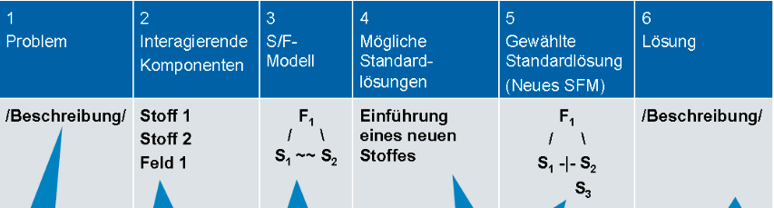

# 76 Standard solutions
Source reference:
Note on the basis of this elaboration: The analyses, terms and structures presented here are based on the systematic methodology of the TRIZ 76 standard solutions, in particular according to the contents of:

- **Adunka, R. (2016).** *76 standard solutions: Creativity can be learned. Finding unimagined solutions.* TRIZ Consulting Group.
- **Adunka, R. (n.d.).** *76 Standard solutions -- class table (internal visualization).* Based on a template from: 76_standardlösungen_A0_01adunka.vsd.
- Supplementary: own derivations according to substance-field analysis and ARIZ logic

## What is a substance field?
A substance field is a system that is formed by the interactions of substances and fields within a technical system.  
Substances are components of a technical system that have a mass, such as wheels, gears or a screw.  
A field is understood as something similar to energy. The scope of interpretation for "field" is very broad in this context. Examples of fields are mechanical, electrical, magnetic, chemical, biological and thermal fields or gravity.

## Fields in the substance-field model
Mechanical field: Includes gravitation, collisions, friction, direct contact, vibration, resonance, shocks, waves, gas/liquid dynamics, wind, pressure, vacuum, mechanical processing and treatment, deformation, mixing, additives, explosions

Acoustic field: sound, ultrasound, infrasound, cavitation

Thermal field: heating, cooling, insulation, thermal expansion, phase transitions, change of state, endo- / exothermic reaction, fire, combustion, thermal radiation, convection

Chemical fields: Reactions, reactants, elements, compounds, catalysts, inhibitors, indicators (pH), dissolving, crystallizing, polymerizing, odor, taste, color change, pH, etc. 

Electric field: Electrostatic charge, current conductors, insulators, electric field, electric current, superconductivity, electrolysis, piezo-electric effect, ionization, electric discharge, sparks

Magnetic field: Magnetic field, forces and particles, induction, electromagnetic waves (X-rays, microwaves, etc.), optics, vision, color change, change in transparency, image

Intermolecular field: Subatomic (nano) particles, capillaries, pores, nuclear reaction, radiation, fusion, emission, laser, intermolecular interaction, surface effects, evaporation

Biological field: microbes, bacteria, living organisms, plants, fungi, cells, enzymes

## Conventions when creating the substance field models
S1: The substance that needs to be changed, processed, transformed, detected, controlled, etc.

S2: The substance that exerts a necessary effect as a "tool" ("instrument" or "medium").

F: The field that generates the energy or force (i.e. the effect of S on Si or their interaction).

### Different types of interaction
Desired, useful effect

Insufficient effect

Excessive effect

Harmful effect

Non-specific, general effect or interaction (e.g. field on substance)

## Subdivision of the 5 classes
The 76 solution standards are divided into five classes and are also called "The classes of standard solutions".

<u>Class 1: Structure and decomposition of complete substance-field models (SFM)</u>

Creating or destroying the substance-field model if it is incomplete or has harmful functions.

This group has 2 subgroups - Group 1.1 Generation of substance-fields and Group 1.2 Decomposition of substance-field models and contains 13 standard solutions.

Group 1.1 - the most important recommendations from this subgroup are:

- Complete the substance-field system so that two substances and one field (interaction) are present.

- Inserting an additive within one of the substances (internal additive).
- Adding an additive to one of the substances or around it (external additive).
- Minimum/maximum method: Add a lot and remove the excess or add a little and improve locally/point by point.
- Insertion of a third substance that is already present in the supersystem.

Group 1.2 - the most important recommendations from this subgroup are

- Insertion of a third substance between the two existing substances.
- Insertion of a third substance as a modification of one of the two existing substances.
- Insertion of a substance as a "victim" (bodyguard).
- Insertion of a field that counteracts the harmful field

<u>Class 2: Improvement of substance-field models</u>

Introduction of modifications within the system boundaries.

This group has 4 subgroups and contains 23 standard solutions.

<u>Class 3: Transition to the super and subsystem (macro and micro level)</u

Development of solutions at the super- and subsystem level.

This group has 2 subgroups and contains 6 standard solutions.

<u>Class 4: Recognize and measure</u>

Solving measurement and detection problems of a technical system.

This group has 5 subgroups and contains 17 standard solutions.

<u>Class 5: Aids (standards for the application of standard solutions)</u

Develops solutions that meet the requirements of an ideal system.

This group has 5 subgroups and contains 17 standard solutions.

### Procedure for describing the solution
1. describe the problem to be solved
2. list all the substances associated with the interactions of the problem
3. create the SFM of the engineering problem using the components from point 2
4. write down the standard solution that can be used to solve the problem
5. write down the new SFM of the problem using the standard solutions from point 4.
6. describe the solution generated by implementing the standard solution.

### Procedure for the application of standard solutions
If the problem is a measurement problem, apply class 4 and additionally class 5.

If the problem is not a measurement problem, analyze whether the SFM model is complete. If it is not complete, then standard 1.1.1 is applied and class 5 is also applied.

If the SFM model is complete, then it is analyzed whether the SFM model causes harmful effects. If the SFM model shows harmful substances, then group 1.2 is applied in addition to class 5.

If the SFM model does not show any harmful substances, it is analyzed whether the SFM model has insufficient effects/effects. If not, then class 3 or possibly class 2 is applied and additionally class 5.

If yes, then standard 1.1.2 to 1.1.8 or class 2 is applied and additionally class 5.

## Class 1: Construction and decomposition of complete substance-field models
### Group 1.1: Generation of substance-field models
#### Standard 1.1.1 Construction of a complete substance-field model
Complete the substance-field system so that two substances and one field (interaction) are present. If a system cannot perform the necessary work, check whether the system is complete.

**Aim:** Complete an engineering system so that it contains two substances (S1 and S2) and at least one field (F) that allows them to interact.

**Basic idea:** A technical system is only complete and functional if it contains three essential components:

- **Substance 1 (S1):** The goal of the action e.g. the object that is being changed.
- Substance 2 (S2):** The tool or acting element, e.g. that which acts on S1.
- Field (F):** A form of energy that causes or enables the interaction between S1 and S2, e.g. mechanical, thermal, electrical.

→ An incomplete substance-field system cannot fulfill a function. It must be completed by adding the missing component(s).

**Application note: Question:** Why does the system not work or only work insufficiently? → Is one of the substances or the interaction field not present?

**Recommended action:** Identify the missing component and add it to construct a complete substance-field model.

**Examples:**

1. truck without fuel** S1: truck S2: fuel F: transformation field (chemical → mechanical energy)→ missing substance (fuel) → incomplete system → no movement

2. **Powder venting** S1: Powder S2: Gas (e.g. air) F: Gravitational field (e.g. by centrifuge)→ Adding centrifugal force enables the necessary interaction

3. **Refrigerator door lock** S1: Door S2: Housing F: Mechanical or magnetic field (e.g. hook, magnet)→ Missing closing force = missing field → incomplete function

**Notes:** This first standard solution is mainly used at the beginning of a material-field analysis and serves as a first checkpoint: Is the system structurally complete?

A minimal substance-field model consists of two substances and one field interacting in a triangular structure. 

Substances (S1, S2) can be any physical objects or materials in the system -- from simple components (e.g. screw) to complex systems (e.g. machine, organism).

The field (F) comprises a variety of forms of energy, including

- Classical physical fields: mechanical, thermal, electric, magnetic, gravitational
- Other technical fields: acoustic, chemical, optical, informational, pressure-based, radiation-based
- Derived or combined fields: e.g. centrifugal force, laser light, ultrasound, electromagnetic waves 

#### Standard 1.1.2 Construction of a complex substance-field model with internal additives 
Insertion of an additive within one of the substances (internal additive).

If a useful effect is to be improved and there are no restrictions on the addition of additives, a foreign additive (S,) can be introduced permanently or temporarily into one of the existing substances (S, or S2). The additional substance should increase the controllability of the substance field or ensure the desired property. The field is retained in its original form.

**Aim:** Improvement of a useful effect within a technical system by **introducing an internal additive (S3)** into one of the existing substances (S1 or S2).

**Basic idea:** If a substance-field system is already complete (consisting of S1, S2 and F), but the performance is insufficient or needs to be improved, one can:

- Introduce an additive (S3) into the interior of S1 or S2
- This additive improves, for example, controllability, efficiency or a desired property
- The original field (F) remains unchanged

**Guiding principle:** The effectiveness of the interaction is increased by improving one of the substances internally.

**Instructions for use**

- When to use? → When a beneficial effect is present but needs to be enhanced or better controlled.
- Action:** Insert an additive into S1 or S2 to create a complex inner structure -- without changing the outer system or field. 

**Examples:** 

1. **Solder with embedded flux**

      - S1: Solder joint
      - S2: Solder
      - S3 (internal additive): Flux inside the wire → Increases the quality of the connection without external additives

2. **Fiber composite material with self-healing effect**

    - S1: Composite structure

    - S2: Stresses/cracks

    - S3: Resin capsules inside the material → Resin escapes when cracks form and automatically seals the damage

3. **Doping of silicon wafers**
   - S1: Silicon base
   - S2: Electric current
   - S3: Doping atoms (e.g. boron, phosphorus) in the silicon → Improves conductivity and control in a targeted manner
4. **Vitamin administration to strengthen the immune system**
   - S1: Human body
   - S2: Environment / virus
   - S3: Internally administered vitamin C → Strengthens the system's defenses without external system changes

**Notes**

- The additive becomes part of the original substance (S1 or S2)

- The focus is on internal improvement without changing the external system layout or the field

- For an extended substance input strategy, see also class 5.1 "Substance additions"
  

#### Standard 1.1.3 Building a complex substance field model with external additives

Insertion of an additive into or around one of the substances (external additive). 
If a useful effect is to be improved, but it is not possible to introduce a substance into the existing substances, then an external additive is to be permanently or temporarily attached to one of the existing substances. The additional substance should increase the controllability of the substance field or ensure the desired property. The new substance must not introduce a new field in order to avoid additional energy consumption.

**Aim:** Improvement of a useful effect within an existing substance-field system by adding an external additive (S3), which is attached outside S1 or S2.

**Basic idea:** If a substance-field model (consisting of S1, S2 and F) already exists but does not work efficiently enough or a specific effect needs to be improved, the following can be done:

- An additive (S3) is attached or applied outside of S1 or S2

- S3 improves, for example, the interaction, controllability, effectiveness or a desired system property

- Important: The field (F) remains unchanged, as does the substance structure of S1 and S2 
  

**Guiding principle:** If a substance cannot be changed internally, an external modification can help to strengthen the effect or make it more targeted. 

**Instructions for use**

- **When to use?** → If no change inside S1 or S2 is possible or permitted, but optimization is necessary

- **Action:** Add an external substance (S3) that supports the interaction in the system without introducing new fields

**Application examples** 

1. leak detection on a gas pipe with soap solution

   - S1: Pipeline
   - S2: Gas
   - S3 (external additive): Soapy water on the outside → Allows leaks to be visualized through bubble formation

2. surgical glove with antiviral coating

    - S1: Skin/hand

    - S2: Surgical glove

    - S3: Virus-killing agent on the inside of the glove → Prevents infection in the event of needle injury

3. ski system with wax

    - S1: Snow

    - S2: Ski

    - S3: Wax film on the underside of the ski → Improves gliding properties without changing the ski itself

**Notes**

- The external additive does not change S1 or S2 internally, but acts on the surface or in the vicinity

- No new energy source (field) is introduced -- the original field effect is retained

- If no external attachment is possible, check alternatives such as standard 1.1.4 (use system environment as substance) 
  

#### Standard 1.1.4 Adding substances from the system environment

If a useful effect is to be improved, but it is not possible to bring a substance into or onto the existing substances, then the existing environment is to be used as a substance (S EXT) 
permanently or temporarily in order to provide the required properties and enhance the interaction of the existing system. 

**Aim:** Improvement of a useful effect in the substance-field model by utilizing an already existing substance from the environment (SEXT) without introducing new elements from outside.

**Basic idea:** If a substance-field model (S1, S2, F) is to be improved, but no new substances may be introduced (e.g. for reasons of simplicity, cost, environment), one can:

- Use a substance from the existing system environment (S EXT)

- This is temporarily or permanently integrated into the existing model

- The substance from the environment contributes to the optimization of the interaction between S1 and S2 -- without new fields or external substance supply 
  

**Guiding principle:** Use what is already present in the system's environment as a functional component instead of adding new resources.

**Application notes** 

- When no internal additives (Standard 1.1.2) and no external substances (Standard 1.1.3) are permitted or practicable→ When the environment already contains useful substances that have so far remained unused
- Measure:** Use an existing environmental substance (S EXT) specifically as a functional element in the substance-field model 

**Application examples** 

1. vibration amplifier with air resistance

   - S1: Unbalanced body

   

   

      - S2: Vibration system

   

      - S EXT: Air → The shape of the unbalance body is designed so that air acts as resistance and amplifies the vibration 

2. self-sealing cable in case of moisture ingress

   - S1: Cable

   

   

      - S2: Penetrating moisture

   

      - S EXT: swelling substance in the cable sheath → water activates the swelling agent -- this closes the opening 

3. seawater as stabilizer for buoy

   - S1: Buoy

   

   

      - S2: swell

   

      - S EXT: Water as a moving mass → Water acts as a buffer and dampens the up and down movement of the buoy

**Notes**

- This solution is particularly elegant as it makes optimum use of system resources

- There are no additional costs, no additional energy requirements

- Also check related concepts such as system resource analysis or ideal final result (IFR)

- If no suitable environmental materials are available, refer to Standard 1.1.5: Decomposition or modification of the environment 
  

#### Standard 1.1.5 Decomposition of the system environment and addition of additives

If a useful effect is to be improved, but it is not possible to introduce a substance into or onto the existing substances and the existing environment does not contain any substances that can impart the required properties to the substance-field model, then permanent or temporary

1. replace the environment with another environment (S ' EXT)
2. the existing environment should be broken down (S 'EXT) or
3. the existing environment is changed by adding an additive (S3). 

**Aim:** Improvement of the function of an existing substance-field model, if neither internal nor external additions (see standards 1.1.2 and 1.1.3) are sufficient, by breaking down and modifying or adding to the existing system environment.

**Basic idea:** If the basic system (S1, S2 and F) does not provide optimal performance and no sensible internal or external substance supply can be realized, one can:

- Split, modify or specifically use the **environment of the system** -- i.e. existing external substances -- in order to be integrated into the model as a functional supplement.

- This either **replaces** or **modifies** the original environment so that a previously unusable substance (S′EXT) can act as an additive. 
  

**Guiding principle:** Utilize the potential of the existing environment by breaking it down into individual, usable components or modifying it -- instead of adding completely new substances from outside. 

**Application notes**

- → If neither the direct introduction of an internal additive (1.1.2) nor an external additive (1.1.3) is possible or effective and the existing system environment does not offer a directly available, usable substance.

- Measure:** Decompose or modify the system environment in order to crystallize a suitable, often already existing substance (S′EXT), which is then integrated into the existing substance-field model as an additive. 
  

**Application examples 

1. improvement of the sliding properties in case of friction:

   - **S1:** Friction surface component

   

   

      - **S2:** Contact surface

   

      - **S′EXT:** Existing ambient air or moisture that is specifically modified (e.g. by pre-treatment) to act as a lubricant→ Friction can be reduced by modification (e.g. by applying a condensate) 

2. modification of a cable sheath:
   - **S1:** Inner cable
   - **S2:** Outer sheath of the cable
   - **S′EXT:** Existing material of the cable sheath that is converted into a seal by a chemical process→ The converted area acts as an additional sealing element

3. adaptation to different environmental conditions:
   - **S1:** Technical device
   - **S2:** Control unit
   - **S′EXT:** Environment (e.g. temperature, humidity), which is integrated into the control loop through targeted adaptation (e.g. cooling or heating)→ Optimizes the function through adaptive use of ambient conditions

**Notes**

- This standard solution is particularly useful if the system environment was previously considered a "given" but offers potential for improvement.

- Dismantling or modifying the environment can be cost-effective, as existing materials are used.

- If no suitable surrounding substance can be found, alternative methods are available, such as the introduction of an external additive (1.1.3).

#### Standard 1.1.6 Optimal operation 

Maximum procedure: Add a lot and remove the excess. 
If a "minimal" (dosed, optimum) effect of a field on a substance or of a substance on another substance is required, an excess of field effect or substance quantity can be introduced and subsequently removed in the following way: 

1. excess field effect is compensated by a new substance 
2. excess amount of substance is removed by a field effect

**Aim:** Achieving an optimum effect in a substance-field system by first generating an excessive (maximum) effect and then specifically removing or compensating for the excess.

**Basic idea:** If a substance-field system works in principle, but the effect is too weak or unstable, it can be useful:

- Use more of a substance or field than necessary

- The excess is then removed, attenuated or discharged to achieve the desired (optimal) effect

In other words, no attempt is made to dose exactly the ideal quantity/field effect, but the system is overridden and then regulated. 

**Guiding principle:** Deliberately create an excessive effect (substance or field) and remove or compensate for the excess to achieve optimum system performance. 

**Application notes**

- **When to use?**→ When precise dosing is difficult or expensive→ When a desired effect is difficult to control

- Measure:** Create maximum effect through excess substance or field
  1. excess field is neutralized by additional substance

  2. excess amount of substance is removed by a field (e.g. centrifugal force, temperature, suction)

**Application examples** 

1. painting by oversize and centrifugal force

   - S1: Cylindrical workpiece

   

   

      - S2: Color

           - F: Centrifugal force → Paint is applied in excess, then evenly distributed by rotation and excess material is removed

2. melting of glass ampoules in a water bath

   - S1: Glass ampoule with medication

   

   

      - S2: Gas flame

   

      - F1: Thermal field

   

      - S3: Water bath for temperature protection → Ampoule is heated excessively, the water bath protects against excessive heating of the medication

3. overfilled mold is straightened

   - S1: Freshly poured concrete

   

   

      - S2: Casting mold

   

      - F: Gravitation / manual smoothing → Overfilling is later removed mechanically → Optimum surface control

**Notes**

- This method is particularly useful for systems with unstable or difficult to control dosing

- It often replaces complex control technology with passive compensation

- In many cases, cost-intensive fine-tuning or control procedures are not necessary.

- See also Standard:

  - 1.1.7 (Maximum effect with intermediate beam)

  - 1.1.8 (Selective maximum operation)

  - 5.2.2 (Use of external fields)
    

​    

#### Standard 1.1.7 Maximum operation

If the maximum effect of a field effect is required on a substance, but this is not desired under the boundary conditions, then the maximum effect should remain, but be directed to a new substance that is attached to the original substance. The new substance becomes a transmitter that only passes on the required part of the effect to the original substance. 

**Aim:** To enable the maximum effect of a field (F max) on a substance, even if the direct application of this effect under the given boundary conditions 
(e.g. sensitivity, safety) is not permissible or practicable. 

**Basic idea:** If a strong field effect is desired but not directly applicable (e.g. due to overheating, material damage or scattering loss), a new element (an additional substance) is introduced:

- This new substance (S V) is added to or interposed between the original substance (S1)

- It receives the full field (F max) and acts as a mediator or transmitter

- The transmitter filters, buffers or transforms the field and only passes on the desired part of the effect to S1
  

**Application notes** 

- → If S1 cannot withstand the full field effect directly→ If the effect is to be more precise, safer or more focused→ If no fields are to be reduced, but passed on in a controlled manner 

- **Measure:**

  - Maintain F max

  

  

    - Add a new substance (S V) that absorbs the full effect

  

    - Pass on the filtered effect selectively to S1 

**Application examples 

1. laser cutting with focus lens 

     - S1: Material
     - S2: Laser source
     - F max: Laser beam
     - S V: Lens (transmitter) → Lens focuses the strong light and transmits it to S1 in a controlled manner → Precise cut without damaging the material 

2. induction heating with ferrite core

     - S1: Workpiece 
     - S2: Coil
     - F max: Magnetic field
     - S V: Ferrite core → Field is concentrated in the core and then transferred to the workpiece in doses 

3. charging via capacitor

     - S1: electrical target system

     - S2: Energy source

     - F max: electrical discharge

     - S V: Capacitor → stores and releases a controlled maximum effect as a pulse

**Notes**

- S V (the transmitter) is an active component in the system, not just a protection, but a targeted mediator of effect

- This enables complex or dangerous field effects to be harnessed in a controlled manner

- The effect is not attenuated, but systematically diverted and regulated

- Often used in high-energy, precision or safety systems

- This standard method is often used in combination with **Standard 1.1.6 (minimum-maximum principle)** and **1.1.8 (selective maximum operation)**. 
  

#### Standard 1.1.8 Selective maximum operation

##### 1.1.8.1 Selective maximum operation (maximum field)

If a selective effect of an action is required (maximum in certain areas, minimum or no effect in the other areas), then the field effect must be maximum.

A protective substance must be introduced where the minimum effect is required. 

**Aim:** To create a **selective, differentiated effect** in a system by applying a field with **maximum intensity**, but in such a way that **only certain areas** are affected - others are selectively **protected or shielded**. 
others are specifically **protected or shielded**. 
**Basic idea:** If a system or process **needs** a strong effect in one area but **must not be affected** in other areas, the following procedure is recommended:

- **set the field to maximum strength** (*Fmax*) to guarantee the effect is achieved at the target location

- Protect the areas not to be affected** with a suitable protective substance or structure (S protection) that blocks, absorbs or deflects the field there.
  

**Guiding principle:** Instead of limiting the field everywhere, work with full intensity and specifically control **where** it works. 

**How to use** 

- **When to use** → If certain areas of the system are to be **targeted or changed**→ If other areas must remain **protected or unaffected**→ If the effect of a weak or finely dosed field **is not sufficient**

- **measure:**
  - Use the field to the maximum**

  - **Insert protective substance or barrier** where the field should not act

  - Result: **Selectivity through protection**, not through field weakening

**Application examples 

1. laser cutting with protective coating

   - **S1:** Workpiece

   

   

      - **S2:** Laser

   

      - **F max:** Laser field

   

      - **S protection:** Cover foil over sensitive areas → Laser only acts on exposed zones → Controlled material removal

2. heat exposure during soldering

     - **S1:** Solder joint
     - **S2:** Soldering iron
     - **F max:** Heat input
     - **S protection:** Heat protection paste on sensitive components→ Only the target area is heated, other components remain undamaged

3. UV exposure of printed circuit boards

   - **S1:** photoresist layer

   

   

      - **S2:** UV light source

   

      - **F max:** UV radiation

   

      - **S protection:** Mask or opaque film → Only desired areas are exposed, the rest remains protected

**Notes**

- This method is particularly suitable for processes where **high effect is required locally**, but **system parts are sensitive**

- Advantage: **full field intensity** → reliable effect, **minimal risk** due to targeted protection

- The protective material (S protection) can be permanent or temporary (e.g. film, paint, mask, thermal buffer)

- We have the same requirement here as for a selective effect: the introduction of a mediator corresponds to the creation of a chain of two substance-field models.
  

##### 1.1.8.2 Selective maximum operation (minimum field)

If a selective effect of an action is required (maximum in certain areas and minimum in the other areas), then the field effect should be minimal and a substance should be introduced, 
that locally increases the field effect on substance S1.

**Aim:** To produce a strong, targeted effect on a specific area (e.g. substance S1) while leaving other areas unaffected by using a weak (minimal) field and targeted local reinforcement using an additional substance.

**Basic idea:** If a selective effect is desired, e.g. maximum effect at point A, minimal or no effect at point B, then it is often not practical to work with a strong field. 
Solution:

- Use a minimum strong field for the overall system

- Add a targeted substance (S3) that locally strengthens the field at S1

- Result: Maximum effect only where it is needed, minimal interference elsewhere
  

**Guiding principle**: Create selective effect through local amplification, not through global field intensity.

**Instructions for use**

- → When certain areas are sensitive to the field and need to be protected→ When energy efficiency, safety or process control are important→ When selective activation or processing is required

- Action:**
  - Use a globally weak field (F min)

  - Apply an amplifying substance (S3) specifically on or close to S1

  - This amplifies the field only locally, e.g. by concentration, conversion or conduction
    

​    

**Application examples** 

1. local laser activation through absorbing coating

   - **S1:** Target area

   

   

      - **S2:** Laser source (weak)

   

      - **F min:** weak laser radiation

   

      - **S3:** absorbing layer only on target site → Only there is enough energy absorbed to trigger a reaction 

2. chemical activation with local catalyst

   - **S1:** Reaction surface

   

   

      - **S2:** chemical reagent

   

      - **F min:** low reaction energy in the entire system

   

      - **S3:** catalyst applied locally → reaction only takes place there → selective material removal or build-up

3. heating with local metal particle in microwave

     - **S1:** Target tissue or material site
     - **S2:** microwave field
     - **F min:** weak microwave radiation
     - **S3:** metallic microparticle that absorbs the microwaves locally → Only the marked area is heated

**Notes**

- We have the same requirement here, because the introduction of a mediator corresponds to

- The areas that require the strong effects can be further strengthened by a substance S3.

- S3 acts as a local amplifier:

  - Absorption (heat, light, radiation)

  - Catalysis (chemical)

  - Conduction or focusing (e.g. electrical, magnetic)

- Particularly suitable for:

  - **Semiconductor technology**

  - Microfabrication**

  - Medical applications

  - Low-energy processes with high selectivity**
    

​    

### Group 1.2: Decomposition of substance-field models 

#### Standard 1.2.1 Elimination of a harmful effect by a foreign substance 

Insertion of a third substance between the two existing substances. If, in addition to the beneficial effect, a harmful effect occurs in contact between two substances, a third substance S3 that is as readily available and inexpensive as possible may be introduced between S1 and S2, provided that the addition of foreign substances is permitted and no direct substance-to-substance contact is necessary. 

**Aim:** If a harmful effect occurs between two substances (S1 and S2) in addition to a useful effect, this should be eliminated or reduced by the introduction of a third substance (S3) without impairing the useful function. 
without impairing the beneficial function.

**Basic idea:** 

- The substances S1 and S2 are in direct contact and produce a desired function, but an undesirable side effect also occurs (e.g. damage, contamination, friction).

- By inserting a suitable foreign substance (S3) between S1 and S2, the harmful effect is prevented or weakened while the beneficial effect is retained. 
  Guiding principle: If two substances work together beneficially but cause harm, insert a third in between to block the harm, not the benefit.
  

**Instructions for use

- → When contact between two substances is simultaneously beneficial and harmful→ When the harmful effect is of a physical, chemical or mechanical nature→ When insertion of an agent that does not cause significant interference is permitted

- Action:** Insert a third substance (S3) between S1 and S2 that:
  - passes through or supports the beneficial effect

  - blocks, buffers or distributes the harmful effect

  - is as inexpensive and readily available as possible
    

​    

**Application examples

1. blasting gas for borehole stabilization

   - S1: Explosion / gas pressure

   

   

      - S2: Borehole wall

   

      - Problem: Pressure stabilizes wall, but creates cracks

   

      - S3: Coating (plasticizer) protects the wall from cracking → Useful effect remains, harmful effect is suppressed

2. surgical gloves

   - S1: Patient

   

   

      - S2: Hand of the surgeon

   

      - Problem: Transmission of germs

   

      - S3: Sterile disposable gloves → Protective effect without restricting the operation

3. steel plate when lifting the house

   - S1: Lifting device

   

   

      - S2: Wooden beam

   

      - Problem: Point loading damages the wood

   

      - S3: Steel plate distributes the load → Avoidance of pressure damage while maintaining function 
        Notes

This solution is particularly common in medicine, manufacturing, packaging, food technology and mechanics

S3 can work through:

- Distribution of forces

- Blockade of microorganisms

- chemical inertness

- thermal insulation

Frequently used substances: Foil, gel, oil, intermediate plates, coatings, barriers, gloves, paper, fillers 

#### Standard 1.2.2 Elimination of a harmful effect through system resources

Insertion of a third substance as a modification of one of the two existing substances. If a negative effect occurs in addition to the beneficial effect, but direct contact is not required and foreign substances are to be avoided, then a modified substance S′₁,₂ (derived from S1 or S2) is introduced between the substances to reduce the harmful effect.

**Aim:** To avoid or reduce harmful effects between two substances (S1 and S2) without adding external foreign substances, but through a modified form of S1 or S2 
i.e. a system-internal substance (S′ 1,2) that acts functionally in between.

**Basic idea:** If two substances in the system produce a desired effect, but also cause an undesirable side effect (e.g. friction, wear, instability):

- direct contact is not absolutely necessary

- and the introduction of a foreign substance is not permitted or undesirable 
  → then a third substance S′1,2 should be introduced, which results from a modification of S1 or S2 (e.g. through a change in aggregate state, change in shape, geometric variation). 
  Guiding principle: If no external substance is permitted, use and shape what you already have in the system.
  

**Application notes**

- → When beneficial effect and harmful side effect occur simultaneously→ When external additives (see 1.2.1) are not desired or permitted→ When it is possible to create an intermediate form (S′ 1,2) from existing resources in the system

- Measure:** Transform or derive a modified substance from S1 or S2 that acts between S1 and S2 and reduces the harmful effect
  

**Examples of use**

1. metal balls in the piping system

   - S1: Conveying medium (metal balls in air flow)

   

   

      - S2: Pipe inner wall

   

      - Problem: Heavy wear on pipe bends due to impact

   

      - S′1: Stationary spherical layer made of the same material → Flowing balls no longer hit the pipe wall, but instead hit stationary balls

2. wind forces on umbrella

   - S1: Wind

   

   

      - S2: Shielding surface

   

      - Problem: Wind pressure damages or bends the structure

   

      - S′ 2: Openings and flexible flaps in the screen material itself → Pressure is reduced, stability increased

3. assembly of interlocking tubes

     - S1/S2: Tubes (identical material)
     - Problem: High friction when pushing into each other
     - S′ 1: Cold treatment → Inner tube shrinks → After heating, a form-fit is created without lubricant

**Notes**

- This solution deliberately dispenses with foreign substances (see 1.2.1) and utilizes the potential of:

  - Changes in the state of aggregation

  - Material-internal deformation

  - Geometric modifications

- The substance S′ 1,2 is often:

  - a derivative element from the system itself

  - e.g. ice, gas cushion, material layer, structured surface, "stationary particle", protective wall made of intrinsic material

- Particularly effective if the system must be autonomous, low-maintenance or closed

#### Standard 1.2.3 Redirection of a harmful field effect

Insertion of a substance as a "victim" (bodyguard). If a damaging field effect F on S1 is to be eliminated, an additional, inexpensive and easily replaceable substance S2 can be introduced to which the damaging energy is specifically redirected. 

**Aim:** Keep a harmful field effect (F) acting on a substance S1 (e.g. heat, pressure, radiation) away from the target object by redirecting the effect to another substance (S2) 
a kind of "bodyguard" that specifically absorbs or dissipates the harmful energy.

**Basic idea:** If a field (F) acts on a substance S1 and causes a harmful effect, the effect can be deflected or absorbed by introducing an additional substance (S2):

- S2 is positioned between F and S1 or close to S1

- S2 is deliberately exposed to the field to protect S1

- Ideally, S2 is inexpensive, readily available and easily replaceable 
  Guiding principle: If you cannot prevent a harmful effect -- divert it and send someone else first. 
  

**Instructions for use

- → If S1 must not be changed directly → If a field effect (e.g. heat, radiation, pressure, chemical attack) cannot be controlled → If physical shielding is possible and economically viable

- Measure:** Add a "sacrificial substance" (S2) that absorbs the harmful field effect
  - absorbs (e.g. radiation, heat)

  - deflects or diverts (e.g. pressure waves, deformations)

  - compensates (e.g. through a controlled opposing field or counter-effect)
    

​    

**Application examples**

1. lining of a container when water freezes

   - S1: Container wall

   

   

      - F: Volume increase when water freezes

   

      - S2: Elastic intermediate layer (foam, rubber) → It absorbs the pressure → No damage to the wall

2. protection of pipes in the ground from frost heave

   - S1: Pipeline

   - F: Ground pressure due to frost

   

   

      - S2: Previously placed cavities in the ground → These buffer the movement → No deformation of the pipe

   

3. x-ray protection for medical images

   - S1: Patient / technician

   

   

      - F: X-ray radiation

   

      - S2: Lead apron or lead-lined wall → Only the target area is irradiated -- rest of body protected

**Notes**

- This method is ideal for passive protection -- no active control required

- S2 acts as:

  - Sacrificial material

  - Protective barrier

  - Equalizing layer

  - Buffer zone

- Can also be combined with **Standard 1.2.1 (Protection by foreign substance)** or **Group 5.1. (Supply of substances)**.

#### Standard 1.2.4 Neutralization of the harmful effect by a second field

Insertion of a field that counteracts the damaging field. If the direct contact between S1 and S2 must be maintained and no new substances are to be added, a second field F₂ is added to the substance-field model, which neutralizes the harmful effect or converts it into a beneficial effect, while F₁ continues to fulfil its positive function.

**Aim:** If a beneficial effect (F₁) occurs between two substances (S1 and S2), but a harmful effect occurs at the same time, this should be neutralized by a second field (F₂) or converted into a beneficial effect without interrupting the contact between S1 and S2 and without introducing additional substances.

**Basic idea:**

- The existing substance-field model (SFM) contains:

  - S1: Target substance

  - S2: Influencing substance

  - F₁: Field that produces a useful effect

- However, this produces an undesirable side effect (e.g. noise, vibration, occlusion, masking)

- Solution: Introduction of a second field (F₂) that cancels out, compensates for or redirects the harmful effect

- This turns the system into a dual substance-field model (dual SFM) 
  Guiding principle: If you are not allowed to block the harmful effect with substances, then fight field with field. 
  

**Instructions for use

- → When the contact between the substances must be maintained → When no new substances may or should be introduced → When the harmful effect can be eliminated by a physical counterfield

- Measure:**
  - Add a second field F₂ to the existing model, which specifically neutralizes or compensates for the negative effect of F₁

  - F₁ remains active for the useful function

**Application examples**

1. flower opening with artificial pollination

   - S1: Flower

   

   

      - S2: Air flow (F₁ → transport of pollen)

   

      - Problem: Air flow closes the flower

   

      - F₂: electrostatic field that opens the flower→ Harmony of useful and compensating field

2. hearing aid with noise suppression

   - S1: human ear

   

   

      - S2: Sound field F₁ (ambient noise + speech)

   

      - F₂: Anti-noise through phase shift → Unwanted noise is canceled out but speech remains audible

3. pump noise suppression with counter-sound

   - S1: Water

   

   

      - S2: Pump

   

      - F₁: Mechanical field → generates useful movement

   

      - F₂: acoustic opposing field (180° phase shift) → neutralization of the disturbing pump noise

**Notes**

- The effect of F₂ can be neutralizing or transforming

- F₂ can be e.g:

  - Counter-sound /counterforce /counter-vibration

  - Optical auxiliary field

  - Electrostatic or magnetic influence

- The model is created from a simple SFM → dual SFM

- Other related standards **Group 5.2 (Introduction of additional fields)** and **Standard 2.3.2 (Reconcile field rhythms / synchronization)** 
  

#### Standard 1.2.5 Switching off magnetic fields and demagnetization

If an undesirable interaction occurs between two ferromagnetic materials in a material-field model with a magnetic field, the ferromagnetic property of the materials can be switched off or the magnetic field compensated by a second field F₂ - e.g. by heating above the Curie temperature, mechanical shocks, vibrations or opposing fields. 

**Aim:** If an undesired interaction between two ferromagnetic substances (S1 and S2) occurs in a substance-field model with magnetic interaction (F mag), 
this should be neutralized by a second field F₂neutralized by eliminating or compensating for the magnetic properties. 

**Basic idea:**

- Magnetic fields can be useful, but also disturbing or dangerous, especially with ferromagnetic substances

- The solution is not to mechanically shield the magnetic field, but to change the magnetic properties of the substance

- This is done by introducing a second field F₂, e.g. by:

  - Heating via the Curie point

  - mechanical shock

  - Vibration

  - Opposing field (demagnetization through field superposition)
    

​    

**Guiding principle:** Don't eliminate the problem with barriers -- eliminate the property that causes the problem. 

**Application notes**

- → When magnetic forces in the system cause unwanted attraction, deflection or repulsion→ When targeted demagnetization is possible→ When complete shielding of the field is not technically or economically feasible

- Measure:**

  - Identify the interfering magnetic interaction (F mag)

  - Add a second field F₂ that:

    - deactivates the magnetic properties of the substance

    - or compensates the magnetic field

**Application examples** 

1. magnetic powder during welding

   - S1: Magnetic powder

   

   

      - S2: Welding zone

   

      - F mag: Electromagnetic field of the welding current

   

      - Problem: Powder is repelled

   

      - F₂: Heating above the Curie point → Demagnetization → Powder can be fed undisturbed

2. inductive heating with self-limitation

   - S1: ferromagnetic component

   

   

      - F₁: Induction field for heating

   

      - F₂: Material heats up to the Curie point → loses ferromagnetism → No overheating possible → Self-regulation of the process 

3. magnetic crane with passive holding mechanism

   - S1: metal to be lifted

   

   

      - S2: Crane with magnetic field

   

      - F mag : Magnetic holding field

   

      - F₂: Opposing field for demagnetization on release → Energy only required for releasing, not for holding → Fail-safe in the event of a power failure

**Notes**

- The focus is on the change of the material property (magnetic → non-magnetic), not only on field change

- F₂ can be generated by various physical methods:

  - Heat: e.g. through high frequency, IR, resistance, friction, exothermic reaction

  - Mechanics: Impact, vibration

  - Opposing fields: e.g. with opposite polarity, phase shift

  - Note physical and technical options for increasing the temperature or modulating the field → see also **Group 5.2 (Adding fields)** and **Standard 2.3.2 (Tuning field rhythms)** 
    

​    

## Class 2: Improvement of substance-field models

- With this group of standard solutions, problems are solved by improving the efficiency of the technical system. This involves making small modifications to the system.

- This class is also called "Development and increase in effectiveness of substance-field models of technical systems" or "Further development of substance-field systems".

- The class consists of 4 groups.

**The most important recommendations from this class:**

- Use of linked fabric field models.

- Use of double substance-field models.

- Inserting a second field.

- Segmentation (splitting into equal components).

- Dynamization (increasing the degrees of freedom).

- Use of rhythm coordination.

- Increasing the degree of porosity.

- Use of ferromagnetic substances

### Group 2.1: Transition to complex substance-field models

#### Standard 2.1.1 Linked substance-field models 

The efficiency of a complete substance-field model can be improved by

1. replacing a substance with an independent substance-field triad. This creates a chain of two substance-field models that can be continued. 
2. a concatenation is carried out within the substance-field model. A third substance S3 is inserted between the substances S1 and S2. 

**Aim:** To increase the efficiency of a complete substance-field model (SFM) by integrating further substance-field triads into the system, either by substitution or nesting. This leads to a chained or stepped structure that improves the technical effect or enables new functions.

**Basic idea:** An existing SFM is systematically extended or rebuilt by: 

1. one of the two substances (S1 or S2) is replaced by a separate substance-field triad, creating a chain of SFMs (SFM → SFM → SFM ...) 
2. a third substance (S3) is inserted between S1 and S2 within an SFM, creating an internal mediator or modulator. 

**Guiding principle:** If direct coupling is not sufficient, build an intelligent chain of active elements. 

**Application notes** 

- → When a single substance-field model is not strong, efficient or flexible enough→ When the direct coupling of S1 and S2 is problematic or too coarse→ When the effect should be modularized or made more controllable 
- Measure:** 
  - Variant (a): Replace e.g. S2 with (S2′ -- F -- S3) → this results in SFM₁ → SFM₂ 
  - Variant (b): Insert an additional substance S3 between S1 and S2 to better transmit, control or dampen the field 

**Application examples** 

1st wedge with modified structure

     - S1: fixed component
     - S2: wedge (originally monolithic)
     - Problem: wedge is difficult to remove
     - Solution: S2 becomes (S2 + S3) → wedge becomes two-part → S3 can be moved → wedge angle can be changed → disassembly made easier→ example of (b) internal interlinking 
2. hammer - chisel - rock

     - S1: Rock
     - S2: Hammer
     - F1: mechanical force
     - S3: chisel is inserted → transmits force more precisely→ improvement by switching on mediation → classic example of (b) 
3rd AZIPOD ship drive

     - Traditional design: Diesel engine → long shaft → rudder → propeller 
       New superstructure: Diesel → Generator → Electricity → Electric motor (in propeller nacelle) 

     - Each functional element is a separate SFM, connected to form a modular, interlinked structure→ Example of (a) cascaded material-field systems

**Notes** 

- Can be combined with **Standard 2.1.1** or **2.1.2**: e.g. concatenation + additional effect through magnetic materials or geometric field focusing 

- Modularization made possible:

  - better maintainability

  

  

    - Targeted control of individual sections

  

    - Scalability of technical systems

- See also:

  - 2.3.2 Rhythm adjustment → for cascaded systems with fields of different timing

#### Standard 2.1.2 Formation of a double substance-field model 

If the effectiveness and controllability of a complete substance-field model is to be increased and the existing substances may not be replaced or changed, then the substance-field model must be doubled. A second, easily controllable field F2 is introduced.

**Aim:** To increase the effectiveness and controllability of an existing substance-field model (SFM), without changing or replacing the existing substances, by introducing a second, easily controllable field (F₂).

**Basic idea:**

- A complete substance-field model already consists of two substances (S1, S2) and a field (F₁) with a useful effect.

- However, the effect is not efficient enough or difficult to control.

- Instead of replacing S1 or S2, a second field (F₂) is introduced, which:

  - increases the useful effect,

  - can be controlled more precisely,

  - produces complementary effects. 
    Guiding principle: If you are not allowed to change the substances - bring a second field into play that helps, controls or supplements.
    

​    

**Instructions for use

- → When existing SFM works in principle, but is imprecise, slow, not fully effective or not controllable
  → If S1 and S2 must remain unchanged (e.g. for design, chemical or functional reasons)

- Measure**

  - Add a second field (F₂) that:

    - acts in parallel, complementary or counteracting

    - either acts directly on S1/S2 or modulates the original field (F₁)

  - Typical fields for F₂:

    - Mechanical (vibration, rotation, ultrasound)

    - Thermal

    - Electrical, magnetic

    - Optical (laser, light)

    - Acoustic, pneumatic 

​      

**Application examples** 

1. electrolyte removal from copper foil

     - S1: Copper foil
     - S2: Rinsing water
     - F₁: mechanical rinsing
     - Problem: Residues remain stuck
     - F₂: Ultrasonic field / movement → improves cleaning effect → Dual-SFM with two mechanical fields

2nd hydrostatically mounted component

   - S1: Liquid metal

   

   

      - S2: Component

   

      - F₁: hydrostatic pressure

   

      - F₂: electromagnetic rotation → targeted position control → combination of hydraulic and electromagnetic action

3. bonding combined with spot welding

   - S1/S2: Joining parts

   

   

      - F₁: Adhesive field (chemical, thermal)

   

      - F₂: mechanical connection by spot welding → Stability even during curing → Processing without waiting time

**Notes**

- Dual SFM = S1 ↔ F₁ ↔ S2 + F₂ on S1/S2

- Can be combined with:

  - **2.1.1 Chained SFM structures** → e.g. combination of dual SFM with mediator

  - Group 5.2: Introduction of additional fields**

  - **2.3.2 Tuning the field rhythm**, e.g. for vibration + temperature → synchronized effect

- Dual models are particularly useful for

  - Cleaning, assembly, manufacturing processes

  - Precision engineering

  - multiphysical systems
    

​    

### Group 2.2 Further development of material-field models 

#### Standard 2.2.1 Application of fields with higher controllability

The effectiveness of a complete substance-field model can be improved by replacing an uncontrollable or difficult to control field F1 with a well controllable field Fneu, possibly in combination with a new substance Sneu. 
with a new substance Sneu. 

In addition to replacing the field with a field of higher controllability (gravitational field → mechanical field → temperature field → magnetic field → electric field → optical field), 
the field itself (stationary → monotonically variable → ...) and its direction of action can also be changed. 

**Aim:** Increasing the effectiveness and controllability of an existing substance-field model (SFM) by replacing or supplementing a field that is difficult to control (F₁) with a more precisely controllable field (Fneu) - possibly in combination with a new substance (Sneu). 
in combination with a new substance (Sneu).

**Basic idea:** Many technical systems are subject to fields (e.g. gravity, friction, pressure) that are difficult or impossible to control. These can be replaced by fields that:

- more targeted,

- more quickly adjustable,

- more precise to use,

- can be dosed more precisely. 
  

In addition, the course of the field (stationary → variable) and its direction or modulation can be adjusted. 

**Guiding principle:** If the field is too inert, diffuse or difficult to control - replace it with a more precisely controllable field. 

**Application notes**

- **When to use?**→ If an existing field cannot be controlled well (e.g. too slow, imprecise, sluggish)→ If the system needs better controllability, timing or adaptability→ If modern control (electrical, optical, digital) is possible or desired

- Typical field hierarchy according to controllability:** (from difficult to easy to control)Gravitational field → mechanical field → thermal field → magnetic field → electric field → optical field 
  Further field parameters for optimization:
  - Waveform: stationary → continuous → pulsed / modulated

  - Direction of action: one-sided → multi-sided (e.g. crossed)

  - Rhythm: Frequency, phase, amplitude controllable
    

​    

Application examples 

1. metal saw replaced by water jet

   - S1: Workpiece

   

   

      - F₁: mechanical field (saw blade)

   

      - S new: water jet

   

      - F new: Pressure + control via jet nozzle → Cutting even irregular contours, contactless and finely controllable 

2nd inkjet printer with variable droplet output

   - S1: Ink

   

   

      - F₁: mechanical impulse due to vapor pressure

   

      - F new: additional heat pulse (temperature field) through second heating element → control of droplet size and dosing → precise color printing 

3. hydraulic control → electrical control

   - S1/S2: Actuator or control element

   

   

      - F₁: hydraulic field (e.g. due to pressure)

   

      - F new: electric field (e.g. via sensor and servomotor) → Fast response, programmable, digitally networkable

**Notes**

- Combinability:

  - with 2.2.5 (structuring of fields) → targeted field progressions

  - with group 5.2 (adding fields)

  - with 2.3.2 (rhythm control) → precisely timed effects

- Development trend of technical systems: Uncontrollable → controllable → self-regulating → adaptive

- The aim is to select fields that:

  - can be specifically switched off

  - have an energy-saving effect

  - are safe and repeatably controllable

  - can be digitally integrated 
    

​    

#### Standard 2.2.2 Fragmentation of substances

The effectiveness of a complete substance-field model can be improved by increasing the degree of fragmentation of one of the substances, usually the active substance, according to the following pattern: 

Monolith - segmented object → powder → liquid → gas → field (which takes over the function of the substance) 

**Aim:** Increasing the effectiveness and adaptability of a substance-field model by increasing the degree of fragmentation of a substance - typically the active substance. 
The aim is to achieve a better effect, control or self-adaptation to different conditions. 

**Basic idea:** An originally monolithic substance (compact, rigid, inflexible) can be converted into a more usable, more reactive form through targeted fragmentation, reduction or change of state. Typical fragmentation process: 
Monolith → segmented object → powder → liquid → gas → field (the field takes over the function) 

**Theorem:** A finely dispersed substance is often more efficient, flexible and adaptable than a large, rigid body. 

**Application notes**

- **When to use?**→ When a substance in its current form is too sluggish, too coarse or not flexible enough→ When a more uniform effect, better distribution, self-adaptation or redundancy is desired→ When more precise control or finer reactions are required

- Possible forms of conversion:**
  - Segmented (e.g. joint, chain link, separable part)

  - Particle form (powder, granulate)

  - Liquid / pasty

  - Gaseous / expanding

  - Replacement by a field that takes over the function of the material (e.g. laser instead of cutting steel)
    

​    

**Application examples** 

1. development of cutting technology

   - S: Cutting tool
   - F: Mechanical field (cut)

   

   

      - Progression:

        - Knife (monolithic)

        - → serrated blade (segmented)

        - → Micro-crusher (powder form)

        - → Abrasive layer (granular)

        - → Laser (field replaces substance)→ Progress from rigid → flexible → field-controlled 

2. demountable cores in injection molding

   - S: Core with undercuts

   

   

      - Problem: Not demoldable

   

      - Solution: Design as separable component → Higher complexity through segmentation enables removal 

3. distributed computing (grid computing)

   - S: Computing power

   

   

      - F: Information field (data processing)

   

      - Solution: Decomposition of the overall task → Distribution to many computers → Self-organizing load distribution with idle times

**Notes**

- This standard solution corresponds to the TRIZ evolution trend:

- Solid → adjustable → flexible → granular → liquid → gaseous → field-based

- Fragmentation often leads to:

  - better adaptation to variable requirements

  - higher space or volume efficiency

  - better controllability or distributability of functions

  - Resilience through redundancy

  - Symbolically, the fragmented substance is often represented as a Sμ. 

#### Standard 2.2.3 Transition to capillary and porous substances

The effectiveness of a complete fabric-field model can be improved by moving from a solid fabric to a capillary porous fabric. 

The transition is made according to the following pattern: Solid fabric → fabric with cavity → object with multiple cavities (perforated object) → capillary porous object → microcapillary porous fabric 
Pores can be specifically filled with substances to create special properties. 

**Aim:** Increasing the effectiveness of a material-field model by replacing or expanding a solid material with a porous or capillary material. This increases the functional density, self-regulation, 
dosing capability or adaptive effect of the substance - especially for liquids, gases, heat or energy transfer. 

**Basic idea:** Instead of a compact, homogeneous substance, a substance is used that contains specific cavities, pores or capillary systems -- for fine distribution, storage, insulation, dosing, amplification or control of technical effects. Transformation process: 
Solid substance → substance with cavity → perforated object → capillary-porous object → micro-capillary-porous substance 

**Guiding principle:** More effect through fine inner structure -- use cavities, pores and capillaries as effect enhancers. 

**Instructions for use**

- **When to use?** → If a substance:
  - too coarse or inefficient

  - needs better distribution, storage or insulation

  - is to be dosed, controlled or passively activated

- Principles of action of porous materials:**
  - Capillary effects (e.g. liquid transport, ink flow, lubrication)

  - Gas/heat storage or insulation

  - Pressure or flow control via diaphragms

  - Self-regulation through structure + combination of substances
    

​    

**Application examples 

1. ink flow through capillary writing systems

   - Development from the split nib → ballpoint pen → fiber pen → porous tips→ The finer the pore structure, the more even and controlled the ink flow 

2. aluminum sandwich with powder layer and propellant

   - Objective: Stiffening and damping with low weight

   

   

      - Method: Heating → powder layer expands → porous, stiffening structure is created→ Mechanical function + energy absorption combined 

3. thermal paint with ceramic hollow spheres

   - S: Acrylic dispersion with vacuum microbubbles

   

   

      - F: Thermal protection despite thin layer→ Light, dirt-repellent and insulating

**Notes & development trends**

- The transition follows a typical TRIZ evolutionary trend:no structure → simple structure → structure + liquid → structure + liquid + active principle

- Additional controllable effects in capillary/porous substances:

  - Ultrasound

  - Temperature gradients

  - electric / magnetic field

  - electrorheological or magnetorheological fluids (see 2.4.4, 2.4.12)

  - Osmosis / electroosmosis

  - chemical activation / reaction

  - Geometric shape control of the pores

- Enables targeted pore filling:

  - Delayed or controlled release of substances (e.g. lubricants, adhesives, active pharmaceutical ingredients)

  - Self-healing materials

  - Adaptive behavior at temperature, pressure, humidity
    

​    

#### Standard 2.2.4 Dynamization of material-field models

The effectiveness of a complete substance-field model can be improved by increasing the degree of dynamization of the SFM. More flexible, rapidly changeable structures should be used. 
Dynamization of substances: Increase the degrees of freedom and the number of joints (linear, rotational, combined) → flexible (spring-loaded) connection → application of flexible fabrics 

Dynamization of fields: stationary field → variable field (pulsed, periodic, modulated, etc.) 
Objective: To increase the efficiency, adaptability and functionality of a substance-field model through the changeability, flexibility and mobility of its substances and/or fields. 

**Aim:** To adapt the system to different conditions or tasks quickly and automatically.

**Basic idea:** Dynamization means:→ Static, rigid structures or fields are further developed into movable, flexible, changeable units. 

**Two main areas of dynamization:**

1. dynamization of substances (S1 / S2):

    - Increasing the degrees of freedom (e.g. rotation, linear movement, bending)

    - Addition of joints (linear, rotational, combined)

    - Resilient, flexible or elastic connections

    - Use of flexible or adaptive materials

2. dynamization of fields (F):
    - Instead of stationary fields:→ time-varying fields (pulsed, clocked, modulated)→ parameter-varying fields (frequency, direction, intensity, etc.) 

**Guiding principle:** Increase the mobility and adaptability of the system in order to react efficiently to changing requirements. 

**Application notes**

- When to use → When a system is too rigid, non-adaptive, oversized or undersized → When the system efficiency varies depending on the situation → When different operating conditions need to be covered

- Targets through dynamization:**
  - Speed of response

  - Energy efficiency

  - Space saving

  - Self-regulation / self-adjustment

  - Combinability of several functions 
    

​    

**Application examples 

1. door systems:
   - From fixed door → two-part folding door → roller shutter door → foldable, bendable door→ more degrees of freedom, space-saving, adaptive 

2. high-pressure cleaner with pulsed water jet:
   - Field: mechanical water jet→ By pulsing: higher cleaning effect, lower water consumption 

3. adaptive suspension system for mountain bikes:
   - Sensors measure road surface → piezoelectric valves control damping→ Optimum traction, comfort and safety 

**Notes**

- Related to TRIZ Principle No. 15 "Dynamization", which states:

  - a ) System properties should adjust optimally depending on the operating phase

  - b ) Divide rigid objects → into parts that are movable relative to each other

  - c ) Make immovable → movable or adjustable

- Additional dynamization effects possible through:

  - Phase change materials, shape memory alloys (see Group 5.3)

  - Adaptive control, sensor integration

  - Combined effect of structure + field + control 
    

​    

#### Standard 2.2.5 Structuring of fields

The effectiveness of a complete substance-field model can be improved by converting a uniform field or a field with a disordered structure into a non-uniform (heterogeneous, non-uniform, asymmetrical) field or a field with a defined spatial/temporal structure.

Spatial structure: standing waves, interference, etc. 

Temporal structure: pulsed, periodic, modulated, etc. 

**Aim:** Improving the effectiveness of a substance-field model by converting a homogeneous or disordered field into a structured field with spatial and/or temporal differentiation. 
**Basic idea:** Instead of using a uniform, "diffuse" field, the field is specifically structured, e.g. by:

- Spatial structuring:→ e.g. standing waves, interference patterns, focusing, polarization

- Temporal structuring:→ e.g. pulses, clocking, modulation, frequency variations 
  Such structured fields enable better control, targeted effects at specific points/zones and greater efficiency in energy or material transfers. 
  Guiding principle: Do not distribute the effect of the field evenly - direct it to where it is needed. 
  

**Instructions for use**

- When to use:**→ If the current field has too broad, unspecific or inefficient an effect→ If a targeted effect is only required at certain points/zones→ If a structure is to be created or reinforced in the material (e.g. shape, pattern, distribution)
- Typical structuring forms:**

| Structure type | Description & example |
| ------------------- | ---------------------------------------------- |
| Standing waves | Positioning of particles or energy |
| Interference pattern | Field superposition for focus or filtering |
| Polarized light | Amplification of contrasts |
| Pulsating fields | Pulse effect on material (e.g. ultrasound) |
| Frequency modulation | Adaptation to resonance effects |

**Application examples 

1. mixing magnetic powders with a structured magnetic field
   - Two powder layers (S1, S2) are specifically mixed by a non-homogeneous magnetic field→ Mixing quality is increased by field structure 

2. wood welding (ultrasonic wood welding)
   - Thermoplastic is plasticized by ultrasonic field→ Penetration into porous wood → High-strength joint→ Energy is concentrated by the structure of the sound field 

3. image contrast enhancement with polarized light
   - Reflections are suppressed in highly reflective environments→ Contrast & recognizability increased by structured light alignment 

**Notes**

- Symbolism:

  - Structured field: F#

  - Structured material: S#

  - Both can influence or shape each other

- Linking with other standards:

  - 2.2.1: Application of controllable fields → structured fields are often also easier to control

  - 2.2.6: Structuring of substances → often in combination with structured field effect

  - Group 5.2: Adding fields → structured additional fields are often more effective than uniform ones

- Important physical effects for field structuring:

  - Acoustics (standing waves, modulation)

  - Optics (polarization, diffraction)

  - Electromagnetics (pulsed fields, HF)

  - Thermal (e.g. temperature gradients) 
    

​    

#### Standard 2.2.6 Structuring of materials

The effectiveness of a complete substance-field model can be improved by replacing a substance with a homogeneous or disordered structure by a substance with a heterogeneous or ordered structure.

Structures can be changed **spatially** (multilayered, fibrous, granular, acicular, honeycomb, reticular, lattice, crystalline, micro- and nanostructure) or **temporally** (dependent or temporary structure).

**Aim:** Increasing the effectiveness of a substance-field model (SFM) by replacing a substance with a homogeneous or disordered structure with a substance with a spatially or temporally structured geometry. 
The new structure enables a more targeted effect, control or functionalization. 

**Basic idea:** The internal order of a substance (e.g. its physical, chemical, geometric or crystalline structure) has a direct influence on the effect of a field and the system performance. 
Targeted structuring creates:

- Mechanical advantages (strength, damping, flexibility)

- Thermal or optical controllability
- Material savings with the same function
- Interactions with fields (F#) such as light, sound, heat, EM fields 

Structure types

- Spatial structures:

  - Multilayer (e.g. laminate, sandwich)

  

  

    - Fibrous (e.g. textiles, CFRP)

  

    - Grainy, granular

  

    - Needle-shaped (e.g. hedgehog structures, bristles)

  

    - Honeycomb, lattice structures

  

    - Reticular (net-like), crystalline

  

    - Micro/nanostructures (e.g. for sensors, surface effects) 

- Temporally structured materials:

  - Temporarily shaped (e.g. reversible material change)

  

  

    - Adaptive (structure changes depending on environment or time)

  

    - Memorizing, reactive, phase-reversing (e.g. shape memory alloys) 

**Application notes**

- When to use → If the material is to perform a new function, higher precision or targeted reaction → If targeted local field effect (e.g. at point or line) is desired → If existing substances are too inert or inefficient

- Structured fabrics help with:**
  - Material savings (e.g. honeycomb-like lightweight constructions)

  - Field guidance (e.g. light scattering, microcrystals)

  - Self-healing/self-regulation

  - Combination of several functions in one material
    

​    

**Application examples

1. create pore structure with threads

   - S: soft material is interwoven with threads

   

   

      - After curing → threads burn→ Result: ordered pore structure, targeted permeability 

2. nanostructured sensors

   - Nanoparticles (e.g. gold, silicon) selectively absorb EM waves→ Customizable sensor technology through targeted crystal sizes and shapes 

3rd Colman™ lantern with structured surface

   - Fabric carrier with organometallic salt → is burnt out→ What remains is structured, luminous ceramic with high temperature resistance

**Notes**

- This solution is closely linked to:

  - Standard 2.2.5 (*Structuring of fields*) - often field structure ↔ substance structure

  - Standard 5.3.1ff ---e.g.e.g. use of effects such as shape memory, microencapsulation, phase change

- symbolism:

  - S# = structured material

  - F# = structured field→ Ideally, these interact in a coordinated manner (e.g. S# with F#, e.g. microstructure + laser field) 
    

​    

### Group 2.3: Further development of substance-field models through coordination of rhythmics 

#### Standard 2.3.1 Coordination of the frequencies of the field and one of the substances

A complete material-field model can be further developed by tuning the frequency of the acting field with the resonance frequency of the workpiece S1 or the tool S2 or by deliberately not tuning it.

The harmonics of the natural frequency, resonance and anti-resonance conditions must be taken into account. 

**Aim:** Optimization or targeted avoidance of resonance effects in a material-field model (SFM) by tuning the frequency of the field (F) to the natural frequency of a participating material (S1 or S2) or deliberately deviating from it. 
or deliberately deviating from it.

**Basic idea:** Many materials (especially mechanical or elastic ones) have natural frequencies at which they react particularly strongly (resonance) or particularly weakly (anti-resonance) to external fields. 
The efficiency or safety of a system can be specifically influenced by:

- the field frequency F is tuned to the natural frequency of S1 or S2 → resonance amplification

- or deliberately deviates from it → Avoidance of vibrations or damage
  

**Instructions for use**

- → When a field (mechanical, acoustic, electromagnetic, etc.) interacts with a substance → When the system reacts to vibrations, waves or periodic signals → When you want to couple energy or avoid scattering in a targeted manner

- Note when tuning:**
  - Fundamental frequency

  - Harmonics / overtones

  - Resonance and anti-resonance conditions

  - Damping and amplification effects 
    

​    

**Application examples**

1. resonance adjustment during arc welding
   - Electrode (S1) melts more efficiently if field frequency = natural frequency → More stable arc, better energy transfer 

2. ultrasound against kidney stones
   - Ultrasound frequency ≈ resonance frequency of the stones → Stone shatters → painless removal possible 

3. gear asymmetry to avoid resonance
   - Small targeted deviations in tooth shape → no resonance → less noise

**Notes**

- Symbolic:

  - FfS1 → Frequency of the field is tuned to substance S1

  - Also applicable to S2: FfS2

- This solution is strongly related to:

  - Standard 2.3.2 (Rhythm coordination of several fields)

  - Standard 2.2.5 (structured fields)

  - System models with oscillators, wave propagation or periodic motion

- Useful tools for practical use:

  - FFT analysis (Fourier transform)

  - Sensors for frequency measurement

  - Active feedback systems for frequency tracking
    

​    

#### Standard 2.3.2 Tuning the field rhythm in complex material-field models

A complex material-field model can be further developed by tuning or deliberately not tuning the frequencies of the fields involved.

Synchronization and desynchronization of the fields must be taken into account. 

**Aim:** Increasing the effectiveness, stability or functionality of a system that uses several fields simultaneously (e.g. electrical + magnetic, mechanical + acoustic) by targeted synchronization or desynchronization of the field frequencies and rhythms involved. 

**Basic idea:** In a complex substance-field model (SFM) in which several fields act simultaneously, their effects can be controlled by tuning (or deliberately not tuning) the rhythms/frequencies.

- Synchronization → amplification, detuning, synchronization, order

- Desynchronization → suppression, decoupling, interference avoidance
  

**Application notes**

- When to use → If several fields act simultaneously on S1 or S2 → If effects can amplify, cancel or overlap → If the system is particularly sensitive to rhythm, phase or frequency

- Typical tuning parameters:**
  - Frequency

  - Phase (e.g. 180° out of phase)

  - Pulse duration

  - Modulation (amplitude, frequency, phase)

  - Time offset / synchronicity

- Symbols:**
  - FfF1 = Field F is synchronized with field F1 (frequency-following field) 

**Application examples 

1. powder coating with coordinated fields

   - S1: Powder coating

   

   

      - F1: electric field (charge)

   

      - F2: magnetic field (alignment) → Tuned frequency pulses generate uniform coating 

2. Bluetooth interference avoidance through frequency jumps

   - Problem: interference from other signals (e.g. WLAN)

   

   

      - Solution: Frequency hopping (1600 changes/s) → No permanent overlap → Example of targeted desynchronization 

3. fly-fishing (fly-fishing)

   - S1: Fishing line

   

   

      - F1: Arm movement

   

      - F2: Line tension → Optimum line guidance through resonant tuning of the movement

**Notes**

- Systemic advantages:

  - Increased efficiency through overlapping effects

  - Function decoupling, if interferences are problematic

  - Targeted localization of effects through wave synchronization

- Related standards:

  - 2.3.1 -- Frequency tuning of field & substance

  - 2.2.5 / 2.2.6 -- Structuring of fields and substances

  - Group 5.2 -- Add fields (e.g. for active correction)
    

​    

#### Standard 2.3.3 Coordination of incompatible or independent effects

If several incompatible (mutually interfering or exclusive) or independent effects are to be executed simultaneously in a complex substance-field model, the substance-field model can be improved by executing one effect in the pauses of the other effect. 

The transition should be made from continuous to periodic effects and to coordinated frequencies of the different effects. 

**Goal:** Enable multiple mutually exclusive or interfering effects within a complex substance-field model by temporal decoupling and use of pauses instead of simultaneous execution. 

**Basic idea:** If two (or more) effects:

- are incompatible (e.g. measurement & energy supply),

- interfere with each other (e.g. mechanical & magnetic effects),

- or are independent of each other but use the same resources, 
  

then they should be separated in time by:

- Transition from continuous → periodic pulsed

- Tuning of the effective frequencies

- Use of the idle times of one effect to carry out the other
  

**Application notes**

- **When to use?** → If two effects cannot take place simultaneously, e.g:
  - due to physical interference

  - due to resource limitation (current, channel, memory, time)

  - due to mutual exclusion conditions

- Technical implementation:**
  - Pulse operation instead of continuous operation

  - Pause management & time multiplexing

  - Priority control in the time grid

  - Possible restructuring to synchronous clock systems

- Related TRIZ principles:**
  - Separation principle by time (ARIZ / standard solution)

  - Innovation principle no. 19: Periodic effect

    - a ) Change from continuous to pulsed

    - b ) Change timing

    - c ) Use breaks for secondary effects

​      

**Application examples

1. measurement during welding breaks

   - F1: Pulsating induction current

   

   

      - S1/S2: Welding electrode + workpiece

   

      - Problem: Current superimposed on measurement signal

   

      - Solution: Measurement only takes place during current pauses 

2. GPRS data transmission in the GSM network

   - Voice data has priority

   

   

      - Packet data (GPRS) is sent in free time windows → Temporal coexistence of incompatible channels 

3. multitasking in computers

   - CPU executes high-priority tasks directly

   - Low-priority tasks are processed in the idle phases → Dynamic time share control (time slicing)

**Notes**

- Particularly useful for

  - High-frequency processes with physical disturbances

  - Systems with limited resources (channels, time, energy)

  - cyclically operating machines

- Can be combined with:

  - 2.3.1 (Frequency tuning of field + substance)

  - 2.3.2 (Rhythm tuning of several fields)

  - 4.x (Control mechanisms & control loops) 
    

​    

### Group 2.4: Complex material-field models (magnetism)

#### Standard 2.4.1 Application of ferromagnetic substances and magnetic fields

The effectiveness of a complete material-field model can be improved by using an erromagnetic material Sm in conjunction with a magnetic field Fmag.

A substance is replaced by a non-fragmented ferromagnetic substance. The ferromagnetic substance interacts with the magnetic field.

**Aim:** Increasing the effectiveness of a substance-field model (SFM) through the targeted use of a ferromagnetic substance (Sm) in conjunction with a magnetic field (Fmag). A conventional (non-magnetic) material is replaced by a non-fragmented ferromagnetic material that interacts specifically with the magnetic field, e.g. for fixation, positioning, movement or levitation.

**Basic idea:** Ferromagnetic materials such as iron, nickel, cobalt or special alloys can interact with external magnetic fields and:

- moved in a targeted manner (drive),

- stabilized (positioning),

- fixed (holding),

- or contactless.
  

**Instructions for use**

- When holding, aligning, moving or levitating without mechanical coupling→ When precise, low-loss or contactless force transmission is required→ When a material in the model can be replaced by a ferromagnetic material that reacts more specifically with magnetic fields

- Important conditions:**
  - Material must be non-fragmented (compact, coherent)

  - Magnetic field should be easily controllable and focused on the material

  - Direct magnetic effect must be permissible and safe
    

​    

**Application examples**

1. positioning of two pipes over magnetic surfaces

   - Wing surfaces of the pipes are made of ferromagnetic material → Facilitates exact alignment when joining 

2. magnetized screwdriver tip

   - Sm = ferromagnetic tip

   

   

      - Fmag = applied magnetic field or permanent magnet → Screws are held and aligned, e.g. in areas that are difficult to access 

3. magnetic fixation & orientation of components

   - Magnetic field ensures precise positioning during assembly or transportation → Contactless, reusable, without mechanical clamps

**Notes**

- Ferromagnetic substances are not yet fragmented in this standard solution (no powder form, no ferrofluids etc.).

- Suitable for extending existing material field models:

  - with holding function (fixation)

  - for the reinforcement of drive or control components

  - as a replacement for mechanical power transmissions

- Linkable standards:

  - 1.1.2 - 1.1.5 (Improvement of existing SFMs by additives or intermediaries)

  - 2.1.1 - 2.1.2 (Coupling or dual SFM with magnetic components)

  - Note 1.2.5: Demagnetization and switching of magnetic fields*

  - 2.4.5 / 2.4.6 if direct ferromagnetic effect is not possible (e.g. through conversion to indirect field effects)
    

​    

#### Standard 2.4.2 Application of ferromagnetic particles

The effectiveness of a complete substance-field model with ferromagnetic substances Sm (Ferro-SFM) can be improved by replacing all or part of the ferromagnetic substance with ferromagnetic particles (S ^µ m). 
or partially replaced. In this context, a magnetic or electromagnetic field Fe/m must be used.

The smaller the particles (coarse grains → fine grains → powder), the better the ferro-SFM can be controlled.

**Aim:** Improving the controllability and effectiveness of a ferro-substance field model (Ferro-SFM) by using ferromagnetic particles (Sμm) instead of compact ferromagnetic substances (Sm), in combination with an (electro)magnetic field (Fe/m). 

**Basic idea**: Instead of a solid ferromagnetic substance, a substance with crushed, finely dispersed particles is used -- typically iron, ferrite, cobalt or nickel -- in sizes ranging from coarse grains to fine powder. The effect is specifically triggered or controlled by an external magnetic field. 

**Instructions for use**

- When compact ferromagnetic materials are too inflexible or difficult to control→ When an adaptive, dynamic or sensitive reaction of the material is desired→ When the magnetic effect should be locally limited or reversible

- Interaction required with:**
  - Magnetic field F e/m  (constant or pulsed)

  - Structure, geometry or shell in which particles are embedded

  - Optional: combination with liquid, elastomer, textile, etc. 
    

​    

**Application examples** 

1. robot gripper with ferromagnetic powder

   - Sμm: magnetic powder in flexible ring

   

   

      - Fe/m: after application of the magnetic field → solidification → gripping force is created → grips sensitive, irregular objects securely 

2. rapid detection of pathogens in meat

   - Antibodies are bound to tiny ferromagnetic spheres → these are concentrated in the magnetic field → targeted optical detection possible 

3. controllable dimensional stability of rubber molds

   - Mixture of rubber + ferromagnetic granulate → Shape is stabilized or changed by magnetic field

**Notes**

- Typical ferromagnetic substances:

  - Iron, ferrite, nickel, cobalt (also as alloys)

- Fragmentation process according to TRIZ standard 2.2.2:Coarse grain → Fine grain → Powder → Suspension (ferrofluid) → Field-based

- Related standards and supplements:

  - 1.1.2 -- 1.1.5: Improvement of incomplete or weak SFMs

  - 2.1.1 -- 2.1.2: Chained & double SFMs with particle integration

  - 2.2.2: *Fragmentation of substances* -- direct conceptual basis

  - 1.2.5: *Switching off / canceling magnetic effect* if required

  - 2.4.5 / 2.4.6: if the use of particulate magnetic materials is not possible

  - Group 5.1: targeted *addition of substances* for effect modification
    

​    

### Standard 2.4.3 Application of magnetic fluids

The effectiveness of a complete substance-field model with ferromagnetic substances Sm (Ferro-SFM) can be improved by replacing the ferromagnetic substance (particle) with magnetic fluid Smf.

Magnetic fluids (ferrofluids) consist of very fine ferromagnetic particles (iron, ferrite, cobalt, nickel, etc.) suspended in base fluids (water, oils, kerosene, synthetic fluids). 
Ferrofluids are colloidal suspensions or colloids.

**Aim:** Increasing the controllability, dynamics and adaptivity of a material field model (SFM) with ferromagnetic materials by replacing solid particles (Sμm) with a magnetic fluid (Smf) -- a colloidal system of very fine ferromagnetic particles in a carrier fluid. 

**Basic idea:** Ferrofluids (magnetic fluids) consist of:

- finest ferromagnetic particles (e.g. iron, ferrite, cobalt, nickel),

- which are evenly distributed in carrier liquids (e.g. water, oil, kerosene) → colloidal suspension. 
  By external magnetic fields (Fe/m):

- viscosity, density distribution, adhesion, damping or movement can be controlled within milliseconds.

- This results in adaptive, reversible and dynamic material functions.

**Application notes**

- When systems should react quickly, fluidly, precisely and controllably to magnetic fields→ When mechanics should be replaced or supported by field-based, viscous or sealing effects→ Ideal for moving, rotationally symmetrical or interacting components

- Typical fields of application:**
  - Active dampers & shock absorbers

  - Sealing systems (especially for vacuum, rotation, weightlessness)

  - Self-regulating lubrication systems

  - Precision control & adaptive materials

- Operating principle:** → Magnetic field directs particles in the fluid → influences flow behavior (magnetorheology)

**Application examples** 

1. magnetorheological shock absorbers

   - Smf: Ferrofluid as damping medium

   

   

      - Fe/m: controlled magnetic field → Change in viscosity → Damping can be adjusted within milliseconds→ Applications e.g. in vehicles, machines, sports equipment 

2. door frame with temperature-controlled ferrofluid seal

   - Seal contains ferrofluid with Curie temperature point→ Below: Magnetic → Door locked→ Above: Non-magnetic → Door can be opened→ Temperature-dependent functionality 

3. sealing of rotating shafts (e.g. in hard disk drives)

   - Ferrofluid is held in place in the magnetic field→ Non-contact, sealing effect→ Use in vacuum environments or weightless conditions

**Notes**

- Rheological properties depend directly on field strength and field gradient → therefore often referred to as "magnetorheological fluids"

- Ferrofluids are particularly effective in combination with:

  - Standards 2.4.1 -- 2.4.2 (compact or particulate ferromagnets)

  - 2.2.4 -- 2.2.6 (dynamization & structuring)

  - 5.1 (targeted addition of substances)

  - 5.3.5 / 5.3.6 (intelligent materials, field activation)
    

​    

#### Standard 2.4.4 Application of capillary and porous materials in the Ferro-SFM

The effectiveness of a complete fabric-field model with ferromagnetic fabrics Sm (FerTo-SFM) can be improved by using capillary-porous structures in combination with magnetic fabrics Scp 
are used. An additional effect can be achieved with this standard by combining the properties of magnetic fluids (good controllability in the magnetic field) and the capillary effects in porous materials. 
materials.

**Aim:** Increasing the controllability, functionality and combination effect of a material-field model with ferromagnetic materials (Ferro-SFM) by integrating capillary-porous structures (Scp). 

The combination of is particularly effective:

- magnetic controllability (e.g. through ferrofluids)

- with capillary effects (e.g. liquid line, filtering, dosing) 
  

**Basic idea:** Capillaries and porous materials have the ability to:

- to conduct, store or release liquids in a targeted manner

- develop a high surface effect through fine pores

- when combined with ferrofluids or magnetic particles, to enable a double active structure:

  - Magnetic field → controls the movement

  - Capillary structure → distributes/transports material in the micro grid
    

​    

**Instructions for use**

- When high controllability + fine dosing capability are required→ When magnetic and capillary mechanisms of action are to act simultaneously and synergistically→ Particularly suitable for filter systems, seals, fluid control, microvalves

- Functional advantages:**
  - Self-regulation through structure

  - Targeted fluid conduction through pores

  - Magnetic alignment to amplify or block flows

  - Low-maintenance control through external fields 
    

​    

**Application examples** 

1. wave soldering machine with magnetic-porous cylinder

   - Magnetic cylinder with coating of magnetic particles

   

   

      - Porous structure enables flux dispensing through capillaries → Excess solder is removed, while flux is directed exactly where it is needed 

2. micro valves with ferrofluid + capillary structure

   - Scp = capillary channel

   

   

      - Smf = Ferrofluid

           - Controlled by miniature electromagnets→ Liquids can be precisely dosed or blocked under field control→ Application in lab-on-a-chip, dosing systems 

3. filters with ferromagnetic components between magnets

   - Filter structure contains ferromagnetic elements

   

   

      - Alignment & filter behavior are changed via field control → Efficient for dynamic separation of particles

**Notes**

- This standard solution is closely linked to:

  - 2.2.3: *Transition to capillary-porous materials*

  - 2.4.2 -- 2.4.3: *Magnetic particles and fluids*

  - 5.1: *Addition of substances* for structural supplementation

  - 5.3.6: *Use of adaptive materials*

- Note the synergy effect:

  - Field + substance + structure → do not act in isolation, but integrated

  - Combined control via field intensity + pore geometry
    

​    

#### Standard 2.4.5 Complex ferromagnetic material-field models

If the controllability of a material-field model is to be increased, but a replacement of materials by ferromagnetic particles is not permitted, then a complex internal or external ferromagnetic material-field model with a magnetic field must be set up. 

Internal: A ferromagnetic substance is permanently or temporarily added to the existing substances. 

External: A ferromagnetic material is permanently or temporarily attached to existing materials. 

**Aim:** Increasing the controllability and functionality of a substance-field model (SFM) if a direct replacement of the substances with ferromagnetic particles (see standard 2.4.2) is not permitted or practicable. Instead, a complex ferromagnetic system is added - internally or externally.

**Basic idea:** If the direct use of ferromagnetic powders or liquids (Smµ, Smf) is not possible, magnetic controllability can still be achieved by:

- adding a ferromagnetic element to the existing system

- this is done either internally (mixed in/stored) or externally (attached/attached)

- a magnetic field (Fmag) acts on the overall model to create specific effects
  

**Application notes**

- → If the substance (S1, S2) cannot be directly replaced by ferroactive substances→ If magnet control is required, but only possible via supplements→ If existing materials are to be made magnetizable, e.g. temporarily

- Solution strategy:**

  - Internal: Magnetic material is added to the original material, stored or integrated

    - e.g. in the form of additives, embedding, coating

  - External: Magnetic material is attached or coupled from the outside

    - e.g. by bracket, sheathing, support structure, magnetic guide

**Application examples** 

1. transport of non-magnetic objects in a magnetic field
   - Objects are embedded in ferromagnetic powder → electromagnet can then also indirectly move non-magnetic objects

2. magnetizing coating
   - Non-magnetic objects are given a ferromagnetic coating or layer → Can then be magnetically controlled, e.g. for alignment or fixing 

3. magnetic control of medical preparations
   - Drug molecule is connected to a magnetic carrier molecule → Magnetic field directs the molecule to the desired location in the body→ Precise, targeted administration → Application in drug delivery & oncology

**Notes**

- Controllability of the SFM depends on:

  - Type of material introduced (solid, granular, liquid, aerosol-like)

  - Degree of fragmentation (→ see standard 2.2.2)

  - Availability of a controllable magnetic field

- Related standards:

  - 2.4.1 -- 2.4.3: if direct replacement by ferroactive substances is possible

  - 5.1: *Addition of substances* - especially in the internal case

  - 1.2.5: *Switching off or compensation of magnetic fields*

  - 2.2.6: Structuring the fabric for better field absorption
    

​    

#### Standard 2.4.6 Ferromagnetic material field models with the system environment

If the controllability of a substance-field model is to be increased, the replacement of substances with ferromagnetic particles and the addition of internal or external ferroparticles is not permitted, 
then ferromagnetic particles must be introduced into the system environment.

Under the effect of the magnetic field, the properties of the system environment should change in such a way that the system is more controllable.

**Aim:** Increasing the controllability of a substance-field model (SFM), if neither:

- the direct replacement of substances by ferromagnetic particles (cf. 2.4.2),

- nor the internal or external addition of such particles (see 2.4.5) is permitted. 
  Instead, the system environment is modified by introducing ferromagnetic particles into the environment (e.g. liquid, work surface, carrier material). 
  

**Basic idea:** The environment of the system (e.g. liquid, air, elastic support, base) is equipped with ferromagnetic particles. An external magnetic field then changes the properties of this environment so that the system becomes (indirectly) controllable. 

**Typical control variables:**

- Viscosity, adhesion, movement, stability, focusing, holding force 

**Application notes**

- → If a magnetic effect is required, but system components must not be changed→ If the workpiece, tool or component must remain "neutral" (e.g. non-magnetizable or medically sensitive)→ If the environment is to be made specifically viscous, adhesive or inert

- System environments with potential:**
  - Liquids (→ ferrofluids, see 2.4.3)

  - Working surfaces, elastic supports

  - Air / gases with suspended particles

  - Temporary working environments (e.g. operating field, assembly area) 

**Application examples** 

1. lowering of an object in modified liquid

   - Liquid is enriched with ferromagnetic particles → ferrofluid

   

   

      - A magnetic field changes the viscosity→ The object sinks slower or faster, depending on the field strength→ Control of the movement without direct influence on the object 

2. magnetic carpet for assembly work

   - Elastic carpet pad contains magnetic granulate → Prevents loss of small parts without magnetizing the machine itself→ Magnetic force only acts on tools or fastening materials 

3. surgical mat or car roof mat with magnetic structure

   - Rubber-like mat contains ferromagnetic material → Tools remain within reach without magnetized surfaces (e.g. car, patient, operating table) 

**Notes**

- System environment ≠ System components: This solution does not intervene in S1/S2, but works via the environment.

- Particularly useful for:

  - Medical systems

  - High-precision technical systems

  - Locations with limited access or clean room conditions

- Related standards & alternatives:

  - 2.4.3: Ferrofluids directly in the system → if permitted

  - 2.4.5: Internal/external ferro-supplement → if possible

  - 2.4.12: *Electro-rheological fluids* as replacement → if magnetism not permitted

  - 5.1 / 5.2: Addition and control of external fields or substances

#### Standard 2.4.7 Introduction of an additional control field in Ferro-SFM

The controllability of a ferromagnetic material-field model can be increased by introducing an additional control field Fc, which specifically influences the properties of the ferromagnetic materials in the SFM on the basis of certain physical effects and phenomena.

Effects associated with the Curie point must be taken into account: Transition across the Curie point → Transition across the Curie point with hysteresis → Hopkins effect → Barkhausen effect

**Aim:** Increasing the fine controllability of a ferromagnetic substance-field model (Ferro-SFM) through an additional, physically acting control field (Fc), which specifically influences the magnetic properties of ferromagnetic substances. 
of the ferromagnetic substances. This field does not primarily act via the magnetic field itself, but via accompanying thermal, electrical or quantum-physical effects.

**Basic idea:** An external parameter (e.g. temperature, electric field, radiation, frequency change) is introduced as an additional control field (Fc) in order to:

- Change magnetizability
- lower power loss / reduce noise
- realize targeted state changes (e.g. between magnetic ↔ non-magnetic)

Important physical effects that are used in this context:

| effect | effect on material |
| ----------------- | ------------------------------------------------------------ |
| Curie point | Material loses its magnetic properties at T > T Curie  |
| Hysteresis | Difference in magnetization and demagnetization |
| Hopkins effect | Increased magnetizability at T = 0.92-0.99 T Curie  |
| Barkhausen effect | Abrupt magnetization changes when switching |

**Application notes**

- When the magnetization should be dynamically adjustable→ When magnetic switch-off, attenuation or targeted control is required→ When stability, precision or imaging is required (e.g. sensor technology, diagnostics)

- Types of control fields (Fc ):**
  - Temperature fields (heating, cooling)

  - Frequency fields (e.g. oscillators, HF fields)

  - Electric fields

  - optical or electromagnetic radiation
    

​    

**Application examples** 

1. magnetic amplifier at T ≈ T Curie 

   - F c : Temperature control

   

   

      - Objective: Noise reduction and higher gain accuracy→ Material behaves optimally in the range 92-99 % of the Curie point (Hopkins effect) 

2. medical imaging via magnetic resonance
     - Fc : High-frequency field→ Certain particles (e.g. hydrogen) give resonant signals → Color representation of tissue differences 

3. temperature-controlled shielding using superconductors
     - Superconducting layer switches off magnetic fields thermally→ If temperature is exceeded, field is blocked or transmitted 

**Notes**

- Effect is indirect, by influencing the material properties:

  - Magnetizability

  - Permeability

  - Coercivity

  - Loss behavior

- Related standards & supplements:

  - 1.2.5: *Disconnection and demagnetization*

  - 2.4.1 -- 2.4.6: active magnet models

  - 2.2.6: *Structuring of substances* to trigger targeted local effects

  - 2.3.1 / 2.3.2: Rhythm and frequency tuning, e.g. for oscillation & resonance
    

​    

#### Standard 2.4.8 Dynamization of ferromagnetic material field models

In order to improve the controllability and effectiveness of a ferromagnetic material-field model, the degree of dynamization or the flexibility and adaptability of the SF model must be increased.

Dynamization of substances: Increasing the degrees of freedom and the number of joints (linear, rotational, combined) → flexible (spring-loaded) connection → application of flexible fabrics 

Dynamization of fields: stationary field → variable field (impulsive, periodic, modulated, etc.) 

**Aim:** The controllability, adaptability and efficiency of a ferromagnetic material field model (Ferro-SFM) is to be improved by increasing the dynamics - both at the material level (S) and at the field level (F). 

**Basic idea:** Many technical systems, especially those with ferromagnetic components, are rigid and difficult to control in their classical form. 

Dynamization makes the model more flexible:

- Dynamization of substances:

  - Increasing mobility (joints, elasticity, adaptable shape)

  - Use of springy, stretchy or malleable fabrics

  - Integration of movable carriers, membranes, elastic particle carriers

- Dynamization of fields:

  - Instead of a stationary field → pulsating, modulated, periodic magnetic fields

  - e.g. magnetic field that is regularly deflected or clock-controlled 
    

​    

**Application notes**

- When to use
  - When rigid ferromagnetic models are not adaptive enough

  - When the shape or position of the object is constantly changing

  - If the magnetic field has to react to changing conditions

  - Particularly suitable for measuring systems, adaptive actuators, medical sensors

- Typical implementations:**
  - Materials: inflatable structures, articulated carriers, stretchable sheaths with magnetic particles

  - Fields: clocked coil fields, phase-shifted control, PWM solenoid control

**Application examples** 

1. elastic ferromagnetic measuring balloon for wall thickness measurement

   - A balloon with a magnetic coating is inserted into the cavity

   

   

      - Inflates → adapts to the geometry

   

      - Inductive sensor measures the outside → Precise position data thanks to perfect adaptation→ Maximum measuring precision with minimally invasive application

2. magnetic field change due to movable ferrofluid

   - Sm: Ferrofluid

   

   

      - When flowing into different areas, the local magnetic field changes→ Application in adaptable valve systems or shock absorbers 

3. measurement of diaphragm movement with magnetic coil system

   - Magnetic component is placed on the outside of the diaphragm

   

   

      - Movement generates induction current in surrounding coil→ Enables non-invasive, dynamic breath monitoring

**Notes**

- This standard solution is a specialization of standard 2.2.4 (dynamization) for magnetically operating systems.

- Particularly relevant for:

  - Medical technology (adaptive sensor technology)

  - Robotics (flexible grippers, soft actuators)

  - Measuring & testing technology

  - Adaptive magnetic drives

- Can be combined with:

  - 2.4.3: ferrofluid carriers with variable shape

  - 2.2.5 /2.2.6: Structured fields and fabrics

  - 2.3.2 /2.3.3: Coordination of field rhythm for synchronization

  - 5.3: Use of physical effects for smart materials (e.g. magnetostriction)
    

​    

#### Standard 2.4.9 Structuring in the ferromagnetic SF models

The effectiveness of a ferromagnetic material-field model can be improved by converting a uniform or unstructured magnetic field into a non-uniform (heterogeneous, non-uniform, asymmetric) or structured field (spatial / temporal, permanent / temporary). 

A substance with a uniform or disordered structure must be replaced by a substance with a non-uniform or ordered structure. 

**Aim:** Improvement of the functionality, controllability and direction of action of a ferromagnetic material field model (Ferro-SFM) by:

- Structuring the magnetic field (Fmag):

  - Spatial: targeted field progressions, interference, field focusing

  

  

    - temporal: pulse control, modulation, phase shift

- Structuring of the substance (Sm):

  - material: ordered microstructure, fibers, layers, lattice
  - functional: selective effect, anisotropic properties 

**Basic idea:** Instead of using a homogeneous, isotropic magnetic field, the system is designed in such a way that:

- the field acts selectively, asymmetrically or temporarily

- the substance is anisotropic or microstructured→ This results in locally differentiated effects, targeted deflection or partial effects 
  

The aim is to achieve a greater effect with less energy input and more precise control of the ferromagnetic reaction. 

**Instructions for use**

- When to use → When a homogeneous magnetic field is too imprecise or too inefficient → When the effect should only occur at certain points or times → When targeted material arrangement is to be generated by field force → For shaping, conductivity, control, patterning, motion control

- Differentiation:**

  - Spatial structuring:

    - Field line focus, interference, holographic fields

    - Gratings, fibers, targeted particle distribution

  - Temporal structuring:

    - Pulses, modulated field sequences (e.g. amplitude, phase, frequency)

**Application examples** 

1. production of fibers by magnetic drawing

   - Ferromagnetic particles are distributed on the plastic surface

   

   

      - Plastic is heated, magnet pulls out particles → pulls plastic with it→ Fibers are created specifically at desired points 

2. spherical electric motor with 3D magnetic field control

   - Rotor: Hollow sphere with 80 permanent magnets

   

   

      - Stator: Half-shell with 16 electromagnets→ Rotational movement around any axis through structured magnetic field control 

3. increasing the conductivity of a polymer

   - Few particles → aligned in the magnetic field→ lower particle consumption with higher conductivity

**Notes**

- Field structure F#mag ↔ Substance structure S#m:Effect can act indirectly on substance structure through field structure -- and vice versa→ Systematic coupling of field orientation and particle arrangement

- Technical implementation:

  - Field generation with *phase-controlled coils, Helmholtz configurations*

  - Microstructuring by *masking, targeted additive placement, magnetic lithography* 
    

​    

- Related standards
  - 2.2.5 / 2.2.6: Structuring of fields and materials in general

  - 2.3.2 / 2.3.3: Rhythm and effect tuning

  - 2.4.3 / 2.4.4: Ferrofluids & capillary-porous systems → Making structure usable

  - 5.2: Adding and tuning fields

#### Standard 2.4.10 Tuning the system rhythm in Ferro-SFM

The effectiveness of a ferromagnetic material-field model can be improved by tuning the rhythm and natural frequencies of all components of the ferro-SFM and, if necessary, additional control fields and the system environment. 
system environment are harmonized.

The magnetic field frequency should be tuned to match or deliberately not match the natural frequency of the ferromagnetic material. Harmonics of the natural frequency and 
resonance and anti-resonance conditions must be observed.

**Aim:** Increasing the effectiveness of a ferromagnetic material-field model (Ferro-SFM) through targeted tuning (or deliberate non-tuning) of the rhythms and natural frequencies of all involved 
components:

- Ferromagnetic substance (S m )

- Magnetic field (F mag )

- Control fields (F c )

- System environment (e.g. liquid, mechanical vibration) 
  

**Basic idea:** Every physical component of a system has a natural frequency. If this is synchronized with an external field (e.g. magnetic field), resonance effects occur - with the following possibilities:

- Amplification of desired effects (e.g. oscillation, separation, rotation)

- Reduction of undesirable coupling effects (anti-resonance)

- Generation of characteristic frequency spectra for analysis (e.g. ESR)
  

**Application notes**

- When to use?

  - When systems work with periodic excitation (e.g. vibration, fields, pulses)

  - When analysis methods with frequency-selective properties are required

  - If a selective effect or material reaction is desired (e.g. only on certain particles)

- Types of frequency tuning:

  - Resonance tuning: F mag  = f nat  of S m 

  - Antiresonance: targeted avoidance of coupling (F mag  ≠ f nat )

  - Harmonics: tuning to multiples of the natural frequency

  - Dynamic adjustment: frequency tracking, modulation, pulse tuning
    

​    

**Application examples** 

1. magnetic particle separation with synchronous vibration
   - Vibration (mechanical field) and magnetic field are synchronized in phase and frequency → Reduction of adhesion forces between particles → Improved separation, e.g. in recycling or ore processing 

2. electron spin resonance (ESR)
   - Magnetic field frequency is selected so that it matches the electron spin resonance frequency of a substance → Material identification through spectral analysis→ Application in chemistry, medicine, materials research 

3. microwave heating through molecular resonance
     - Water molecules have a natural frequency of ~2.45 GHz → Microwaves generate targeted resonance movement → Heat is generated by internal friction
4. frequency tuning in magnetic actuators
   - Actuator is operated at its own mechanical resonance frequency → Maximum amplitude with minimum energy input → Use in ultrasound, micropumps, adaptive systems

**Notes**

- Symbolic notation: FfSm → magnetic field frequency F mag  is tuned to the frequency of the substance S m 

- Integration with:

  - Group 2.3: *Tuning the system rhythm in general*

  - 2.3.1 / 2.3.2: Single frequency and field tuning

  - 2.4.7: Control via temperature (Hopkins, Barkhausen) → Frequency near transition point

  - 5.2 / 5.3: Field modulation, resonance amplification, material-specific field coupling

- Technical implementation:

  - Frequency-controlled coils

  - Signal phase control

  - Pulse width modulation (PWM)

  - Real-time tracking for adaptive resonance control
    

​    

#### Standard 2.4.11 Electric material field models

If the effectiveness of a material-field model is to be increased, but magnetization, internal or external additives are not permitted, then an external electric or electromagnetic field Fei must be used in conjunction with the electric charges/currents. 
field Fei must be used in conjunction with the electric charges / currents.

Electromagnetic interactions from physical effects and phenomena in the material-field model must be utilized. 

**Aim:** Increasing the effectiveness of a substance-field model (SFM) by using an external electric or electromagnetic field (Fel ), without magnetization or the addition of additives (e.g. magnetic particles). Instead, the electrical properties (charge, current, voltage) of the substances involved (S1, S2) are used to achieve a targeted interaction via electromagnetic effects. 

**Basic idea:** If magnetic means are not permitted or ineffective, the function can be realized by electrically generated fields and forces, e.g:

- Interactions between charged substances

- electrical contact or induction effects

- controllable fields (switchable, modulated, pulsed) 
  

**Application notes**

- When to use?

  - If magnetism is excluded (e.g. due to material specifications, environment)

  - If no additives (internal/external) are permitted (critical to purity or safety)

  - If electrical effects are to be specifically controllable, switchable or locally limited

- Typical field types:

  - DC electric field (F el ) → attraction, repulsion, alignment

  - Alternating field / high frequency → Heating, induction, plasmas

  - Pulse fields / discharges → Destruction, separation, positioning
    

​    

**Application examples**

1. rock blasting by pulsed current discharge

   - Two parallel lines laid through the rock

   

   

      - Pulsed current generates local discharge and mechanical tearing force→ Efficient, additive-free material fragmentation 

2. electrically conductive rolling bearing grease

   - Prevents voltage flashovers in bearings → Protection against damage caused by electrical discharge / pitting 

3. electromagnets instead of permanent magnets

   - Can also be used above the Curie point

   

   

      - Advantage: switchable, field strength-controlled, fuse-free installation → Use e.g. in high-temperature or dynamic systems

**Notes**

- What is an electric SFM (E-SFM)?

  - A material-field model in which electric charges or currents between S1 and S2 influence each other

  - Field trigger is F el  - a controllable electric or electromagnetic field

  - Effects are based on:

    - Coulomb forces

    - Current induction

    - voltage fields

    - Field gradients

​      

- Development logic: Evolution of electric SF models
  Similar to magnetic SFMs (ferro-SFM), the electric material field model also develops in stages:

  1. simple E-SFM: → Only F el  + charge carrier
  2. complex E-SFM: → several substances and coupled fields
  3. E-SFM with system environment: → Interactions with liquids, solid carriers, etc.
  4. dynamic E-SFM: → pulsating, modulated fields, variable control
  5. structured E-SFM: → fields with spatially/temporally differentiated effect
  6. e-SFM with rhythmic tuning: → Resonance tuning as in 2.3 or 2.4.10

- Related standards & additions

  - 1.1.3 - 1.1.6: Field change due to field exchange (also electric field instead of magnetic field)

  

  

    - 2.2.1 - 2.2.6: Field selection, dynamization and structuring

  

    - 2.3.1 / 2.3.2: Frequency tuning - also applicable with electric fields

  

    - 2.4.12: *Electro-rheological systems* as a continuation of this idea

  

    - 5.2 - 5.3: Technical-physical effects, field types, smart materials

#### Standard 2.4.12 Application of electrorheological fluids 

If the effectiveness of a substance-field model is to be increased, but ferromagnetic substances and magnetic fluids are not permitted, then a substance is to be replaced by an electrorheological fluid Srf in connection with an electric field Fei. 

Electrorheological fluids change their viscosity almost to the point of solidification depending on the intensity of an applied electric field. They consist, for example, of a suspension of fine quartz particles in a base liquid.

**Aim:** Improving the effectiveness of a substance-field model (SFM) by replacing a substance with an electrorheological fluid (S rf ) in combination with a controllable electric field (F el >).
electric field (F el ) - especially when magnetic components are not allowed. 

**Basic idea:** Electrorheological fluids (ER fluids) are special suspensions that can change their viscosity (flow behavior) depending on the strength of an electric field - up to (quasi) solidification.

- Without field: Fluid behaves like oil

- With field: Fluid becomes viscous or almost solid

- The behavior is reversible, quickly controllable and can be activated at a precise location
  

**Application notes**

- When to use
- If magnetic fluids / ferrofluids cannot be used (e.g. due to material specifications, EM interference)
  
  
  
- When highly dynamic or adaptive control is required
  
  
  
- When movements need to be damped, blocked or precisely metered

- Typical system properties:**
  - Response time: Millisecond range

  - Field control: e.g. via high-voltage plates, inductors

  - Material basis: quartz or polymer particles in insulating oil, silicone or other liquids
    

​    

**Application examples** 

1. universal clamp with ER fluid

   - Workpiece is placed in a bowl with ER fluid

   - By applying an electric field → Fluid solidifies→ Immediate fixation, reversible and positive clamping 

2. dynamic shock absorber with E-field control

   - ER fluid in damper

   - Electric field controls flow or blockage→ Adaptation to driving situation or shock load in real time 

3. precise positioning through viscous control

   - Object floats in ER fluid

   - Local field control → Viscosity changed in a targeted manner→ Object is braked, held or guided without mechanical contact 

4. sealing / sealing system with switchable fluid barrier

   - ER-Fluid as an intelligent seal

   - Seals rotating shafts or pistons temporarily or permanently - depending on the field

**Notes**

- Physical principle: Interactions between induced electrical polarization of the particles → structure formation → increase in viscosity
- Integration into TRIZ structure:
  - Special case of an electric substance field model (E-SFM) according to standard 2.4.11
- Can be combined with:
  - 2.2.3 /2.4.4: Use of capillary & porous structures for targeted field/fluid guidance
  - 2.3.2 /2.4.10: Field rhythm & frequency tuning for dynamically modulated fluid control
- Related technical applications

| Application | Function by ER-Fluid |
| ----------------------- | ------------------------------------------ |
| Adaptive damping | Chassis, vibration isolation |
| Clamping/clamping systems | Reversible fixing of workpieces |
| Robot joints | Blocking/releasing movements |
| Prostheses & exoskeletons | Adjustable motion damping |
| Precision guidance | Silent, controlled object movement |

**Summary

| Component | Description |
| ----------------- | ------------------------------------------------------------ |
| Srf  | Electrorheological fluid -- suspension-based, field-dependent |
| Fel  | Electric field -- controllable in strength, duration, frequency |
| Function | Control of viscosity → movement, hold, damping |
| Typical benefits | responsiveness, reversibility, contactless control |

## Class 3: Transition to super and subsystem (macro and micro level)

With the help of this group of standard solutions, problems are solved by developing solutions on the supersystem level or on the subsystem level.

The class consists of 2 groups. 

### Group 3.1: Transition to bi- and polysystems

#### Standard 3.1.1 Synthesis of bi- and polysystems

The effectiveness of the system can be improved at all stages of its evolution by combining the system with one or more other systems to form a bi- or polysystem.

To form a bi- or poly-system, two or more similar components are combined. Components that can be combined are substances, fields, substance-field pairs, complete substance-field models or complex systems. It is also possible to move on to multi-level systems/processes in space and time.

**Aim:** Increasing the effectiveness of a system in each phase of its development by combining it with one or more similar systems - to form a bi-system or polysystem. System components are duplicated or multiplied, resulting in redundancy, parallelism, scaling or new functions. 

**Basic idea:** According to TRIZ, technical systems develop not only internally (materials, fields, dynamization), but also through the transition to the next higher system level - the "supersystem". This includes the multiplication or combination of individual elements, systems or processes. 

**Application notes**

- When to use
  - When a single system reaches its performance limits

  - When a function is scalable or divisible

  - When parallelism, redundancy or step-by-step processes offer advantages

  - When new functions can be created through combination

- **What can be combined?**
  - Substances (S)
  - Fields (F)
  - Fabric-field pairs (S-F)
  - Complete substance-field models (SFM)
  - Complete systems or subsystems
  - Systems in space and time (e.g. process chains, cycle processes)

**Application examples**

1st spring system
   - Single spring → spring system (e.g. leaf spring assembly) → higher force absorption capacity
2. binary adhesives / drugs
   - Two inactive substances → combined creates active product (e.g. hardening)
3. multi-layer cut for clothing
   - Fabric layers are cut together, saving time through parallel work
4. micro-channel filter
   - Instead of one channel, many parallel channels → surface area increases, filtration rate increases
5. LED cluster
   - Many small LEDs replace single light source → Reliability, flexibility
6. LCD pixel structure
   - Each pixel consists of several color components → enables color control
7. hydroelectric power plant with multiple turbines
   - Parallel arrangement for redundant energy generation
8. turbine chains with increasing speed
   - Stage coupling of turbines → cascade effect
9. multi-pole electrochemical processing
   - Multi-part electrode → differentiated material processing
10. low loader with multiple axes
    - Distribution of large loads to many axes → Protection of the transport system

**Notes**

- Systematically transferable: This standard solution can be applied to any system level -- from the molecule to the production line.

- Strategic benefit:

  - Redundancy (e.g. in the event of a subsystem failure)

  - Parallelization (e.g. simultaneous processing)

  - Combined functionality (e.g. chemical reaction only with mixing)

  - Space/time optimization (e.g. batch vs. flow)

- Reference to TRIZ evolutionary laws:
  - Transition to the supersystem
  - Increase in complexity / system integration
  - Increase in multiplication and modularization

- Related TRIZ standards

| Reference | Content |
| ------------- | ------------------------------------------------------------ |
| 2.1.1 | Chained substance-field models -- Special case of bi-/polysystems at SFM level |
| 1.1.3 - 1.1.5 | Adding new substances/fields → Basis for system combination |
| 3.1.2 ff.     | Further methods for combination, differentiation and modularization |
| 5.1 - 5.3 | Function extension through technical effects |

**Summary

| Component | Description |
| --------------- | ----------------------------------------------------- |
| Bi-/Polysystem | Combination of 2 or more similar system parts |
| Goal | Efficiency, redundancy, new functions, scalability |
| Principle | "More of the same, but cleverly integrated" |
| Typical benefits | Increased system performance, parallelized processes |

#### Standard 3.1.2 Expansion of connections in the bi- and polysystems

The effectiveness of bi- and polysystems can be improved by establishing and expanding connections, communication and interaction between the parts of the systems. 

Depending on the boundary conditions, the connections can either be strengthened and made more rigid or made more dynamic and flexible. 

**Objective:** To increase the effectiveness of bi- and polysystems by creating or improving targeted connections, communication and interactions between the subsystems. depending on the context, these connections can be rigid (fixed) or dynamic (mobile, flexible). 

**Basic idea:** A bi- or polysystem only develops its full potential when the parts involved work together in a coordinated and harmonized way. This requires

- Mechanical coupling (rigid or movable)

- Functional communication (electrical, hydraulic, logical)

- Synergetic processes (e.g. parallel control, self-balancing, redundancy)

- → Individual subsystems are only a true polysystem if they interact in a coordinated manner. 
  

**Application notes** 

- When to use

  - If a bi-/polysystem is not yet optimally connected to each other

  - If there is inconsistent movement, control or function

  - If new functions can be created through connection (e.g. information exchange, mechanical coupling)

- Connection types:**

  - Rigid: high precision, load distribution, synchronization
  - Flexible: adaptation to environmental influences, range of movement, shock absorption
  - Hybrid: combined systems with switching or adaptation mechanisms

**Application examples**

1. load lifting with three cranes
   - Rigid triangular structure couples three cranes → synchronized lifting of heavy loads
2. tailored blanks in car body construction
   - Different sheets (thickness, material) welded into one blank → functional integration
3. multi-chamber immersion body
   - Chambers flooded/emptied via central control → coordinated ascent/descent
4. floating ramps for ships
   - Connection between shore and ship dock automatically adjusts to the tide
5. flexible catamaran
   - Flexible beams instead of rigid connection → variable distance, possibly better maneuverability
6. car with Bluetooth radio
   - Music and phone are functionally linked → Music is automatically turned down when a call is received

**Notes**

- Technically realizable connection types:

  - Mechanical: rigid/folding joints, adjustable lengths, spring-loaded connections

  - Fluidic: hydraulic, pneumatic coupling

  - Electrical/logical: bus systems, signal control, automatic dependencies

  - Informational: software-based interactions between modules

- Flexibilization through dynamization:

  - → see also standard 2.2.4 (dynamization)

  - Increase freedom of movement, convertibility, adaptability

- Strategic benefits: 
  - Better utilization of system components
  - Fault tolerance and redundancy avoidance
  - Functional synergies (1+1 > 2)
  - Enables the implementation of modularity and functional differentiation (see 3.1.3)
- Related TRIZ standards

| Reference | Content |
| ------------ | ------------------------------------------------------------ |
| 3.1.1 | Synthesis of bi- and polysystems - basic idea of combination |
| 2.2.4 /2.4.8 | Dynamization - increasing mobility and reaction |
| 3.1.3 | Functional differentiation of the combined systems |
| 5.3 | Use of physical effects for active coupling (e.g. memory metals, smart links) |

**Summary

| Component | Description |
| ---------------- | -------------------------------------------------------- |
| System structure | Bi- or polysystem with several subsystems |
| Action | Expansion and fine-tuning of connections/communication |
| Connection types | Rigid, flexible, dynamic, intelligent |
| Goal | Synchronization, adaptivity, system efficiency |

#### Standard 3.1.3 Differentiation in the bi- and polysystems 

The effectiveness of bi- and polysystems can be improved by increasing the differences in the properties and functions of the parts of the system:

1. changing the parameters of similar systems
2. combining the systems with different characteristics and functions with summation of positive properties and reduction of negative properties
3. combining systems with inverse/opposite characteristics and functions

**Aim:** To increase the effectiveness of a bi- or polysystem by deliberately increasing the differences in the characteristics and functions of the subsystems.→ *Functional diversity* instead of mere duplication. 

**Basic idea:** A bi/polysystem is not only more efficient when several identical elements work together (see 3.1.1), but above all when differences between the subsystems are consciously utilized. 

There are 3 differentiation strategies:

1. parameter variation with similar components→ e.g. same type but different size, range, colors, materials 
2. combination of different subsystems with complementary properties→ bundle strengths, compensate for weaknesses 
3. combination of opposing systems→ e.g. heating + cooling, rigid + flexible, absorbent + reflective→ *"contradiction integrated in the system "* 

**Application notes**

- **When to use?** 
  - When a poly system appears redundant and potential is wasted 
  - When diversity of functionality or areas of application is required 
  - When complementary or opposing effects can be usefully combined 
- Application logic:** 
  - First homogenize (3.1.1), then couple (3.1.2), then differentiate (3.1.3) 
  - If necessary, feedback with principles of separation of contradictions (e.g. in space, time, phase) 

**Application examples**

| Strategy | Example | Description |
| ----------------------------------------- | ---------------------------------- | ------------------------------------------------------------ |
| parameter variation | colored pens | same type but different colors → functional diversity |
| Multi-ink printers | One device with different cartridges (CMYK) → differentiated output |
| Combination of complementary functions | Stapler + staple remover | Combination device for mounting + correction |
| multifunction printer | printer + scanner + copier → synergy of several subsystems |
| Integration of opposing properties | Pencil with eraser | Writing + erasing = function + counter-function |
| | Sunglasses with photochromic glass | Glass reacts dynamically in the opposite direction to light intensity (light ↔ dark) |

**Notes** 

- Strategic advantage: 
  - Functional diversity without disproportionately increasing system complexity 
  - Better adaptation to different usage scenarios 
  - Fault tolerance through contrasts (e.g. reset or correction functions) 
- Technological implementation: 
  - Differentiated sensor/actuator technology 
  - Modular design with interchangeable / combinable parts 
  - Combining physical or chemical opposites (e.g. hydrophobic + hydrophilic) 
- Differentiation from 3.1.1 /3.1.2: 
  - 3.1.1: Combining identical parts 
  - 3.1.2: Connecting these parts 
  - 3.1.3: Deliberately make/select different parts 
- Related TRIZ standards

| Reference | Content |
| ------------------------------------- | ---------------------------------------------------------- |
| 3.1.1 | Synthesis of homogeneous bi-/polysystems |
| 3.1.2 | Connection optimization within the system |
| Innovation principle 3: Local quality | Parts should take on different functions locally |
| Innovation principle 5: Combination | Combine different elements to create a new benefit |
| Innovation principle 13: Reverse | Supplement with opposite functions in the system |

**Summary

| Aspect | Description |
| ------------------- | ----------------------------------------------------- |
| Goal | Improvement through diversity |
| Methods | Variation -- Combination -- Contrast |
| Benefit | Functionality, error correction, user comfort |
| Systemic effect | Evolution through specialization within the system |

#### Standard 3.1.4 Reduction (trimming) in the expanded bi- and polysystems

The effectiveness of a dismantled bi or poly system can be increased by optimizing the system by reducing redundant or superfluous parts and auxiliary components.

Several functions are combined into one system component with the transition to a new multifunctional monosystem. The new monosystem repeats the development at a new stage of evolution. 
stage of evolution.

**Goal:** Increasing the effectiveness of a complex bi- or polysystem by reducing redundancies, superfluous elements and auxiliary components. 

→ The functions of several components are combined in a single multifunctional element.→ A new monosystem with a higher functional density is created - and this begins the next evolutionary loop (analogous to the trends of technical evolution according to TRIZ). 

**Basic idea:** A polysystem that has been expanded through combination (3.1.1), connection (3.1.2) and differentiation (3.1.3) reaches a complexity limit at some point - it becomes:

- cumbersome

- expensive

- high-maintenance

- redundant 
  

The next evolutionary step is the intelligent return to the monosystem, which is compact, efficient and multifunctional - but at a higher functional level. 

**Application notes**

- When to use
  - When a system is overgrown or overcomplex

  - When functions can be simplified or bundled

  - When space, costs, energy or control effort must be reduced

- Typical trimming targets:**
  - Displays (LEDs, displays)

  - Control elements

  - Energy sources

  - Enclosure components

  - Sensor/actuator combinations

- What remains?** → A multifunctional monosystem that fulfills several tasks in one device, module or component.

**Application examples**

1st LED with dual function
   - One LED indicates two states by changing color (green = ON, red = OFF) → replaces two LEDs 
2. multifunction display
   - One display with multicolored pointers replaces several individual displays
3. scaphander (protective suit for extreme pressure conditions) with combined circuit
   - Liquid oxygen is first used for cooling, then for breathing → saves system weight
4. combined screw
   - Self-drilling, self-tapping screw with integrated washer → replaces several assembly steps
5. all-in-one stereo system
   - Speakers, amplifier, player in one housing instead of several individual devices
6. camera as an integrated system
   - Modern camera combines: autofocus, zoom, flash, exposure, rewind mechanism, etc. → Previously: individual modules
7. autocockpit (high-end)
   - A single operating and control system integrates navigation, climate, media, vehicle functions

**Notes**

- Technical realization by:

  - Multifunctional modules

  - Adaptive software control

  - Smart materials / sensor fusion

  - Mechatronic integration

- Typical trimming effects:

  - Functional density ↑

  - System weight ↓

  - Number of parts ↓

  - Costs ↓

  - Ease of use ↑

  - Sources of error ↓

- Strategic cycle according to TRIZ:
  - Monosystem
  - → Bi-/polysystem (through combination)
  - → Reduction to new monosystem (with higher functional depth)
  - → New round of evolution begins...

- Related TRIZ standards

| Reference | Content |
| ------------------------------------------ | ------------------------------------------------------------ |
| 3.1.1 - 3.1.3 | Preliminary stages: Combination → Connection → Differentiation |
| Innovation principle 2: Omitting (trimming) | Remove superfluous parts if their function is taken over by others |
| Innovation principle 6: Universal function | Transform an object into a multifunctional tool |
| Innovation principle 35: Parameter change | Create multiple effects by changing one parameter (e.g. color, frequency) |

**Summary

| Aspect | Description |
| ------------ | ---------------------------------------------------------- |
| Initial situation | Complex, extended bi-/polysystem |
| Action | Trimming of redundant parts, integration of functions |
| Goal | New, compact, multifunctional monosystem |
| Result | Start of a new evolutionary stage |

#### Standard 3.1.5 Redistribution of incompatible properties

The effectiveness of bi- and polysystems can be improved by distributing opposing, incompatible properties to the system and its parts.

This is achieved by using a two-level structure in which the entire system has the property "A " and its parts have the property "Anti-A ". 

This standard corresponds to separation by system transition. 

**Objective:** To increase the effectiveness of bi- and polysystems by specifically distributing opposing or incompatible properties to the overall system and its parts. This resolves physical contradictions without compromises.

**Basic idea:** Some system requirements are fundamentally contradictory - e.g:

- fixed AND flexible

- light AND stable

- thermally insulating AND thermally conductive
  

Instead of looking for a middle ground, TRIZ separates the opposites at system level:

- The overall system has the property A

- The individual parts have the property Anti-A 
  

**Instructions for use**

- When to use
  - When two necessary properties are incompatible in one component

  - When classic compromises (e.g. mean value solutions) do not work

  - If there are already polysystems with subsystems → optimal separation possible

- Typical opposites:**
  - rigid vs. flexible

  - short vs. long

  - unstable vs. stable

  - limited service life vs. durable

  - micro-soft vs. macro-rigid

- Principle of "Separation through system transition" → Switching to structural distribution instead of a compromise solution

**Application examples**

1st vice with flexible mounting
   - Individual gripping sleeves are rigid but movably mounted → system adapts flexibly
2. CFRP material structure
   - Individual material layers compensate for thermal expansion → Overall structure remains dimensionally stable
3. telescopic walking stick
   - Overall system = stable & long, individual parts = short & compact
4. bicycle chain
   - Individual links = rigid, overall chain = flexible in motion
5. algae colony / bee colony
   - Part = short-lived, system = long-lived and self-organizing
6. butcher's protective glove
   - Macro-flexible for mobility, but micro-rigid for protection against cuts

**Notes**

- Contradiction resolution through separation:→ This solution is based on the TRIZ principle "Physical contradiction: Separation in the system"→ Particularly strong in mechanics, thermodynamics, material design

- Two-level system thinking:

  - Macro level: desired system behavior

  - Micro level: physical properties of the parts

- Generalized application:
  - Separation of functions at component level
  - Structural separation e.g. through modular design, layered materials, adaptive systems

- Related TRIZ standards

| Reference | Content |
| -------------------------------------- | ------------------------------------------------------------ |
| Physical contradiction | An object should have property A AND anti-A |
| Separation in space | The properties A / Anti-A occur at different locations |
| Innovation principle 3: Local quality | Parts of an object have different properties |
| 3.1.3: Differentiation in polysystems | Differences between parts generate system benefits |

**Summary

| Aspect | Description |
| --------------- | ------------------------------------------------------------ |
| Problem type | Two incompatible properties are required simultaneously |
| Solution | Distribution on system levels: A in the overall system, anti-A in the parts |
| Typical example | Rigid vs. flexible, long-lasting vs. short-lived, large vs. small |
| Benefit | Functional expansion without compromise, targeted specialization |

### Group 3.2: Transition from the macro to the micro level

#### Standard 3.2.1 Transition from the macro to the micro level

The effectiveness of a technical system can be increased by transitioning to the micro level, regardless of its level of development. This can

1. functions of the technical system can be carried out at the lower system levels, 
2. functions of the technical system can be carried out through the interaction of a field with the microstructure of a substance, or
3. the technical system and its components can be miniaturized.

**Aim:** The effectiveness of a technical system (TS) can be increased - regardless of the level of development - by making a transition from the macroscopic to the microscopic level.

**Basic idea:** TRIZ uses a central law of technical evolution here: → *"Transition from the coarse to the fine "*

There are three variants of this transition: 

1. functions of the system are performed at a lower level→ system → subsystem → component → material structure 
2. functions are created by fields that interact with microstructures → crystal lattice, molecules, atoms, nanoparticles, etc. 
3. systems and components are miniaturized → "Same function - smaller scale" 

**Application notes** 

- When to use

  - When a system is too big, slow or expensive

  - When greater precision, speed or energy efficiency is required

  - When new functions are possible at the molecular, atomic or quantum level 

- Typical approaches:**

  - Micro- or nanotechnology

  - Material structure engineering

  - Use of fields (e.g. light, temperature, magnetism) for targeted effects at micro level

- Related standards**

  - 2.2.2 Fragmentation
  - 2.2.3 Porosity and capillarity
  - 2.2.1 Controllable fields

**Application examples**

1. thermal micro drive
   - Instead of mechanical fine adjustment, a metal rod expands under the influence of heat
2. microencapsulation
   - Substances are enclosed in microcapsules and released in a targeted manner (e.g. thermal paper, medicines)
3. van der Waals interaction and chemical bonding
   - Solid connection through approximation at the atomic level (e.g. "blasting")
4. nanomaterials
   - Better light guidance, hardening, sensor effects through nanostructures
   5TH CD → MP3
   - Miniaturization + digitalization: less mass, same function
6. electric car with solar cells
   - Use of the photoelectric effect at molecular level → direct electrical energy
7. inkjet printer
   - Microdroplet formation instead of mechanical ink system → high resolution
8. pilkington process (glass production)
   - Macro components (rollers) are replaced by micro effects (floating technology on tin)

**Notes**

- Micro level ≠ only small - but functionally novel!→ New mechanisms of action such as:

  - Van der Waals forces

  - Quantum and field interaction

  - Nanostructure effects

- Strategic effect:

  - Miniaturization

  - Function integration

  - Material efficiency

  - Reduction of mechanical components in favor of "smart" materials 

- Related TRIZ standards

| Reference | Description |
| ---------------------------------------- | ----------------------------------------------------------- |
| Innovation Principle 1: Segmentation | Basis of microstructure thinking |
| Innovation principle 35: Parameter change | Changing function through miniaturization parameters |
| Trends in technology evolution | Refining systems by moving to lower levels |
| ARIZ - Material-Field-Analysis | Consider: Can an "ideal microsystem" solve the task? |

**Summary

| Aspect | Description |
| -------------------- | ------------------------------------------------------------ |
| Solution approach | Transition to microstructural level or miniaturization |
| Mechanism of action | Interaction of fields with microstructures or component miniaturization |
| Benefit | Precision, new effects, material reduction, energy efficiency |
| Strategic effect | New development chapter with fine structure instead of coarse system |

## Class 4: Recognize and measure

This group of standard solutions is used to solve problems related to measurement and recognition tasks.

The class consists of 5 groups. 

The most important recommendations from this class:

* Eliminate the need for detection and measurement.
* Introduction of an internal marker ("Trojan horse").
* Introduction of an external marker.
* Measurement of derivatives: Measuring the change in size, not the size itself.
* Discrete measurement: two detection processes instead of one continuous measurement process. 

### Group 4.1: Indirect methods

#### Standard 4.1.1 Bypassing measurement or localization by changing the system 

If a measurement or detection is to be carried out in a technical system, it must first be checked whether the problem can be changed in such a way that a measurement or detection is no longer necessary. 

**Goal:** Redesign a technical system in such a way that measurement, control or detection becomes superfluous because the desired function is performed automatically and intrinsically.

**Basic idea:** Before introducing a complex measurement or detection function, it should be checked whether the system behavior can be changed in such a way that measurement is no longer necessary.→ The control or control is then carried out by material property, structure, automatic reaction or physical effect. 
This also corresponds to a principle of the Ideal End Result (IER):→ *"The function is realized without additional means and effort. "* 

**Application notes**

- When to use
  - If sensors, measuring devices or control systems are too complex, expensive or prone to errors

  - When a "passive" or "self-regulating" solution would be more efficient

  - When high reliability is required by reducing the technology (e.g. safety-critical systems)

- Possible system changes:**
  - Use of materials with a defined physical reaction (e.g. bimetal, Curie point)
  - Design changes where measurement is no longer necessary (e.g. geometric self-limiting)
  - Coupling of cause and effect, e.g. mechanical blocking when a limit value is reached

**Application examples**

1st motor with Curie stop
   - Instead of temperature measurement: poles consist of an alloy with Curie temperature → motor stops automatically in the event of overheating
2nd screwdriver with seal check
   - Pneumatic feedback indicates whether seal is present - without separate measurement           
3. music box with air resistance
   - Rotation speed is automatically limited by air resistance - no tachometer required
4. bimetal switch
   - Switches heating systems off in the event of overheating - without external sensors
5. color control layer
   - Paint layers show how much has been removed by sandblasting - no thickness measurement required
6. inductive heat treatment with salt
   - Melting point of the salt indicates whether the target temperature has been reached - without thermometer

**Notes**

- Avoidance is better than measurement: Measurement is not ideal. An ideal system recognizes limit states "by itself".

- Related TRIZ standards

| Reference | Description |
| ------------------------------------------- | --------------------------------------------------- |
| 1.1.6 (Automatic function) | The system delivers the effect itself |
| IER - Ideal end result | System fulfills task without external intervention |
| Innovation Principle 24: Intermediary Medium | Use a material that automatically displays the status |
| Innovation Principle 23: Feedback | Physical feedback instead of measurement |

- Strategic benefit:
  - Cost and component reduction
  - Error minimization
  - Faster reaction in the system
  - Increased robustness

**Summary**

| Aspect | Description |
| ----------------- | ------------------------------------------------------------ |
| Problem type | Measurement or detection necessary, but time-consuming or error-prone |
| Solution | Modify system so that explicit measurement is no longer necessary |
| Technical means | Choice of material, geometry, physical thresholds, self-limiting |
| Benefits | Simplicity, reliability, proximity to IEF |

 

 

#### Standard 4.1.2 Use of copies

If a problem requires measurement or recognition and it is not possible to change the problem so that measurement or recognition is not necessary, the properties of a copy of the object should be processed for measurement or recognition. 
object should be processed for the measurement or recognition.

Copies can be, for example, models of the stem, impressions, images, positive or negative images (intrared, visible, ultraviolet, contgenautnanmen, etc.), postitive and negative shadows (light, radio, temperature shadows) and computerized image processing.

**Aim:** If measurement or detection is required but cannot be avoided (see standard 4.1.1), it should be performed on a copy rather than the original.

**Basic idea:** It is recommended to use a copy or an image of the object for difficult, risky or complex measurement tasks in order to:

- avoid danger

- reduce costs

- conserve complex original systems

- speed up or automate measurements
  

**Application notes**

- When to use

  - When the original object:

    - dangerous (e.g. toxic, radioactive)

    - inaccessible (e.g. on the move, difficult to reach)

    - is too large, too small or too sensitive

  - When a repeatable, non-invasive measurement is required

- Types of copies:

  - Models (physical, digital, scaled)
  - Images (visible, infrared, UV, X-ray)
  - Shadows (light, heat, radio)
  - Prints, impressions, scans
  - Simulated virtual copies (e.g. CAD, FEM)

**Application examples**

1. measure snake length
   - Instead of direct measurement: Take a photo and scale it using a reference scale
2. 3D model using water lines
   - Mold is filled with water, water lines are recorded by camera and converted into a 3D model by calculation
3. satellite images of troop strength
   - Troop density or bird population is analyzed using aerial or satellite images
4. negative control for perforated plates
   - Yellow image of a real plate is overlaid with a blue target plate → color difference indicates errors
5. thermography
   - Thermal image replaces invasive temperature measurement → e.g. for solar modules, buildings or machines

**Notes**

- Focus on safety and efficiency: copies avoid risks and speed up control
- Link to principle 26 "Copy" (from the 40 innovation principles): *"Instead of a complicated, dangerous or expensive object, use a simple and inexpensive copy. "*
- Image processing automates measurement: For complex shapes, dynamic processes or large quantities
- Positive/negative superimposition as a particularly effective method for visual system comparisons

**Summary**

| Aspect | Description |
| ----------------- | ------------------------------------------------------------ |
| Problem type | Measurement or recognition on the original not possible/meaningful |
| Solution | Use of a copy or image for indirect analysis |
| Technical means | Photos, scans, thermography, 3D models, shadow projection |
| Benefits | Safety, cost reduction, automation, repeatability |

 

 

#### Standard 4.1.3 Replacing measurement with successive localizations

If a problem requires measurement or detection and it is not possible to solve the problem according to Standard 4.1.1 or 4.1.2, the problem shall be transformed into a successive change detection problem. 
changes.

Instead of a measurement, a series of localizations or detection measures are carried out. Additional substances can be used as indicators: Phosphors, thermochromic or photochromic substances, radioactive tracers, etc.

**Aim:** A measurement problem is to be transformed into a sequence of simple state detections (localizations, thresholds). This eliminates the need for continuous or precise measurement. 

**Basic idea:** If a direct measurement is not practicable (e.g. too complex, expensive or impossible), then the problem is transformed into a sequence of simple, binary state checks, e.g:

- Has a limit value been exceeded?

- Has a condition visibly changed? 
  → Instead of an exact measured value, sufficiently reliable information is obtained by observing a change.
  

**Application notes**

- When to use
  - If standard 4.1.1 (system change) and 4.1.2 (copy) are not sufficient

  - If precise measurement is unnecessary, but status detection is sufficient

  - If the target is a quality limit, a function point or a critical threshold

- Typical tools:**
  - Indicator substances:
    - Thermochromes, photochromes, radioactive markers
    - Fluorescent dyes, pigments with color change
  - Sensorless system reaction due to detectable change
  - Multi-point observation instead of single measurement

**Application examples**

1. thermochromic color
   - Color changes with temperature change → instead of temperature value, color change is sufficient as threshold indicator
2. curie point marker in lubricating film
   - Ferromagnetic particles lose magnetism above a certain temperature value → analysis after load
3. ABS sensors for tire pressure monitoring
   - Sudden change in rolling circumference (speed difference) indicates pressure loss → without pressure sensor

**Notes**

- Measurement is replaced by multiple "localization": Instead of e.g. temperature = 152 °C → "state A" vs. "state B"

- Accuracy depends on the distance between the thresholds ("locating points")

- Related TRIZ standards

  - Innovation principle 26: Copy

  - Innovation principle 28: Mechanical vibrations / measurement by comparison

  - Innovation principle 23: Feedback

  - Innovation principle 32: Color change to indicate change

- Can be combined with standard 2.4.7 (Curie effect) or 2.4.12 (electrorheological fluid) → Change of state generates detection

### Group 4.2 Synthesis of measurement substance field models (measurement SFM)

#### Standard 4.2.1 Structure of a measurement substance field model

If the measurements and detections in a technical system cannot be solved satisfactorily, the measurement-substance-field model of the system must be supplemented by adding an additional field F ' at the input 
so that the field change at the output F " provides the necessary information about the state of the system and is easy to measure. 

In the general case, different fields F1 and F2 can also occur as input and output.

**Aim:** A technical system is to be supplemented in such a way that the recording of system states (e.g. measurement, detection, monitoring) is reliable, simple and unambiguous through the targeted 
development of a complete measurement substance field model (measurement SFM).

**Basic idea:** If measurements and detections are not possible directly or not satisfactorily, then the measurement system should be further developed in such a way that:

- an additional field F′ at the input acts on a substance S,

- and a measurable change in the output field F′′

- from which this change can be deduced from the internal state of the system. 
  

**Application notes**

- When to use

  - When conventional sensor technology is too slow, expensive, imprecise or unreliable

  - If conclusions can be drawn via a measurement-friendly output field instead of direct measurement

  - If internal system states are to be recorded indirectly

- Typical structure:**

  - F ' → S → F ' '

    - Field F ′: actively used measuring field (e.g. voltage, vibration, light)

    - Substance S: the system element or the condition to be tested

    - Field change F′′: measurable reaction (e.g. change in capacitance, frequency, resistance)

  - Different fields also possible as input/output: e.g. mechanicale.g. mechanical → electrical, optical → thermal, acoustic → electrical

**Application examples**

1. boiling start detection
   - Flooding a liquid with voltage → bubbles are created during boiling, which greatly reduce the electrical resistance (F ' ')
2. foil thickness measurement
   - Thin film is placed between the plates of a capacitor → changing the thickness changes the capacitance
3. tension detection on the toothed belt
   - Toothed belt is excited (F1 = vibration) → Frequency change (F2) provides information on pretension

**Notes**

- Typical SF structure: F′→S→F′′ or F1→S→F2

- Extension of the classic SFM: The model is supplemented by a specifically measurable output value.

- Also applicable for:

  - Signal amplification

  - Condition monitoring

  - Process monitoring

  - Indirect measurement of variables that are not directly accessible

- Links with other standards:
  - Standard 4.1.3 - successive detection instead of measurement
  - Standard 4.2.2 - Use of a new object for measurement
  - Innovation principle 23: Feedback
  - Innovation principle 28: Mechanical vibration as an information field

**Summary

| Aspect | Description |
| ---------- | ------------------------------------------------------------ |
| Problem type | Measurement or condition detection difficult or unreliable |
| Solution | Introduction of a defined input field that generates a measurable change |
| Structure | F′→S→F′′′ (e.g. voltage → material → change in capacity) |
| Benefit | Reliable, clear, indirect measurement of the system status possible |

#### Standard 4.2.2 Structure of a complex measurement substance-field model

If the measurements and detections cannot be solved satisfactorily in a technical system, an internal or external measurement substance-field model must be set up.

An internal or external additive S3 is permanently or temporarily added to the system or to the existing substances S1 or S2, which can be easily detected with the field F1 or provides an easily measurable signal F2. 
measurable signal F2.

**Aim:** A technical system is to be expanded in such a way that measurements or detections are reliable, simplified or made possible in the first place by the targeted insertion of an additive (S3) that can be easily detected with a field or generates a measurable signal.

**Basic idea:** If a state in the system cannot be measured or detected directly, an indirect but easily measurable reaction can be generated by introducing an additive (substance S3):

- S3 is added to the system or a component (S1, S2)

- S3 interacts with field F1 → generates measurable field F2

- The resulting F2 provides information about the state of the system
  

**Application notes**

- When to use?

  - When conventional sensor technology fails or is unsuitable

  - When conditions inside the system can only be observed indirectly

  - If targeted visualization or amplification of the measurement signal is necessary

- Types of S3:

  - Fluorescent or phosphorescent substances

  - Radioactive markers

  - Chemical markers or contrast agents

  - DNA markers or coded additives

  - Temperature- or light-dependent pigments

- Field types (F1 → F2):
  - Optical (UV → visible light)
  - Radiological (X-ray, gamma radiation)
  - Thermal, chemical, electrical, magnetic

**Application examples**

1. coolant with fluorescent additive
   - A fluorescent additive (S3) is mixed into air conditioning systems → made visible with UV light (F1)
2. banknote inspection
   - UV light (F1) makes special security features (S3) visible through a luminous reaction (F2)
3. DNA marker in car paint
   - Paint contains synthetic DNA (S3) → Identification by genetic detection possible

**Notes**

- The typical substance-field model structure is: F1 → S3 (in the system) → F2

- This is often a transition from invisible → visible or not measurable → measurable

- The additives (S3) can:

  - be introduced temporarily or permanently

  - act internally (in the material) or externally (as an auxiliary medium)

- Related TRIZ principles:

  - Innovation Principle 26: *Copy*

  - Innovation principle 28: *Mechanical vibration (e.g. optical excitation)*

  - Innovation principle 35: *Transformation of physical properties*

  - Innovation principle 10: *Preliminary remark (use indicators)*

- Can be linked to:

  - Group 5.1 (Adding substances)

  - Standard 4.2.1 (Measurement by changing a field)

  - Standard 1.1.2 (introduction of internal additives to improve the effect)
    

​    

#### Standard 4.2.3 Complex measurement substance-field model with the system environment

If the measurements and recognitions in a technical system cannot be solved satisfactorily and the addition of internal and external additives is inadmissible, an additive S3 should be added permanently or 
temporarily added to the system environment Sext , which can be easily detected with the field F1 or provides an easily measurable signal.

The system characteristics are then derived from the easily measurable state of the environment. 

**Aim:** Measurement or detection functions are to be realized without changing the technical system itself or its components by internal/external additives. Instead, the system environment Sext  is extended by an additive S3, which generates a measurable signal.

**Basic idea:** If a measurement or detection is necessary, but adding additives to the system (S1, S2) is not allowed, then:

- S3 is introduced into the environment Sext ,

- this reacts to the field F1 and generates an easily measurable signal F2,

- The properties of the actual system are derived from the change in this environmental state. 

**Application notes**

- When to use
  - If direct intervention in the system is excluded

  - If only the environment can be modified (e.g. due to security or integrity requirements)

  - If sensors are to be implemented outside the system

**Application examples

1. wear detection
   - To detect the wear of a rotating metal disk (S1), a fluorescent powder (S2) is added to the lubricating oil already present. Metal abrasion that gets into the oil reduces the luminous intensity and thus serves as a measurement signal.
2. position determination
   - A person wants to know their exact position, even without visible landmarks. The global positioning system (GPS) of satellites generates an information field that covers the entire earth. Using a handy GPS receiver, the person determines both their absolute position and their speed of movement. S1 is the position, S2 the person, F₁ the information field, F₂ the distances to at least three satellites.

**Notes**

* The fields F1 and F2 in the displayed substance field model F1→S→F2 can be variants of the same field type F'→S→F'' e.g. UV light F' → visible light F''.
* The substance field models F'→S→F'' and F1→S→F2 are typical for measurement and localization tasks.
* For "Adding substances" see group 5.1
* Links with other standards:
  * Standard 4.2.2 (Additive in the system)
  * Standard 5.1.1 ff. (Addition of substances)
  * Standard 4.1.3 (indirect localization instead of direct measurement)

#### Standard 4.2.4 Utilization of resources in the system environment 

If the measurements and detections in a technical system cannot be solved satisfactorily and the addition of internal and external additives to the system or its environment is not permitted, 
the necessary easily measurable or recognizable substances should be obtained by decomposing, changing the aggregate state or modifying the system environment S 'ext itself. 

Gas or vapor bubbles from electrolysis, cavitation or other effects are examples of decomposition of the external environment.

**Aim:** Measurement or detection functions are to be realized without changing the technical system itself or its components by internal/external additives. Instead, the easily measurable or recognizable substances are obtained from the system environment itself. 

- Indirect measurement through reaction of the environment to a system change

- Environment "senses" the system states and supplies the measurement signal

**Basic idea:** If no additional marker can be introduced, the environment Sext itself is used as a "measuring substance". For this purpose, existing resources such as liquid, solid deposits or dissolved ions are used and their state is changed in a targeted manner.

Instead of adding foreign substances, the marker is "invented" from what is already present - by splitting, converting or mobilizing the system environment.

**Application notes**

- When to use
  - If direct intervention in the system is excluded

  - If only the environment can be modified (e.g. due to security or integrity requirements)

  - If sensors are to be implemented outside the system

- Typical signals/fields:**
  - Optical signals (e.g. light intensity, UV absorption)
  - Radio waves, electromagnetic fields
  - Temperature, thermal effects (e.g. boiling)

**Application examples**

1. flow velocity of water
   - The speed of the water flow in a pipe can be determined by the amount of air bubbles generated by cavitation.
2. detection of subatomic particles
   - Bubble or cloud chambers make the paths of high-energy particles visible. In bubble chambers, liquid hydrogen is kept just below the boiling point; passing particles cause local vaporization, the bubbles of which are photographed. In cloud chambers, fine droplets condense on the ionization tracks of the particles - these tracks are also photographed. 

**Notes**

- The liquid environment can be changed by generating gas bubbles in the medium - for example by electrolysis, ultrasound (cavitation), heating or pressure reduction.

- The fields F₁ and F₂ in the material-field model shown F₁→S→F₂ can in individual cases be variants of the same field type F′→S→F″, such as UV light F′ → visible light F″.
  
  
  
- The substance-field groups F′→S→F″ and F₁→S→F₂ are typical for solving measurement and localization tasks.

### Group 4.3: Increasing the effectiveness of measurement substance-field models

#### Standard 4.3.1 Application of the effect database

To increase the effectiveness of a measurement system or a measurement substance-field model, possible input and output fields (F1, F2) must be defined in the measurement substance-field model and suitable physical, chemical and other effects must be used. 
physical, chemical and other effects. 

Different effects can be coupled into effect pairs according to the input/output fields. 

**Aim:** The effectiveness of a measurement system or measurement substance field model (measurement SFM) should be increased by specifically selecting and using physical, chemical or technical effects, 
that can act between defined input and output fields (F₁ → F₂).

**Basic idea:** If there is a measurement problem and classical methods are not sufficient or not efficient, then:

- define input field (F₁) and output field (F₂) in the substance-field model,

- search specifically for known effects that enable or reinforce such a transformation.
  

**Instructions for use**

- Use effect databases such as

  - Oxford Creativity: [wbam2244.dns-systems.net/EDB_Welcome.php](http://wbam2244.dns-systems.net/EDB_Welcome.php)

  - ProductionInspiration: [www.productioninspiration.com](http://www.productioninspiration.com/) 

  - MoreInspiration: [www.moreinspiration.com](http://www.moreinspiration.com/) 

  - AskNature biodatabase: [asknature.org](https://asknature.org/)

- Methodical procedure
  1. define the aim of the measurement: what is to be detected/measured?
  2. determine input and output field: e.g. mechanical effect → electrical reaction
  3. research suitable effects in databases
  4. evaluate feasibility: is the effect reproducible, robust, miniaturizable, etc.?
  5. integrate the effect found into the substance-field model

- Typical field combinations are e.g: 
  - F₁ = Electric field → F₂ = Thermal signal (change in resistance)
  - F₁ = Light → F₂₂ = Electric current (photoelectric effect) 
  - F₁ = Magnetic field → F₂₂ = Strain (magnetostriction)
  - F₁ = Mechanics → F₂₂ = Color (thermochromism)

**Application examples**

1. pyroelectric effect
   - Temperature measuring devices based on the so-called "pyroelectric effect". This is the property of
     some crystals to react to a change in temperature over time with charge separation. Temperature
     changes thus cause electrical voltage.
2. contactless temperature measurement
   - In a method for contactless temperature measurement a combination of thermomechanical and
     mechano-optical effects is used. Polarized light passes through a quartz disc, and its angle of
     polarization rotates depending on the thickness of the disc, which depends on the temperature due to thermal expansion.
3. detection of loose parts
   - Using sound waves, loose parts on plastered wall surfaces can be carefully excited to vibrate and
     made visible in laser light. In this way, the extent of necessary restoration work, e.g. on frescoes,
     becomes clear.
4. temperature measurement of conductive liquids
   - The temperature of conductive liquids can be determined by changing the conductivity.
5. controlling the speed of electric motors
   - The Hall effect (the voltage in the semiconductor, depends on the vertical magnetic field strength) is used to have a fast precision in controlling the speed of electric motors. The Hall effect consists of a potential difference, which is created by a magnetic field across the charge-carrying plate.
6. mass spectrometry
   - Mass spectroscopy is achieved by controlling a magnetic field that accelerates particles. The path
     length of the particle also depends on the degree of ionization. This allows the mass of the test
     particles to be measured, which is calculated from the flight path.
7. detection of moisture
   - To increase the sensitivity for the detection of moisture, the phenomena of triggering the
     luminescence of luminophores in the presence of small amounts of moisture are applied.

**Notes**

* Advantages:
  * Enables completely new measurement approaches
  * Supports miniaturization, non-contact methods, real-time measurement
  * Promotes interdisciplinarity (e.g. physics ↔ biology ↔ technology)
* Related TRIZ principles:
  * Standard 4.2.1 - Building a measurement substance-field model
  * Standard 4.1.3 - Replacing measurement with localization
  * Innovation principle 28: "Resolving mechanical systems" → Use of fields

**Summary**

| Aspect | Description |
| ------------- | ------------------------------------------------------------ |
| Standard Goal | More effective and innovative design of measurement processes |
| Method | Use of known physical, chemical or technical effects |
| Procedure | F₁ → Effect → F₂ |
| Benefit | Reduced effort, higher precision, new measurement possibilities |

#### Standard 4.3.2 Application of system resonance

If the effectiveness of a measurement system or a measurement substance-field model is to be increased, but the addition of indicator additives to the system and the influence on these substances with external fields is not permitted, the system or its parts should be brought into resonance oscillation or into the natural frequency.

Information about the state of the system can be derived from the change in oscillation frequency. 

**Aim:** The effectiveness of a measurement system or a substance-field model for measurement should be increased without:

- Indicator substances (additives) may be introduced into the system.

- External fields may have a direct effect on the system.

**Basic idea:** Use the natural frequency or resonance oscillation of the system or individual components to indirectly draw conclusions about the system state. 
Substance-field model (Su-field model):

**Application notes**

- Pay attention to:

  - Harmonic resonances (fundamental frequency + overtones)

  - Damped vibration characteristics

  - Aperiodicities

- These effects can provide information on material condition, load, temperature, stress or density. 

**Application examples

1. mass determination: A container is mechanically excited to vibrate. The resonance frequency is proportional to the total mass.
2. tension measurement of belts or cables: The oscillation frequency provides information on the pretension.
3. finite element analysis: Frequency responses of various mechanical excitations are simulated in order to draw conclusions about internal stresses.

#### Standard 4.3.3 Application of the resonance of the system environment 

If the effectiveness of a measurement system or a measurement material-field model is to be increased, but the vibration excitation within the system is not permissible, then the system environment or its parts are to be set into resonance vibration.

Information about the state of the system under investigation can be derived from the change in the oscillation frequency of the environment. The resonance frequency of an object from the environment that is connected to the system can also be observed.

**Aim:** Not the system, but its environment is set into resonant vibration. 
The resonance frequencies derived from this or their changes contain information about the state of the system.

**Basic idea:** The environment becomes the resonator, not the system itself. A suitable part of the system environment is made to resonate with an external field. This creates non-contact processes without disturbing the actual system.

**Application notes**

- If required, the environment can be modified or supplemented to generate measurable resonance behavior.

- Damping, harmonics, non-linearities and coupling effects can be used in a targeted manner.

- Ideal if the system is closed, sensitive or safety-critical (e.g. in medicine, aerospace, chemical engineering).

- Comparison with 4.3.2

| Feature | 4.3.2 - System resonance | 4.3.3 - Ambient resonance |
| ------------------- | ------------------------------------------------------------ | ------------------------------------------ |
| Excitation | System itself | Environment or connected objects |
| system influence | not permitted: additives/fields | not permitted: direct excitation |
| application | use natural frequency or resonance oscillation of the system or its components | use resonance oscillation(s) of the environment |
| Advantages | high system proximity | no intervention in the system |

**Application examples

1. boiling liquid & gas vibration:

    - The evaporation rate changes the vibration of the vapor flow.

    - Conclusion on the quantity or temperature of the liquid.

2. oscillating crystals for temperature measurement:
    - Quartz crystals change their natural frequency depending on the temperature.
    - Temperature measurement without direct thermal influence.

3. capacitance determination via resonant circuit:
    - An unknown capacitance is built into a known LC resonant circuit.
    - The capacitance is determined via the changed resonant frequency - without direct measurement

4. level measurement in a closed tank:
    - Direct opening or measurement inside is prohibited.
    - A connected support or outer wall is excited to resonance by airborne or structure-borne sound.
    - The change in frequency (due to mass displacement) provides information about the fill level. 

### Group 4.4: Electromagnetic measurement substance-field models

#### Standard 4.4.1 Ferromagnetic measurement material field models

The effectiveness of a measurement system or a measurement-substance field model can be increased if ferromagnetic substances Sm are used in conjunction with a magnetic field Fmag instead of non-magnetic substances.

This standard requires the use of a non-fragmented ferromagnetic object. 

**Aim:** The effectiveness of a measuring system should be increased by using ferromagnetic materials in combination with magnetic fields. This enables precise, often non-contact measurement of physical quantities such as position, movement, force or the presence of an object.

**Basic idea:** Replace non-magnetic or difficult to measure objects with ferromagnetic substances (Sm). These substances can be detected easily and precisely via their interaction with magnetic fields (Fmag). The change in the magnetic field (e.g. due to movement or approach) provides information about the system state. A compact, non-fragmented ferromagnetic object is used for this purpose.

**Application notes**

**When to use?** 
  * This standard solution is particularly suitable when:
    * non-contact measurement is required (e.g. for safety or hygiene reasons)
    * no optical, electrical or chemical sensors may be used in the system
    * the object to be measured is easily exchangeable or adaptable (e.g. by substitution with a magnetic body)
    * high precision via field change is possible
    * the system is compatible with existing magnetic infrastructure (sensors) 

**Application examples** 

1. bicycle brake force measurement to control the rear light:
   - Goal: Automatic activation of the rear light when braking.
   - Solution: A small permanent magnet is integrated into the brake pad. When braking, its distance to a permanently mounted Hall sensor changes.
   - Effect: The change in the magnetic field is measured → Conclusion on braking process → Light is activated.
   - Advantage: Simple design, no wiring of the brake mechanism, robust against environmental influences. 
2. traffic-dependent traffic light control
   - Traffic control is normally carried out with traffic lights that stop the cars.
   - If it is desirable to know when a car is waiting to move on, or to know how long the queue of cars will last, then power lines can be placed in loops under the pavement at key locations, which can then easily detect cars (due to their ferromagnetic materials).
3. inspection of ship hulls
   - To speed up the detection of previously sealed holes in a ship's hull, embed a small permanent magnet in each patched hole with its magnetic axis oriented perpendicular to the hull surface. During inspection, a handheld magnetometer swept along the exterior will show a distinct peak in field strength directly over every magnet, instantly revealing the location of every sealed hole.

**Notes**

- Sensors: Simple magnetic field sensors such as Hall effect sensors, magnetometers, reed contacts.

- Choice of materials: Only ferromagnetic materials such as iron, cobalt, nickel or alloys (e.g. neodymium magnets).

- System design: Sm should be well integrated into the existing SFM. Note possible interactions with other magnetic fields!

- Links with other standards:
  - 1.2.5 should be used if the resulting magnetic fields are undesirable or harmful.

  - 4.4.3 /4.4.4, if more complex or indirect ferromagnetic models are required (e.g. in case of restrictions due to material selection).

  - 5.2.3: If a magnetic field is required, a field-generating substance can be introduced into the system. 

#### Standard 4.4.2 Measuring substance field models with ferromagnetic particles

In order to increase the effectiveness of a measurement system or a measurement-substance field model with ferromagnetic substances, a ferromagnetic substance Sm is to be replaced in the measurement-substance model in whole or in part by ferromagnetic particles (S ^µm) and used in conjunction with a magnetic field Fe/m. 

**Aim:** The measurement accuracy and effectiveness of a measurement system should be improved by using ferromagnetic particles (S ^µm) instead of solid ferromagnetic materials (Sm). These particles react more sensitively to changes in the system state and enable finer, more sensitive and more dynamic measurements.

**Basic idea:** Instead of a compact magnetic material, the ferromagnetic material is replaced by magnetizable particles (e.g. powders, microparticles, magnetic liquids). These particles are located within the material or system under investigation. Changes in the system (e.g. curing, voltage, density) change the magnetic properties (e.g. permeability), 
which are measured via an external magnetic field (Fe/m). 

This structure allows:

- high sensitivity due to many small measuring elements

- Distributed measurement throughout the entire volume

- Contactless measurement via external fields 
  

**Application notes** 

**When to use?** This standard solution is useful when:
  * non-contact or non-destructive measurements are required (e.g. for polymerization, medicine, safety)
  * the measurement object is located inside a system
  * the measured variable has an influence on the magnetic properties of a carrier medium
  * conventional sensor technology is unsuitable (e.g. under extreme conditions)
  * the measurement requires a high spatial resolution or volume detection 

**Application examples**

1. curing control of plastic mixtures:

   - Aim: Recognizing the degree of curing of a polymer resin.

   - Solution: A magnetic powder (S ^µm) is added to the resin.

   - Effect: During curing, the magnetic permeability of the mixture changes. This is influenced by an external magnetic field (Fe/m).

   - Measurement: The change in the magnetic field is detected with a magnetometer or induction coil → Conclusion on the curing state.

   - Advantage: Non-destructive, real-time capable, even with opaque or encapsulated systems.

2. magnetic particle imaging (MPI) for blood flow and stenosis analysis

  - Goal: Real-time visualization of hemodynamics without contrast artifacts.
  - Solution: Superparamagnetic iron oxide nanoparticles (S ^µm) are injected into the bloodstream as tracers. An external, rapidly reversing magnetic field scanner (Fe/m) detects the non-linear magnetization of the particles and reconstructs their 3D distribution pattern.
  - Effect: Shifts in particle density locally reflect the flow velocity or vessel geometry; stenoses of < 2 mm are reliably detected. Frame rate > 40 frames/s possible, practically unlimited depth.
  - Advantages: Higher signal-to-noise ratios than PET / MRI, no background signals from soft tissue, , no ionizing beam, can be combined with catheter navigation.

3. magnetoelastic composite sensor for strain / magnetic fields

   - Objective: Distributed, flexible monitoring of structural strain or low-field magnetic signals (pT - nT range) in soft robotics, e-skin or structural monitoring.
   - Solution: Ferromagnetic microparticles are baked into an elastic polymer matrix. Under external field excitation, the particles rotate or shift; the composite acts like a magnetostrictive resonator whose natural frequency or capacitance depends on tension / bending.
   - Measurement: Capacitive or inductive readout by electrodes or coils outside the composite is possible completely wirelessly.
   - Advantage: Freely formable, biocompatible sensors; mechanical and magnetic properties can be adjusted independently, therefore ideal for adaptive structures.

**Notes**

- Particle size is crucial: the smaller the particles, the more sensitive and accurate the measurement → development of:Coarse grains → fine powder → microparticles → magnetic liquids (see standard 2.4.3).

- Pay attention to interactions with ambient fields, material matrix or chemical properties.

- Links with other standards:
  - Standard 1.2.5: If magnetic effects interfere, introduce targeted shielding or demagnetization.

  - Standard 4.4.3/4.4.4: If complex or system-integrated solutions are required.

  - Standard 4.4.5: Inclusion of physical effects (e.g. temperature dependence, scattering effects). 
    Summary (SFM components)

#### Standard 4.4.3 Complex ferromagnetic measurement material field models 

In order to increase the effectiveness of a measurement system or a measurement-substance field model, although the replacement of existing substances with ferromagnetic particles is not permitted, a complex internal or external measurement-substance field model can be constructed. 
or external measuring substance field model can be set up.

Ferromagnetic substances Sm are to be added permanently or temporarily. 

**Aim:** The measurement accuracy and effectiveness of a measurement system should be increased, although a direct replacement of system components by ferromagnetic materials or particles is not permitted. Instead, a complex measurement material-field model (internal or external) is set up, which functions either permanently or temporarily through the targeted addition of ferromagnetic materials (Sm). 

**Basic idea:** If there are restrictions (e.g. legal, safety, chemical) that prohibit the direct exchange by ferromagnetic particles, an additional subsystem or a temporary addition is realized:

- Ferromagnetic substances are not introduced as a substitution, but as a supplement.

- In combination with a magnetic field, these generate an independent measurement SFM.

- The model can be placed inside the system (e.g. in a process medium) or outside (e.g. by an external probe). 
  

**Application notes** 

* When to use? This solution is useful when:
  * replacement of system components is not permitted (e.g. for legal, chemical, functional reasons)
  * temporary or external additional measuring systems are possible
  * the system must not interact directly with a measuring field or signal
  * the measurement process can be influenced by a medium or subsystem (e.g. pressure fluid, plastic matrix)
  * measurement is to be carried out via induced magnetic effects

**Application examples**

1. control of the degree of polymerization in a plastic process:

   - Objective: To measure the degree of curing non-destructively without changing the structure.

   - Restriction: Direct substitution of components not permitted.

   - Solution: A ferromagnetic powder (Sm) is temporarily introduced into the plastic mass.

   - Effect: The magnetic permeability of the compound changes as it hardens.

   - Measurement: Generate an external magnetic field and detect the field changes → draw conclusions about the condition.

   - Advantage: No interference with the main structure, yet accurate measurement possible. 

2. breaking of rocks

  - A rock can be broken with the help of a pressure fluid as the behavior of fluids under pressure leads to hydro-explosions of rock layers.
  - Ferromagnetic particles are added to the liquid to improve its control and regulation.

**Notes**

- The magnetic materials can:

  - be permanently embedded (e.g. in a carrier matrix),

  - temporarily added (e.g. in liquid or via probe),

  - or be part of a complex coupling system (e.g. multiphase system).

- The controllability and accuracy of measuring-SFM increases with the reduction of the
  particle size:
  - Grains → Powder → Microparticles → Magnetic liquids (see standard 2.4.3)
- Magnetic fields can easily be measured with a magnetometer.

- Links with other standards:

  - 1.2.5 When magnetic fields interfere → targeted shielding/demagnetization

  - 4.4.5 Use of specific physical effects (e.g. temperature, frequency)

  - 5.1 For strategic supply of substances, e.g. temporary or external
    

​    

#### Standard 4.4.4 Complex ferromagnetic measurement substance field models with the system environment 

In order to increase the effectiveness of a measurement system or a measurement-substance-field model, although the replacement of existing substances with ferromagnetic particles is not permitted and no internal and external ferromagnetic particles may be added, ferromagnetic particles S ^µm must be added to the system environment. 
ferromagnetic particles may be added, ferromagnetic particles S ^µm must be added permanently or temporarily to the system environment Sext. 

The system environment is included in the measurements to be carried out. 

**Aim:** Increasing the measurement accuracy of a technical system, although no ferromagnetic particles may be introduced directly into the system or as external additives. Instead, the solution is 
through targeted modification of the system environment (SEXT), which is actively included in the measurement. 

**Basic idea:** If all internal and direct external modifications are inadmissible, the system environment itself is extended as a measurement medium by adding ferromagnetic particles (S ^µm) permanently or temporarily. The measurement then takes place indirectly, via the behavior of the environment in a magnetic field (Fe/m). The solution thus uses the principle that it is not the system but the surrounding medium that shows the measurable behavior. 

**Application notes** 

** **When to use?** Use when:

  - System modifications are prohibited or technically not possible (e.g. for closed, sensitive, biological or safety-relevant systems)

  - no internal or external ferromagnetic substances may be used directly

  - the environment of the system exhibits physically coupled behavior (e.g. liquid, air, carrier material)

  - indirect measurement is permitted

  - the environment is easily contaminated with particles without affecting the system itself 

**Application examples

1. investigation of wave formation in model ships:
   - Aim: Analysis of the wave form and flow characteristics when a model ship passes through water.
   - Solution: Ferromagnetic particles (S ^µm) are added to the water (SEXT ).
   - Effect: The movement of the particles due to the wave propagation can be evaluated via a magnetic field (Fe/m ) and corresponding sensors (e.g. magnetometer).
   - Advantage: Indirect, contactless measurement without interfering with the model or its mechanics. 

**Notes**

- Particle size influences the measurement resolution:

  - Grains → Powder → Microparticles → Magnetic liquids

  - → see standard 2.4.3

- The measuring system must be able to resolve field changes in the environment.

- The environment (SEXT) can be:

  - Liquids (e.g. water, oil, coolant)

  - Gases (e.g. air flow)

  - Carrier materials (e.g. gel, plastic matrix)

- Magnetic fields can easily be measured with a magnetometer.

- Links with other standards:

  - 1.2.5 In the event of interference from magnetic fields: Plan for shielding or demagnetization

  - 4.4.5 For special physical effects, e.g. frequency shift, scattering

  - 5.1 For systematic addition of substances to the environment → e.g. temporary activation of the environment 
    

​    

#### Standard 4.4.5 Application of physical effects in magnetic measurement substance-field models

To increase the effectiveness of a measured-substance field model with magnetic substances and electromagnetic fields

* a) an electrical or electromagnetic effect can be utilized or 
* b) an additional control field Fc can be introduced, which specifically influences the properties of the ferromagnetic substances in the measurement-substance-field model on the basis of certain physical effects and phenomena. 
  specifically influenced. 

**Aim:** The effectiveness and precision of a measurement-substance-field model with ferromagnetic materials and electromagnetic fields is to be improved by using specific physical effects or introducing additional control fields. 

**Basic idea:** Two strategic approaches are available:

* a) Utilization of special electrical, electromagnetic or magnetic effects based on physical properties of ferromagnetic materials. 
* b) Introduction of an additional control field Fc that triggers or modulates these effects in order to specifically influence measurement-relevant material properties (e.g. permeability, magnetization). 

This creates a highly sensitive, selectively controllable measuring system that detects the smallest structural, thermal or mechanical changes in the material. 

**Application notes** 

* This solution is particularly suitable when:
  * very fine or microscopic changes in the material condition need to be detected
  * conventional measuring principles (force, temperature, strain) are not sensitive enough
  * the measuring system needs to be adapted to special material behavior (e.g. in magnetic materials, sensor technology, material testing)
  * non-contact or non-destructive testing methods are required
  * targeted field control via temperature, current, frequency or other external variables is possible

**Application examples**

1st Barkhausen effect for crack testing:
   - Ferromagnetic materials show abrupt changes in the magnetic field when passing through magnetization cycles. These effects, which can be measured as "magnetic noise", are caused by microstructural changes (e.g. cracks, stresses).

   - Application e.g. for non-destructive testing of steel shafts.

2. hopkins effect in magnetic amplifiers:
   - The sensitivity of a magnetic core is increased through targeted temperature control close to the Curie temperature.
   - This enables a finer response to external fields, e.g. for signal amplification at low field strengths.

**Notes** 

* Important physical effects that can be used in a targeted manner:

  - Curie point: temperature-dependent phase transitions in magnetic materials

  - Hopkins effect: Sensitivity increase shortly before Curie temperature

  - Barkhausen effect: Noise signals as an indicator of internal material changes

  - Others: magnetostriction, magnetic resonance, seignette effects, magnetoelectric coupling, magnetoresistance effect

- Additional control fields Fc can be:
  - Temperature fields

  - HF or microwave fields

  - electrical impulses

  - mechanical voltage fields

### Group 4.5 Evolution lines of measuring-material-field models

#### Standard 4.5.1 Transition to bi- and poly-measurement systems

The effectiveness of a measurement system can be improved at all stages of its evolution by combining the system with one or more other systems to form a bi- or poly-system.

To form a bi- or poly-system, two or more similar components are combined. Components that can be combined are substances, fields, substance-field pairs, complete substance-field models or complex systems. Bi- and poly-systems can be expanded as described in the standard solutions 3.1.2 to 3.1.5.

**Aim:** Improve the effectiveness of a measurement system by combining it with other similar or identical systems to form a bi- or poly-measurement system. This can be done at any stage of development and increases the accuracy, robustness and functionality of the measurement process. 

**Basic idea:** Instead of relying on a single measurement system, two or more components of the same type or function are used in parallel or combined. These components can be

- Single substances

- Fields

- Fabric-field pairs

- complete substance-field models (SFM)

- or even entire subsystems 
  

This creates a redundant, complementary or reinforcing system that is more powerful overall than the sum of its parts, analogous to the principle of system multiplication (cf. trend in technology evolution: "transition to the supersystem"). 

**Application notes**

** **When to use?** Use when:

  - Individual measuring systems are too inaccurate, too sensitive or too slow

  - the measurement is carried out under varying environmental conditions (e.g. noise, temperature, humidity)

  - more robust or multidimensional data is required

  - different aspects of a parameter are to be measured simultaneously

  - system failures must be protected by redundancy 

**Application examples

1. temperature measurement on small objects (e.g. beetles):

    - Individual animal too small for precise temperature measurement.

    - Solution: Several animals in one container → collective temperature measurement via averaging.

2. precise temperature measurement with pyrometer:
    - Pyrometer measures temperature via radiation, but without visual targeting system.
    - Combination with LED pilot light → visualization of the measuring point → combined two-system.

3. eye measurement at the optician:
    - Several devices record different aspects of vision: near vision, far vision, visual acuity distribution.
    - Formation of a complementary poly-measurement system. 

**Notes**

- Choice of components: Choose similar components that complement or protect each other.

- Possible is:

  - Redundancy (several identical sensors → error detection, averaging)

  - Distributed systems (sensor networks, distributed measuring points)

  - Functional combination (different sensor principles for the same parameter)

- Use synergies: Combination of measuring field and control field, of analog and digital, of sensors and actuators.
- Note further development steps from standards 3.1.2 - 3.1.5:
  - 3.1.2: Strengthening the connection between components
  - 3.1.3: Functional differentiation 
  - 3.1.4: Trimming (omitting redundant parts according to synergy)
  - 3.1.5: Redistribution of contradictory properties

#### Standard 4.5.2 - Differentiation of measurement functions

Measurement systems can be further developed by measuring derivatives of the function of the parameter to be measured: measurement of the function → measurement of the first derivative of the function → measurement of the second derivative of the function. 

**Aim:** The effectiveness and informative value of a measurement system should be increased by extending the measurement function to its temporal or functional derivatives, i.e. not just "What is? ", but also "How does it change? " and "How is the change accelerating?".

**Basic idea:** Instead of just recording a static measured value (e.g. position, temperature, voltage), the measurement is supplemented by temporal or functional derivatives:

- 0th order: Direct measurement of the parameter (e.g. temperature, voltage, speed)

- 1st order: Measurement of the change (e.g. temperature gradient, current change, acceleration)

- 2nd order: Measurement of the rate of change of the change (e.g. jerk, curvature, reaction intensity) 

This enables a deeper understanding of dynamic processes. 

**Application notes**

* This standard solution is particularly useful when:

  - the parameter to be measured changes rapidly or non-linearly

  - the dynamics of the process play a decisive role (e.g. for control, early fault detection, forecasting)

  - static measurements are not sufficient (e.g. in geophysics, aerospace, medical technology)

  - the signal-to-noise ratio is to be improved (derivatives can reduce noise influences) 

**Application examples**

1. seismic analysis of rock:
   - Direct measurement: electrical resistance in the rock.
   - Extension: measurement of the change in resistance → indication of seismic activity.
   2nd order radar for flight tracking:
   - 0th order: position of the aircraft.
   - 1st order: velocity (from Doppler effect). 
   - 2nd order: acceleration → important for flight condition predictions and collision avoidance.
   3rd order astrophysics - redshift:
   - Light shift shows the speed of distant galaxies.
   - Changes in redshift → inference of acceleration of the universe (e.g. due to dark energy). 

**Notes**

* Mathematical differentiation can be performed directly on the sensor signal or with computer support.
* Combination of measured values of different orders (e.g. temperature & temperature gradient) provides a more complex picture.
* Measurement of higher derivatives can introduce new disturbance variables or noise components → filtering may be necessary. 
* Links with other standards:
  * 4.2.x /4.3.x - Extended measurement substance-field models
  * 4.5.1 - Bi-/poly-measurement systems to record spatially distributed or redundant discharges
  * 5.2.1 /5.3.1 - When discharge becomes more measurable due to state changes (e.g. phase transitions)

## Class 5 Aids (standards for the application of standard solutions) 

This class supports the application of the previous four classes. If a proposed standard from the first four classes cannot be implemented directly for any reason, the help standards provide guidelines on how the solution can still be realized. The class consists of five groups.

### Group 5.1: Adding substances

#### Standard 5.1.1 Indirect processes

##### 5.1.1.1 Indirect procedures: Insert blank space 

If it is necessary to introduce a substance into a system, but the addition of substances is not permitted, a void can be introduced or created instead of a substance.

A "void" is usually a gaseous substance such as air or an empty space within a solid substance. In some cases, an "empty space " can also be formed by other substances such as liquids 
(bubbles) or loose bodies. 

**Aim:** A substance is to be introduced into a system, e.g. for measurement, structuring or functional expansion -- but the direct insertion of substances is not permitted (e.g. for regulatory, safety or material-related reasons).

**Solution:** Instead of a real substance, an "empty space" is created that achieves the same functional effect. 

**Basic idea:** If the direct introduction of a material is not permitted, a cavity, a gas bubble, a vacuum or a removable medium (e.g. wire mesh, which is later dissolved) can be introduced. This void takes on the functional role of a material without itself being permanently present as a material. Types of empty space:

- Gaseous (e.g. air, vacuum, gas bubbles)

- Liquid (e.g. trapped bubbles)

- Mechanically generated (e.g. by removing a material → channels, capillaries)

- Temporarily structured (e.g. with soluble bodies) 
  

**Instructions for use**

- **When to use?** If:

  - Addition of substances is not permitted (e.g. clean rooms, medical systems, chemical reactions)

  - the function can also be achieved by volume displacement, shape or structure

  - measurement or flow effects are to be achieved without permanently changing the system

  - the aim is to change the structure of a substrate (e.g. capillary networks, channels, sensor paths)

  - the system is prepared for subsequent filling, control or measurements

**Application examples

1. hollow ducts in plastic:

    - Production of a transparent plastic block with copper wires.

    - Subsequent etching of the wires → Creation of a cavity-like channel network for optical or thermal applications.

2. tensometric capillary network:
    - Originally wire mesh for voltage detection → impairs measurement result.
    - Removal of the wire creates a network of hollow capillaries that is used depending on the flow or voltage.

3. flow analysis through air bubbles:
    - In hydrodynamic channels, air bubbles generated by ultrasound are used as visual tracers for flow analysis.
    - No additive necessary - only temporary empty space (gas) for observation.

**Notes**

- Empty spaces can be created by:

  - Removing an inserted carrier material (e.g. chemically or thermally)

  - Physical processes such as cavitation, evaporation, sublimation

  - Targeted inclusion mechanisms (e.g. gas bubbles in liquids, porous structures)

- Related physical-chemical methods:
  - Electrolysis
  - cavitation
  - Phase transitions (melting, evaporation, sublimation)
  - Mechanical dissolving or emptying

- Linking with other standards

| Standard | Functional supplement |
| ------------ | ------------------------------------------------------------ |
| 4.3.2 /4.3.3 | Voids can be used for resonance amplification or vibration control |
| 4.4.x | Combination with ferromagnetic particle confinement in carrier materials |
| 2.2.5 | Control of the fields in cavities through targeted field structuring |
| 5.2.x | If temporary material functions are to be generated via voids |

##### 5.1.1.2 Indirect methods: Field instead of substance 

If it is necessary to introduce a substance into a system, but the addition of substances is not permitted, a field can be introduced instead of the substance.

**Aim:** A substance is to be introduced into a system for functional reasons (e.g. for measurement, testing, control), but the introduction of a real substance is not permitted.

**Solution:** Instead, a physical field (e.g. pressure, electric, magnetic, acoustic or thermal field) is used to replace or enable the function of the substance.

**Basic idea:** Instead of a physical substance, a field is used as a functional substitute to achieve the desired effect in the system. The field either acts directly on the system or changes the conditions so that the desired measurement or effect occurs. Typical fields:

- Electric fields

- Magnetic fields

- Acoustic fields (sound, ultrasound)

- Pressure fields (vacuum, differential pressure)

- Temperature fields (heat flow, heat radiation)

- Radiation fields (light, infrared, microwaves) 
  

**Instructions for use** 

**When to use** This solution is particularly suitable when:
  * the introduction of substances is not permitted for regulatory, safety or process-related reasons
  * the system must be influenced or tested in a non-contact, non-destructive or contactless manner
  * fields can perform a comparable function to the substance being searched for (e.g. change in shape due to pressure, charging instead of mass)
  * high flexibility or reusability is desired (e.g. through external field sources) 

**Application examples**

1. measurement of thread deformation using an electric field:
   - Instead of measuring the thread mechanically, it is electrically charged.
   - The change in the charge distribution (linear density) indicates the deformation → contactless measurement using an electric field.
2. leak test of plastic containers in a vacuum:
   - Instead of introducing liquids or other substances to test for leaks, a vacuum (pressure field) is used.
   - The pressure rises in a leaking container → field replaces test liquid. 

**Notes**

* Fields should be selected so that they have a targeted effect on relevant system components (location, intensity, direction).
* Combination of several fields can increase the detection accuracy or information density.
* Fields can be easily integrated into existing systems or connected externally.
* Linking with other standards

| Standard | Functional supplement |
| ------------- | ------------------------------------------------------------ |
| 5.1.1.1 | If one field is not sufficient → structural empty space as an alternative |
| 4.3.x / 4.4.x | Fields for measuring resonance, permeability, vibrations |
| 2.2.5 | Optimization of field structures for targeted effects |
| 5.2.x | Strategies for field utilization through new sources or conversion |

* Conclusion: Standard 5.1.1.2 allows a functional substitution of substances by fields, which is particularly valuable for non-contact, non-invasive or non-material measurement systems. It is central to modern sensor technology, non-destructive testing and digital measurement methods. 

##### 5.1.1.3 Indirect methods: External instead of internal addition

If it is necessary to introduce a substance into a system, but the addition of substances is not permitted, an external additive can be introduced instead of an internal substance.

**Aim:** A substance is to be introduced into the system (e.g. for amplification, measurement or testing), but internal introduction is not permitted for technical, regulatory or safety reasons. 
not permitted.

**Solution:** An external additive is used to enable the function without directly interfering with the inside of the system. 

**Basic idea:** An active ingredient or additive that is introduced to the system from the outside assumes the functional role of an internal additive without directly penetrating the system. The substance acts either through contact with the surface, through a medium, or indirectly mediates an effect. 
Typical external additives:

- Contact liquids (e.g. conductive liquids)

- Protective coatings (e.g. antiviral coating on the outside)

- Deposits (e.g. Teflon tape, wax, foam)

- Power transmission aids (e.g. springs, spacers)

- External media (e.g. liquid, gas, fiber optics) 
  

**Application notes**

**When to use** This solution is particularly suitable if:
  - The system must not be opened (e.g. sterile, hermetically sealed systems)

  - The additive must not be introduced permanently

  - An effect is only required selectively or temporarily

  - External adaptations are simpler, safer or cheaper

  - Subsequent modifications to existing systems are necessary

**Application examples

1. wall thickness measurement of a hollow body
   - The hollow body is filled with conductive liquid.
   - An external sensor measures the resistance and thus provides information on the wall thickness.→ *Indirect test by external addition and external measurement.
2. leak test using foam
   - Instead of introducing a test medium into the system, the outside is wetted with soapy water.
   - Any bubbles that appear indicate leaks.→ *The additive remains on the outside, but still allows testing.*
3. avoidance of friction
   - Teflon tape is wrapped on the outside of a thread to improve sealing.→ *Functional improvement through external material.* 

**Notes**

* The additive must not get inside the system.
* The effect must be transferable from the outside (e.g. through material contact or physical coupling).
* The measure must be reversible or easy to remove (for temporary use).
* Check system compatibility (material, temperature, pressure, etc.)
* Link with other standards

| Standard | Functional supplement |
| ------------- | ------------------------------------------------------------ |
| 5.1.1.2 | If external additions are not possible → Use field as replacement |
| 2.2.5 | Structuring fields for targeted effect |
| 4.1.x / 4.2.x | Indirect measurement methods for closed systems |
| 5.2.x | Supplementary use of fields instead of substances |
| 5.1.1.4 | Very small but highly active additives for substance restriction |

* Conclusion: Standard 5.1.1.3 offers a practicable solution to the dilemma when a substance is functionally required but cannot be introduced internally for technical or regulatory reasons. The introduction of external additives opens up flexible, non-invasive ways to mediate effect and is particularly useful for retrofittable, temporary or non-contact solutions.

##### 5.1.1.4 Indirect methods: Small amount of a very active additive

If it is necessary to introduce a substance into a system, but the addition of substances is not permitted, a very active additive can be introduced in very small quantities instead of a substance.

**Aim:** A certain substance is to be introduced into a technical system to fulfill a function (e.g. lubrication, reaction, control), but:

- the introduction of large quantities of a substance is prohibited, undesirable or dangerous,

- only limited space or contact is permitted, or

- minimal disruption to the existing system is allowed. 
  

**Solution:** Introduction of a minimal amount of a highly effective substance that has a disproportionate effect.

**Basic idea:** A conventional additive would cause too much volume, mass, energy input or complexity. Therefore, a highly efficient, selective and strong substance is used in a minimal dose, 
to achieve the same or even better effect. Typical substances and effects:

- Polymers, surfactants, catalysts

- Nanoparticles with high reactivity

- Enzymes, microorganisms

- Ionic or reactive additives

- Phase changing agents, chemical initiators 
  

**Instructions for use** 

**When to use** This solution is particularly suitable when:

  - the introduction of larger quantities is technically or legally inadmissible

  - a rapid, targeted effect is required

  - substances should only have a temporary or selective effect

  - energetic, chemical or biological reinforcement is required

  - space, time or material consumption must be minimized 

**Application examples

1. hydrodynamic pressure reduction through polymer addition

    - A small amount of polymer acrylate is added to lubricating oil.

    - This significantly changes the flow properties and lowers the pressure.→ *Major effect due to minimal amount of additive.

2. prevention of corrosion through micro-addition
    - A metal is coated with traces of inhibitors.
    - These react selectively with moisture or oxygen without affecting the metal itself.

3. chemical reactions with catalyst initiation
    - Only a few molecules of a catalyst are sufficient to initiate a reaction → *Substance almost completely preserved, but effect fully developed 

**Notes on the conversion**

* Additive must have a targeted and efficient effect (e.g. catalysis, surface interaction)
* Homogeneous distribution is often crucial
* Check material compatibility and long-term effect
* Consider possible side effects due to high reactivity
* Effect can often be enhanced by physico-chemical effects (e.g. heating, ultrasound)
* Link with other standards

| Standard | Functional supplement |
| ------------- | ------------------------------------------------------------ |
| 5.1.1.2 | If no substance allowed → Field as alternative |
| 5.1.1.3 | If external addition permitted → external instead of internal additives |
| 2.2.5 Structured fields to enhance the effect
| 5.2.x | Supplementary fields enhance the effect of the small amount of substance |
| 5.1.3 / 5.3.x | Support through phase transitions or particle formation |

 

 

##### 5.1.1.5 Indirect processes: Locally concentrated addition

If it is necessary to introduce a substance into a system, but the addition of substances is not permitted, an additive can be introduced in small quantities and locally concentrated at certain points of an object instead of a substance. 
concentrated at certain points of an object.

**Objective:** A substance is required to fulfill a specific function (e.g. conductivity, protection, reaction), but:

- the entire system must not be changed,

- the total amount of substance must remain minimal,

- the intervention may only be carried out selectively.
  

**Solution:** Use of a highly effective additive at strategically selected points in the system.

**Basic idea:** Instead of distributing the additive throughout the entire system, it is only applied locally where it is needed on surfaces, lines, points or volume sections. This creates a targeted effect with minimal use of resources. Typical applications:

- Selective functionalization (e.g. conductive paths, reaction zones)

- Edge zone modification (e.g. hardness gradients)

- Locally effective additives (e.g. corrosion protection, heat conductors)

- Self-aligning particles due to fields (e.g. magnetism)

- Contact areas (e.g. catalysts, tribology)
  

**Application notes** 

**When to use** This solution is particularly suitable when:

  - Substance input is only permitted or necessary at critical points

  - Substance costs are to be reduced, consumption of active substances minimized

  - specific material properties are required in certain areas

  - subsequent adaptation or retrofitting is necessary

  - the additive can be aligned by field action

**Application examples**

1. making plastic material electrically conductive
   - Metal particles are added to the plastic mass.
   - A magnetic field causes the particles to align themselves along the field lines.
   - This creates directional conductive structures, while the rest of the plastic remains insulating.→ *Targeted local effect instead of complete doping.
2. laser-absorbing coating only in the laser entry zone
   - Thin layer of absorbent material is only applied at the point of impact.
   - The rest of the surface remains unaffected.→ *Functionality only where it is needed.*
3. corrosion protection only at vulnerable points
   - Protective particles are applied specifically in cracks or transition areas.
   - Elaborate full-body coatings are no longer necessary.→ *Efficiency through localization.* 

**Notes**

* Control the distribution mechanism in a targeted manner (e.g. fields, masking, microapplication)
* Activate effect only at required points (e.g. through temperature, radiation)
* Use the possibility of self-organization, e.g. magnetic field or electric field
* Possible gradient structures can be realized: e.g. gradient, lines, networks
* Keep the amount of additives as low as possible to comply with system limits
* Link with other standards

| Standard | Functional addition |
| ------------- | ------------------------------------------------------------ |
| 5.1.1.4 | If an extremely small quantity is sufficient instead of localization |
| 2.2.5 | Structuring fields to align additive particles in a targeted manner |
| 5.2.3 | Using field-forming substances to control particles |
| 1.1.7 / 1.1.8 | Allow maximum effect only in desired zones |
| 4.4.x | Use measurement of electromagnetic interactions in a targeted manner |

##### 5.1.1.6 Indirect methods: Temporary introduction of the addition

If it is necessary to introduce a substance into a system, but the addition of substances is not permitted, the substance can only be introduced temporarily instead of permanently, with subsequent disposal.

**Aim:** A substance is temporarily introduced into a technical system in order to achieve a short-term effect or support (e.g. positioning, stabilization, measurement, protection) and is then removed without leaving any residue.

**Basic idea:** The additive is not a permanent part of the system, but fulfills temporary tasks, e.g. only during production, handling, measurement or a specific process step 
and then disappears through removal, dissolution, evaporation or consumption. Typical variants:

- Temporary fillers or placeholders

- Washable, meltable or vaporizable additives

- Self-decomposing or consumable reagents

- Short-term adhesive or injectable media

- Substances with a defined retraction mechanism
  

**Instructions for use** 

**When to use** This solution is particularly suitable when:
  * Long-term contamination must be avoided
  * The substance is only required for specific situations
  * Sterile systems, closed or safety-critical systems are involved
  * An original state is to be restored after the process
  * The substance can be easily removed or transformed (e.g. by thermal, chemical or mechanical processes)

**Application examples**

1. positioning of hollow bodies in production
   - Hollow bodies are filled with ferromagnetic powder.
   - They are precisely aligned with the aid of a magnetic field.
   - The powder is then poured out again or extracted.→ *Temporary additive with clear function and complete recirculation.
2. temporary internal support during casting
   - A wax pattern serves as a mold former inside a component.
   - After hardening, it is melted out.→ *Temporary existence to fulfill the function.*
3. short-term coating
   - A substance is applied for temporary insulation or marking.
   - At the end of the treatment, it is washed off or evaporated. 

**Notes**

* Substance must be residue-free or easily removable (e.g. by rinsing, heat, fields)
* Clearly define duration of use, compatibility and removal method
* Substances can be selected so that they decompose or transform independently
* Combination with fields can help to control introduction and removal (e.g. magnetism, temperature)
* Link with other standards

| Standard | Functional addition |
| ------------- | ------------------------------------------------------------ |
| 5.1.1.4 | Very small quantities instead of time restrictions |
| 5.1.1.5 | Use locally instead of temporarily concentrated |
| 5.3.x | Use phase transitions (e.g. melting, evaporation, sublimation) |
| 2.2.4 / 2.2.5 | Dynamization and field structure to control input/output |
| 5.2.2 | Use of fields for targeted removal of the additive |

##### 5.1.1.7 Indirect methods: Insertion of substances into a copy of the system

If it is necessary to introduce a substance into a system, but the addition of substances is not permitted, a copy of the system can be used instead of the original system, into which the substance is then introduced.

**Aim:** A system must be analyzed, modified or optimized without affecting the original system.

**Solution:** Construction of a functional or structural copy that is identical or similar enough to specifically introduce or test a substance.

**Basic idea:** By using a surrogate system or test model, an additive can be used freely without risk or tampering with the original system. This is particularly useful for measurements, simulations, tests or hazardous substances. Typical applications:

- Physical model (e.g. transparent copy, test specimen)

- Virtual model (e.g. digital twin, CAD model with FEM analysis)

- Functional imitation (e.g. laboratory model with the same interactions)

- Biological or chemical imitation (e.g. cell culture instead of organism)

- Scale model (true-to-scale replica for tests)
  

**Application notes** 

* This solution is particularly suitable when:
  * the real intervention is unauthorized or risky
  * tests or measurements have to be carried out with real material
  * the original system must not be destroyed or contaminated
  * adaptation or optimization is necessary before the final launch
  * real conditions can be reproduced or simulated

**Application examples

1. stereometry measurement on 3D bodies
   - A transparent model copy is used instead of the original object.
   - The copy is filled with a liquid in order to analyze precise cross-sections on the liquid surface.→ *The measuring material (liquid) only influences the model, not the original.
2. flow simulation in complex components
   - A transparent model of a flow channel is filled with dye or smoke.
   - The real system remains untouched.→ * Investigation of flow behavior through modeling.*
3. drug testing on cell cultures
   - The effect of a substance is not tested on humans, but on biological models.→ *Copy on a biological level.* 

**Notes**

* The copy must be representative of the critical functions or properties of the original.
* Deviations from reality should be explicitly analyzed and taken into account.
* Copies can also be digital or hybrid (physical + virtual).
* Modeling can be adapted through scaling, transparency, simplification or choice of material.
* Linking with other standards

| Standard | Functional supplement |
| ------------- | ----------------------------------------------------------- |
| 5.1.1.6 | If temporary material is used in the copy |
| 4.2.x | Complex measurement models using the copy system |
| 3.1.x / 3.2.1 | Working with super- and subsystems (macro/micro transitions) |
| 2.2.5 | Testing field structuring in the model system |
| 5.3.3 | Making phase transitions visible or usable in the model |

##### 5.1.1.8 Indirect methods: Introduction of a chemical compound whose decomposition generates the additives 

If it is necessary to introduce a substance into a system, but the addition of substances is not permitted, the substance can be introduced in the form of a chemical mixture, the decomposition of which generates the necessary additives.

**Aim:** Functional substances should work in the system, but must not be added directly.

**Solution:** Introduction of a reactive chemical precursor that breaks down into the necessary active ingredients in situ under certain conditions.

**Basic idea:** An apparently inactive or neutral substance (e.g. a salt compound, an encapsulated mixture or a latent substance) is introduced into the system. There it is decomposed by internal triggers such as friction, heat, pressure, moisture, fields or similar and releases the required substances in a targeted manner. Typical decomposition mechanisms:

- Thermolysis (e.g. through frictional or process heat)

- Hydrolysis (water dissolves the bond)

- Photolysis (decomposition by light, e.g. UV)

- Chemical reaction with ambient substances (e.g. oxidation)

- Mechanical release (e.g. due to capsule breakage)

- Field-induced effects (e.g. through electrical or magnetic activation)
  

**Instructions for use**

**When to use** Particularly suitable when:

  - the direct introduction of substances is not permitted for technical, safety or functional reasons

  - Reactive or active substances should only be created at the right moment

  - Mixed substances are easier to store or transport than the target substances

  - substances are to be released selectively or on demand 

**Application examples**

1. increasing wood flexibility in the event of friction
   - Wood is impregnated with salt.
   - Frictional heat triggers decomposition, producing ammonia, which makes the wood soft and malleable.→ *Function is generated by decomposition product, not by starting material.*
2. lubricating effect due to additive decomposition
   - A carrier substance contains organic components that decompose when heated.
   - The decomposition product acts as a temporary lubricant during assembly.
3. corrosion protection through reactive release
   - A coating contains encapsulated additives that are activated when moisture penetrates.
   - The decomposition produces inhibitors that prevent corrosion. 

**Notes**

* Disassembly must be possible under controlled conditions in the system
* The original substance must be safely storable and compatible
* Reaction by-products must be considered and neutralized if necessary
* Temperature, pH, pressure or field thresholds can be used specifically to control release
* Capsule technology or carrier systems increase applicability and safety
* Link with other standards

| Standard | Functional supplement |
| ------------- | ------------------------------------------------------------ |
| 5.1.1.4 | If extremely small but effective quantities are to be released |
| 5.1.1.6 | If the substances produced are only needed temporarily |
| 5.3.x | Phase transitions can be used as triggers for decompositions |
| 2.2.5 / 2.2.6 | Structuring of fields or materials to control the release |
| 5.1.1.9 | If no chemical compound, but the system itself serves as a source of substance |

##### 5.1.1.9 Indirect processes: Disassembly or modification of the system parts or system environment

If it is necessary to introduce a substance into a system, but the addition of substances is not permitted, the substance can be created by decomposing the external environment or the system itself, 
for example by electrolysis or changing the aggregate state of parts of the system or the external environment.

**Aim:** Instead of actively adding a substance, the system itself or its environment is manipulated to create a useful substance, e.g. by decomposition, phase transition, chemical reaction or change of state of aggregation. 

**Basic idea:** A desired substance (e.g. a gas, a liquid, a reactant) is created from existing components of the system or the environment by physical or chemical transformation without the need to add external substances. Typical processes for generating substances in the system:

- Electrolysis (e.g. water → H₂ + O₂)

- Cavitation (formation of bubbles to release substances)

- Phase transitions (e.g. melting, evaporation, sublimation)

- Pressure or temperature changes for segregation

- Mechanical decomposition (e.g. abrasion, shearing)

- Influence of radiation (UV, microwave, laser for substance release)

**Instructions for use** 

**When to use** This solution is particularly suitable when:
  * no external substances are permitted, but an additive is functionally necessary
  * the system has internal resources that can be utilized
  * space, time or safety do not permit active feeding
  * the substances produced should be locally limited or only temporarily available

**Application examples

1. flow improvement through electrolysis gas bubbles
   - Mechanical stirring is not permitted in a liquid.
   - Gas bubbles are generated by electrolysis.
   - These swirl up the liquid and improve mixing.→ *Substance (gas) is generated from the medium itself.*
2. temperature-induced vapor generation from the environment
   - For cleaning, the surface is heated so that moisture condenses in the ambient air and acts as a cleaning medium.
3. cold extraction through evaporation of an internal medium
   - A medium in the system (e.g. water) is made to evaporate by reducing the pressure.
   - The resulting cooling energy can be used to stabilize the process. 

**Notes**

* It must be possible to control the generation of the substance in a targeted manner (e.g. through electrical voltage, pressure, temperature) 
* Side effects (e.g. material fatigue, energy consumption) must be taken into account
* System limits and environmental conditions must be suitable (e.g. sufficient water for electrolysis)
* Reversibility of material production can be useful (e.g. for reuse)
* Link with other standards

| Standard | Functional addition |
| ------------- | ------------------------------------------------------------ |
| 5.1.1.8 | If not decomposition of the system but of an introduced compound takes place |
| 5.3.x | Phase transitions as targeted material conversion |
| 2.2.5 / 2.2.6 | Control of the field or material structure for targeted activation |
| 5.2.3 | Utilization of existing field-forming substances for activation |
| 4.2.4 / 4.4.x | Use of the generated substances for measurement or detection in the system |

#### **Standard 5.1.2 Splitting of substances** 

If it is necessary to introduce a substance into a system, but the replacement of system parts or the addition of necessary substances is not permitted, then the required new substances or system parts can be produced by splitting from one of the existing substances. 
system parts can be produced by splitting one of the existing substances.

**Aim:** The system requires additional functional elements or substances, but external addition or replacement of parts is prohibited or undesirable.

**Solution:** Decomposition of existing substances into subcomponents, molecular groups or functional units, which are then reused in a targeted manner.

**Basic idea:** A substance already present in the system (e.g. liquid, gas, solid, mixture) is not used as a whole, but is split into several functional components chemically, physically or mechanically in order to generate the required new active substances or components. Typical cleavage mechanisms:

- Ionization (e.g. in plasma generation)

- Mechanical separation (flow separation, shearing, comminution)

- Phase separation (e.g. steam/liquid, oil/water)

- Chemical decomposition (e.g. catalysis, electrolysis)

- Thermal decomposition (pyrolysis)

- Field-induced fragmentation (e.g. electric fields)
  

**Application notes** 

**When to use** Particularly suitable when:
  * the system is closed but new substances/functions are required
  * it is not possible to introduce substances or replace parts for regulatory, technical or safety reasons
  * a functional separation or subsystem formation is desired
  * active components are to be created from passive substances (e.g. charge separation) 

**Application examples**

1. flow intensification through flow splitting
   - A liquid mixture is split into two streams that are directed against each other.
   - The collision results in more intensive mixing.→ *Substance is functionally split, new effect is created.
2. ionization of a gas
   - A gas is split into ions and electrons by adding energy.
   - The charged particles enable e.g. electrical conductivity or chemical reactivity.
3. splitting propellers in two for supersonic avoidance
   - Instead of one long propeller, two shorter ones are used to avoid supersonic noise at the edge → *Mechanical division of an element to maintain function
4. air treatment in air conditioning systems or compressors
   - Components of the air are physically separated (e.g. humidity, CO₂) without new substances being added. 

**Notes**

* Fission can be temporary or permanent
* Fission products must be usable in a targeted manner (e.g. through fields, pipes, channels)
* Energy input or field application may be necessary (e.g. ionization, electrolysis)
* Unwanted by-products (e.g. heat, residues) may need to be compensated for
* Combination with standards 5.1.1.8/9 possible (chemical or structural decomposition)
* Link with other standards

| Standard | Functional supplement |
| -------- | ------------------------------------------------------------ |
| 5.1.1.8 | When cleavage is triggered by chemical mixing |
| 5.1.1.9 | When fission is triggered by system environment |
| 2.2.2 | When fission is specifically used to fragment substances |
| 5.3.1 | Forcing cleavage by phase change |
| 4.2.4 | Use of fission products for measurement or control |

#### Standard 5.1.3 Self-elimination of substances 

If it is necessary to introduce a substance into a system where the addition of necessary substances is not permitted, then the substance may be introduced to perform its function and then self-eliminate. After the substance introduced into the system has performed its function, it should either disappear or become one of the substances of the original system 
or external environment.

**Aim:** A substance is introduced into a system to perform a specific function (e.g. cleaning, shaping, reinforcing, stabilizing). It should then disappear without a trace either through decomposition, transformation, evaporation or integration into the existing system or its environment. 

**Basic idea:** The substance has a temporary effect and is not removed afterwards, but dissolves independently, becomes another component or disappears without leaving any residue. Self-elimination can take place through chemical reactions, physical effects or biological processes. Typical elimination mechanisms:

- Evaporation / sublimation (e.g. dry ice, solvents)

- Thermal decomposition (e.g. fusible interfacing)

- Chemical transformation (e.g. oxidation, reaction with the environment)

- Biological degradation (e.g. absorbable sutures)

- Integration into the base material (e.g. conversion into matrix material) 
  

**Application notes** 

**When to use** This solution is particularly suitable when:
  * the substance is only needed for a short time
  * manual removal is impractical, expensive or dangerous
  * residues or impurities are undesirable
  * the substance is used as a process step helper (e.g. temporary fixation, shaping, cleaning)
  * the substance can integrate into the environment or the system

**Application examples

1. dry ice sandblasting for complex shapes
   - Dry ice is used as a particle blasting medium.
   - After use, it sublimates without leaving any residue → no cleaning necessary.→ *Self-elimination through phase transition.*
2. self-dissolving sutures in medicine
   - Absorbable sutures are used to treat wounds.
   - After healing, they are completely degraded by the body → *No follow-up surgery necessary
3. aluminum electrodes in oxide production
   - Electrodes made of pure aluminum melt together and become part of the end product (Al₂O₃).→ *Material is functionally integrated into the product.*
4. evaporating cleaning liquids
   - Liquids for internal cleaning of components evaporate completely after use.→ *No residue or post-treatment required.*
5. fusible interfacing in textiles
   - A nonwoven fabric is ironed onto garments.
   - During final pressing, it fuses completely with the textile structure.→ *Durable reinforcement without a separate interlining element.*

**Notes**

* The effect of the substance must be completely finished before its elimination
* The elimination mechanism must be reliable, safe and residue-free
* Conversion should not be harmful to system or environment
* Temperature, time or reaction control can control the release
* Integration into the system may be functionally useful (e.g. as a structural component)
* Link to other standards

| Standard | Functional addition |
| -------- | ------------------------------------------------------------ |
| 5.1.1.6 | Temporary substance use, but with external removal |
| 5.1.1.8 | Substance release through chemical decomposition |
| 5.3.x | Utilization of phase transitions for substance elimination |
| 5.1.1.4 | Very small amounts of substance → simplified self-elimination |
| 2.2.6 | Self-regulating substance or field distribution supports the elimination |

#### Standard 5.1.4 Introducing large quantities of material

If it is necessary to introduce a large quantity of a substance, but this is not permitted, then an "empty space" in the form of inflatable structures or foam can be used as a substance. Empty or hollow spaces can therefore be introduced instead of a large quantity of material.

**Objective:** A large material effect (e.g. lifting force, insulation, volume filling, stability) should be achieved without actually introducing a large mass or quantity of a real material.

**Solution:** Empty structures (cavities, gas fillings, foam) take over the function that would otherwise have to be fulfilled by a large mass of material with minimal use of material.

**Basic idea:** Instead of using "a lot of material", "a lot of space with little material" is created. This results in large-volume but lightweight structures that have similar effects to solid materials in terms of load-bearing capacity, insulation, damping, shaping or stabilization. Typical solutions:

- Inflatable elements (e.g. air cushions, balloons, air mattresses)

- Foams and foamed materials (e.g. PU foam, aerogels)

- Cellular structures (e.g. honeycomb cores, sandwich materials)

- Structured cavities (e.g. microbubbles, pores, macroenvelopes)

- Gas-permeated media (e.g. lightweight concrete, expanded glass)
  

**Application notes**

**When to use** This solution is particularly suitable when:
  * volume or surface effects are to be achieved with minimum use of material
  * Lightness, transportability or compact storage are required
  * Large forces need to be distributed or cushioned (e.g. lifting, damping)
  * Temperature or sound insulation with low weight is required
  * Material or cost restrictions prohibit the use of solid materials

**Application examples**

1. aircraft recovery with inflatable balloons
   - Air cushions are placed under a damaged aircraft.
   - These lift the aircraft gently and efficiently, without heavy lifting equipment.→ *Great effect due to air volume instead of mass.
2. immersion suits with foam insulation
   - Foamed material is used instead of thick rubber layers.
   - It insulates better and is lighter and more flexible.→ *"Nothing" (air in the foam) fulfills the insulating function.*
3. guest mattresses: Comfort from air
   - Inflatable beds offer comfortable sleeping options, but can be stowed away compactly.→ *Space filling without permanent mass.* 

**Notes**

* Stability and durability of the empty spaces must be sufficient (e.g. compressive strength for foam)
* External conditions such as temperature, pressure or humidity influence the solution (e.g. for gas fillings)
* Select the material specifically: Microstructure, density, elasticity
* Combine structural reinforcements (e.g. sandwich structure)
* Reversible applications possible (e.g. inflate - use - deflate)
* Link with other standards

| Standard | Functional addition |
| ----------------- | ------------------------------------------------------------ |
| 5.1.1.3 / 5.1.1.6 | External or temporary use of materials instead of permanent filling |
| 5.1.3 | Self-eliminating materials → e.g. foam that degrades |
| 5.2.1 | Use of fields to stabilize empty structures |
| 5.3.1 / 5.3.3 | Phase transitions (e.g. expansion of gases or foams) as functional carriers |
| 1.1.4 / 1.1.5 | Combining principles of lightweight construction and segmentation |

### Group 5.2: Adding fields

#### Standard 5.2.1 Multiple use of available fields

If it is necessary to introduce a field into a system, existing fields should first be used directly or modified. Available resources of the fields should be systematically 
uncovered and made usable. The use of substances and fields that are already present in the system increases the ideality of the system. The number of functions of the system increases, 
without increasing the number of components. 

**Goal:** System-internal fields (e.g. mechanical, thermal, electrical, magnetic) are identified and functionally expanded so that new functions can be realized without introducing new components. This increases the ideality of the system: more functionality with the same complexity.

**Basic idea:** Instead of introducing new fields (e.g. an additional energy source or a separate magnetic field) into the system, an existing field is specifically identified, redirected, amplified, modulated or converted so that it fulfils a new function.→ *One system field = several functions.* Typical field resources (according to TRIZ classification):

| Field type | Examples of usable effects |
| ----------- | ------------------------------------------------------------ |
| Mechanical | Friction, pressure, deformation, vibration, momentum, centrifugal force, motion |
| Thermal | Thermal expansion, bimetals, phase transitions, memory metals |
| Magnetic | Static or rotating field, induction |
| Electrical | Electrostatic/dynamic fields, potentials |
| Optical | Light, IR/UV, laser |
| Acoustic | Sound, ultrasound, infrasound |
| Chemical | Odors, reactions, catalysis, explosions |
| Biological | Microorganisms, biochemical processes |
| Gravity | Weight, buoyancy, vacuum effect, momentum |

**Application notes**

**When to use?** Particularly suitable if:
  * the system already contains field sources that are unused or only used on one side
  * new functions are to be achieved without additional hardware
  * the system needs to be simpler, more compact or more energy-efficient
  * resonance effects or field superpositions can be made functionally usable
  * the system ideality is to be increased

**Application examples

1. speed sensor with self-energy generation
   - The magnetic field change between gear teeth is used to realize both the measurement and the energy supply by induction.→ *One field, two functions**.
2. self-inflating sleeping pad (Therma-Rest)
   - The restoring force of the compressed foam creates a mechanical vacuum that draws in air without external energy.→ *Mechanical field replaces external pump.*
3. HF welding of plastics
   - High-frequency radiation is converted into heat -- specifically at the joint, without external heating.→ *Electromagnetic field = local heat generation.*
4. cyclotron: utilization of the side effect (Cherenkov radiation)
   - Particle acceleration in the magnetic field generates optical radiation whose wavelength can be controlled via the magnetic field.→ *Secondary effect can be used as a measurable field.*

**Notes**

* Carry out a systematic field inventory: Which fields are present?
* Use field amplification or conversion in a targeted manner (e.g. mechanics → electricity)
* Check combined fields: Synergies and resonances (e.g. magnetic field + movement = induction)
* Specifically adjust the location, time, intensity and frequency of the field
* Passive structures in the system can possibly be used as field amplifiers (e.g. reflectors, conductive structures)
* Link with other standards

| Standard | Functional addition |
| ------------- | ------------------------------------------------------------ |
| 5.2.2 | If no suitable field is available → use external field sources |
| 5.1.1.2 | If a field is to be used instead of a substance |
| 2.2.5 / 2.2.6 | Structuring or transformation of existing fields |
| 4.2.1 / 4.4.1 | Field-based measurement and control |
| 5.3.1 | Utilization of phase transitions through existing temperature fields |

#### Standard 5.2.2 Adding available fields from the system environment

If it is necessary to introduce a field into a system, but field resources in the system cannot be used, then existing fields and field-generating substances from the system environment S `ext can be used directly or modified. 
modified. Available field resources must be systematically identified and made usable.

The use of fields from the external environment increases the ideality of the system. The number of system functions increases without increasing the number of components. 

**Goal:** A system requires a field (e.g. for drive, control, energy transfer, measurement), but cannot use field sources internal to the system.

**Solution:** The environment is used as a field source without generating additional components in the system itself.

**Basic idea:** Instead of generating a new field internally (which costs energy, space or components), a field already present in the environment (e.g. wind, water flow, gravity, temperature difference) is systematically identified and integrated into the system.→ *System works with its environment, not just in itself.* Typical external field sources:

| Field type | Examples of external sources |
| --------------------------- | ------------------------------------------------------------ |
| Mechanical | Wind, current, vibration, waves, earth rotation |
| Gravitational | Weight, height differences, hydrostatic pressure |
| Thermal | Solar radiation, temperature gradients, geothermal energy |
| Magnetic | Earth's magnetic field, machine fields |
| Electromagnetic | Sunlight, radio waves, radio waves, infrared |
| Acoustic | Ambient noise, sound waves |
| Atmospheric | Air pressure, gusts of wind, temperature changes |
| Hydraulic | Rivers, rain, capillary action |
| Social/information fields | GPS, radio networks, traffic flow data (especially in networked systems) |

**Application notes**

**When to use?** Particularly suitable when:
  * no internal field sources are available or may be generated
  * the system should remain as simple and low-component as possible
  * the environment provides permanent or predictable field sources
  * energy, control or information transmission is required, but must be resource-efficient

**Application examples

1. water suction via river flow (ejector effect)
   - The flow under a bridge generates a negative pressure through a bypass suction effect, which is used to draw in water → *Flow = external field source for mechanical effect
2. autonomous emergency call systems (e.g. eCall)
   - Vehicles use environmental data (satellite GPS, mobile networks) for position reporting and communication after a collision.→ *Information field of the environment (GPS, network) is used.*
3. electronics cooling through waste heat
   - Heat from components generates air circulation → Cooling without fan.→ *Thermal field from system environment is used.*
4. trim tabs for boats and airplanes
   - Water or air pressure on small auxiliary rudders acts on large control surfaces -- without additional drive.→ *Environmental field (fluid pressure) replaces active control impulse.* 

**Notes**

* Carry out a systematic environmental analysis: Which field sources exist locally or over time?
* If necessary, use field guidance or amplification (e.g. through geometry, reflectors, guiding elements)
* Consider fluctuations and irregularities in the field (e.g. gusts of wind, course of the sun)
* Coupling the system with the external field as passively as possible (no energy supply required)
* Combination with standard 5.2.1 if the internal field is to be amplified and combined with the external field
* Linking with other standards

Functional supplement | Standard | Functional supplement |
| -------- | ------------------------------------------------------------ |
| 5.2.1 | Check internal field usage first, then external |
| 5.2.3 | Create new fields if internal + external are not sufficient |
| 5.1.1.2 | Substance replacement by fields → Environment can supply field |
| 5.3.x | Use of external fields for phase change or substance modification |
| 2.2.5 | Structuring of external fields for targeted function fulfillment |

#### Standard 5.2.3 Use of field-generating substances

If it is necessary to introduce a field into a system, but field resources in the system or from the external environment cannot be used, then substances already present in the system or in the system environment must be used directly or modified to generate the fields. 
or in the system environment should be used directly or modified to generate the fields. 

If the required substances are not available in the system or its environment, external field-generating substances can be introduced into the system. 

**Goal:** A physical field (e.g. electric, magnetic, thermal) is required to realize a certain function in the system. solution: Existing substances are not only considered materially, but also as sources for fields, e.g. through magnetization, heating, ionization, activation, etc.

**Basic idea:** A substance in the system (e.g. steel, liquid, pigment, semiconductor, radioactive substance) is used or modified in such a way that it generates or transmits a field. This means: "Every substance can do more than you think", so unused physical properties should also be activated in order to provide system-internal fields. Typical strategies and substances:

| Substance type | Generable field |
| ---------------------------- | ----------------------------------------------------------- |
| Ferromagnetic materials | Magnetic field (e.g. through magnetization) |
| Thermoactive materials | Temperature field (e.g. due to friction, coolants, bimetals) |
| Radioactive materials | Radiation field (e.g. gamma, beta) |
| Phosphorescent materials | Optical fields (e.g. UV → visible light) |
| Piezoelectric materials | Electric field (during mechanical deformation) |
| Reactive substances | Chemical or thermal field (e.g. exothermic reaction) |

**Application notes**

**When to use?** Particularly suitable if:
  * there are no usable fields in the system or in the environment
  * existing materials are lying fallow but can be physically activated
  * a compact, integrated or miniaturized system is desired
  * new functionalities are to be created without structural expansion
  * additional functions are to be developed from the base material 

**Application examples

1. thermocouple from workpiece and tool
   - During machining, the tool and workpiece form a thermocouple that directly measures the cutting temperature.→ *Mechanically used materials also generate an electric field.
2. phosphors for color change
   - UV light hits brightener particles in a material.
   - These emit visible light → color or brightness change.→ *Substance generates optical field (light) based on UV absorption.*
3. radioactive radiation sources in the tumor
   - Beads with radioactive isotopes are introduced into the tumor.
   - The resulting gamma radiation selectively destroys tissue.→ *Substance becomes a targeted field source.*
4. coolant as a heat source
   - In the car, the waste heat from the coolant is not only dissipated but also used for the vehicle interior.→ *Substance generates a usable temperature field.* 

**Notes**

* Analyse properties of existing substances comprehensively: e.g. magnetizable, electrically active, radiatively active
* Excitation or activation may be necessary (e.g. through fields, pressure, temperature)
* Observe the repercussions on the system (e.g. material changes, ageing)
* Combination with micro- or nanotechnology possible (e.g. fluorescent particles)
* In the absence of substances: targeted introduction of field-generating substances in accordance with standard 5.1.x
* Link with other standards

| Standard | Functional supplement |
| ----------------- | ------------------------------------------------------------ |
| 5.2.1 / 5.2.2 | Use of existing or external fields (field instead of substance) |
| 5.1.1.2 | Use of existing or external fields (field instead of substance) |
| 5.1.1.8 / 5.1.1.9 | If field is generated by chemical or system-internal reaction |
| 2.2.5 / 2.2.6 | Structuring and transformation of fields |
| 5.3.1 / 5.3.3 | Fields generate or influence phase transitions for function initiation |

 

 

### Group 5.3: Phase transitions

#### **Standard 5.3.1 Change of physical state** 

The effectiveness of the use of an existing substance can be increased without adding further substances by changing the physical state of the substances present in the system. 
From solid to liquid, from liquid to gas, from solid to gas or vice versa.

**Objective:** By changing the physical state of an existing substance, new or improved functions are activated in the system, e.g. transportation, cooling, cleaning, shaping, reaction, energy storage or release, without adding new substances.

**Basic idea:** The aggregate state of a substance largely determines its properties such as density, mobility, reactivity, contact surface, pressure and temperature behavior.Through a targeted change of state, the same substance can fulfill new functions, e.g:

* Liquid → better wetting or transportation
* Gas → increase in volume, cleaning, cooling
* Solid → precise shaping or abrasive effect

 Typical changes of state and effects

| Change | Functional effect |
| ------------------- | ------------------------------------------------------------ |
| Solid → Liquid | Melting for coating, dissolving, bonding |
| Liquid → Gaseous | Cooling, volume expansion, pressure generation |
| Solid → Gaseous | Dry ice, cleaning, residue-free |
| Gaseous → Liquid | Storage (e.g. LNG), condensation |
| Liquid → Solid | Crystallization, shaping, structure formation |
| Solid ↔ Crystal form | Change in mechanical/electrical properties (e.g. α/β brass) |

**Application notes**

**When to use** Particularly suitable when:
  * the performance of existing fabrics is to be increased
  * compact storage or transportation is required
  * certain functions are only possible in a specific aggregate state
  * substances are to have a residue-free or reversible effect
  * pressure, temperature or volume behavior can be used in a targeted manner

**Application examples

1. ice blasting for surface treatment
   - Water is frozen into ice and used as an abrasive blasting medium.
   - After the process, it thaws without leaving any residue.*Cleaning function through solid phase, self-elimination through transition to liquid.
2. sugar crystals for temporary wound treatment
   - Fine sugar particles are applied.
   - The sugar particles are then dissolved in water. → Useful in the solid state, but easily removable in the liquid state.
3. use of α-brass instead of β-brass
   - Temperature treatment changes the crystal structure of the metal, resulting in different mechanical properties.→ *Aggregate state at microstructure level changes the function.

**Notes**

* Thermal conditions (melting point, boiling point) must be achievable on the system side
* Allow for energy input/output for the change of state
* Temporary or partial change of state is often sufficient and energy-saving
* Consider residues, volume change and reaction behavior
* Combination with field control (e.g. microwaves, magnetic fields) possible
* Link with other standards 

| Standard | Functional supplement |
| ------------- | ------------------------------------------------------------ |
| 5.3.2 - 5.3.5 | Detailed control of location, time, direction and intensity of state change |
| 5.1.3 | Change of state can contribute to self-elimination |
| 5.2.3 | Change of state can be activated by field-generating substances |
| 2.2.5 / 2.2.6 | Control and structuring of the field for targeted change of state |
| 4.2.x | Making change of state measurable (e.g. temperature distribution, density change) |

#### Standard 5.3.2 Reversible phase transitions

The effectiveness of the application of substances can be increased by utilizing the reversible changes of the aggregate states depending on the working conditions of the system. The substance is made available with "dual" properties.

**Aim:** A substance is used in such a way that it can assume different states depending on the environmental situation (e.g. solid ↔ liquid ↔ gaseous) and thus fulfill different functions repeatedly and controllably.→ One substance, two (or more) functions, depending on the system state.

**Basic idea:** Through the targeted use of reversible phase transitions, functions such as heat storage, control, regulation, energy buffering, friction, insulation, reshaping can be achieved without consuming or replacing the substance, making the substance "intelligent" as it actively reacts to changing conditions. Typical reversible transitions and functional examples:

| Transition | Functional application |
| ------------------------------ | ------------------------------------------------------- |
| Solid ↔ Liquid | Latent heat storage, surface change, lubrication |
| Solid ↔ Solid (crystal structure) | Shape memory alloys, strength adjustment |
| Gas ↔ Liquid | Climate control, heat pumps, buffer systems |
| Thermomechanical | Bimetals, shape change due to temperature |
| Reversible chemical | reversible hydration, polymerization states |

**Application notes**

**When to use?** Particularly suitable when:
  * Dynamic adaptation to changing system conditions is required
  * Several functions are to be realized with only one material
  * Storage functions for energy, heat or shape are required
  * Reversible self-regulation or control is desired (e.g. adaptive cooling)
  * Space or material savings with simultaneous multifunctionality are desired 

**Application examples**

1. latent heat storage with kerosene balls
   - A layer of plaster contains microcapsules filled with kerosene.
   - When heated above 25 °C, the kerosene melts and absorbs heat; when it cools, it crystallizes and releases the heat again.→ Temperature regulation through reversible phase change.
2. shape memory alloys (SMA) for cooling surface regulation
   - Cooling plates made of memory material bend when heated and reduce the cooling surface.
   - When they cool down, they return to their original shape.→ Temperature-dependent self-regulation.
3. friction reduction during ice skating
   - The ice under the skate melts due to pressure and friction → Liquid phase reduces friction.
   - It then freezes again, self-healing of the sliding film.
4. blow molding of plastic bottles
   - Plastic is heated to just below the glass transition, then deformed.
   - The oriented structure remains when cooling → material becomes more robust and transparent.

**Notes**

- Select phase change temperature specifically (e.g. by doping, structure control)

- Check the cycle stability of the reversible reaction (many changes without degradation)

- If necessary, combine with field control for targeted triggering (e.g. laser, current, magnetic field)

- Take reaction speed and inertia into account

- Enable loss-free return to the original state
  

#### Standard 5.3.3 Application of accompanying phenomena of a phase transition

The effectiveness of the application of substances can be improved by using physical phenomena that accompany a phase transition. During a phase transition, for example, the structure of the substance, the density, the volume or the conductivity changes. In addition, energy is released or bound during a phase transition. 

**Aim:** Instead of or in addition to the direct use of the phase change (e.g. melting, evaporation), secondary effects such as volume change, structural change, energy release/absorption, conductivity change or density change are specifically put to the service of the function. 

**Basic idea:** A phase transition is always associated with other physical phenomena, which can be used to solve technical problems, e.g:

* Cooling through evaporation
* Heat release during solidification
* Increase in volume during freezing or solidification of certain substances
* Structural change for material deformation or seals
* Conductivity switching for control or insulation
* Typical accompanying phenomena during phase transitions

| Phenomenon | Useful function |
| -------------------------- | --------------------------------------- |
| Energy absorption/release | Cooling, heat storage, heating |
| Volume change | Sealing, clamping, form fit |
| structural change | memory effect, material stiffening |
| density change | separation, buoyancy, dosing |
| conductivity change | switching, insulating, measuring |
| crystal structure rearrangement | magnetism, strength, thermal switch |

**Application notes**

* This solution is particularly suitable when:
  * additional functionalities are to be derived from a single substance
  * no new components are to be introduced
  * a phase transition takes place in the process anyway and should also be used
  * Cooling, sealing, energy buffering or intelligent material responses are required
  * changes in state can be efficiently controlled (e.g. by temperature or pressure)

**Application examples

1. cooling by evaporation (e.g. zeolite cooling systems)
   - Water evaporates under vacuum → heat of evaporation is extracted → strong cooling.
   - Zeolite condenses the vapor, releases condensation heat → double use: cooling + heat transfer.
2. molten alloy for sealing (e.g. Wood's metal)
   - Liquid metal is poured into an irregular cavity.
   - During solidification it expands → hermetic seal due to increase in volume.→ Sealing effect due to physical effect of phase change.
3. hand warmer through exothermic crystallization
   - Triggered by bending a metal element → solution crystallizes → heat is released.
   - Reusable by heating above melting point.→ Reversible heat source from phase transition. 

**Notes**

* Controlled triggering of the transition by temperature, pressure, fields
* Localize accompanying phenomena specifically (e.g. only at transition points)
* Observe cycle capability: reversible application possible?
* Combinability with shape change, material change, analyze system reaction
* Distinguish between 1st order (classical) and 2nd order (e.g. crystal structure) phase transitions
* Link with other standards 

| Standard | Functional supplement |
| ------------- | ------------------------------------------------------------ |
| 5.3.1 / 5.3.2 | Utilization of the actual phase change (not just a side effect) |
| 5.1.3 | Self-elimination by evaporation, sublimation, etc.       |
| 2.2.6 | Adaptation through feedback, e.g. self-triggering thermal effect |
| 5.2.3 | Control of phenomena by field-generating substances |
| 4.2.x / 4.4.x | Measurement or control via state changes (e.g. conductivity) |

 

 

#### Standard 5.3.4 Two-phase systems

The effectiveness of the application of substances can be increased by replacing substances in a single-phase state with substances in a two-phase state. Substances in a two-phase state have two different states of aggregation combined in one component.

**Aim:** The combination of two states (e.g. solid-liquid, gaseous-liquid) in a single component or environment creates a synergy effect. The advantages of both phases are combined, e.g. flow behavior of the liquid with abrasiveness of the solids or contradictions (e.g. soft ↔ hard, open ↔ dense) are elegantly resolved.

**Basic idea:** Two-phase systems can:

* mechanically active (e.g. abrasive effect due to particles in liquid)
* thermally reactive (e.g. condensation/evaporation)
* electrically controllable (e.g. phase change materials) or
* structurally adaptable (e.g. foam systems).

They enable new functions or optimize existing ones without additional complex system components. Typical two-phase systems:

| System type | Typical uses |
| --------------- | ------------------------------------------------------------ |
| solid-liquid | suspensions, abrasives, pastes |
| liquid-gas | foams, aerosols, bubble-flow systems |
| solid-gas | foam particles, porous solids with gas filling |
| crystal amorphous | phase change materials for electrical/thermal applications |
| Mixed phases | Coexistence of phases at certain temperatures or pressures (e.g. emulsions) |

**Application notes**

**When to use?** Particularly suitable when:
  * two opposing requirements have to be fulfilled (e.g. flow and carry, separate and let through)
  * a single material phase does not fulfill the task
  * adaptive, situation-dependent reactions to external influences are desired
  * the effect can be improved through synergy or carrier properties
  * structuring, filtration, separation or cooling is required 

**Application examples**

1. polishing agent with abrasive particles
   - Liquid as a carrier for solid abrasive particles → flowable and abrasive at the same time.→ Solid-liquid system for material processing.
2. foams to reduce emissions during cutting
   - Foam dampens noise, binds vapors and splinters without hindering the cut.→ Gas-liquid system as a protective, penetrable barrier.
3. diver training with air bubbles in the water
   - Injected air bubbles in the pool reduce the impact hardness when jumping.→ Gas in liquid to dampen forces. 

**Notes**

* Ensure stability and uniform distribution of the phases (e.g. emulsifiers, stirring systems)
* Influence phase ratio and structure in a targeted manner (e.g. through temperature, pressure, fields)
* Make transitions reversible or irreversible depending on application requirements
* Observe interactions between the phases (e.g. chemical reactions, adhesion)
* Linking with other standards

| Standard | Functional supplement |
| ------------- | ------------------------------------------------------------ |
| 5.3.1 / 5.3.2 | Basis for phase behavior and reversible transitions |
| 5.3.3 | Use accompanying phenomena of transitions in two-phase systems |
| 5.1.4 | Foams as lightweight functional carriers |
| 2.2.6 | Self-adaptation of the phases when the system changes |
| 5.2.3 | Using fields to control the phase distribution |

 

 

#### Standard 5.3.5 Interaction between the phases

To increase the effectiveness of systems with substances in two different states of aggregation (two-phase systems), a physical or chemical interaction between different phases or between the substances in different states of aggregation can be introduced or intensified. 
different phases or between the substances in different states of aggregation can be introduced or intensified. 

**Aim:** Instead of simply allowing the two phases to coexist, they should interact with each other in a targeted manner, for example in order to

* mass transfer
* energy transfer
* Catalysis
* Adsorption/desorption
* Selective permeability
* Chemical reaction or adsorption

and thus realize new or improved system functions.

**Basic idea:** The boundary between the phases becomes an active functional unit: through adsorption, reaction, bonding, exchange, etc., a synergy effect is created that would not be possible with any of the phases alone. Typical forms of phase interaction:

| Form of interaction | Description / Benefit |
| ----------------------------------- | ------------------------------------------------------------ |
| Adsorption / Absorption | Absorption of liquids or gases into solids (e.g. activated carbon, zeolites) |
| Catalytic reaction | Solid as carrier or activator for chemical reaction in liquid/gas phase |
| Desorption / release | Reverse process → Targeted substance release |
| Selective permeation | Only certain molecules can pass through a phase (e.g. membranes) |
| Crystal growth / restructuring | Interactions lead to structural changes (e.g. barrel maturation) |
| Phase mixture recycling | Reversible binding and release of substances for system optimization |

**Application notes**

**When to use?** Particularly suitable when:
  * targeted exchange of substances, energy or momentum between two phases is required
  * a phase is to serve as a carrier or medium for active substances
  * an active surface can be used for control or filtering
  * chemical reactions are to take place in a controlled manner at interfaces
  * a combination of opposing properties (soft-hard, conductive-insulating) is desired 

**Application examples**

1. hydrogen storage through metal absorbers
   - Platinum/palladium sponges bind hydrogen gas reversibly, allowing compact, safe storage.→ Gas-solid interaction for reversible energy storage.
2. double distillation and wood barrel maturation of eaux-de-vie
   - Liquid interacts with wood: flavors are absorbed, unwanted molecules are degraded.→ Chemical-physical interaction in liquid-solid system.
3. zeolite cooling systems
   - Zeolite adsorbs water vapor → Condensation heat is released, cooling side evaporates again → Cooling cycle through phase change interaction.

**Notes**

* Design the interface specifically (e.g. porous, reactive, structured)
* Check the reversibility of the interaction (for cyclic processes)
* Optimize material properties: Wettability, solubility, reactivity, polarity
* If necessary, use external fields to amplify or control the interaction (magnetic field, pressure, temperature)
* Link with other standards

| Standard | Functional addition |
| ----------------- | ------------------------------------------------------------ |
| 5.3.4 | Basis: two-phase system available |
| 5.2.3 | Use of field-generating substances to activate the interaction |
| 5.1.1.8 / 5.1.1.9 | Substance separation or reaction via phase modification |
| 2.2.6 | Self-adapting systems through feedback at phase transitions |
| 4.2.3 | Measurement or control by changing the interaction |

 

 

### Group 5.4: Characteristics of the use of physical effects 

#### Standard 5.4.1 Self-controlling transformation

If a substance is to change (periodically) between two different states of aggregation, the required transformation should be carried out by the substance itself using reversible physical transitions. 
transitions. Examples of this are the change of the aggregate state, second-order phase transitions in the material structure or ionization and recombination of gas molecules.

**Aim:** A material or system should adapt independently to changing environmental conditions by automatically switching between two states (e.g. solid ↔ liquid, transparent ↔ dark, conductive ↔ insulating) 
switches over. The transformation is carried out by the material itself, triggered by external parameters such as temperature, pressure, light, field effect or similar, without external control or sensors. 

**Basic idea:** The material has dynamic properties that adapt automatically. This is based on reversible physical transitions, e.g:

* aggregate state changes
* Second-order phase transitions (e.g. crystalline restructuring)
* Ionization ↔ recombination
* Shape memory effects
* Conductivity changes due to temperature, light, etc.

Typical self-regulating mechanisms

| mechanism | mechanism |
| - | |
| phase change (solid/liquid) | damping, connection, closure |
| crystal structure change (SMA) | motion, actuation |
| Ionization/recombination (plasma) | Conductivity, energy transfer |
| Optical reaction (photochromism) | Light regulation |
| Conductivity switching | Switching, control, safety |

**Application notes**

**When to use** Particularly suitable when:

- Systems should react autonomously to changes in the environment

- no complex sensor/actuator systems can/may be installed

- high reliability or reaction speed is required

- cyclical or repeated switching processes take place

- Low-maintenance or energy-independent solutions are desired 
  

**Application examples**

1. ionizable gas in lightning rods
   - Noble gas in glass flasks is not normally conductive.
   - When struck by lightning, the gas is ionized → high conductivity → current is discharged.
   - The gas then recombines and becomes neutral again → no more interference → *self-activating protective function.
2. photochromic lenses (Photogray™)
   - UV radiation triggers structural changes in glass molecules → darkening in the sun.
   - The process reversibly returns in the shade → glasses become transparent again → *light-dependent self-regulation without electronics
3. shape memory alloys (SMA, e.g. NiTi)
   - Deformed component returns to its original shape when heated.
   - Used e.g. in pipe connections, thermal actuators, shock absorbers.→ *Self-regulating mechanics through phase change.*

**Notes**

* Carefully define temperature/pressure/light threshold values
* Observe reversibility and cycle stability
* Select materials specifically for the desired transition behavior
* External fields (electric, magnetic, optical) can serve as triggers or amplifiers
* Combination with two-phase systems (5.3.4/5.3.5) possible for adaptive systems
* Link with other standards

| Standard | Functional addition |
| ------------ | ---------------------------------------------------------- |
| 5.3.1 -5.3.3 | Utilization of changes in aggregate state or structure |
| 5.2.3 | Control by field-generating substances or fields |
| 2.2.6 | Self-adaptation through internal feedback |
| 5.1.3 | Combination with self-eliminating properties conceivable |
| 1.2.4 /1.2.5 | Realizing dynamic systems with adaptive properties |

#### Standard 5.4.2 - Amplification of the output field 

If it is necessary to generate a strong effect at the system output, triggered by a weak effect at the input, the transforming material must be kept close to the critical state 
(e.g. close to the resonance frequency). The energy is stored in the material and the input signal serves as a "trigger". 

**Aim:** A weak trigger (impulse, signal, pressure difference, temperature change) should produce a disproportionately strong effect, e.g. for:

* Destruction
* control of large amounts of energy
* precise triggering
* amplification of signals
* Threshold reactions

**Basic idea:** The energy for the main process is not supplied directly from the input, but is stored in the system in advance (thermally, mechanically, chemically, electrically). The system is "pre-stressed" to just below the critical state. A minimal stimulus then leads to a sudden, strongly amplified reaction. Typical mechanisms for amplification:

| state close to critical threshold | principle of action |
| --------------------------------- | ------------------------------------- |
| Overheated liquid | Bubble formation due to smallest disturbance |
| Explosives / shaped charge | Chain reaction with small ignition |
| Resonance systems | Small excitation → large oscillation |
| Catalytic processes | Activation by low energy |
| Memory with threshold behavior | Trigger releases stored energy |
| Phase transitions | Switching with minimal stimulus |

**Application notes**

** **When to use?** This solution is particularly suitable when:
  * a small signal should produce a large effect (principle of the amplifier)
  * threshold values need to be defined (trigger vs. permanent effect)
  * high precision is required for triggering
  * energy efficiency or fast response times are required
  * large amounts of energy are to be made controllable with minimum effort

**Application examples

1. bubble chamber for particle detection
   - Liquid is heated above the boiling point but remains liquid (metastability).
   - Particle traces generate local ionization → bubble formation at critical points → *tiny pulses* → *macroscopically visible effect*.
2. explosives with shaped charge
   - Geometric shape and energy concentration trigger a directed shock with a minimal ignition pulse → *Large destruction with a small trigger
3. shape memory metals for shock generation
   - Structural transition in crystal lattice due to temperature change → sudden shape change generates impulse or shock wave.→ *Mechanical actuator by thermal trigger.* 
4. transistor
   - Transistors, like vacuum tubes or relays, enable very high currents to be controlled by low currents.

**Notes**

* The critical state must be stable but achievable (e.g. with regulation or preconditioning)
* Safety and controllability must be observed - sudden energy discharge can be dangerous
* Can be combined with field control: e.g. microwaves, magnetic fields, light
* Reversibility is not necessarily given - in many cases the effect is one-off or reversible to a limited extent
* Measurement or triggering by other standards possible (e.g. 4.2.x, 5.2.3)
* Link with other standards

| Standard | Functional supplement |
| ------------- | ------------------------------------------------------------ |
| 5.1.3 | Self-elimination possible after enhanced effect |
| 5.2.3 | Activation via field-generating substances |
| 5.3.3 / 5.4.1 | Utilization of transition effects or self-transformation |
| 2.2.6 | Self-adaptation and feedback for trigger point control |
| 1.2.2 / 1.2.4 | Dynamization and "explosion" as problem-solving principles |

  

  

### Group 5.5: Generation of material particles and decomposition

#### Standard 5.5.1 Generation of substance particles by decomposition

If certain particles of matter (e.g. ions, atoms, radicals) are required to solve a problem but are not directly available, they can be generated by decomposing a structurally more complex substance (e.g. molecules, compounds, high-molecular substances). 
(e.g. molecules, compounds, high-molecular substances). 

**Aim:** Required substances or particles that are not ready or accessible are obtained by breaking down existing substances. Ideal for substance restrictions, transportation problems or safety requirements. 

**Basic idea:** Instead of making a substance directly available (which may be restricted by material shortages, storage, transportation or regulations), another, harmless or more stable substance is used to release the required particles by physical, chemical or nuclear decomposition. 

Typical decomposition methods for particle generation:

| Type of decomposition | Generatable particles / Application |
| ----------------------- | -------------------------------------------------- |
| Electrolysis | H₂, O₂, ions (e.g. from water or salt solutions) |
| Thermal decomposition | Gases, reactive fragments, catalysis products |
| Photochemical decomposition | radicals, ozone → O₂ + O- (e.g. UV radiation) |
| Catalytic reaction | NOₓ → N₂ + H₂O, C-H compounds in CO₂/H₂O |
| Nuclear processes | Radioactive decay products |
| Plasma technology | **Ionization, activation of particles** |

**Application notes**

**When to use?** Particularly suitable when:
  * the required substances cannot be stored or transported
  * substances are only to be produced temporarily or locally
  * regulatory or safety restrictions prevent storage
  * a high degree of reactivity or selectivity is required (e.g. for radicals, ions)
  * precise dosing or control of the substance input is required

**Examples

1. hydrogen production by electrolysis of salt water
   - Salt water is split into H₂ and Cl₂ by electrolysis in a closed container.
   - The hydrogen is produced directly under high pressure without storing or transporting it.
2. decomposition of water to obtain O₂/H₂
   - Standard process for obtaining pure hydrogen and oxygen by electrolysis → Sustainable energy supply or provision of reactants
3. UV decomposition of ozone to produce atomic oxygen
   - O₃ is split into O₂ + O- by UV radiation.
   - Radicals are used for cleaning or sterilization processes.

**Notes**

* Decomposition reaction must be controllable and safe (e.g. by temperature, voltage, radiation)
* Precisely define decomposition conditions (temperature, current, pressure, catalyst)
* Analyse and, if necessary, neutralize by-products, observe energy requirements
* Combination with storage and release technologies makes sense (e.g. for controlled use)
* Use of catalysts or fields (see 5.2.3) to initiate or accelerate decomposition
* Integration into closed systems for reaction safety and substance recovery (explosive or toxic substances possible)
* Linking with other standards

| Standard | Functional addition |
| ----------------- | ------------------------------------------------------------ |
| 5.1.1.8 / 5.1.1.9 | Substance extraction by chemical decomposition or by the environment |
| 5.3.3 / 5.3.5 | Utilization of accompanying phenomena or interfaces for particle generation |
| 5.2.3 | Fields as triggers for decomposition processes |
| 2.2.5 / 2.2.6 | Optimization of field or material structure for targeted particle formation |
| 5.5.2 / 5.5.3 | Isolation and control of the generated particles |

#### Standard 5.5.2 Generation of particles by synthesis

If certain substances are required to solve a problem, these can be created by assembling (synthesis, fusion) particles that are in a structurally lower state.

**Aim:** Required substances are not obtained from a more complex starting material (as in 5.5.1), but are constructed from simpler units by controlled chemical, biological or physical synthesis processes.

**Basic idea:** You start with structurally lower particles (e.g. ions, simple molecules, atoms) and bring them together in a targeted manner to form more highly structured particles.→ *Bottom-up principle instead of top-down decomposition.* Typical synthesis mechanisms:

| synthesis type | description / example |
| ------------------------------- | ------------------------------------------------------ |
| Chemical synthesis | Molecules through reaction of atoms/ions |
| Biological synthesis | Cellular processes (e.g. photosynthesis, fermentation) |
| Electrochemical processes | Complex formation through electric fields |
| Thermonuclear fusion | Fusion of atomic nuclei to form new elements |
| Crystallization/cluster formation | Molecular assemblies through self-organization |
| Enzymatic catalysis | Molecule formation by biological macromolecules |

**Application notes**

**When to use?** Particularly useful when:
  * desired substances are not available or transportable
  * they can only be produced on site and as required
  * decomposition (5.5.1) is not possible or inefficient
  * higher material complexity (e.g. organics, active substances, functional materials) is required
  * biological or ecological processes are to serve as a model or mechanism 

**Application examples**

1. complex formation of water molecules in the electromagnetic field
   - H₂O molecules are organized into clusters to reduce the flow resistance.→ *Physical synthesis by field application.*
2. classical chemical synthesis
   - Production of e.g. acetylsalicylic acid (aspirin) from salicylic acid and acetic anhydride.→ *Molecules through controlled reaction from basic building blocks.*
3. photosynthesis in plants
   - Trees form organic material such as sugar, wood and fruit from H₂O + CO₂ + sunlight.→ *Natural synthesis of complex structures.* 

**Notes**

* Control process conditions: temperature, pressure, pH, catalyst, field effect
* Stabilize or eliminate intermediates
* Observe reaction kinetics and equilibrium (reversibility, yield)
* Synthesis can be continuous, discrete or localized (e.g. in microreactors)
* Energetic evaluation: synthesis is often endothermic (energy required)
* Linking with other standards

| Standard | Functional supplement |
| ------------- | ------------------------------------------------------------ |
| 5.5.1 | Complementary: Substance production by decomposition instead of synthesis |
| 5.3.3 / 5.3.5 | Synthesis through interfacial interaction or concomitant phenomena |
| 5.2.3 | Use of field-generating substances to control synthesis |
| 2.2.6 | Feedback and self-adaptation in the synthesis process |
| 5.1.1.8 | Use of chemical compounds as a source of synthesis |

#### Standard 5.5.3 Characteristics of the generation of material particles 

If a substance is to be obtained by decomposition (Standard 5.5.1) or synthesis (Standard 5.5.2), the elements of the next higher or next lower state should preferably be selected.

**Aim:** The generation of substance particles should be targeted and efficient by selecting the appropriate structural starting point, neither too high nor too low.

**Basic idea:** Depending on whether a substance is to be produced by decomposition (splitting) or by synthesis (combining), the starting point is decisive:

* In the case of decomposition: One does not decompose the entire system or object, but only the next higher structural level in order to reach the target particles directly.
* Synthesis: You do not start with elementary building blocks, but directly one level below the desired structure in order to avoid unnecessarily long or inefficient processes.

Examples of structural levels (simplified model):

| level | examples |
| ------------------- | -------------------------------- |
| macrosystem | antenna, reactor, material body |
| molecules | H₂O, CO₂, NOₓ, sugar |
| Ions/atoms | H⁺, O²-, Na⁺, Fe³⁺ |
| subatomic particles | electrons/protons |

**Application notes**

**When and how to use**.
  - For decomposition (→ Standard 5.5.1):→ Choose a directly superordinate structure (e.g. molecule → ion), not unnecessarily complex units.

  - For synthesis (→ Standard 5.5.2):→ Choose a directly subordinate unit (e.g. ion → molecule) instead of atomic re-synthesis. 

**Application examples**

1. ion generation through molecular decomposition
   - Water is split into H⁺ and OH- by electrolysis.
   - Starting point: molecule → Goal: ions→ *Direct decomposition of the next higher level, no unnecessary atomic fission*.
2. molecule formation through fusion of ions
   - H⁺ and OH- are reunited to form H₂O.
   - Starting point: Ions → Goal: Molecule→ *Targeted synthesis without atomic restructuring.
3. ionization in a gas discharge (e.g. lightning rod)
   - Gas (molecule) is ionized → ions + electrons → conductive channel.
   - Afterwards: Recombination to form neutral gas → *Decomposition and re-synthesis at exactly the right structural level 

**Notes**

- Analysis of the target structure: What is the complexity of the target particle?

- Planning the reaction path backwards/forwards: At which level can you start efficiently?

- Avoid unnecessary energy losses due to reaction levels that are too low or too high

- Use resources, catalysts or fields specifically at the selected level (see 5.2.3)
