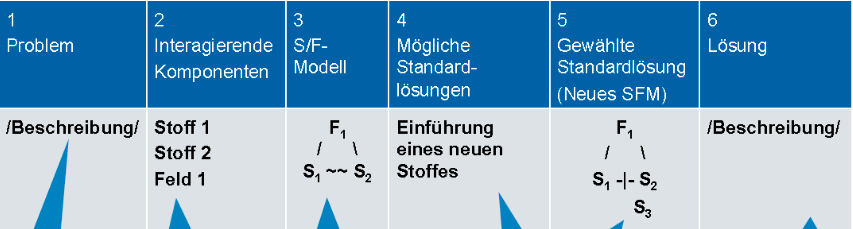

# 76 Standardlösungen
Quellenhinweis:
Hinweis zur Grundlage dieser Ausarbeitung:Die hier dargestellten Analysen, Begriffe und Strukturierungen basieren auf der systematischen Methodik der TRIZ 76 Standardlösungen, insbesondere gemäß den Inhalten aus:

- **Adunka, R. (2016).** *76 Standardlösungen: Kreativität ist lernbar. Ungeahnte Lösungen finden.* TRIZ Consulting Group.
- **Adunka, R. (o. J.).** *76 Standardlösungen -- Klassentabelle (interne Visualisierung).* Nach einer Vorlage von: 76_standardlösungen_A0_01adunka.vsd.
- Ergänzend: eigene Ableitungen gemäß Stoff-Feld-Analyse und ARIZ-Logik

## Was ist ein Stoff-Feld?
Ein Stoff-Feld ist ein System, das durch die Interkationen von Stoffen und Feldern innerhalb eines technischen Systems gebildet wird.  
Stoffe sind dabei Komponenten eines technischen Systems, die eine Masse habe, wie z.B. Räder, Getriebe oder eine Schraube.  
Ein Feld wird als etwas Energieähnliches verstanden. Der Auslegungsbereich für „Feld" ist in diesem Zusammenhang sehr weit. Beispiel für Felder sind mechanische, elektrische, magnetische, chemische, biologische und thermische Felder oder die Gravitation.

## Felder im Stoff-Feld-Modell
Mechanisches Feld: Beinhaltet Gravitation, Kollisionen, Reibung, direkter Kontakt, Vibration, Resonanz, Schocks, Wellen, Gas-/Flüssigkeitsdynamik, Wind, Druck, Vakuum, Mechanische Bearbeitung und Behandlung Deformation, Mischen, Additive, Explosionen

Akustisches Feld: Schall, Ultraschall, Infraschall, Kavitation

Thermisches Feld: Erwärmen, Kühlen, Isolation, thermische Expansion, Phasenübergänge, Zustandsänderung, endo- / exothermische Reaktion, Feuer, Verbrennung, Wärmestrahlung, Konvektion

Chemische Felder: Reaktionen, Reaktanten, Elemente, Verbindungen, Katalysatoren, Inhibitoren, Indikatoren (pH), auflösend, kristallisierend, polymerisierend, Geruch, Geschmack, Farbänderung, pH, usw. 

Elektrisches Feld: Elektrostatische Ladung, Stromleiter, Isolatoren, Elektrisches Feld, elektrischer Strom, Supraleitfähigkeit, Elektrolyse, piezo-elektrischer Effekt, Ionisierung, Elektrische Entladung, Funken

Magnetisches Feld: Magnetisches Feld, Kräfte und Partikel, Induktion, Elektromagnetische Wellen (Röntgenstrahlung, Mikrowellen, usw.), Optik, Sicht, Farbänderung, Änderung der Durchsichtigkeit, Bild

Intermolekulares Feld: Subatomare (Nano-) Partikel, Kapillaren, Poren, Nuklearreaktion, Strahlung, Fusion, Emission, Laser, Intermolekulare Interaktion, Oberflächeneffekte, Evaporation

Biologisches Feld: Mikroben, Bakterien, lebende Organismen, Pflanzen, Pilze, Zellen, Enzyme

## Konventionen beim Erstellen der Stoff-Feld-Modelle
S1: Der Stoff, der verändert, bearbeitet, umgewandelt, festgestellt, kontrolliert usw. werden muss.

S2: Der Stoff, der als „Werkzeug " („Instrument " oder „Medium ") eine notwendige Wirkung ausübt.

F: Das Feld, das die Energie, bzw. die Kraft erzeugt (also die Wirkung von S auf Si oder deren Wechselwirkung).

### Unterschiedliche Arten der Wechselwirkung
Erwünschte, nützliche Wirkung

Unzureichende Wirkung

Überzogene Wirkung

Schädliche Wirkung

Unspezifische, allgemeine Wirkung oder Wechselwirkung (z.B. Feld auf Stoff)

## Unterteilung der 5 Klassen
Die 76 Lösungsstandards werden in fünf Klassen unterteilt und werden auch „Die Klassen der Standardlösungen" genannt.

<u>Klasse 1: Aufbau und Zerlegung vollständiger Stoff-Feld-Modelle (SFM)</u>

Erzeugen oder Zerstören des Stoff-Feld-Modells, wenn es unvollständig ist oder schädliche Funktionen aufweist.

Diese Gruppe hat 2 Untergruppen - Gruppe 1.1 Erzeugung von Stoff-Feldern und Gruppe 1.2 Zerlegung von Stoff-Feld-Modellen und enthält 13 Standardlösungen.

Gruppe 1.1 - die wichtigsten Empfehlungen aus dieser Untergruppe sind:

- Vervollständigen des Stoff-Feld-Systems so, dass zwei Stoffe und ein Feld (Interaktion) vorhanden sind.

- Einfügen eines Additivs innerhalb eines der Stoffe (internes Additiv).
- Einfügen eines Additivs an einen der Stoffe oder um ihn herum (externes Additiv).
- Minimum/Maximum-Verfahren: Viel hinzufügen und das Überschüssige entfernen oder wenig hinzufügen und gezielt lokal/punktuell verbesser.
- Einfügen eines dritten Stoff, der bereits im Supersystem vorhanden ist.

Gruppe 1.2 - die wichtigsten Empfehlungen aus dieser Untergruppe sind:

- Einfügen eines dritten Stoffes zwischen den beiden existierenden Stoffen.
- Einfügen eines dritten Stoffes als eine Modifikation eines der beiden gegebenen Stoffe.
- Einfügen eines Stoffs als „Opfer " (Bodyguard).
- Einfügen eines Feldes, das dem schädlichen Feld entgegenwirkt

<u>Klasse 2: Verbesserung von Stoff-Feld-Modellen</u>

Einführung von Modifikationen innerhalb der Systemgrenzen.

Diese Gruppe hat 4 Untergruppen und enthält 23 Standardlösungen.

<u>Klasse 3: Übergang ins Super- und Subsystem (Makro- und Mikro-Level)</u>

Entwicklung von Lösungen auf der Ebene der Super- und Subsysteme.

Diese Gruppe hat 2 Untergruppen und enthält 6 Standardlösungen.

<u>Klasse 4: Erkennen und Messen</u>

Lösung von Mess- und Erkennungsproblemen eines technischen Systems.

Diese Gruppe hat 5 Untergruppen und enthält 17 Standardlösungen.

<u>Klasse 5: Hilfen (Standards für die Anwendung der Standardlösungen)</u>

Entwickelt Lösungen, die die Bedingungen an ein ideales System treffen.

Diese Gruppe hat 5 Untergruppen und enthält 17 Standardlösungen.

### Vorgehen bei der Beschreibung der Lösung
1. Beschreibe das Problem, das es zu lösen gilt.
2. Zähle alles Stoffe auf, die mit den Interaktionen des Problems in Verbindung gebracht werden.
3. Erzeuge das SFM des technischen Problems unter Verwendung der Komponenten von Punkt 2.
4. Notiere die Standardlösung, die zur Lösung herangezogen werden kann.
5. Notiere das Neue SFM des Problems unter Verwendung der Standardlösungen aus Punkt 4.
6. Beschreibe die Lösung, die durch das Implementieren der Standardlösung erzeugt wurde.

### Vorgehensweise bei der Anwendung von Standardlösungen
Wenn das Problem ein Messproblem ist, dann wendet man die Klasse 4 an und zusätzlich die Klasse 5.

Ist das Problem kein Messproblem, dann wird analysiert, ob das SFM-Modell vollständig ist. Ist es nicht vollständig, dann wendet man den Standard 1.1.1 an und zusätzlich die Klasse 5.

Ist das SFM-Modell vollständig, dann wird analysiert, ob das SFM-Modell schädlich Effekte hervorruft. Wenn das SFM-Modell schädliche Stoffe vorzeigt, dann wird die Gruppe 1.2 angewendet zusätzlich die Klasse 5.

Wenn das SFM-Modell keine schädlichen Stoffe vorzeigt, dann wird analysiert, ob das SFM-Modell unzureichende Effekte/Wirkungen hat. Wenn nein, dann wird die Klasse 3 oder eventuell die Klasse 2 angewendet und zusätzlich die Klasse 5.

Wenn Ja, Dann wird Standard 1.1.2 bis 1.1.8 oder Klasse 2 angewendet und zusätzlich die Klasse 5.

## Klasse 1: Aufbau und Zerlegung vollständiger Stoff-Feld-Modelle
### Gruppe 1.1: Erzeugung von Stoff-Feld-Modellen
#### Standard 1.1.1 Aufbau eines vollständigen Stoff-Feld-Modells
Vervollständigen Sie das Stoff-Feld-System so, dass zwei Stoffe und ein Feld (Wechselwirkung) vorhanden sind. Wenn ein System die notwendige Arbeit nicht leisten kann, prüfen Sie, ob das System vollständig ist.

**Ziel:** Ein technisches System so vervollständigen, dass es zwei Substanzen (S1 und S2) und mindestens ein Feld (F) enthält, das eine Wechselwirkung zwischen ihnen ermöglicht.

**Grundidee:** Ein technisches System ist nur dann vollständig und funktionsfähig, wenn es drei wesentliche Komponenten enthält:

-  **Stoff 1 (S1):** Das Ziel der Handlung z. B. das Objekt, das verändert wird.
-  **Stoff 2 (S2):** Das Werkzeug oder agierende Element z. B. das, was auf S1 einwirkt*
- **Feld (F):** Eine Energieform, die die Wechselwirkung zwischen S1 und S2 verursacht oder ermöglicht z. B. mechanisch, thermisch, elektrisch.

→ Ein unvollständiges Stoff-Feld-System kann keine Funktion erfüllen. Es muss durch Hinzufügen der fehlenden Komponente(n) vervollständigt werden.

**Anwendungshinweis: Frage:** Warum funktioniert das System nicht oder nur unzureichend?→ Ist eine der Substanzen oder das Wechselwirkungsfeld nicht vorhanden?

**Empfohlene Maßnahme:** Identifizieren Sie die fehlende Komponente und fügen Sie sie hinzu, um ein vollständiges Stoff-Feld-Modell zu konstruieren.

**Beispiele:**

1.  **LKW ohne Treibstoff** S1: LKW S2: Treibstoff F: Umwandlungsfeld (chemische → mechanische Energie)→ Fehlende Substanz (Treibstoff) → unvollständiges System → keine Bewegung

2.  **Pulverentlüftung** S1: Pulver S2: Gas (z. B. Luft) F: Gravitationsfeld (z. B. durch Zentrifuge)→ Hinzufügen der Zentrifugalkraft ermöglicht die notwendige Wechselwirkung

3.  **Kühlschranktürverschluss** S1: Tür S2: Gehäuse F: Mechanisches oder magnetisches Feld (z. B. Haken, Magnet)→ Fehlende Schließkraft = fehlendes Feld → unvollständige Funktion

**Hinweise:** Diese erste Standardlösung wird hauptsächlich zu Beginn einer Stoff-Feld-Analyse verwendet und dient als erster Prüfpunkt: Ist das System strukturell vollständig?

Ein minimales Stoff-Feld-Modell besteht aus zwei Stoffen und einem Feld, die in einer dreieckigen Struktur interagieren. 

Substanzen (S1, S2) können beliebige physikalische Objekte oder Materialien im System sein -- von einfachen Bauteilen (z. B. Schraube) bis zu komplexen Systemen (z. B. Maschine, Organismus).

Das Feld (F) umfasst eine Vielzahl von Energieformen, darunter:

- Klassische physikalische Felder: mechanisch, thermisch, elektrisch, magnetisch, gravitationell
- Weitere technische Felder: akustisch, chemisch, optisch, informatorisch, druckbasiert, strahlungsbasiert
- Abgeleitete oder kombinierte Felder: z. B. Zentrifugalkraft, Laserlicht, Ultraschall, elektromagnetische Wellen 

#### Standard 1.1.2 Aufbau eines komplexen Stoff-Feld-Modells mit internen Zusatzstoffen 
Einfügen eines Additivs innerhalb eines der Stoffe (internes Additiv).

Wenn ein nützlicher Effekt verbessert werden soll und es keine Einschränkungen beim Hinzufügen von Zusatzstoffen gibt, kann ein fremder Zusatzstoff (S,) permanent oder zeitweise in einen der vorhandenen Stoffe (S, oder S2) eingeführt werden. Der zusätzliche Stoff soll die Kontrollierbarkeit des Stoff-Feldes erhöhen oder die gewünschte Eigenschaft gewährleisten. Das Feld wird in seiner ursprünglichen Form beibehalten.

**Ziel:** Verbesserung einer nützlichen Wirkung innerhalb eines technischen Systems durch das **Einführen eines internen Additivs (S3)** in eine der vorhandenen Substanzen (S1 oder S2).

**Grundidee:** Wenn ein Stoff-Feld-System bereits vollständig ist (bestehend aus S1, S2 und F), aber die Leistung unzureichend ist oder verbessert werden soll, kann man:

- Ein Additiv (S3) in das Innere von S1 oder S2 einbringen
- Dieses Additiv verbessert z. B. Steuerbarkeit, Wirkungsgrad oder eine gewünschte Eigenschaft
- Das ursprüngliche Feld (F) bleibt unverändert

**Leitsatz:** Die Effektivität der Wechselwirkung wird erhöht, indem eine der Substanzen intern verbessert wird. 
**Anwendungshinweise**

- Wann anwenden? → Wenn eine nützliche Wirkung vorhanden ist, aber verstärkt oder besser gesteuert werden soll.
- **Maßnahme:** Füge ein Additiv in S1 oder S2 ein, um eine komplexe innere Struktur zu erzeugen -- ohne das äußere System oder das Feld zu verändern. 

**Beispiele:** 

1. **Lötzinn mit eingebettetem Flussmittel**

   - S1: Lötstelle
   
   
      - S2: Lötzinn
   
   
      - S3 (internes Additiv): Flussmittel im Drahtinneren → Erhöht die Qualität der Verbindung ohne externe Zusätze 
   
2. **Faserverbundwerkstoff mit Selbstheilungseffekt**

     - S1: Verbundstruktur
     - S2: Spannungen/Risse
     - S3: Harz-Kapseln im Materialinneren → Harz tritt bei Rissbildung aus und verschließt den Schaden automatisch

3. **Dotierung von Silizium-Wafern**
     - S1: Siliziumbasis
     - S2: Elektrischer Strom
     - S3: Dotieratome (z. B. Bor, Phosphor) im Silizium → Verbessert Leitfähigkeit und Steuerung gezielt

4. **Vitamingabe zur Stärkung des Immunsystems**
     - S1: Menschlicher Körper
     - S2: Umwelt / Virus
     - S3: Innerlich zugeführtes Vitamin C → Stärkt die Systemabwehr ohne äußere Systemänderung

**Hinweise**

- Das Additiv wird Teil der ursprünglichen Substanz (S1 oder S2)

- Der Fokus liegt auf der internen Verbesserung, ohne das äußere Systemlayout oder das Feld zu verändern

- Für eine erweiterte Strategie des Stoffeintrags siehe auch Klasse 5.1 „Substanzzugaben"
  

#### Standard 1.1.3 Aufbau eines komplexen Stoff-Feld-Modells mit externen Zusatzstoffen

Einfügen eines Additivs an einen der Stoffe oder um ihn herum (extemes Additiv). 
Wenn ein nützlicher Effekt verbessert werden soll, es aber nicht möglich ist, einen Stoff in die vorliegenden Stoffe einzuführen, dann ist ein fremder Zusatzstoff permanent oder zeitweise an einen der vorliegenden Stoffe anzuhängen. Der zusätzliche Stoff soll die Kontrollierbarkeit des Stoff-Feldes erhöhen oder die gewünschte Eigenschaft gewährleisten. Der neue Stoff darf kein neues Feld mitbringen, um zusätzlichen Energieverbrauch zu vermeiden.

**Ziel:** Verbesserung einer nützlichen Wirkung innerhalb eines bestehenden Stoff-Feld-Systems durch das Hinzufügen eines externen Additivs (S3), das außerhalb von S1 oder S2 angebracht wird.

**Grundidee:** Wenn ein Stoff-Feld-Modell (bestehend aus S1, S2 und F) bereits vorhanden ist, aber nicht effizient genug arbeitetoder eine bestimmte Wirkung verbessert werden soll, kann Folgendes getan werden:

- Ein Additiv (S3) wird außerhalb von S1 oder S2 angebracht oder aufgebracht

- S3 verbessert z. B. die Wechselwirkung, Steuerbarkeit, Wirkungsstärke oder eine gewünschte Systemeigenschaft

- Wichtig: Das Feld (F) bleibt unverändert, ebenso die Substanzstruktur von S1 und S2 
  

**Leitsatz:** Wenn eine Substanz nicht intern verändert werden kann, kann eine äußere Modifikationhelfen, die Wirkung zu verstärken oder gezielter zu gestalten. 

**Anwendungshinweise**

- **Wann anwenden?** → Wenn keine Veränderung im Inneren von S1 oder S2 möglich oder erlaubt ist, aber eine Optimierungnotwendig ist

- **Maßnahme:** Füge eine externe Substanz (S3) hinzu, die die Interaktion im System unterstützt, ohne neue Felder einzuführen
  

**Anwendungsbeispiele** 

1. Lecksuche an einer Gasleitung mit Seifenlösung

   - S1: Rohrleitung
   
   
      - S2: Gas
   
   
      - S3 (externes Additiv): Seifenwasser auf der Außenseite → Erlaubt das Sichtbarmachen von Lecks durch Blasenbildung
   
2. Chirurgenhandschuh mit antiviraler Beschichtung

     - S1: Haut/Hand
     - S2: Chirurgenhandschuh
     - S3: Virusabtötender Wirkstoff an der Innenseite des Handschuhs → Verhindert Infektion bei Verletzung durch Nadel

3. Skisystem mit Wachs

     - S1: Schnee
     - S2: Ski
     - S3: Wachsfilm auf der Ski-Unterseite → Verbessert Gleiteigenschaften ohne Veränderung am Ski selbst

**Hinweise**

- Das externe Additiv verändert S1 oder S2 nicht intern, sondern wirkt an der Oberfläche oder in der Nähe

- Es wird keine neue Energiequelle (Feld) eingeführt -- die ursprüngliche Feldwirkung bleibt erhalten

- Wenn keine äußere Anbringung möglich ist, prüfe Alternativen wie Standard 1.1.4 (Systemumfeld als Substanz nutzen) 
  

#### Standard 1.1.4 Hinzufügen von Stoffen aus der Systemumgebung

Wenn ein nützlicher Effekt verbessert werden soll, es aber nicht möglich ist, einen Stoff in oder an die vorliegenden Stoffe zu bringen, dann ist das vorhandene Umfeld (Enviroment) als Stoff (S EXT) 
permanent oder zeitweise zu nutzen, um die benötigten Eigenschaften bereit zu stellen und die Interaktion des existierenden Systems zu verstärken. 

**Ziel:** Verbesserung einer nützlichen Wirkung im Stoff-Feld-Modell durch das Nützen einer bereits vorhandenen Substanz aus der Umgebung (SEXT), ohne neue Elemente von außen einzuführen.

**Grundidee:** Wenn ein Stoff-Feld-Modell (S1, S2, F) verbessert werden soll, aber keine neuen Stoffe eingeführt werden dürfen (z. B. aus Gründen der Einfachheit, Kosten, Umwelt), kann man:

- Eine Substanz aus dem bestehenden Systemumfeld (S EXT) verwenden

- Diese wird temporär oder dauerhaft in das bestehende Modell eingebunden

- Die Substanz aus dem Umfeld trägt zur Optimierung der Wechselwirkung zwischen S1 und S2 bei -- ohne neue Felder oder externe Stoffzufuhr 
  

**Leitsatz:** Nutze das, was ohnehin schon im Umfeld des Systems vorhanden ist, als funktionalen Bestandteil anstatt neue Ressourcen zuzuführen.

**Anwendungshinweise** 

- **Wann anwenden?**→ Wenn keine internen Additive (Standard 1.1.2) und keine externen Substanzen (Standard 1.1.3) erlaubt oder praktikabel sind→ Wenn die Umgebung bereits nützliche Stoffe enthält, die bisher ungenutzt blieben
- **Maßnahme:** Verwende eine vorhandene Umgebungs-Substanz (S EXT) gezielt als funktionales Element im Stoff-Feld-Modell 

**Anwendungsbeispiele** 

1. Vibrationsverstärker mit Luftwiderstand

   - S1: Unwuchtkörper
   
   
      - S2: Schwingungssystem
   
   
      - S EXT: Luft → Die Form des Unwuchtkörpers wird so gestaltet, dass Luft als Widerstand wirkt und die Schwingung verstärkt 
   
2. Selbstabdichtendes Kabel bei Feuchtigkeitseintritt

   - S1: Kabel
   
   
      - S2: eindringende Feuchtigkeit
   
   
      - S EXT: quellfähige Substanz im Kabelmantel → Wasser aktiviert das Quellmittel -- dieses verschließt die Öffnung 
   
3. Seewasser als Stabilisator für Boje

   - S1: Boje
   
   
      - S2: Wellengang
   
   
      - S EXT: Wasser als bewegte Masse → Wasser wirkt als Puffer und dämpft die Auf- und Abbewegung der Boje
   

**Hinweise**

- Diese Lösung ist besonders elegant, da sie Systemressourcen optimal nutzt

- Es entstehen keine zusätzlichen Kosten, kein zusätzlicher Energiebedarf

- Prüfe auch angrenzende Konzepte wie Systemressourcenanalyse oder Ideales Endresultat (IFR)

- Wenn keine geeigneten Umgebungsstoffe verfügbar sind, verweise auf Standard 1.1.5: Zerlegung oder Modifikation des Umfelds 
  

#### Standard 1.1.5 Zerlegung der Systemumgebung und Hinzufügen von Zusatzstoffen

Wenn ein nützlicher Effekt verbessert werden soll, es aber nicht möglich ist, einen Stoff in oder an die vorliegenden Stoffe zu bringen und das vorhandene Umfeld keine Stoffe enthält, die dem Stoff-Feld-Modell die benötigten Eigenschaften vermitteln kann, dann soll permanent oder zeitweise

1. das Umfeld durch ein anderes Umfeld (S ' EXT) ersetzt werden
2. das vorhandene Umfeld zerlegt werden (S 'EXT) oder
3. das vorhandene Umfeld durch Zugabe eines Additivs (S3) verändert werden. 

**Ziel:** Verbesserung der Funktion eines bestehenden Stoff-Feld-Modells, wenn weder interne noch externe Ergänzungen (siehe Normen 1.1.2 und 1.1.3) ausreichen, durch Aufschlüsselung und Änderung oder Ergänzung der bestehenden Systemumgebung.

**Grundidee:** Wenn das Grundsystem (S1, S2 und F) keine optimale Leistung erbringt und sich auch keine sinnvolle interne oder externe Substanzzufuhr realisieren lässt, kann man:

- Das **Umfeld des Systems** -- also vorhandene externe Stoffe -- aufteilen, modifizieren oder gezielt nutzen, um als funktionale Ergänzung in das Modell integriert zu werden.

- Dadurch wird die ursprüngliche Umgebung entweder **ersetzt** oder **modifiziert**, sodass ein zuvor nicht nutzbarer Stoff (S′EXT) als Additiv fungieren kann. 
  

**Leitsatz:** Nutze die Potentiale des bestehenden Umfelds, indem du es in einzelne, nutzbare Komponenten zerlegst oder modifizierst -- statt komplett neue Stoffe von außen zuzuführen. 

**Anwendungshinweise**

- **Wann anwenden?** → Wenn weder das direkte Einbringen eines internen Additivs (1.1.2) noch eines externen Additivs (1.1.3) möglich oder effektiv ist und das bestehende Systemumfeld keine direkt verfügbare, nutzbare Substanz bietet.

- **Maßnahme:** Zerlege oder modifiziere das Systemumfeld, um eine geeignete, oft bereits vorhandene Substanz (S′EXT) herauszukristallisieren, die dann als Additiv in das bestehende Stoff-Feld-Modell eingebunden wird. 
  

**Anwendungsbeispiele** 

1. Verbesserung der Gleiteigenschaften bei Reibung:

   - **S1:** Reibflächiges Bauteil
   
   
      - **S2:** Kontaktfläche
   
   
      - **S′EXT:** Vorhandene Umgebungsluft oder Feuchtigkeit, die gezielt modifiziert (z. B. durch Vorbehandlung) als Schmiermittel wirkt→ Durch Modifikation (z. B. durch Aufbringen eines Kondensats) kann die Reibung reduziert werden 
   
2. Modifikation eines Kabelmantels:
   - **S1:** Inneres Kabel
   - **S2:** Außenhülle des Kabels
   - **S′EXT:** Vorhandenes Material des Kabelmantels, das durch einen chemischen Prozess in eine Dichtung umgewandelt wird→ Der umgewandelte Bereich wirkt als zusätzliches Dichtungselement

3. Anpassung an unterschiedliche Umgebungsbedingungen:
   - **S1:** Technisches Gerät
   - **S2:** Steuerungseinheit
   - **S′EXT:** Umgebung (z. B. Temperatur, Luftfeuchtigkeit), die durch gezielte Anpassung (z. B. Kühlung oder Beheizung) in den Regelkreis integriert wird→ Optimiert die Funktion durch adaptive Nutzung von Umgebungsbedingungen

**Hinweise**

- Diese Standardlösung ist besonders nützlich, wenn das Systemumfeld bisher als „gegeben" betrachtet wurde, aber Potenziale zur Verbesserung bietet.

- Die Zerlegung oder Modifikation des Umfelds kann kosteneffizient sein, da auf bereits vorhandene Materialien zurückgegriffen wird.

- Falls keine geeignete Umgebungssubstanz gefunden werden kann, bieten sich alternative Wege an, wie z. B. die Einführung eines externen Additivs (1.1.3).

#### Standard 1.1.6 Optimaler Betrieb 

Maximum-Verfahren: Viel hinzufügen und das Überschüssige entfernen. 
Wenn ein „minimaler " (dosierter, optimaler) Effekt eines Feldes auf einen Stoff oder eines Stoffes auf einen anderen Stoff benötigt wird, kann ein Überschuss an  Feldwirkung oder Stoffmenge eingebracht werden und dieser im Nachhinein auf folgende Weise beseitigt werden: 

1. Überschüssige Feldwirkung wird durch einen neuen Stoff kompensiert 
2. Überschüssige Stoffmenge wird durch eine Feldwirkung beseitigt

**Ziel:** Erreichen einer optimalen Wirkung in einem Stoff-Feld-System, indem zunächst eine übermäßige (maximale) Wirkung erzeugt und der Überschuss gezielt entfernt oder kompensiert wird.

**Grundidee:** Wenn ein Stoff-Feld-System grundsätzlich funktioniert, aber die Wirkung zu schwach oder instabil ist, kann es sinnvoll sein:

- Mehr als notwendig von einem Stoff oder einem Feld einzusetzen

- Danach wird der Überschuss entfernt, abgeschwächt oder abgeführt, um die gewünschte (optimale) Wirkung zu erzielen

Es wird also nicht versucht, exakt die ideale Menge/Feldwirkung zu dosieren, sondern das System wird übersteuert und dann reguliert. 

**Leitsatz:** Erzeuge absichtlich eine übermäßige Wirkung (Substanz oder Feld) und entferne oder kompensiere den Überschuss, um optimale Systemleistung zu erreichen. 

**Anwendungshinweise**

- **Wann anwenden?**→ Wenn präzise Dosierung schwierig oder teuer ist→ Wenn eine gewünschte Wirkung nur schwer kontrollierbar erzeugt werden kann

- **Maßnahme:** Erzeuge eine maximale Wirkung durch Übermaß an Stoff oder Feld
  1. Überschüssiges Feld wird durch zusätzliche Substanz neutralisiert

  2. Überschüssige Substanzmenge wird durch ein Feld entfernt (z. B. Fliehkraft, Temperatur, Absaugung)

**Anwendungsbeispiele** 

1. Lackieren durch Übermaß und Fliehkraft

   - S1: Zylindrisches Werkstück
   
   
      - S2: Farbe
   
           - F: Zentrifugalkraft → Farbe wird im Überschuss aufgetragen, dann durch Rotation gleichmäßig verteilt und überschüssiges Material entfernt
   
2. Schmelzen von Glasampullen im Wasserbad

   - S1: Glasampulle mit Medikament
   
   
      - S2: Gasflamme
   
   
      - F1: Thermisches Feld
   
   
      - S3: Wasserbad zum Temperaturschutz → Ampulle wird übermäßig erhitzt, das Wasserbad schützt vor zu starker Erwärmung des Medikaments
   
3. Überfüllte Gussform wird begradigt

   - S1: Frisch gegossener Beton
   
   
      - S2: Gussform
   
   
      - F: Gravitation / manuelle Glättung → Überfüllung wird später mechanisch entfernt → optimale Oberflächenkontrolle
   

**Hinweise**

- Diese Methode ist besonders nützlich bei Systemen mit instabiler oder schwer steuerbarer Dosierung

- Sie ersetzt oft aufwändige Regeltechnik durch passive Kompensation

- In vielen Fällen sind kostenintensive Feinabstimmungen oder Regelungsverfahren nicht erforderlich.

- Siehe auch Standard:

  - 1.1.7 (Maximale Wirkung mit Zwischenträger)

  - 1.1.8 (Selektiver Maximalbetrieb)

  - 5.2.2 (Nutzung externer Felder)
    

#### Standard 1.1.7 Maximaler Betrieb

Wenn die maximale Wirkung einer Feldwirkung auf einen Stoff benötigt wird, dies aber unter den Randbedingungen nicht gewünscht ist, dann soll die maximale Wirkung bestehen bleiben, aber auf einen neuen Stoff gerichtet werden, der dem ursprünglichen Stoff angehängt wird. Der neue Stoff wird zum Übermittler, der nur den erforderlichen Teil der Wirkung an den ursprünglichen Stoff weitergibt. 

**Ziel:** Die maximale Wirkung eines Feldes (F max) auf eine Substanz zu ermöglichen, auch dann, wenn die direkte Anwendung dieser Wirkung unter den gegebenen Randbedingungen 
(z. B. Empfindlichkeit, Sicherheit) nicht zulässig oder praktikabel ist. 

**Grundidee:** Wenn eine starke Feldwirkung gewünscht, aber nicht direkt anwendbar ist (z. B. wegen Überhitzung, Materialschädigung oder Streuverlust), wird ein neues Element (eine zusätzliche Substanz) eingeführt:

- Diese neue Substanz (S V) wird an die ursprüngliche Substanz (S1) angefügt oder dazwischengeschaltet

- Sie empfängt das volle Feld (F max) und wirkt als Vermittler oder Transmitter

- Der Transmitter filtert, puffert oder transformiert das Feld und gibt nur den gewünschten Teil der Wirkungan S1 weiter
  

**Anwendungshinweise** 

- **Wann anweden?** → Wenn S1 die volle Feldwirkung nicht direkt aushalten kann→ Wenn die Wirkung präziser, sicherer oder fokussierter erfolgen soll→ Wenn keine Felder reduziert, sondern kontrolliert weitergegeben werden sollen 

- **Maßnahme:**

  - Halte F max aufrecht
  
  
    - Füge eine neue Substanz (S V) hinzu, die die volle Wirkung aufnimmt
  
  
    - Leite die gefilterte Wirkung selektiv an S1 weiter 
  

**Anwendungsbeispiele** 

1. Laserschneiden mit Fokuslinse 

     - S1: Material
     - S2: Laserquelle
     - F max: Laserstrahl
     - S V: Linse (Transmitter) → Linse bündelt das starke Licht und überträgt es kontrolliert auf S1 → präziser Schnitt ohne Materialschaden 

2. Induktionsheizung mit Ferritkern

     - S1: Werkstück 
     - S2: Spule
     - F max: Magnetfeld
     - S V: Ferritkern → Feld wird im Kern konzentriert und dann dosiert ans Werkstück übertragen 

3. Aufladung über Kondensator

     - S1: elektrisches Zielsystem

     - S2: Energiequelle

     - F max: elektrische Entladung

     - S V: Kondensator → speichert und gibt eine kontrollierte Maximalwirkung als Impuls frei

**Hinweise**

- S V (der Transmitter) ist eine aktive Komponente im System, nicht nur ein Schutz, sondern ein gezielter Wirkungsvermittler

- Dies ermöglicht komplexe oder gefährliche Feldwirkungen kontrolliert nutzbar zu machen

- Die Wirkung ist nicht abgeschwächt, sondern systematisch umgeleitet und geregelt

- Oft genutzt in Hochenergie-, Präzisions- oder Sicherheitssystemen

- Dieses Standardverfahren wird oft in Kombination mit **Standard 1.1.6 (Minimum-Maximum-Prinzip)** und **1.1.8 (Selektiver maximaler Betrieb)** verwendet 
  

#### Standard 1.1.8 Selektiver maximaler Betrieb

##### 1.1.8.1 Selektiver maximaler Betrieb (Feld maximal)

Wenn ein selektiver Effekt einer Wirkung benötigt wird (Maximal in bestimmten Bereichen, minimaler oder kein Effekt in den anderen Bereichen), dann muss die Feldwirkung maximal sein.

Ein schützender Stoff ist dort einzuführen, wo die minimale Wirkung benötigt wird. 

**Ziel:** Erzeugung einer **selektiven, differenzierten Wirkung** in einem System, indem ein Feld mit **maximaler Intensität** eingesetzt wird, jedoch so, dass **nur bestimmte Bereiche** davon betroffen sind - 
andere werden gezielt **geschützt oder abgeschirmt**. 
**Grundidee:** Wenn ein System oder Prozess **in einem Bereich eine starke Wirkung benötigt**, aber in anderen Bereichen **nicht beeinträchtigt** werden darf, wird folgendes Vorgehen empfohlen:

- **Setze das Feld mit maximaler Stärke ein** (*Fmax*), damit die Wirkung an der Zielstelle garantiert erreicht wird

- **Schütze die nicht zu beeinflussenden Bereiche** durch eine geeignete Schutzsubstanz oder -struktur (S Schutz), die das Feld dort blockiert, absorbiert oder umlenkt.
  

**Leitsatz:** Anstatt das Feld überall zu begrenzen, arbeite mit voller Intensität und kontrolliere gezielt, **wo** es wirkt. 

**Anwendungshinweise** 

- **Wann anwenden?** → Wenn bestimmte Bereiche des Systems **gezielt bearbeitet oder verändert** werden sollen→ Wenn andere Bereiche dabei **geschützt oder unbeeinflusst** bleiben müssen→ Wenn die Wirkung eines schwachen oder fein dosierten Feldes **nicht ausreicht**

- **Maßnahme:**
  - **Feld maximal einsetzen**

  - **Schutzstoff oder Barriere** dort einführen, wo das Feld nicht wirken soll

  - Ergebnis: **Selektivität durch Schutz**, nicht durch Feldschwächung

**Anwendungsbeispiele** 

1. Laserschneiden mit Schutzschicht

   - **S1:** Werkstück
   
   
      - **S2:** Laser
   
   
      - **F max:** Laserfeld
   
   
      - **S Schutz:** Abdeckfolie über empfindlichen Bereichen → Laser wirkt nur auf freiliegende Zonen → kontrollierter Materialabtrag
   
2. Wärmeeinwirkung beim Löten

     - **S1:** Lötstelle
     - **S2:** Lötkolben
     - **F max:** Wärmeeintrag
     - **S Schutz:** Hitzeschutz-Paste an empfindlichen Bauteilen→ Nur die Zielstelle wird erhitzt, andere Komponenten bleiben unbeschädigt

3. UV-Belichtung von Leiterplatten

   - **S1:** Fotolackschicht
   
   
      - **S2:** UV-Lichtquelle
   
   
      - **F max:** UV-Strahlung
   
   
      - **S Schutz:** Maske oder lichtundurchlässige Folie → Nur gewünschte Bereiche werden belichtet, Rest bleibt geschützt
   

**Hinweise**

- Diese Methode ist besonders geeignet für Prozesse, bei denen **hohe Wirkung lokal notwendig**, aber **Systemteile empfindlich** sind

- Vorteil: **Volle Feldintensität** → zuverlässige Wirkung, **minimales Risiko** durch gezielten Schutz

- Der Schutzstoff (S Schutz) kann dauerhaft oder temporär sein (z. B. Folie, Lack, Maske, thermischer Puffer)

- Wir haben hier die gleiche Anforderung wie bei einer selektiven Wirkung: Das Einführen eines Vermittlers entspricht dem Aufbau einer Kette von zwei Stoff-Feld-Modellen.
  

##### 1.1.8.2 Selektiver maximaler Betrieb (Feld minimal)

Wenn ein selektiver Effekt einer Wirkung benötigt wird (Maximal in bestimmten Bereichen und minimal in den anderen Bereichen), dann sollte die Feldwirkung minimal sein und ein Stoff eingeführt werden, 
der die Feldwirkung auf den Stoff S1 lokal verstärkt.

**Ziel:** Eine starke, gezielte Wirkung auf einen bestimmten Bereich (z. B. Substanz S1) zu erzeugen, während andere Bereiche unbeeinflusst bleiben durch Einsatz eines schwachen (minimalen) Feldes und gezielte lokale Verstärkung mittels einer zusätzlichen Substanz.

**Grundidee:** Wenn eine selektive Wirkung gewünscht ist, z. B. maximal an Punkt A, minimal oder keine Wirkung an Punkt B, dann ist es oft nicht praktikabel, mit einem starken Feld zu arbeiten. 
Lösung:

- Setze ein minimal starkes Feld für das Gesamtsystem ein

- Füge eine gezielte Substanz (S3) hinzu, die lokal das Feld an S1 verstärkt

- Ergebnis: Maximale Wirkung nur dort, wo sie gebraucht wird, minimale Störung anderswo
  

**Leitsatz**: Erzeuge selektive Wirkung durch lokale Verstärkung, nicht durch globale Feldintensität.

**Anwendungshinweise**

- **Wann anwenden?** → Wenn bestimmte Bereiche empfindlich auf das Feld reagieren und geschont werden müssen→ Wenn Energieeffizienz, Sicherheit oder Prozesskontrolle wichtig sind→ Wenn selektive Aktivierung oder Bearbeitung erforderlich ist

- **Maßnahme:**
  - Verwende ein global schwaches Feld (F min)

  - Bringe eine verstärkende Substanz (S3) gezielt auf oder nahe bei S1 an

  - Diese verstärkt das Feld nur lokal, z. B. durch Konzentration, Umwandlung oder Leitung
    

**Anwendungsbeispiele** 

1. Lokale Laseraktivierung durch absorbierende Beschichtung

   - **S1:** Zielbereich
   
   
      - **S2:** Laserquelle (schwach)
   
   
      - **F min:** schwache Laserstrahlung
   
   
      - **S3:** absorbierende Schicht nur auf Zielstelle → Nur dort wird genug Energie aufgenommen, um eine Reaktion auszulösen 
   
2. Chemische Aktivierung mit lokalem Katalysator

   - **S1:** Reaktionsfläche
   
   
      - **S2:** chemisches Reagenz
   
   
      - **F min:** geringe Reaktionsenergie im gesamten System
   
   
      - **S3:** Katalysator lokal aufgetragen → Nur dort findet die Reaktion statt → selektiver Materialabtrag oder Aufbau
   
3. Erwärmung mit lokalem Metallpartikel in Mikrowelle

     - **S1:** Zielgewebe oder Materialstelle
     - **S2:** Mikrowellenfeld
     - **F min:** schwache Mikrowellenstrahlung
     - **S3:** metallischer Mikropartikel, der lokal die Mikrowellen absorbiert → Nur der markierte Bereich wird erhitzt

**Hinweise**

- Wir haben hier die gleiche Anforderung, denn die Einführung eines Mediators entspricht

- Die Stellen, die die starken Effekte benötigen, können durch einen Stoff S3 weiter verstärkt werden.

- S3 wirkt als lokaler Verstärker durch:

  - Absorption (Wärme, Licht, Strahlung)

  - Katalyse (chemisch)

  - Leitung oder Fokussierung (z. B. elektrisch, magnetisch)

- Besonders geeignet für:

  - **Halbleitertechnik**

  - **Mikrofertigung**

  - **Medizinische Anwendungen**

  - **Energiearme Prozesse mit hoher Selektivität**
    

### Gruppe 1.2: Zerlegung von Stoff-Feld-Modellen 

#### Standard 1.2.1 Beseitigung einer schädlichen Wirkung durch einen Fremdstoff 

Einfügen einer dritten Substanz zwischen die beiden vorhandenen Substanzen. Tritt neben der nützlichen Wirkung im Kontakt zwischen zwei Stoffen eine schädliche Wirkung auf, darf sofern die Zugabe von Fremdstoffen zulässig ist und kein direkter Stoff-zu-Stoff-Kontakt nötig ist eine dritte, möglichst leicht verfügbare und kostengünstige Substanz S3 zwischen S1 und S2 eingeführt werden. 

**Ziel:** Wenn zwischen zwei Substanzen (S1 und S2) neben einer nützlichen Wirkung auch eine schädliche Wirkungauftritt, soll diese durch das Einfügen einer dritten Substanz (S3) beseitigt oder reduziert werden 
ohne die nützliche Funktion zu beeinträchtigen.

**Grundidee:** 

- Die Substanzen S1 und S2 stehen in direktem Kontakt und erzeugen eine gewünschte Funktion, jedoch tritt zusätzlich eine unerwünschte Nebenwirkung auf (z. B. Beschädigung, Verunreinigung, Reibung).

- Durch das Einfügen einer geeigneten Fremdsubstanz (S3) zwischen S1 und S2 wird die schädliche Wirkung verhindert oder abgeschwächt, während die nützliche Wirkung erhalten bleibt. 
  Leitsatz: Wenn zwei Substanzen nützlich zusammenwirken, aber Schaden verursachen, setze eine dritte dazwischen, die den Schaden blockiert, nicht den Nutzen.
  

**Anwendungshinweise**

- **Wann anwenden?** → Wenn ein Kontakt zwischen zwei Substanzen gleichzeitig nützlich und schädlich ist→ Wenn die schädliche Wirkung physikalischer, chemischer oder mechanischer Natur ist→ Wenn das Einfügen eines Mittels zulässig ist, das keine wesentliche Störung verursacht

- **Maßnahme:** Füge eine dritte Substanz (S3) zwischen S1 und S2 ein, die:
  - den nützlichen Effekt durchlässt oder unterstützt

  - die schädliche Wirkung blockiert, puffert oder verteilt

  - möglichst kostengünstig und leicht verfügbar ist
    

**Anwendungsbeispiele**

1. Sprenggas bei Bohrlochverfestigung

   - S1: Explosion / Gasdruck
   
   
      - S2: Bohrlochwand
   
   
      - Problem: Druck stabilisiert Wand, erzeugt aber Risse
   
   
      - S3: Beschichtung (Plastifizierer) schützt die Wand vor Rissbildung → Nützliche Wirkung bleibt, schädliche wird unterdrückt
   
2. Chirurgische Handschuhe

   - S1: Patient
   
   
      - S2: Hand des Chirurgen
   
   
      - Problem: Übertragung von Keimen
   
   
      - S3: Sterile Einmalhandschuhe → Schutzwirkung ohne Einschränkung der Operation
   
3. Stahlplatte beim Hausanheben

   - S1: Hebevorrichtung
   
   
      - S2: Holzbalken
   
   
      - Problem: Punktuelle Belastung beschädigt das Holz
   
   
      - S3: Stahlplatte verteilt die Last → Vermeidung von Druckschäden bei gleichbleibender Funktion 
        Hinweise
   

Diese Lösung ist besonders häufig in der Medizin, Fertigung, Verpackung, Lebensmitteltechnik und Mechanik zu finden

S3 kann wirken durch:

- Verteilung von Kräften

- Blockade von Mikroorganismen

- chemische Inertheit

- thermische Isolation

Häufig verwendete Substanzen: Folie, Gel, Öl, Zwischenplatten, Beschichtungen, Barrieren, Handschuhe, Papier, Füllstoffe 

#### Standard 1.2.2 Beseitigung einer schädlichen Wirkung durch Systemressourcen

Einfügen einer dritten Substanz als Modifikation einer der beiden vorhandenen Substanzen. Tritt neben der nützlichen Wirkung ein negativer Effekt auf, ein direkter Kontakt ist jedoch nicht erforderlich und Fremdstoffe sollen vermieden werden, dann wird eine modifizierte Substanz S′₁,₂ (abgeleitet aus S1 oder S2) zwischen die Stoffe eingeführt, um die schädliche Wirkung zu vermindern.

**Ziel:** Schädliche Wirkungen zwischen zwei Substanzen (S1 und S2) zu vermeiden oder zu reduzieren, ohne externe Fremdstoffe hinzuzufügen, sondern durch eine modifizierte Form von S1 oder S2 
also eine Systeminterne Substanz (S′ 1,2), die funktional dazwischen wirkt.

**Grundidee:** Wenn zwei Substanzen im System eine gewünschte Wirkung erzeugen, dabei jedoch auch eine unerwünschte Nebenwirkung (z. B. Reibung, Abnutzung, Instabilität) verursachen aber:

- direkter Kontakt nicht zwingend erforderlich ist

- und das Einführen einer fremden Substanz nicht erlaubt oder unerwünscht ist 
  → dann sollte eine dritte Substanz S′1,2 eingeführt werden, die aus einer Modifikation von S1 oder S2 hervorgeht (z. B. durch Aggregatzustandsänderung, Formänderung, geometrische Variation). 
  Leitsatz: Wenn keine externe Substanz erlaubt ist, nutze und forme das, was du schon im System hast.
  

**Anwendungshinweise**

- **Wann anwenden?** → Wenn nützlicher Effekt und schädliche Nebenwirkung gleichzeitig auftreten→ Wenn externe Additive (siehe 1.2.1) nicht gewünscht oder zulässig sind→ Wenn es im System möglich ist, aus vorhandenen Ressourcen eine Zwischenform (S′ 1,2) zu schaffen

- **Maßnahme:** Verwandle oder leite eine modifizierte Substanz aus S1 oder S2 ab, die zwischen S1 und S2 wirkt und die schädliche Wirkung reduziert
  

**Anwendungsbeispiele**

1. Metallkugeln im Rohrleitungssystem

   - S1: Fördermedium (Metallkugeln in Luftstrom)
   
   
      - S2: Rohrinnenwand
   
   
      - Problem: Starke Abnutzung an Rohrbiegungen durch Aufprall
   
   
      - S′1: Stationäre Kugelschicht aus dem gleichen Material → Fließende Kugeln treffen nicht mehr auf die Rohrwand, sondern auf ruhende Kugeln
   
2. Windkräfte auf Regenschirm

   - S1: Wind
   
   
      - S2: Schirmfläche
   
   
      - Problem: Winddruck beschädigt oder verbiegt die Struktur
   
   
      - S′ 2: Öffnungen und flexible Klappen im Schirmmaterial selbst → Druck wird reduziert, Stabilität erhöht
   
3. Montieren von ineinander steckbaren Rohren

     - S1/S2: Rohre (identisches Material)
     - Problem: Hohe Reibung beim Ineinanderschieben
     - S′ 1: Kältebehandlung → Inneres Rohr schrumpft → Nach Erwärmung entsteht formschlüssiger Sitz ohne Schmiermittel

**Hinweise**

- Diese Lösung verzichtet bewusst auf Fremdstoffe (vgl. 1.2.1) und nutzt das Potenzial von:

  - Aggregatzustandsänderungen

  - Materialinterner Umformung

  - Geometrischen Modifikationen

- Die Substanz S′ 1,2 ist oft:

  - ein derivates Element aus dem System selbst

  - z. B. Eis, Gaspolster, Materialschicht, strukturierte Oberfläche, „stehendes Teilchen", Schutzwand aus Eigenmaterial

- Besonders wirksam, wenn das System autonom, wartungsarm oder geschlossen sein muss

#### Standard 1.2.3 Umlenkung einer schädlichen Feldwirkung

Einfügen einer Substanz als „Opfer“ (Bodyguard). Ist eine schädliche Feldwirkung F auf S1 zu beseitigen, kann eine zusätzliche, preiswerte und leicht ersetzbare Substanz S2 eingeführt werden, auf die die schädliche Energie gezielt umgelenkt wird. 

**Ziel:** Eine schädliche Feldwirkung (F), die auf eine Substanz S1 wirkt (z. B. Hitze, Druck, Strahlung), vom Zielobjekt fernhalten, indem die Wirkung auf eine andere Substanz (S2) umgeleitet wird 
eine Art  "Bodyguard ", der gezielt die schädliche Energie aufnimmt oder ableitet.

**Grundidee:** Wenn ein Feld (F) auf eine Substanz S1 wirkt und dabei eine schädliche Wirkung verursacht, kann durch das Einführen einer zusätzlichen Substanz (S2) die Wirkung abgelenkt oder absorbiert werden:

- S2 steht zwischen F und S1 oder ist nahe bei S1 positioniert

- S2 wird gezielt dem Feld ausgesetzt, um S1 zu schützen

- Idealerweise ist S2 preiswert, leicht verfügbar und leicht ersetzbar 
  Leitsatz: Wenn du eine schädliche Wirkung nicht verhindern kannst -- leite sie um und schick jemand anderen vor. 
  

**Anwendungshinweise**

- **Wann anwenden?** → Wenn S1 nicht direkt verändert werden darf→ Wenn eine Feldwirkung (z. B. Wärme, Strahlung, Druck, chemischer Angriff) nicht kontrolliert werden kann→ Wenn eine physikalische Abschirmung möglich und wirtschaftlich sinnvoll ist

- **Maßnahme:** Füge eine  "Opfer-Substanz " (S2) hinzu, die die schädliche Feldwirkung:
  - absorbiert (z. B. Strahlung, Hitze)

  - ablenkt oder ableitet (z. B. Druckwellen, Verformungen)

  - kompensiert (z. B. durch kontrolliertes Gegenfeld oder Gegeneffekt)
    

**Anwendungsbeispiele**

1. Auskleidung eines Behälters bei Gefrieren von Wasser

   - S1: Behälterwand
   
   
      - F: Volumenzunahme beim Gefrieren von Wasser
   
   
      - S2: Elastische Zwischenschicht (Schaumstoff, Gummi) → Sie nimmt den Druck auf → keine Beschädigung der Wand
   
2. Schutz von Rohren im Erdreich vor Frosthebung

   - S1: Rohrleitung

   - F: Bodendruck durch Frost
   
   
      - S2: Vorher platzierte Hohlräume im Erdreich → Diese puffern die Bewegung → keine Deformation des Rohrs
   
3. Röntgenschutz bei medizinischen Aufnahmen

   - S1: Patient / Techniker
   
   
      - F: Röntgenstrahlung
   
   
      - S2: Bleischürze oder bleigefütterte Wand → Nur der Zielbereich wird bestrahlt -- restlicher Körper geschützt
   

**Hinweise**

- Diese Methode ist ideal für passiven Schutz -- keine aktive Steuerung nötig

- S2 wirkt als:

  - Opfermaterial

  - Schutzbarriere

  - Ausgleichsschicht

  - Pufferzone

- Kann auch mit **Standard 1.2.1 (Schutz durch Fremdsubstanz)** oder **Gruppe 5.1. (Zuführung von Stoffen)** kombiniert werden

#### Standard 1.2.4 Neutralisation der schädlichen Wirkung durch ein zweites Feld

Einfügen eines Feldes, das dem schädlichen Feld entgegenwirkt. Wenn der direkte Kontakt zwischen S1 und S2 erhalten bleiben muss und keine neuen Substanzen hinzugefügt werden sollen, erweitert man das Stoff-Feld-Modell um ein zweites Feld F₂, das die schädliche Wirkung neutralisiert oder in eine nützliche Wirkung überführt, während F₁ weiterhin seine positive Funktion erfüllt.

**Ziel:** Wenn eine nützliche Wirkung (F₁) zwischen zwei Substanzen (S1 und S2) auftritt, dabei aber gleichzeitig eine schädliche Wirkung entsteht, soll diese durch ein zweites Feld (F₂) neutralisiert oder in eine nützliche Wirkung umgewandelt werden, ohne den Kontakt zwischen S1 und S2 zu unterbrechen und ohne zusätzliche Substanzen einzuführen.

**Grundidee:**

- Das bestehende Stoff-Feld-Modell (SFM) enthält:

  - S1: Zielsubstanz

  - S2: Einflusssubstanz

  - F₁: Feld, das eine nützliche Wirkung erzeugt

- Doch dabei entsteht eine unerwünschte Nebenwirkung (z. B. Lärm, Schwingung, Verschluss, Verdeckung)

- Lösung: Einführung eines zweiten Feldes (F₂), das die schädliche Wirkung aufhebt, kompensiert oder umleitet

- Das System wird dadurch zu einem doppelten Stoff-Feld-Modell (Dual SFM) 
  Leitsatz: Wenn du den schädlichen Effekt nicht durch Stoffe blockieren darfst, dann kämpfe Feld mit Feld. 
  

**Anwendungshinweise**

- **Wann anwenden?** → Wenn der Kontakt zwischen den Substanzen erhalten bleiben muss→ Wenn keine neuen Substanzen eingeführt werden dürfen oder sollen→ Wenn die schädliche Wirkung durch ein physikalisches Gegenfeld eliminiert werden kann

- **Maßnahme:**
  - Ergänze das bestehende Modell um ein zweites Feld F₂, das die negative Wirkung von F₁ gezielt neutralisiert oder kompensiert

  - F₁ bleibt für die nützliche Funktion aktiv

**Anwendungsbeispiele**

1. Blütenöffnung bei künstlicher Bestäubung

   - S1: Blüte
   
   
      - S2: Luftstrom (F₁ → Transport von Pollen)
   
   
      - Problem: Luftstrom verschließt die Blüte
   
   
      - F₂: elektrostatisches Feld, das die Blüte öffnet→ Harmonie aus nützlichem und kompensierendem Feld
   
2. Hörgerät mit Störgeräuschunterdrückung

   - S1: menschliches Ohr
   
   
      - S2: Schallfeld F₁ (Umgebungsgeräusche + Sprache)
   
   
      - F₂: Antischall durch Phasenverschiebung → Unerwünschter Lärm wird ausgelöscht doch die Sprache bleibt hörbar
   
3. Pumpgeräuschunterdrückung mit Gegenschall

   - S1: Wasser
   
   
      - S2: Pumpe
   
   
      - F₁: Mechanisches Feld → erzeugt nützliche Bewegung
   
   
      - F₂: akustisches Gegenfeld (180° Phasenverschiebung) → Neutralisation des störenden Pumpengeräuschs
   

**Hinweise**

- Die Wirkung von F₂ kann neutralisierend oder transformierend sein

- F₂ kann z. B. sein:

  - Gegenschall /Gegenkraft /Gegenschwingung

  - optisches Hilfsfeld

  - elektrostatische oder magnetische Beeinflussung

- Das Modell entsteht aus einem einfachen SFM → duales SFM

- Weitere verwandte Standards **Gruppe 5.2 (Einführung zusätzlicher Felder)** und **Standard 2.3.2 (Feldrhythmen abstimmen / Synchronisation)** 
  

#### Standard 1.2.5 Ausschalten magnetischer Felder und Entmagnetisierung

Tritt in einem Stoff-Feld-Modell mit Magnetfeld eine unerwünschte Wechselwirkung zwischen zwei ferromagnetischen Stoffen auf, kann durch ein zweites Feld F₂ die ferromagnetische Eigenschaft der Stoffe abgeschaltet oder das Magnetfeld kompensiert werden – z. B. durch Erwärmen über die Curie-Temperatur, mechanische Schocks, Vibrationen oder Gegenfelder. 

**Ziel:** Wenn in einem Stoff-Feld-Modell mit magnetischer Wechselwirkung (F mag) eine unerwünschte Interaktion zwischen zwei ferromagnetischen Substanzen (S1 und S2) auftritt, 
soll diese durch ein zweites Feld F₂neutralisiert werden, indem die magnetischen Eigenschaften beseitigt oder kompensiert werden. 

**Grundidee:**

- Magnetische Felder können nützlich, aber auch störend oder gefährlich sein, insbesondere bei ferromagnetischen Substanzen

- Die Lösung besteht darin, das magnetische Feld nicht mechanisch abzuschirmen, sondern die magnetischen Eigenschaften der Substanz zu verändern

- Das geschieht durch Einführung eines zweiten Feldes F₂, z. B. durch:

  - Erwärmung über den Curie-Punkt

  - mechanischen Schock

  - Vibration

  - Gegenfeld (Entmagnetisierung durch Feldüberlagerung)
    

**Leitsatz:** Schalte das Problem nicht durch Barrieren aus -- schalte die Eigenschaft ab, die das Problem verursacht. 

**Anwendungshinweise**

- **Wann anwenden?** → Wenn magnetische Kräfte im System unerwünschte Anziehung, Ablenkung oder Abstoßung verursachen→ Wenn eine gezielte Entmagnetisierung möglich ist→ Wenn eine komplette Abschirmung des Feldes technisch oder wirtschaftlich nicht sinnvoll ist

- **Maßnahme:**

  - Identifiziere die störende magnetische Wechselwirkung (F mag)

  - Füge ein zweites Feld F₂ hinzu, das:

    - die magnetischen Eigenschaften der Substanz deaktiviert

    - oder das Magnetfeld kompensiert

**Anwendungsbeispiele** 

1. Magnetisches Pulver beim Schweißen

   - S1: Magnetisches Pulver
   
   
      - S2: Schweißzone
   
   
      - F mag: Elektromagnetisches Feld des Schweißstroms
   
   
      - Problem: Pulver wird abgestoßen
   
   
      - F₂: Erwärmung über den Curie-Punkt → Entmagnetisierung → Pulver kann ungestört zugeführt werden
   
2. Induktives Erwärmen mit Selbstbegrenzung

   - S1: ferromagnetisches Bauteil
   
   
      - F₁: Induktionsfeld zur Erwärmung
   
   
      - F₂: Material erwärmt sich bis zum Curie-Punkt → verliert Ferromagnetismus → Keine Überhitzung möglich → Selbstregelung des Prozesses 
   

3. Magnetkran mit passiver Haltemechanik

   - S1: zu hebendes Metall
   
   
      - S2: Kran mit Magnetfeld
   
   
      - F mag : Magnetisches Haltefeld
   
   
      - F₂: Gegenfeld zur Entmagnetisierung bei Freigabe → Energie nur zum Lösen nötig, nicht zum Halten → Ausfallsicherheit bei Stromausfall
   

**Hinweise**

- Der Fokus liegt auf der Veränderung der Stoffeigenschaft (magnetisch → unmagnetisch), nicht nur auf Feldveränderung

- F₂ kann durch verschiedene physikalische Methoden erzeugt werden:

  - Wärme: z. B. durch Hochfrequenz, IR, Widerstand, Reibung, exotherme Reaktion

  - Mechanik: Stoß, Vibration

  - Gegenfelder: z. B. mit entgegengesetzter Polarität, Phasenverschiebung

  - Beachte physikalisch-technische Möglichkeiten zur Temperaturerhöhung oder Feldmodulation → siehe auch **Gruppe 5.2 (Felder hinzufügen)** und **Standard 2.3.2 (Feldrhythmen abstimmen)** 
    

## Klasse 2: Verbesserung von Stoff-Feld Modellen

- Mit dieser Gruppe der Standardlösungen werden Probleme durch die Verbesserung der Effizienz des technischen Systems gelöst. Dazu führt man kleine Modifikationen am System durch.

- Diese Klasse wird auch „Entwicklung und Effektivitätserhöhung von Stoff-Feld-Modellen technischer Systeme " oder „Weiterentwicklung von Stoff-Feld-Systemen " genannt.

- Die Klasse besteht aus 4 Gruppen.

**Die wichtigsten Empfehlungen aus dieser Klasse:**

- Verwendung von verketteten Stoff-Feld-Modellen.

- Verwendung von doppelten Stoff-Feld-Modellen.

- Einfügen eines zweiten Feldes.

- Segmentieren (Zerteilung in gleiche Komponenten).

- Dynamisieren (Erhöhung der Freiheitsgrade).

- Verwendung von Rhythmuskoordination.

- Erhöhung des Grades der Porosität.

- Verwendung von ferromagnetischen Substanzen

### Gruppe 2.1: Übergang zu komplexen Stoff-Feld-Modellen

#### Standard 2.1.1 Verkettete Stoff-Feld-Modelle 

Die Effizienz eines vollständigen Stoff-Feld-Modells kann verbessert werden, indem

1. ein Stoff durch eine unabhängige Stoff-Feld-Triade ersetzt wird. Dadurch entsteht eine Kette aus zwei Stoff-Feld-Modellen, die fortgesetzt werden kann. 
2. eine Verkettung innerhalb des Stoff-Feld-Modells durchgeführt wird. Ein dritter Stoff S3 wird zwischen die Stoffe S1 und S2 eingesetzt. 

**Ziel:** Die Effizienz eines vollständigen Stoff-Feld-Modells (SFM) zu erhöhen, indem weitere Substanz-Feld-Triaden in das System integriert werden, entweder durch Substitution oder Verschachtelung. Dies führt zu einer verketteten oder gestuften Struktur, die die technische Wirkung verbessert oder neue Funktionen ermöglicht.

**Grundidee:** Ein bestehendes SFM wird systematisch erweitert oder umgebaut, indem: 

1. eine der beiden Substanzen (S1 oder S2) durch eine eigene Substanz-Feld-Triade ersetzt wird, wodurch eine Kette von SFMs entsteht (SFM → SFM → SFM  ...) 
2. innerhalb eines SFM eine dritte Substanz (S3) zwischen S1 und S2 eingefügt wird, wodurch ein interner Vermittler oder Modulator entsteht. 

**Leitsatz:** Wenn eine direkte Kopplung nicht ausreicht, baue eine intelligente Kette von Wirkungselementen auf. 

**Anwendungshinweise** 

- **Wann anwenden?** → Wenn ein einzelnes Stoff-Feld-Modell nicht stark, effizient oder flexibel genug ist→ Wenn die direkte Kopplung von S1 und S2 problematisch oder zu grob ist→ Wenn die Wirkung modularisiert oder besser steuerbar gemacht werden soll 
- **Maßnahme:** 
  - Variante (a): Ersetze z. B. S2 durch (S2′ -- F -- S3) → daraus entsteht SFM₁ → SFM₂ 
  - Variante (b): Füge eine zusätzliche Substanz S3 zwischen S1 und S2 ein, um das Feld besser zu übertragen, zu steuern oder zu dämpfen 

**Anwendungsbeispiele** 

1. Keil mit modifiziertem Aufbau

     - S1: befestigtes Bauteil
     - S2: Keil (ursprünglich monolithisch)
     - Problem: Keil lässt sich nur schwer entfernen
     - Lösung: S2 wird zu (S2 + S3) → Keil wird zweiteilig → S3 verschiebbar → Keilwinkel veränderbar → Demontage erleichtert→ Beispiel für (b) interne Verkettung 
2. Hammer - Meißel - Gestein

     - S1: Fels
     - S2: Hammer
     - F1: mechanische Kraft
     - S3: Meißel wird eingeführt → überträgt Kraft präziser→ Verbesserung durch eingeschaltete Vermittlung → klassisches Beispiel für (b) 
3. AZIPOD-Schiffsantrieb

     - Traditioneller Aufbau: Dieselmotor → lange Welle → Ruder → Propeller 
       Neuer Aufbau: Diesel → Generator → Strom → Elektromotor (im Propellernacelle) 

     - Jedes Funktionsglied ist ein eigenes SFM, verbunden zu einer modularen, verketteten Struktur→ Beispiel für (a) kaskadierte Stoff-Feld-Systeme

**Hinweise** 

- Kombinierbarkeit mit **Standard 2.1.1** oder **2.1.2**: z. B. Verkettung + zusätzliche Wirkung durch magnetische Materialien oder geometrische Feldfokussierung 

- Modularisierung ermöglicht:

  - bessere Wartbarkeit
  
  
    - gezielte Steuerung einzelner Abschnitte
  
  
    - Skalierbarkeit technischer Systeme
  

- Siehe auch:

  - 2.3.2 Rhythmusanpassung → bei kaskadierten Systemen mit Feldern unterschiedlicher Taktung

#### Standard 2.1.2 Bildung eines doppelten Stoff-Feld-Modells 

Wenn die Effektivität und Steuerbarkeit eines vollständigen Stoff-Feld-Modells erhöht werden soll und die vorhandenen Stoffe nicht ersetzt oder geändert werden dürfen, dann ist das Stoff-Feld-Modell zu verdoppeln. Ein zweites, leicht steuerbares Feld F2, wird eingeführt.

**Ziel:** Steigerung der Effektivität und Steuerbarkeit eines bestehenden Stoff-Feld-Modells (SFM), ohne die vorhandenen Substanzen zu verändern oder zu ersetzen, durch die Einführung eines zweiten, gut kontrollierbaren Feldes (F₂).

**Grundidee:**

- Ein vollständiges Stoff-Feld-Modell besteht bereits aus zwei Substanzen (S1, S2) und einem Feld (F₁) mit nützlicher Wirkung.

- Die Wirkung ist jedoch nicht effizient genug oder schwer kontrollierbar.

- Anstatt S1 oder S2 zu ersetzen, wird ein zweites Feld (F₂) eingeführt, das:

  - die nützliche Wirkung verstärkt,

  - präziser steuerbar ist,

  - ergänzende Effekte erzeugt. 
    Leitsatz: Wenn du die Substanzen nicht verändern darfst - bring ein zweites Feld ins Spiel, das hilft, steuert oder ergänzt.
    

**Anwendungshinweise**

- **Wann anwenden?** → Wenn bestehendes SFM grundsätzlich funktioniert, aber unpräzise, langsam, nicht vollständig wirksam oder nicht steuerbar ist
  → Wenn S1 und S2 unverändert bleiben müssen (z. B. aus konstruktiven, chemischen oder funktionalen Gründen)

- **Maßnahme**

  - Füge ein zweites Feld (F₂) hinzu, das:

    - parallel, ergänzend oder gegenwirkend agiert

    - entweder direkt auf S1/S2 wirkt oder das ursprüngliche Feld (F₁) moduliert

  - Typische Felder für F₂:

    - Mechanisch (Vibration, Rotation, Ultraschall)

    - Thermisch

    - Elektrisch, magnetisch

    - Optisch (Laser, Licht)

    - Akustisch, pneumatisch 
      

**Anwendungsbeispiele** 

1. Elektrolyt-Entfernung bei Kupferfolie

     - S1: Kupferfolie
     - S2: Spülwasser
     - F₁: mechanische Spülung
     - Problem: Rückstände bleiben haften
     - F₂: Ultraschallfeld / Bewegung → verbessert Reinigungswirkung → Dual-SFM mit zwei mechanischen Feldern

2. Hydrostatisch gelagerte Komponente

   - S1: Flüssigmetall
   
   
      - S2: Bauteil
   
   
      - F₁: hydrostatischer Druck
   
   
      - F₂: elektromagnetische Rotation → gezielte Steuerung der Lage → Kombination von hydraulischer und elektromagnetischer Wirkung
   
3. Kleben mit Punktschweißung kombiniert

   - S1/S2: Fügeteile
   
   
      - F₁: Klebefeld (chemisch, thermisch)
   
   
      - F₂: mechanische Verbindung durch Punktschweißung → Stabilität auch während der Aushärtung → Verarbeitung ohne Wartezeit
   

**Hinweise**

- Dual-SFM = S1 ↔ F₁ ↔ S2 + F₂ auf S1/S2

- Kombinierbar mit:

  - **2.1.1 Verkettete SFM-Strukturen** → z. B. Kombination von Dual-SFM mit Vermittler

  - **Gruppe 5.2: Einführung zusätzlicher Felder**

  - **2.3.2 Feldrhythmus abstimmen**, z. B. bei Vibration + Temperatur → synchronisierte Wirkung

- Duale Modelle sind besonders nützlich bei:

  - Reinigungs-, Montage-, Fertigungsprozessen

  - Präzisionstechnik

  - multiphysikalischen Systemen
    

### Gruppe 2.2 Weiterentwicklung von Stoff-Feld-Modellen 

#### Standard 2.2.1 Anwendung von Feldern mit höherer Steuerbarkeit

Die Effektivität eines vollständigen Stoff-Feld-Modells kann verbessert werden, indem ein unkontrollierbares oder schwer kontrollierbares Feld F1, durch ein gut steuerbares Feld Fneu, ggf. in 
Verbindung mit einem neuen Stoff Sneu, ausgetauscht wird. 

Neben dem Ersetzen des Feldes durch ein Feld höherer Steuerbarkeit (Gravitationsfeld → mechanisches Feld → Temperaturfeld → Magnetfeld → elektrisches Feld → optisches Feld), 
kann auch das Feld selbst (stationär → monoton veränderbar →  ...) und dessen Wirkrichtung verändert werden. 

**Ziel:** Erhöhung der Effektivität und Regelbarkeit eines bestehenden Stoff-Feld-Modells (SFM), indem ein schwer steuerbares Feld (F₁) durch ein präziser steuerbares Feld (Fneu) ersetzt oder ergänzt wird - ggf. 
in Kombination mit einem neuen Stoff (Sneu).

**Grundidee:** In vielen technischen Systemen wirken Felder (z. B. Schwerkraft, Reibung, Druck), die schwer oder gar nicht steuerbar sind. Diese können durch Felder ersetzt werden, die:

- zielgerichteter,

- schneller regelbar,

- präziser einsetzbar,

- feiner dosierbar sind. 
  

Zusätzlich kann der Verlauf des Feldes (stationär → variabel) und dessen Richtung oder Modulation angepasst werden. 

**Leitsatz:** Wenn das Feld zu träge, diffus oder schwer steuerbar ist - ersetze es durch ein präziser kontrollierbares Feld. 

**Anwendungshinweise**

- **Wann anwenden?**→ Wenn ein vorhandenes Feld nicht gut steuerbar ist (z. B. zu langsam, unpräzise, träge)→ Wenn das System eine bessere Regelbarkeit, Taktung oder Anpassbarkeit braucht→ Wenn moderne Steuerung (elektrisch, optisch, digital) möglich oder erwünscht ist

- **Typische Feld-Hierarchie nach Steuerbarkeit:** (von schwer zu leicht steuerbar)Gravitationsfeld → mechanisches Feld → thermisches Feld → magnetisches Feld → elektrisches Feld → optisches Feld 
  Weitere Feldparameter zur Optimierung:
  - Verlaufsform: stationär → stufenlos → gepulst / moduliert

  - Wirkungsrichtung: einseitig → mehrseitig (z. B. gekreuzt)

  - Rhythmus: Frequenz, Phase, Amplitude steuerbar
    

Anwendungsbeispiele 

1. Metallsäge durch Wasserstrahl ersetzt

   - S1: Werkstück
   
   
      - F₁: mechanisches Feld (Sägeblatt)
   
   
      - S neu: Wasserstrahl
   
   
      - F neu: Druck + Steuerung über Strahldüse → Schneiden auch unregelmäßiger Konturen, kontaktlos und fein steuerbar 
   
2. Tintenstrahldrucker mit variablem Tröpfchenausstoß

   - S1: Tinte
   
   
      - F₁: mechanischer Impuls durch Dampfdruck
   
   
      - F neu: zusätzlicher Wärmepuls (Temperaturfeld) durch zweites Heizelement → Kontrolle über Tropfengröße und Dosierung → präziser Farbausdruck 
   
3. Hydraulische Steuerung → elektrische Steuerung

   - S1/S2: Aktor oder Regelglied
   
   
      - F₁: hydraulisches Feld (z. B. durch Druck)
   
   
      - F neu: elektrisches Feld (z. B. via Sensor und Stellmotor) → Reaktionsschnell, programmierbar, digital vernetzbar
   

**Hinweise**

- Kombinierbarkeit:

  - mit 2.2.5 (Strukturierung von Feldern) → gezielte Feldverläufe

  - mit Gruppe 5.2 (Hinzufügen von Feldern)

  - mit 2.3.2 (Rhythmussteuerung) → präzise getaktete Effekte

- Entwicklungstrend technischer Systeme: Unsteuerbar → steuerbar → selbstregelnd → adaptiv

- Ziel ist es, Felder zu wählen, die:

  - gezielt abschaltbar sind

  - energiesparend wirken

  - sicher und wiederholbar steuerbar sind

  - digital integrierbar sind 
    

#### Standard 2.2.2 Fragmentierung von Stoffen

Die Effektivität eines vollständigen Stoff-Feld-Modells kann verbessert werden, indem der Grad der Fragmentierung eines der Stoffe, normalerweise des aktiv wirkenden Stoffes, nach folgendem Muster erhöht wird: 

Monolith - segmentiertes Objekt → Pulver → Flüssigkeit → Gas → Feld (das Funktion des Stoffes übemimmt) 

**Ziel:** Steigerung der Effektivität und Anpassungsfähigkeit eines Stoff-Feld-Modells, indem der Grad der Fragmentierung eines Stoffes - typischerweise des aktiv wirkenden - erhöht wird. 
Ziel ist eine bessere Wirkung, Kontrolle oder Selbstanpassung an unterschiedliche Bedingungen. 

**Grundidee:** Ein ursprünglich monolithischer Stoff (kompakt, starr, unflexibel) kann durch gezielte Zerlegung, Verkleinerung oder Zustandsänderung in eine besser nutzbare, reaktionsfreudigere Form überführt werden. Typischer Fragmentierungsverlauf: 
Monolith → segmentiertes Objekt → Pulver → Flüssigkeit → Gas → Feld (Funktion übernimmt das Feld) 

**Leitsatz:** Ein fein verteilter Stoff wirkt oft effizienter, flexibler und anpassungsfähiger als ein großer, starrer Körper. 

**Anwendungshinweise**

- **Wann anwenden?**→ Wenn ein Stoff in seiner aktuellen Form zu träge, zu grob oder nicht flexibel genug wirkt→ Wenn eine gleichmäßigere Wirkung, bessere Verteilung, Selbstanpassung oder Redundanz gewünscht ist→ Wenn präzisere Steuerung oder feinere Reaktionen erforderlich sind

- **Mögliche Umwandlungsformen:**
  - Segmentiert (z. B. Gelenk, Kettenglied, zerlegbares Teil)

  - Partikelform (Pulver, Granulat)

  - Flüssig / pastös

  - Gasförmig / expandierend

  - Ersetzung durch Feld, das die Funktion des Stoffes übernimmt (z. B. Laser statt Schneidstahl)
    

**Anwendungsbeispiele** 

1. Entwicklung der Schneidtechnologie

   - S: Schneidewerkzeug
   - F: Mechanisches Feld (Schnitt)
   
   
      - Verlauf:
   
        - Messer (monolithisch)
   
        - → gezahntes Messer (segmentiert)
   
        - → Mikrozerkleinerer (Pulverform)
   
        - → Schleifschicht (granular)
   
        - → Laser (Feld ersetzt Substanz)→ Fortschritt von starr → flexibel → feldgesteuert 
   
2. Demontierbare Kerne im Spritzguss

   - S: Kern mit Hinterschneidungen
   
   
      - Problem: Nicht entformbar
   
   
      - Lösung: Konstruktion als zerlegbares Bauteil → Höhere Komplexität durch Segmentierung ermöglicht Entnahme 
   
3. Verteiltes Rechnen (Grid Computing)

   - S: Rechnerleistung
   
   
      - F: Informationsfeld (Datenverarbeitung)
   
   
      - Lösung: Zerlegung der Gesamtaufgabe → Verteilung auf viele Rechner → Selbstorganisierende Lastverteilung bei idle-Zeiten
   

**Hinweise**

- Diese Standardlösung entspricht dem TRIZ-Evolutionstrend:

- Festkörper → verstellbar → flexibel → granular → flüssig → gasförmig → feldbasiert

- Fragmentierung führt häufig zu:

  - besserer Anpassung an variable Anforderungen

  - höherer Flächen- oder Volumeneffizienz

  - besserer Steuerbarkeit oder Verteilbarkeit von Funktionen

  - Resilienz durch Redundanz

  - Symbolisch wird der fragmentierte Stoff oft als Sμ dargestellt. 

#### Standard 2.2.3 Übergang zu kapillaren und porösen Stoffen

Die Effektivität eines vollständigen Stoff-Feld-Modells kann verbessert werden, indem von einem massiven Stoff zu einem kapillar porösen Stoff übergegangen wird. 

Der Übergang erfolgt nach dem folgenden Muster: Fester Stoff → Stoff mit Hohlraum → Objekt mit mehreren Hohlräumen (perforiertes Objekt) → kapillar poröses Objekt → mikrokapillarer poröser Stoff 
Poren können gezielt mit Stoffen gefüllt werden, um besondere Eigenschaften hervorzubringen. 

**Ziel:** Steigerung der Effektivität eines Stoff-Feld-Modells, indem ein massiver Stoff durch einen porösen oder kapillar wirkenden Stoff ersetzt oder erweitert wird. Dies erhöht die Funktionsdichte, Selbstregulation, 
Dosierbarkeit oder adaptive Wirkung des Stoffes - insbesondere bei Flüssigkeiten, Gasen, Wärme oder Energieübertragung. 

**Grundidee:** Anstelle eines kompakten, homogenen Stoffes wird ein Stoff verwendet, der gezielte Hohlräume, Poren oder Kapillarsysteme enthält -- zur Feinverteilung, Speicherung, Isolation, Dosierung, Verstärkung oder Regelungtechnischer Effekte. Transformationsverlauf: 
Fester Stoff → Stoff mit Hohlraum → perforiertes Objekt → kapillar-poröses Objekt → mikrokapillar-poröser Stoff 

**Leitsatz:** Mehr Wirkung durch feine innere Struktur -- nutze Hohlräume, Poren und Kapillaren als Wirkverstärker. 

**Anwendungshinweise**

- **Wann anwenden?** → Wenn ein Stoff:
  - zu grob oder ineffizient wirkt

  - eine bessere Verteilung, Speicherung oder Isolation benötigt

  - dosiert, geregelt oder passiv aktiviert werden soll

- **Wirkprinzipien poröser Stoffe:**
  - Kapillareffekte (z. B. Flüssigkeitstransport, Tintenfluss, Schmierung)

  - Gas-/Wärmespeicherung oder -isolation

  - Druck- oder Stromregelung über Membranen

  - Selbstregulation durch Struktur + Substanzkombination
    

**Anwendungsbeispiele** 

1. Tintenfluss durch kapillare Schreibsysteme

   - Entwicklung von der gespaltenen Feder → Kugelschreiber → Faserschreiber → poröse Spitzen→ Je feiner die Porenstruktur, desto gleichmäßiger und kontrollierter der Tintenfluss 

2. Aluminium-Sandwich mit Pulverschicht und Treibmittel

   - Ziel: Versteifung und Dämpfung bei gleichzeitig geringem Gewicht
   
   
      - Methode: Erhitzen → Pulverschicht bläht sich → poröse, versteifende Struktur entsteht→ Mechanische Funktion + Energieabsorption kombiniert 
   
3. Thermolack mit keramischen Hohlkugeln

   - S: Acryl-Dispersion mit Vakuum-Mikroblasen
   
   
      - F: Wärmeschutz trotz dünner Schicht→ Leicht, schmutzabweisend und dämmend
   

**Hinweise & Entwicklungstrends**

- Der Übergang folgt einem typischen TRIZ-Evolutionstrend:keine Struktur → einfache Struktur → Struktur + Flüssigkeit → Struktur + Flüssigkeit + Wirkprinzip

- Zusätzliche steuerbare Effekte in kapillaren/porösen Stoffen:

  - Ultraschall

  - Temperaturgradienten

  - elektrisches / magnetisches Feld

  - elektrorheologische oder magnetorheologische Flüssigkeiten (vgl. 2.4.4, 2.4.12)

  - Osmose / Elektroosmose

  - chemische Aktivierung / Reaktion

  - geometrische Formsteuerung der Poren

- Gezielte Porenbefüllung ermöglicht:

  - Verzögerte oder gesteuerte Freisetzung von Stoffen (z. B. Schmiermittel, Kleber, pharmazeutische Wirkstoffe)

  - Selbstheilende Materialien

  - adaptives Verhalten bei Temperatur, Druck, Feuchtigkeit
    

#### Standard 2.2.4 Dynamisierung von Stoff-Feld-Modellen

Die Effektivität eines vollständigen Stoff-Feld-Modells kann verbessert werden, indem der Grad der Dynamisierung des SFMs erhöht wird. Flexiblere, schnell veränderbaren Strukturen sind einzusetzen. 
Dynamisierung von Stoffen: Erhöhung der Freiheitsgrade und der Anzahl von Gelenken (linear, rotatorisch, kombiniert) → flexible (gefederte) Verbindung → Anwendung flexibler Stoffe 

Dynamisierung von Feldern: stationäres Feld → variables Feld (impulsartig, periodisch, moduliert, usw.) 
Ziel: Erhöhung der Effizienz, Anpassungsfähigkeit und Funktionalität eines Stoff-Feld-Modells durch Veränderbarkeit, Flexibilität und Beweglichkeit seiner Substanzen und/oder Felder. 

**Ziel:** Das System an unterschiedliche Bedingungen oder Aufgaben schnell und automatisch anzupassen.

**Grundidee:** Dynamisierung bedeutet:→ Statische, starre Strukturen oder Felder werden zu beweglichen, flexiblen, veränderbaren Einheiten weiterentwickelt. 

**Zwei Hauptbereiche der Dynamisierung:**

1.  Dynamisierung von Substanzen (S1 / S2):

    - Erhöhung der Freiheitsgrade (z. B. Drehung, Linearbewegung, Biegung)

    - Hinzufügen von Gelenken (linear, rotatorisch, kombiniert)

    - Federnde, biegbare oder elastische Verbindungen

    - Einsatz von flexiblen oder adaptiven Materialien

2.  Dynamisierung von Feldern (F):
    - Statt stationärer Felder:→ zeitlich veränderliche Felder (gepulst, getaktet, moduliert)→ parameterveränderliche Felder (Frequenz, Richtung, Intensität etc.) 

**Leitsatz:** Erhöhe die Beweglichkeit und Anpassbarkeit des Systems, um auf wechselnde Anforderungen effizient zu reagieren. 

**Anwendungshinweise**

- **Wann anwenden?** → Wenn ein System zu starr, nicht adaptiv, über- oder unterdimensioniert ist→ Wenn die Systemeffizienz je nach Situation schwankt→ Wenn verschiedene Betriebszustände abgedeckt werden müssen

- **Ziele durch Dynamisierung:**
  - Reaktionsschnelligkeit

  - Energieeffizienz

  - Platzersparnis

  - Selbstregelung / Selbstanpassung

  - Kombinierbarkeit mehrerer Funktionen 
    

**Anwendungsbeispiele** 

1. Türsysteme:
   - Von fester Tür → zweiteilige Klapptür → Rolltor → faltbare, biegbare Tür→ Mehr Freiheitsgrade, platzsparend, adaptiv 

2. Hochdruckreiniger mit gepulstem Wasserstrahl:
   - Feld: mechanischer Wasserstrahl→ Durch Pulsieren: höhere Reinigungswirkung, geringerer Wasserverbrauch 

3. Adaptives Federungssystem bei Mountainbikes:
   - Sensoren messen Fahrbahn → piezoelektrische Ventile steuern Dämpfung→ Optimale Traktion, Komfort und Sicherheit 

**Hinweise**

- Verwandt mit TRIZ-Prinzip Nr. 15 „Dynamisierung", welches besagt:

  - a ) Systemeigenschaften sollen sich je nach Betriebsphase optimal einstellen

  - b ) Starre Objekte → in Teile aufteilen, die relativ zueinander beweglich sind

  - c ) Unbewegliches → beweglich oder verstellbar machen

- Zusätzliche Dynamisierungseffekte möglich durch:

  - Phasenwechselmaterialien, Formgedächtnislegierungen (siehe Gruppe 5.3)

  - adaptive Steuerung, Sensorintegration

  - kombinierte Wirkung aus Struktur + Feld + Regelung 
    

#### Standard 2.2.5 Strukturierung von Feldern

Die Effektivität eines vollständigen Stoff-Feld-Modells kann verbessert werden, indem ein gleichförmiges Feld oder ein Feld mit ungeordneter Struktur in ein ungleichförmiges (heterogenes, ungleichartiges, unsymmetrisches) Feld oder ein Feld mit definierter räumlich /zeitlicher Struktur umgewandelt wird.

Räumliche Struktur: Stehwellen, Interferenz, usw. 

Zeitliche Struktur: impulsartig, periodisch, moduliert, usw. 

**Ziel:** Verbesserung der Effektivität eines Stoff-Feld-Modells, indem ein homogenes oder ungeordnetes Feld in ein strukturiertes Feld mit räumlicher und/oder zeitlicher Differenzierung umgewandelt wird. 
**Grundidee:** Statt ein gleichförmiges, „diffus" wirkendes Feld zu verwenden, wird das Feld gezielt strukturiert z. B. durch:

- Räumliche Strukturierung:→ z. B. stehende Wellen, Interferenzmuster, Fokussierung, Polarisation

- Zeitliche Strukturierung:→ z. B. Impulse, Taktung, Modulation, Frequenzvariationen 
  Solche strukturierten Felder ermöglichen bessere Steuerung, gezielte Wirkung an bestimmten Punkten/Zonen und höhere Effizienz bei Energie- oder Stoffübertragungen. 
  Leitsatz: Verteile die Wirkung des Feldes nicht gleichmäßig -- lenke sie dorthin, wo sie gebraucht wird. 
  

**Anwendungshinweise**

- **Wann anwenden?**→ Wenn das aktuelle Feld zu breitflächig, unspezifisch oder ineffizient wirkt→ Wenn eine gezielte Wirkung nur an bestimmten Punkten/Zonen nötig ist→ Wenn eine Struktur im Material erzeugt oder verstärkt werden soll (z. B. Form, Muster, Verteilung)
- **Typische Strukturierungsformen:**

| Strukturtyp         | Beschreibung & Beispiel                        |
| ------------------- | ---------------------------------------------- |
| Stehende Wellen     | Positionierung von Teilchen oder Energie       |
| Interferenzmuster   | Feldüberlagerung für Fokus oder Filterung      |
| Polarisiertes Licht | Verstärkung von Kontrasten                     |
| Pulsierende Felder  | Impulswirkung auf Material (z. B. Ultraschall) |
| Frequenzmodulation  | Anpassung an Resonanzeffekte                   |

**Anwendungsbeispiele** 

1. Mischen magnetischer Pulver mit strukturiertem Magnetfeld
   - Zwei Pulverschichten (S1, S2) werden durch nicht homogenes Magnetfeld gezielt durchmischt→ Mischqualität wird erhöht durch Feldstruktur 

2. "Woodwelding " (Ultraschall-Holzschweißen)
   - Thermoplast wird durch Ultraschallfeld plastifiziert→ Eindringen in poröses Holz → hochfeste Verbindung→ Energie konzentriert sich durch Struktur des Schallfeldes 

3. Bildkontrastverstärkung mit polarisiertem Licht
   - In stark reflektierender Umgebung werden Reflexionen unterdrückt→ Kontrast & Erkennbarkeit erhöht durch strukturierte Lichtausrichtung 

**Hinweise**

- Symbolik:

  - Strukturiertes Feld: F#

  - Strukturiertes Material: S#

  - Beide können sich gegenseitig beeinflussen oder formen

- Verknüpfung mit weiteren Standards:

  - 2.2.1: Anwendung steuerbarer Felder → strukturierte Felder sind oft auch besser kontrollierbar

  - 2.2.6: Strukturierung von Stoffen → häufig in Kombination mit strukturierter Feldwirkung

  - Gruppe 5.2: Felder hinzufügen → strukturierte Zusatzfelder sind oft effektiver als gleichförmige

- Wichtige physikalische Effekte zur Feldstrukturierung:

  - Akustik (stehende Wellen, Modulation)

  - Optik (Polarisation, Beugung)

  - Elektromagnetik (gepulste Felder, HF)

  - Thermik (z. B. Temperaturgradienten) 
    

#### Standard 2.2.6 Strukturierung von Stoffen

Die Effektivität eines vollständigen Stoff-Feld-Modells kann verbessert werden, indem ein Stoff mit gleichartiger oder ungeordneter Struktur durch einen Stoff mit heterogener oder geordneter Struktur ersetzt wird.

Strukturen sind **räumlich** (mehrschichtig, faserig, körnig, nadelförmig, wabenartig, netzartig, gitterartig, kristallines Gefüge, Mikro- und Nanostruktur) oder **zeitlich** (abhängige oder temporäre Struktur) zu verändern.

**Ziel:** Steigerung der Effektivität eines Stoff-Feld-Modells (SFM), indem ein Stoff mit homogener oder ungeordneter Struktur durch einen Stoff mit räumlich oder zeitlich strukturierter Geometrie ersetzt wird. 
Die neue Struktur ermöglicht eine gezieltere Wirkung, Steuerung oder Funktionalisierung. 

**Grundidee:** Die innere Ordnung eines Stoffes (z. B. seine physikalische, chemische, geometrische oder kristalline Struktur) hat direkten Einfluss auf die Wirkung eines Feldes und die Systemleistung. 
Durch gezielte Strukturierung entstehen:

- Mechanische Vorteile (Festigkeit, Dämpfung, Flexibilität)

- Thermische oder optische Steuerbarkeit
- Materialeinsparung bei gleichbleibender Funktion
- Wechselwirkungen mit Feldern (F#) wie z. B. Licht, Schall, Wärme, EM-Felder 

Strukturtypen

- Räumliche Strukturen:

  - Mehrschichtig (z. B. Laminat, Sandwich)
  
  
    - Faserig (z. B. Textilien, CFK)
  
  
    - Körnig, granular
  
  
    - Nadelförmig (z. B. Igelstrukturen, Borsten)
  
  
    - Wabenförmig, Gitterstrukturen
  
  
    - Retikulär (netzartig), kristallin
  
  
    - Mikro-/Nanostrukturen (z. B. bei Sensorik, Oberflächeneffekten) 
  

- Zeitlich strukturierte Stoffe:

  - Temporär geformt (z. B. reversible Materialveränderung)
  
  
    - Adaptiv (Struktur ändert sich abhängig von Umwelt oder Zeit)
  
  
    - Speichernd, reaktiv, phasenumkehrend (z. B. Formgedächtnislegierungen) 
  

**Anwendungshinweise**

- **Wann anwenden?** → Wenn das Material eine neue Funktion, höhere Präzision oder gezielte Reaktion ausführen soll→ Wenn gezielte lokale Feldwirkung (z. B. an Punkt oder Linie) erwünscht ist→ Wenn bestehende Stoffe zu träge oder ineffizient sind

- **Strukturierte Stoffe helfen bei:**
  - Materialeinsparung (z. B. wabenartige Leichtbauweisen)

  - Feldlenkung (z. B. Lichtstreuung, Mikrokristalle)

  - Selbstheilung /Selbstregelung

  - Kombination mehrerer Funktionen in einem Material
    

**Anwendungsbeispiele**

1. Porenstruktur durch Fäden erzeugen

   - S: weiches Material wird mit Fäden durchzogen
   
   
      - Nach Aushärtung → Fäden verbrennen→ Resultat: geordnete Porenstruktur, gezielte Durchlässigkeit 
   
2. Nanostrukturierte Sensoren

   - Nanopartikel (z. B. Gold, Silizium) absorbieren EM-Wellen selektiv→ Anpassbare Sensorik durch gezielte Kristallgrößen und -formen 

3. Colman™-Laterne mit strukturierter Oberfläche

   - Stoffträger mit metallorganischem Salz → wird ausgebrannt→ Zurück bleibt strukturierte, leuchtende Keramik mit hoher Temperaturbeständigkeit

**Hinweise**

- Diese Lösung ist eng gekoppelt mit:

  - Standard 2.2.5 (*Strukturierung von Feldern*) - oft Feldstruktur ↔ Stoffstruktur

  - Standard 5.3.1ff ---z. B. Nutzung von Effekten wie Formgedächtnis, Mikroverkapselung, Phasenwechsel

- Symbolik:

  - S# = strukturiertes Material

  - F# = strukturiertes Feld→ Diese interagieren idealerweise koordiniert (z. B. S# mit F#, z. B. Mikrostruktur + Laserfeld) 
    

### Gruppe 2.3: Weiterentwicklung von Stoff-Feld-Modellen durch Koordination der Rhythmik 

#### Standard 2.3.1 Abstimmung der Frequenzen des Feldes und eines der Stoffe

Ein vollständiges Stoff-Feld-Modell kann weiterentwickelt werden, indem die Frequenz des agierenden Feldes mit der Resonanzfrequenz des Werkstückes S1 oder des Werkzeuges S2 abgestimmt oder gezielt nicht abgestimmt wird.

Die Harmonischen der Eigenfrequenz, Resonanz- und Antiresonanzbedingungen sind zu beachten. 

**Ziel:** Optimierung oder gezielte Vermeidung von Resonanzeffekten in einem Stoff-Feld-Modell (SFM), indem die Frequenz des Feldes (F) auf die Eigenfrequenz eines beteiligten Stoffes (S1 oder S2) 
abgestimmt oder bewusst davon abweicht.

**Grundidee:** Viele Stoffe (insbesondere mechanische oder elastische) besitzen Eigenfrequenzen, bei denen sie auf äußere Felder besonders stark (Resonanz) oder besonders schwach (Antiresonanz) reagieren. 
Die Effizienz oder Sicherheit eines Systems kann gezielt beeinflusst werden, indem:

- die Feldfrequenz F auf die Eigenfrequenz von S1 oder S2 abgestimmt wird → Resonanzverstärkung

- oder gezielt davon abweicht → Vermeidung von Schwingungen oder Schäden
  

**Anwendungshinweise**

- **Wann anwenden?** → Wenn ein Feld (mechanisch, akustisch, elektromagnetisch etc.) mit einem Stoff wechselwirkt→ Wenn das System auf Schwingungen, Wellen oder periodische Signale reagiert→ Wenn man gezielt Energie koppeln oder Streuung vermeiden will

- **Beachte bei der Abstimmung:**
  - Grundfrequenz

  - Harmonische / Obertöne

  - Resonanz- und Antiresonanzbedingungen

  - Dämpfung und Verstärkungseffekte 
    

**Anwendungsbeispiele**

1. Resonanzanpassung beim Lichtbogenschweißen
   - Elektrode (S1) schmilzt effizienter, wenn Feldfrequenz = Eigenfrequenz → Stabilerer Lichtbogen, bessere Energieübertragung 

2. Ultraschall gegen Nierensteine
   - Ultraschallfrequenz ≈ Resonanzfrequenz der Steine → Gestein zerspringt → schmerzfreie Ausleitung möglich 

3. Zahnradasymmetrie zur Resonanzvermeidung
   - Kleine gezielte Abweichungen in Zahnform → keine Resonanz → weniger Lärm

**Hinweise**

- Symbolisch:

  - FfS1 → Frequenz des Feldes ist abgestimmt auf Substanz S1

  - Auch auf S2 anwendbar: FfS2

- Diese Lösung ist stark verbunden mit:

  - Standard 2.3.2 (Rhythmuskoordination mehrerer Felder)

  - Standard 2.2.5 (strukturierte Felder)

  - Systemmodellen mit Oszillatoren, Wellenausbreitung oder periodischer Bewegung

- Nützliche Tools für die Praxis:

  - FFT-Analyse (Fourier-Transformation)

  - Sensorik zur Frequenzmessung

  - Aktive Rückkopplungssysteme zur Frequenznachführung
    

#### Standard 2.3.2 Abstimmung der Feldrhythmik in komplexen Stoff-Feld-Modellen

Ein komplexes Stoff-Feld-Modell kann weiterentwickelt werden, indem die Frequenzen der beteiligten Felder gegenseitig abgestimmt oder gezielt nicht abgestimmt werden.

Synchronisierung und Desynchronisierung der Felder sind zu beachten. 

**Ziel:** Erhöhung der Effektivität, Stabilität oder Funktionalität eines Systems, das mehrere Felder gleichzeitig nutzt (z. B. elektrisch + magnetisch, mechanisch + akustisch), durch gezielte Synchronisation oder Desynchronisation der beteiligten Feldfrequenzen und -rhythmen. 

**Grundidee:** In einem komplexen Stoff-Feld-Modell (SFM), in dem mehrere Felder gleichzeitig wirken, können deren Effekte durch Abstimmung (oder gezielte Nicht-Abstimmung) der Rhythmik/Frequenzen gesteuert werden.

- Synchronisation → Verstärkung, Verstimmung, Gleichschritt, Ordnung

- Desynchronisation → Unterdrückung, Entkopplung, Interferenzvermeidung
  

**Anwendungshinweise**

- **Wann anwenden?** → Wenn mehrere Felder gleichzeitig auf S1 oder S2 wirken→ Wenn sich Wirkungen verstärken, auslöschen oder überlagern können→ Wenn das System auf Rhythmus, Phase oder Frequenz besonders empfindlich reagiert

- **Typische Abstimmparameter:**
  - Frequenz

  - Phase (z. B. 180° phasenversetzt)

  - Impulsdauer

  - Modulation (Amplitude, Frequenz, Phase)

  - Zeitversatz / Synchronität

- **Symbolik:**
  - FfF1 = Feld F ist auf Feld F1 abgestimmt (frequency-following field) 

**Anwendungsbeispiele** 

1. Pulverbeschichtung mit koordinierten Feldern

   - S1: Pulverschicht
   
   
      - F1: elektrisches Feld (Ladung)
   
   
      - F2: magnetisches Feld (Ausrichtung) → Abgestimmte Frequenzimpulse erzeugen gleichmäßige Beschichtung 
   
2. Bluetooth-Störungsvermeidung durch Frequenzsprünge

   - Problem: Überlagerung durch andere Signale (z. B. WLAN)
   
   
      - Lösung: Frequenz-Hopping (1600 Wechsel/s) → keine dauerhafte Überlappung → Beispiel für gezielte Desynchronisation 
   
3. Fly-Fishing (Fliegenfischen)

   - S1: Angelschnur
   
   
      - F1: Armbewegung
   
   
      - F2: Schnurspannung → Optimale Schnurführung durch resonante Abstimmung der Bewegung
   

**Hinweise**

- Systemische Vorteile:

  - Effizienzsteigerung durch Wirkungsüberlagerung

  - Funktionsentkopplung, falls Interferenzen problematisch sind

  - Gezielte Lokalisierung von Effekten durch Wellensynchronität

- Verwandte Standards:

  - 2.3.1 -- Frequenzabstimmung von Feld & Substanz

  - 2.2.5 / 2.2.6 -- Strukturierung von Feldern und Stoffen

  - Gruppe 5.2 -- Felder hinzufügen (z. B. zur aktiven Korrektur)
    

#### Standard 2.3.3 Koordinierung der inkompatiblen oder unabhängigen Wirkung

Wenn in einem komplexen Stoff-Feld-Modell mehrere inkompatible (sich gegenseitig störende oder ausschließende) oder unabhängige Wirkungen gleichzeitig ausgeführt werden sollen, dann kann das Stoff-Feld-Modell verbessert werden, indem eine Wirkung in den Pausen der anderen Wirkung ausgeführt wird. 

Von kontinuierlicher zu periodischer Wirkung und zu abgestimmten Frequenzen der unterschiedlichen Wirkungen ist überzugehen. 

**Ziel:** Ermöglichung mehrerer sich gegenseitig ausschließender oder störender Wirkungen innerhalb eines komplexen Stoff-Feld-Modells, durch zeitliche Entkopplung und Nutzung von Pausen, anstatt gleichzeitiger Ausführung. 

**Grundidee:** Wenn zwei (oder mehr) Wirkungen:

- inkompatibel sind (z. B. Messung & Energiezufuhr),

- sich gegenseitig stören (z. B. mechanische & magnetische Effekte),

- oder voneinander unabhängig sind, aber dieselben Ressourcen beanspruchen, 
  

dann sollten sie zeitlich voneinander getrennt werden durch:

- Übergang von kontinuierlich → periodisch gepulst

- Abstimmung der Wirkfrequenzen

- Nutzung der Leerlaufzeiten einer Wirkung zur Durchführung der anderen
  

**Anwendungshinweise**

- **Wann anwenden?** → Wenn zwei Wirkungen nicht gleichzeitig ablaufen können, z. B.:
  - wegen physikalischer Interferenz

  - wegen Ressourcenlimitierung (Strom, Kanal, Speicher, Zeit)

  - wegen gegenseitiger Ausschlussbedingungen

- **Technische Umsetzung:**
  - Impulsbetrieb statt Dauerbetrieb

  - Pausenmanagement & Zeitmultiplexing

  - Prioritätensteuerung im Zeitraster

  - Eventuell Umstrukturierung zu synchronen Taktsystemen

- **Verwandte TRIZ-Prinzipien:**
  - Trennprinzip nach Zeit (ARIZ / Standardlösung)

  - Innovationsprinzip Nr. 19: Periodische Wirkung

    - a ) Wechsle von kontinuierlich zu gepulst

    - b ) Ändere Taktung

    - c ) Nutze Pausen für Zweitwirkung
      

**Anwendungsbeispiele**

1. Messung während Schweißpausen

   - F1: Pulsierender Induktionsstrom
   
   
      - S1/S2: Schweißelektrode + Werkstück
   
   
      - Problem: Strom überlagert Messsignal
   
   
      - Lösung: Messung erfolgt nur während Strompausen 
   
2. GPRS-Datenübertragung im GSM-Netz

   - Sprachdaten haben Priorität
   
   
      - Paketdaten (GPRS) werden in freien Zeitfenstern gesendet → Zeitliche Koexistenz inkompatibler Kanäle 
   
3. Multitasking in Computern

   - CPU führt High-Priority-Tasks direkt aus

   - Niedrig priorisierte Tasks werden in den Leerlaufphasen bearbeitet → Dynamische Zeitanteil-Steuerung (Time Slicing)

**Hinweise**

- Besonders nützlich bei:

  - Hochfrequenzprozessen mit physikalischen Störungen

  - Systemen mit begrenzten Ressourcen (Kanäle, Zeit, Energie)

  - zyklisch arbeitenden Maschinen

- Kombinierbar mit:

  - 2.3.1 (Frequenzabstimmung von Feld + Substanz)

  - 2.3.2 (Rhythmusabstimmung mehrerer Felder)

  - 4.x (Steuerungsmechanismen & Regelkreise) 
    

### Gruppe 2.4: Komplexe Stoff-Feld-Modelle (Magnetismus)

#### Standard 2.4.1 Anwendung von ferromagnetischen Stoffen und Magnetfeldern

Die Effektivität eines vollständigen Stoff-Feld-Modells kann verbessert werden, indem ein erromagnetischer Stoff Sm im Zusammenhang mit einen Magnetfeld Fmag eingesetzt wird.

Ein Stoff wird durch einen nicht fragmentierten ferromagnetischen Stoff ersetzt. Der ferromagnetische Stoff interagiert mit dem Magnetfeld.

**Ziel:** Steigerung der Effektivität eines Stoff-Feld-Modells (SFM) durch den gezielten Einsatz eines ferromagnetischen Stoffes (Sm) in Verbindung mit einem Magnetfeld (Fmag). Dabei wird ein herkömmlicher (nicht-magnetischer) Stoff durch einen nicht-fragmentierten ferromagnetischen Stoffersetzt, der gezielt mit dem Magnetfeld wechselwirkt z. B. zur Fixierung, Positionierung, Bewegung oder Levitation.

**Grundidee:** Ferromagnetische Stoffe wie Eisen, Nickel, Kobalt oder spezielle Legierungen können mit äußeren Magnetfeldern in Wechselwirkung treten und:

- gezielt bewegt (Antrieb),

- stabilisiert (Positionierung),

- fixiert (Halten),

- oder kontaktlos geführt werden.
  

**Anwendungshinweise**

- **Wann anwenden?** → Wenn Halten, Ausrichten, Bewegen oder Schweben ohne mechanische Kopplung erfolgen soll→ Wenn präzise, verlustarme oder berührungslose Kraftübertragung benötigt wird→ Wenn ein Stoff im Modell ersetzt werden kann durch einen ferromagnetischen Stoff, der gezielter mit Magnetfeldern reagiert

- **Wichtige Bedingungen:**
  - Stoff muss nicht-fragmentiert (kompakt, zusammenhängend) sein

  - Magnetfeld sollte gut steuerbar und auf den Stoff fokussiert sein

  - Direkte magnetische Wirkung muss zulässig und sicher sein
    

**Anwendungsbeispiele**

1. Positionierung zweier Rohre über magnetische Flächen

   - Flügelflächen der Rohre bestehen aus ferromagnetischem Material → Erleichtert exakte Ausrichtung beim Fügen 

2. Magnetisierte Schraubenzieherspitze

   - Sm = ferromagnetische Spitze
   
   
      - Fmag = angelegtes Magnetfeld oder Permanentmagnet → Schrauben werden gehalten und ausgerichtet, z. B. in schwer zugänglichen Bereichen 
   
3. Magnetische Fixierung & Orientierung von Bauteilen

   - Magnetfeld sorgt für präzise Position in Montage oder Transport → Kontaktlos, wiederverwendbar, ohne mechanische Klemmen

**Hinweise**

- Ferromagnetische Stoffe sind in dieser Standardlösung noch nicht fragmentiert (keine Pulverform, keine Ferrofluide etc.).

- Geeignet zur Erweiterung bestehender Stoff-Feld-Modelle:

  - mit Haltefunktion (Fixierung)

  - zur Verstärkung von Antriebs- oder Steuerkomponenten

  - als Ersatz mechanischer Kraftübertragungen

- Verknüpfbare Standards:

  - 1.1.2 - 1.1.5 (Verbesserung bestehender SFMs durch Zusatzstoffe oder Vermittler)

  - 2.1.1 - 2.1.2 (Kopplung oder Dual-SFM mit magnetischen Komponenten)

  - *1.2.5 beachten: Entmagnetisierung und Schaltung magnetischer Felder*

  - 2.4.5 / 2.4.6 falls direkte ferromagnetische Wirkung nicht möglich ist (z. B. durch Umwandlung in indirekte Feldwirkungen)
    

#### Standard 2.4.2 Anwendung ferromagnetischer Partikel

Die Effektivität eines vollständigen Stoff-Feld-Modells mit ferromagnetischen Stoffen Sm (Ferro-SFM) kann verbessert werden, indem der ferromagnetische Stoff durch ferromagnetische Partikel (S ^µ m) ganz 
oder teilweise ersetzt wird. In diesem Zusammenhang ist ein magnetisches oder elektromagnetisches Feld Fe/m einzusetzen.

Je kleiner die Partikel (grobe Körner → feine Kömer → Pulver) sind, desto besser ist das Ferro-SFM zu steuern.

**Ziel:** Verbesserung der Steuerbarkeit und Effektivität eines Ferro-Stoff-Feld-Modells (Ferro-SFM) durch den Einsatz von ferromagnetischen Partikeln (Sμm) anstelle kompakter ferromagnetischer Stoffe (Sm), in Verbindung mit einem (elektro-)magnetischen Feld (Fe/m). 

**Grundidee**: Anstelle eines massiven ferromagnetischen Stoffes wird ein Stoff mit zerkleinerten, fein verteilten Partikeln verwendet -- typischerweise Eisen, Ferrit, Kobalt oder Nickel -- in Größen von groben Körnern bis zu feinem Pulver. Durch ein externes Magnetfeld wird die Wirkung gezielt ausgelöst oder gesteuert. 

**Anwendungshinweise**

- **Wann anwenden?**→ Wenn kompakte ferromagnetische Materialien zu unflexibel oder schwer steuerbar sind→ Wenn eine adaptive, dynamische oder feinfühlige Reaktion des Materials gewünscht ist→ Wenn die magnetische Wirkung lokal begrenzt oder reversibel sein soll

- **Zusammenspiel erforderlich mit:**
  - Magnetfeld F e/m  (konstant oder gepulst)

  - Struktur, Geometrie oder Hülle, in der Partikel eingebettet sind

  - Optional: Kombination mit Flüssigkeit, Elastomer, Textil etc. 
    

**Anwendungsbeispiele** 

1. Robotergreifer mit ferromagnetischem Pulver

   - Sμm: magnetisches Pulver in flexiblem Ring
   
   
      - Fe/m: nach Anlegen des Magnetfelds → Verfestigung → Greifkraft entsteht → Greift empfindliche, unregelmäßige Objekte sicher 
   
2. Schneller Nachweis von Erregern im Fleisch

   - Antikörper sind an winzige ferromagnetische Kugeln gebunden → Diese werden im Magnetfeld konzentriert → gezielter optischer Nachweis möglich 

3. Steuerbare Formstabilität von Gummiformen

   - Mischung aus Gummi + ferromagnetischem Granulat → Form wird durch Magnetfeld stabilisiert oder verändert

**Hinweise**

- Typische ferromagnetische Stoffe:

  - Eisen, Ferrit, Nickel, Kobalt (auch als Legierungen)

- Fragmentierungsverlauf nach TRIZ Standard 2.2.2:Grobkorn → Feinkorn → Pulver → Suspension (Ferrofluid) → feldbasiert

- Verwandte Standards und Ergänzungen:

  - 1.1.2 -- 1.1.5: Verbesserung unvollständiger oder schwacher SFMs

  - 2.1.1 -- 2.1.2: Verkettete & doppelte SFM mit Partikelintegration

  - 2.2.2: *Fragmentierung von Stoffen* -- direkte konzeptionelle Grundlage

  - 1.2.5: *Abschalten / Aufheben magnetischer Wirkung* bei Bedarf

  - 2.4.5 / 2.4.6: falls der Einsatz partikulärer Magnetstoffe nicht möglich ist

  - Gruppe 5.1: gezielte *Zugabe von Substanzen* zur Wirkungsmodifikation
    

### Standard 2.4.3 Anwendung von magnetischen Flüssigkeiten

Die Effektivität eines vollständigen Stoff-Feld-Modells mit ferromagnetischen Stoffen Sm (Ferro-SFM) kann verbessert werden, indem der ferromagnetische Stoff (Partikel) durch magnetische Flüssigkeit Smf ersetzt wird.

Magnetische Flüssigkeiten (Ferrofluide) bestehen aus feinsten ferromagnetischen Partikeln (Eisen, Ferrit, Kobalt, Nickel, usw.), die in Basisflüssigkeiten (Wasser, Öle, Kerosin, synthetische Flüssigkeiten)schweben. 
Ferrofluide sind kolloidale Suspensionen, bzw. Kolloide.

**Ziel:** Erhöhung der Steuerbarkeit, Dynamik und Adaptivität eines Stoff-Feld-Modells (SFM) mit ferromagnetischen Stoffen durch den Ersatz von festen Partikeln (Sμm) durch eine magnetische Flüssigkeit (Smf) -- ein kolloidales System feinster ferromagnetischer Partikel in Trägerflüssigkeit. 

**Grundidee:** Ferrofluide (magnetische Flüssigkeiten) bestehen aus:

- feinsten ferromagnetischen Partikeln (z. B. Eisen, Ferrit, Kobalt, Nickel),

- die in Trägerflüssigkeiten (z. B. Wasser, Öl, Kerosin) gleichmäßig verteilt sind → kolloidale Suspension. 
  Durch externe Magnetfelder (Fe/m):

- lassen sich Viskosität, Dichteverteilung, Haftung, Dämpfung oder Bewegung innerhalb von Millisekunden steuern.

- entstehen adaptive, reversible und dynamische Materialfunktionen.

**Anwendungshinweise**

- **Wann anwenden?** → Wenn Systeme schnell, flüssig, präzise und steuerbar auf Magnetfelder reagieren sollen→ Wenn Mechanik durch feldbasierte, viskose oder versiegelnde Effekte ersetzt oder unterstützt werden soll→ Ideal bei beweglichen, rotationssymmetrischen oder wechselwirkenden Komponenten

- **Typische Anwendungsfelder:**
  - Aktive Dämpfer & Stoßabsorber

  - Abdichtsysteme (insbesondere bei Vakuum, Rotation, Schwerelosigkeit)

  - Selbstregelnde Schmiersysteme

  - Präzisionsregelung & adaptive Materialien

- **Wirkprinzip:** → Magnetfeld richtet Partikel im Fluid → beeinflusst Fließverhalten (Magnetorheologie)

**Anwendungsbeispiele** 

1. Magnetorheologische Stoßdämpfer

   - Smf: Ferrofluid als Dämpfmedium
   
   
      - Fe/m: gesteuertes Magnetfeld → Veränderung der Viskosität → Innerhalb von Millisekunden kann die Dämpfung angepasst werden→ Anwendungen z. B. in Fahrzeugen, Maschinen, Sportgeräten 
   
2. Türrahmen mit temperaturgesteuerter Ferrofluid-Dichtung

   - Dichtung enthält Ferrofluid mit Curie-Temperaturpunkt→ Unterhalb: Magnetisch → Tür verriegelt→ Oberhalb: Nicht magnetisch → Tür kann geöffnet werden→ Temperaturabhängige Funktionalität 

3. Abdichtung rotierender Wellen (z. B. in Festplattenlaufwerken)

   - Ferrofluid wird im Magnetfeld an Ort und Stelle gehalten→ Berührungslose, abdichtende Wirkung→ Einsatz in Vakuumumgebungen oder schwerelosen Bedingungen

**Hinweise**

- Rheologische Eigenschaften hängen direkt von Feldstärke und Feldgradient ab → daher oft auch  "magnetorheologische Flüssigkeiten "

- Ferrofluide sind besonders  wirksam in Kombination mit:

  - Standards 2.4.1 -- 2.4.2 (kompakte oder partikuläre Ferromagnete)

  - 2.2.4 -- 2.2.6 (Dynamisierung & Strukturierung)

  - 5.1 (gezielte Substanzzugabe)

  - 5.3.5 / 5.3.6 (intelligente Materialien, Feldaktivierung)
    

#### Standard 2.4.4 Anwendung von kapillaren und porösen Stoffen in den Ferro-SFM

Die Effektivität eines vollständigen Stoff-Feld-Modells mit ferromagnetischen Stoffen Sm (FerTo-SFM) kann verbessert werden, indem kapillar-poröse Strukturen in Verbindung mit magnetischen Stoffen Scp 
genutzt werden. Ein zusätzlicher Effekt kann bei diesem Standard durch die Kombination der Eigenschaften von magnetischen Flüssigkeiten (gute Steuerbarkeit im Magnetfeld) und der Kapillareffekte in porösen 
Materialien entstehen.

**Ziel:** Steigerung der Steuerbarkeit, Funktionalität und Kombinationswirkung eines Stoff-Feld-Modells mit ferromagnetischen Materialien (Ferro-SFM), indem kapillar-poröse Strukturen (Scp) integriert werden. 

Besonders wirkungsvoll ist die Kombination von:

- magnetischer Steuerbarkeit (z. B. durch Ferrofluide)

- mit Kapillareffekten (z. B. Flüssigkeitsleitung, Filterung, Dosierung) 
  

**Grundidee:** Kapillare und poröse Materialien haben die Fähigkeit:

- Flüssigkeiten gezielt zu leiten, zu speichern oder dosiert abzugeben

- durch feine Poren eine hohe Oberflächenwirkung zu entfalten

- bei Kombination mit Ferrofluiden oder magnetischen Partikeln eine doppelte Wirkstruktur zu ermöglichen:

  - Magnetfeld → kontrolliert die Bewegung

  - Kapillarstruktur → verteilt/transportiert Material im Mikroraster
    

**Anwendungshinweise**

- **Wann anwenden?** → Wenn hohe Steuerbarkeit + feine Dosierbarkeit benötigt werden→ Wenn magnetische und kapillare Wirkmechanismen gleichzeitig und synergetisch wirken sollen→ Besonders geeignet für Filtersysteme, Dichtungen, Flüssigkeitssteuerung, Mikroventile

- **Funktionale Vorteile:**
  - Selbstregulation durch Struktur

  - Gezielte Fluidleitung durch Poren

  - Magnetische Ausrichtung zur Verstärkung oder Sperrung von Flüssen

  - Wartungsarme Steuerung durch äußere Felder 
    

**Anwendungsbeispiele** 

1. Wellenlötmaschine mit magnetisch-porösem Zylinder

   - Magnetzylinder mit Beschichtung aus magnetischen Partikeln
   
   
      - Poröse Struktur ermöglicht Flussmittelausgabe durch Kapillaren → Überschüssiges Lot wird entfernt, gleichzeitig wird Flux genau dorthin geleitet, wo es gebraucht wird 
   
2. Mikroventile mit Ferrofluid + Kapillarstruktur

   - Scp = Kapillarkanal
   
   
      - Smf = Ferrofluid
   
           - Gesteuert durch Miniatur-Elektromagnete→ Flüssigkeiten können präzise unter Feldsteuerung dosiert oder blockiert werden→ Anwendung in Lab-on-a-Chip, Dosiersystemen 
   
3. Filter mit ferromagnetischen Komponenten zwischen Magneten

   - Filterstruktur enthält ferromagnetische Elemente
   
   
      - Ausrichtung & Filterverhalten werden über Feldsteuerung verändert → Effizient bei dynamischer Trennung von Partikeln
   

**Hinweise**

- Diese Standardlösung ist eng verbunden mit:

  - 2.2.3: *Übergang zu kapillar-porösen Stoffen*

  - 2.4.2 -- 2.4.3: *Magnetische Partikel und Fluide*

  - 5.1: *Zugabe von Substanzen* zur strukturellen Ergänzung

  - 5.3.6: *Verwendung adaptiver Materialien*

- Synergiewirkung beachten:

  - Feld + Stoff + Struktur → wirken nicht isoliert, sondern integriert

  - Kombinierte Steuerung über Feldintensität + Porengeometrie
    

#### Standard 2.4.5 Komplexe ferromagnetische Stoff-Feld-Modelle

Wenn die Steuerbarkeit eines Stoff-Feld-Modells erhöht werden soll, ein Ersatz von Stoffen durch ferromagnetische Partikel aber nicht zulässig ist, dann ist ein komplexes internes oder externes ferromagnetisches Stoff-Feld-Modell mit einem Magnetfeld aufzubauen. 

Intern: Den vorhandenen Stoffen wird permanent oder zeitweilig ein ferromagnetischer Stoff zugefügt. 

Extern: An vorhandenen Stoffe wird permanent oder zeitweilig ein ferromagnetischer Stoff angebracht. 

**Ziel:** Erhöhung der Steuerbarkeit und Funktionalität eines Stoff-Feld-Modells (SFM), wenn ein direkter Ersatz der Substanzen durch ferromagnetische Partikel (vgl. Standard 2.4.2) nicht erlaubt oder praktikabel ist. Stattdessen wird ein komplexes ferromagnetisches System ergänzt - intern oder extern.

**Grundidee:** Wenn die direkte Verwendung von ferromagnetischen Pulvern oder Flüssigkeiten (Smµ, Smf) nicht möglich ist, kann dennoch eine magnetische Steuerbarkeit erzielt werden, indem:

- ein ferromagnetisches Element zum bestehenden System hinzugefügt wird

- dies entweder intern (eingemischt/eingelagert) oder extern (angebracht/aufgesetzt) erfolgt

- ein Magnetfeld (Fmag) auf das Gesamtmodell wirkt, um gezielte Effekte zu erzeugen
  

**Anwendungshinweise**

- **Wann anwenden?** → Wenn der Stoff (S1, S2) nicht direkt durch ferroaktive Stoffe ersetzt werden kann→ Wenn Magnetsteuerung erforderlich ist, aber nur über Ergänzungen möglich→ Wenn bestehende Materialien magnetisierbar gemacht werden sollen, z. B. temporär

- **Lösungsstrategie:**

  - Intern: Magnetischer Stoff wird dem Originalstoff beigemischt, eingelagert oder integriert

    - z. B. in Form von Additiven, Einbettung, Beschichtung

  - Extern: Magnetischer Stoff wird von außen angebracht oder gekoppelt

    - z. B. per Halterung, Ummantelung, Trägerstruktur, magnetische Führung

**Anwendungsbeispiele** 

1. Transport nichtmagnetischer Objekte im Magnetfeld
   - Objekte werden in ferromagnetisches Pulver gebettet → Elektromagnet kann dann indirekt auch nichtmagnetische Objekte bewegen

2. Magnetisierende Beschichtung
   - Nichtmagnetische Objekte erhalten eine ferromagnetische Lackierung oder Schicht → Danach magnetisch steuerbar, z. B. für Ausrichtung oder Fixierung 

3. Magnetische Steuerung medizinischer Präparate
   - Arzneimolekül wird mit einem magnetischen Trägermolekül verbunden → Magnetfeld lenkt das Molekül an die gewünschte Stelle im Körper→ Präzise, gezielte Verabreichung → Anwendung in Medikamententransport & Onkologie

**Hinweise**

- Steuerbarkeit des SFM hängt ab von:

  - Art des eingebrachten Materials (fest, körnig, flüssig, aerosolartig)

  - Grad der Fragmentierung (→ siehe Standard 2.2.2)

  - Verfügbarkeit eines steuerbaren Magnetfelds

- Verwandte Standards:

  - 2.4.1 -- 2.4.3: wenn direkter Ersatz durch ferroaktive Stoffe möglich ist

  - 5.1: *Zugabe von Substanzen* - insbesondere im internen Fall

  - 1.2.5: *Abschaltung oder Kompensation von Magnetfeldern*

  - 2.2.6: Strukturierung des Stoffes für bessere Feldaufnahme
    

#### Standard 2.4.6 Ferromagnetische Stoff-Feld-Modelle mit der Systemumgebung

Wenn die Steuerbarkeit eines Stoff-Feld-Modells erhöht werden soll, ein Ersatz von Stoffen durch ferromagnetische Partikel sowie Hinzufügen interner oder externer Ferropartikel nicht zulässig ist, 
dann sind ferromagnetische Partikel in die Systemumgebung einzuführen.

Unter der Wirkung des Magnetfeldes sollten sich die Eigenschaften der Systemumgebung derart ändem, dass das Systems besser steuerbar ist.

**Ziel:** Steigerung der Steuerbarkeit eines Stoff-Feld-Modells (SFM), wenn weder:

- der direkte Ersatz von Stoffen durch ferromagnetische Partikel (vgl. 2.4.2),

- noch das interne oder externe Hinzufügen solcher Partikel (vgl. 2.4.5) erlaubt ist. 
  Stattdessen wird die Systemumgebung modifiziert, indem ferromagnetische Partikel in das Umfeld (z. B. Flüssigkeit, Arbeitsfläche, Trägermaterial) eingebracht werden. 
  

**Grundidee:** Die Umgebung des Systems (z. B. Flüssigkeit, Luft, elastischer Träger, Unterlage) wird mit ferromagnetischen Partikeln ausgestattet. Ein externes Magnetfeld verändert dann die Eigenschaften dieser Umgebung, sodass das System (indirekt) steuerbar wird. 

**Typische Steuergrößen:**

- Viskosität, Haftung, Bewegung, Stabilität, Fokussierung, Haltekraft 

**Anwendungshinweise**

- **Wann anwenden?** → Wenn Magnetwirkung notwendig ist, aber Systemkomponenten nicht verändert werden dürfen→ Wenn Werkstück, Werkzeug oder Komponente  "neutral " bleiben muss (z. B. nicht magnetisierbar oder medizinisch sensibel)→ Wenn das Umfeld gezielt viskos, haftend oder träge gemacht werden soll

- **Systemumgebungen mit Potenzial:**
  - Flüssigkeiten (→ Ferrofluide, vgl. 2.4.3)

  - Arbeitsunterlagen, elastische Träger

  - Luft / Gase mit schwebenden Partikeln

  - temporäre Arbeitsumgebungen (z. B. OP-Feld, Montagefläche) 

**Anwendungsbeispiele** 

1. Absenkung eines Objekts in modifizierter Flüssigkeit

   - Flüssigkeit wird mit ferromagnetischen Partikeln angereichert → Ferrofluid
   
   
      - Ein Magnetfeld verändert die Viskosität→ Das Objekt sinkt langsamer oder schneller, je nach Feldstärke→ Steuerung der Bewegung ohne direkte Einwirkung auf das Objekt 
   
2. Magnetischer Teppich für Montagearbeit

   - Elastische Unterlage enthält magnetisches Granulat → Verhindert Verlust kleiner Teile ohne die Maschine selbst zu magnetisieren→ Magnetkraft wirkt nur auf Werkzeuge oder Befestigungsmaterialien 

3. OP-Matte oder Autodachmatte mit Magnetstruktur

   - Gummiartige Matte enthält ferromagnetisches Material → Werkzeuge bleiben griffbereit, ohne magnetisierte Oberflächen (z. B. Auto, Patient, OP-Tisch) 

**Hinweise**

- Systemumgebung ≠ Systemkomponenten: Diese Lösung greift nicht in S1/S2 ein, sondern wirkt über das Umfeld.

- Besonders nützlich bei:

  - Medizinischen Systemen

  - Hochpräzisen technischen Anlagen

  - Orten mit begrenztem Zugang oder Reinraumbedingungen

- Verwandte Standards & Alternativen:

  - 2.4.3: Ferrofluide direkt im System → wenn erlaubt

  - 2.4.5: interne/externe Ferro-Ergänzung → wenn möglich

  - 2.4.12: *Elektro-rheologische Fluide* als Ersatz → wenn Magnetismus nicht gestattet

  - 5.1 / 5.2: Addition und Steuerung externer Felder oder Substanzen

#### Standard 2.4.7 Einführung eines zusätzlichen Steuerungsfelds ins Ferro-SFM

Die Steuerbarkeit eines ferromagnetischen Stoff-Feld-Modells kann erhöht werden, indem ein zusätzliches Steuerungsfeld Fc, eingeführt wird, das die Eigenschaften der ferromagnetischen Stoffe im SFM auf Grundlage bestimmter physikalischer Effekte und Erscheinungen gezielt beeinflusst.

Mit dem Curie-Punkt verbundene Effekte sind zu berücksichtigen: Übergang über den Curie-Punkt → Übergang über den Curie-Punkt mit Hysterese → Hopkins-Effekt → Barkhausen-Effekt

**Ziel:** Steigerung der Feinsteuerbarkeit eines ferromagnetischen Stoff-Feld-Modells (Ferro-SFM) durch ein zusätzliches, physikalisch wirkendes Steuerungsfeld (Fc), das gezielt magnetische Eigenschaften 
der ferromagnetischen Substanzen beeinflusst. Dieses Feld wirkt nicht primär über das Magnetfeld selbst, sondern über begleitende thermische, elektrische oder quantenphysikalische Effekte.

**Grundidee:** Ein externer Parameter (z. B. Temperatur, elektrisches Feld, Strahlung, Frequenzänderung) wird als zusätzliches Steuerungsfeld (Fc) eingeführt, um:

- Magnetisierbarkeit zu verändern
- Verlustleistung zu senken / Rauschen zu verringern
- gezielte Zustandswechsel (z. B. zwischen magnetisch ↔ unmagnetisch) zu realisieren

Wichtige physikalische Effekte, die in diesem Zusammenhang genutzt werden:

| Effekt            | Wirkung auf Material                                         |
| ----------------- | ------------------------------------------------------------ |
| Curie-Punkt       | Material verliert bei T  > T Curie  seine magnetischen Eigenschaften |
| Hysterese         | Unterschied beim Auf- und Abmagnetisieren                    |
| Hopkins-Effekt    | Verstärkte Magnetisierbarkeit bei T = 0.92-0.99 T Curie  |
| Barkhausen-Effekt | Sprunghafte Magnetisierungsänderungen beim Umschalten        |

**Anwendungshinweise**

- **Wann anwenden?** → Wenn die Magnetisierung dynamisch regulierbar sein soll→ Wenn man magnetische Abschaltung, Abschwächung oder gezielte Steuerung benötigt→ Wenn es um Stabilität, Präzision oder Bildgebung geht (z. B. Sensorik, Diagnostik)

- **Arten von Steuerungsfeldern (Fc ):**
  - Temperaturfelder (Heizung, Kühlung)

  - Frequenzfelder (z. B. Oszillatoren, HF-Felder)

  - elektrische Felder

  - optische oder elektromagnetische Strahlung
    

**Anwendungsbeispiele** 

1. Magnetischer Verstärker bei T ≈ T Curie 

   - F c : Temperatursteuerung
   
   
      - Ziel: Geräuschreduktion und höhere Verstärkungsgenauigkeit→ Material verhält sich im Bereich 92-99 % des Curie-Punktes optimal (Hopkins-Effekt) 
   
2. Medizinische Bildgebung per Magnetresonanz
     - Fc : Hochfrequenzfeld→ Bestimmte Partikel (z. B. Wasserstoff) geben resonante Signale → farbliche Darstellung von Gewebeunterschieden 

3. Temperaturgesteuerte Abschirmung mittels Supraleitern
     - Supraleitende Schicht schaltet magnetische Felder thermisch ab→ Wird Temperatur überschritten, Feld wird blockiert oder durchgelassen 

**Hinweise**

- Wirkung ist indirekt, über Beeinflussung der Materialeigenschaften:

  - Magnetisierbarkeit

  - Permeabilität

  - Koerzitivfeldstärke

  - Verlustverhalten

- Verwandte Standards & Ergänzungen:

  - 1.2.5: *Abschaltung und Demagnetisierung*

  - 2.4.1 -- 2.4.6: aktive Magnetmodelle

  - 2.2.6: *Strukturierung von Stoffen*, um Effekte gezielt lokal auszulösen

  - 2.3.1 / 2.3.2: Rhythmus- und Frequenzabstimmungen, z. B. bei Oszillation & Resonanz
    

#### Standard 2.4.8 Dynamisierung der ferromagnetischen Stoff-Feld-Modelle

Um die Steuerbarkeit und Effektivität eines ferromagnetischen Stoff-Feld-Modells zu verbessern, ist der Grad der Dynamisierung bzw. die Flexibilität und Anpassungsfähigkeit des SF-Modells zu erhöhen.

Dynamisierung von Stoffen: Erhöhung der Freiheitsgrade und der Anzahl von Gelenken (linear, rotatorisch, kombiniert) → flexible (gefederte) Verbindung → Anwendung flexibler Stoffe 

Dynamisierung von Feldern: stationäres Feld → variables Feld (impulsartig, periodisch, moduliert, usw.) 

**Ziel:** Die Steuerbarkeit, Anpassungsfähigkeit und Effizienz eines ferromagnetischen Stoff-Feld-Modells (Ferro-SFM) soll durch Erhöhung der Dynamik verbessert werden - sowohl auf der Stoffebene (S) als auch auf der Feldebene (F). 

**Grundidee:** Viele technische Systeme, insbesondere solche mit ferromagnetischen Komponenten, sind in ihrer klassischen Form starr und schwer steuerbar. 

Durch Dynamisierung wird das Modell flexibler:

- Dynamisierung von Stoffen:

  - Erhöhung der Beweglichkeit (Gelenke, Elastizität, anpassungsfähige Form)

  - Einsatz federnder, dehnbarer oder verformbarer Stoffe

  - Integration beweglicher Träger, Membranen, elastischer Partikelträger

- Dynamisierung von Feldern:

  - Statt stationärem Feld → pulsierende, modulierte, periodische Magnetfelder

  - z. B. Magnetfeld, das regelmäßig umgelenkt oder taktgesteuert wird 
    

**Anwendungshinweise**

- **Wann anwenden?**
  - Wenn starre ferromagnetische Modelle nicht adaptiv genug sind

  - Wenn sich die Form oder Position des Objekts laufend ändert

  - Wenn das Magnetfeld auf wechselnde Bedingungen reagieren muss

  - Besonders geeignet für Messsysteme, adaptive Aktuatoren, medizinische Sensorik

- **Typische Umsetzungen:**
  - Stoffe: aufblasbare Strukturen, gelenkige Träger, dehnbare Hüllen mit Magnetpartikeln

  - Felder: getaktete Spulenfelder, phasenversetzte Ansteuerung, PWM-Magnetsteuerung

**Anwendungsbeispiele** 

1. Elastischer ferromagnetischer Messballon zur Wandstärkenmessung

   - Ein Ballon mit magnetischer Beschichtung wird in Hohlraum eingeführt
   
   
      - Bläht sich auf → passt sich Geometrie an
   
   
      - Induktiver Sensor misst Außenseite → genaue Positionsdaten durch perfekte Anpassung→ Maximale Messpräzision bei minimalinvasiver Anwendung
   
2. Magnetfeldveränderung durch bewegliche Ferroflüssigkeit

   - Sm: Ferrofluid
   
   
      - Beim Fluss in verschiedene Bereiche verändert sich das lokale Magnetfeld→ Anwendung in anpassungsfähigen Ventilsystemen oder Stoßdämpfern 
   
3. Messung der Zwerchfellbewegung mit Magnet-Coil-System

   - Magnetische Komponente wird außen am Zwerchfell platziert
   
   
      - Bewegung erzeugt Induktionsstrom in umliegender Spule→ Ermöglicht nicht-invasive, dynamische Atemüberwachung
   

**Hinweise**

- Diese Standardlösung ist eine Spezialisierung von Standard 2.2.4 (Dynamisierung) für magnetisch arbeitende Systeme.

- Besonders relevant für:

  - Medizintechnik (adaptive Sensorik)

  - Robotik (flexible Greifer, weiche Aktuatoren)

  - Mess- & Prüftechnik

  - Adaptive Magnetantriebe

- Kombinierbar mit:

  - 2.4.3: ferrofluide Träger mit variabler Form

  - 2.2.5 /2.2.6: strukturierte Felder und Stoffe

  - 2.3.2 /2.3.3: Abstimmung von Feldrhythmik für Synchronisation

  - 5.3: Nutzung physikalischer Effekte für Smart Materials (z. B. Magnetostriktion)
    

#### Standard 2.4.9 Strukturierung in den ferromagnetischen SF-Modellen

Die Effektivität eines ferromagnetischen Stoff-Feld-Modells kann verbessert werden, indem ein gleichförmiges oder nicht strukturiertes Magnetfeld in ein ungleichförmiges (heterogenes, ungleichartiges, unsymmetrisches) oder strukturiertes Feld (räumlich / zeitlich, permanent / temporär) umgewandelt wird. 

Ein Stoff mit gleichartiger oder ungeordneter Struktur ist durch einen Stoff mit ungleichartiger oder geordneter Struktur zu ersetzen. 

**Ziel:** Verbesserung der Funktionalität, Steuerbarkeit und Wirkrichtung eines ferromagnetischen Stoff-Feld-Modells (Ferro-SFM) durch:

- Strukturierung des Magnetfeldes (Fmag):

  - räumlich: gezielte Feldverläufe, Interferenzen, Feldfokussierung
  
  
    - zeitlich: Impulssteuerung, Modulation, Phasenverschiebung
  

- Strukturierung der Substanz (Sm):

  - stofflich: geordnete Mikrostruktur, Fasern, Lagen, Gitter
  - funktional: selektive Wirkung, anisotrope Eigenschaften 

**Grundidee:** Anstatt ein homogenes, isotropes Magnetfeld zu verwenden, wird das System so gestaltet, dass:

- das Feld selektiv, asymmetrisch oder temporär wirkt

- die Substanz anisotrop oder mikrostrukturiert ist→ Dadurch entstehen lokal differenzierte Effekte, gezielte Auslenkung oder partielle Wirkung 
  

Ziel ist größere Wirkung bei geringerem Energieeinsatz und präzisere Kontrolle der ferromagnetischen Reaktion. 

**Anwendungshinweise**

- **Wann anwenden?** → Wenn ein homogenes Magnetfeld zu unpräzise oder zu ineffizient ist→ Wenn die Wirkung nur an bestimmten Stellen oder Zeitpunkten auftreten soll→ Wenn gezielte Materialanordnung durch Feldkraft erzeugt werden soll→ Bei Formgebung, Leitfähigkeit, Steuerung, Musterung, Bewegungskontrolle

- **Unterscheidung:**

  - Räumliche Strukturierung:

    - Feldlinienfokus, Interferenzen, holografische Felder

    - Gitter, Fasern, gezielte Partikelverteilung

  - Zeitliche Strukturierung:

    - Impulse, modulierte Feldfolgen (z. B. Amplitude, Phase, Frequenz)

**Anwendungsbeispiele** 

1. Herstellung von Fasern durch magnetisches Ziehen

   - Ferromagnetische Partikel werden auf Kunststoffoberfläche verteilt
   
   
      - Kunststoff wird erhitzt, Magnet zieht Partikel heraus → zieht Kunststoff mit→ Fasern entstehen gezielt an gewünschten Stellen 
   
2. Sphärischer Elektromotor mit 3D-Magnetfeldsteuerung

   - Rotor: Hohlkugel mit 80 Permanentmagneten
   
   
      - Stator: Halbschale mit 16 Elektromagneten→ Rotationsbewegung um beliebige Achse durch strukturierte Magnetfeldansteuerung 
   
3. Erhöhung der Leitfähigkeit eines Polymers

   - Wenige Partikel → geordnet ausgerichtet im Magnetfeld→ geringerer Partikelverbrauch bei höherer Leitfähigkeit

**Hinweise**

- Feldstruktur F#mag ↔ Substanzstruktur S#m:Wirkung kann durch Feldstruktur indirekt auf Stoffstruktur wirken -- und umgekehrt→ Systematische Kopplung von Feldausrichtung und Partikelanordnung

- Technische Umsetzung:

  - Felderzeugung mit *phasengesteuerten Spulen, Helmholtz-Konfigurationen*

  - Mikrostrukturierung durch *Maskierung, gezielte Additivplatzierung, magnetische Lithografie* 
    

- Verwandte Standards
  - 2.2.5 / 2.2.6: Strukturierung von Feldern und Stoffen allgemein

  - 2.3.2 / 2.3.3: Rhythmik- und Wirkungsabstimmung

  - 2.4.3 / 2.4.4: Ferrofluide & kapillar-poröse Systeme → Struktur nutzbar machen

  - 5.2: Hinzufügen und Abstimmen von Feldern

#### Standard 2.4.10 Abstimmung der Systemrhythmik in Ferro-SFM

Die Effektivität eines ferromagnetischen Stoff-Feld-Modells ist zu verbessern, indem die Rhythmik und Eigenfrequenzen aller Komponenten des Ferro-SFM sowie ggf. zusätzlicher Steuerungsfelder und der 
Systemumgebung aufeinander abgestimmt werden.

Es soll die Magnetfeldfrequenz mit der Eigenfrequenz des ferromagnetischen Stoffs übereinstimmend oder gezielt nicht übereinstimmend abgestimmt werden. Harmonische der Eigenfrequenz sowie 
Resonanz- und Antiresonanzbedingungen sind zu beachten.

**Ziel:** Erhöhung der Effektivität eines ferromagnetischen Stoff-Feld-Modells (Ferro-SFM) durch gezielte Abstimmung (oder bewusste Nicht-Abstimmung) der Rhythmen und Eigenfrequenzen aller beteiligten 
Komponenten:

- Ferromagnetischer Stoff (S m )

- Magnetfeld (F mag )

- Steuerfelder (F c )

- Systemumgebung (z. B. Flüssigkeit, mechanische Schwingung) 
  

**Grundidee:** Jede physikalische Komponente eines Systems hat eine Eigenfrequenz. Wird diese mit einem externen Feld (z. B. Magnetfeld) synchronisiert, treten Resonanzeffekte auf - mit folgenden Möglichkeiten:

- Verstärkung erwünschter Effekte (z. B. Schwingung, Trennung, Rotation)

- Reduktion unerwünschter Kopplungseffekte (Antiresonanz)

- Erzeugung charakteristischer Frequenzspektren zur Analyse (z. B. ESR)
  

**Anwendungshinweise**

- Wann anwenden?

  - Wenn Systeme mit periodischer Anregung arbeiten (z. B. Vibration, Felder, Impulse)

  - Wenn Analyseverfahren mit frequenzselektiven Eigenschaften nötig sind

  - Wenn selektive Wirkung oder Materialreaktion erwünscht ist (z. B. nur auf bestimmte Partikel)

- Arten der Frequenzabstimmung:

  - Resonanzabstimmung: F mag  = f nat  von S m 

  - Antiresonanz: gezielte Vermeidung von Kopplung (F mag  ≠ f nat )

  - Harmonische: Abstimmung auf Vielfache der Eigenfrequenz

  - Dynamische Anpassung: Frequenztracking, Modulation, Pulsabstimmung
    

**Anwendungsbeispiele** 

1. Magnetische Partikeltrennung bei synchroner Vibration
   - Vibration (mechanisches Feld) und Magnetfeld sind phasen- und frequenzsynchron → Reduktion der Adhäsionskräfte zwischen Partikeln → Verbesserte Separation, z. B. bei Recycling oder Erzaufbereitung 

2. Elektronenspinresonanz (ESR)
   - Magnetfeldfrequenz wird so gewählt, dass sie Elektronenspinresonanzfrequenz eines Stoffes trifft → Materialidentifikation durch Spektralanalyse→ Anwendung in Chemie, Medizin, Materialforschung 

3. Mikrowellenheizung durch Molekülresonanz
     - Wassermoleküle haben Eigenfrequenz  ~2,45 GHz → Mikrowellen erzeugen gezielte Resonanzbewegung → Hitze entsteht durch innere Reibung
4. Frequenzabstimmung in Magnetaktuatoren
   - Aktor wird auf eigene mechanische Resonanzfrequenz betrieben → Maximale Amplitude bei minimalem Energieeinsatz → Einsatz in Ultraschall, Mikropumpen, adaptive Systeme

**Hinweise**

- Symbolische Notation: FfSm → Magnetfeldfrequenz F mag  ist mit Frequenz des Stoffes S m  abgestimmt

- Integration mit:

  - Gruppe 2.3: *Tuning der Systemrhythmik allgemein*

  - 2.3.1 / 2.3.2: Einzelfrequenz- und Feldabstimmung

  - 2.4.7: Steuerung über Temperatur (Hopkins, Barkhausen) → Frequenz nahe Übergangspunkt

  - 5.2 / 5.3: Feldmodulation, Resonanzverstärkung, materialspezifische Feldkopplung

- Technische Umsetzung:

  - Frequenzgesteuerte Spulen

  - Signal-Phasenregelung

  - Pulslängenmodulation (PWM)

  - Echtzeit-Tracking für adaptive Resonanzregelung
    

#### Standard 2.4.11 Elektrische Stoff-Feld-Modelle

Wenn die Effektivität eines Stoff-Feld-Modells erhöht werden soll, eine Magnetisierung, interne oder exteme Additive aber unzulässig sind, dann ist ein extemes elektrisches bzw. elektromagnetisches 
Feld Fei im Zusammenhang mit den elektrischen Ladungen / Strömen einzusetzen.

Elektromagnetische Wechselwirkungen aus physikalischen Effekten und Erscheinungen im Stoff-Feld-Modell sind auszunutzen. 

**Ziel:** Erhöhung der Effektivität eines Stoff-Feld-Modells (SFM) durch Einsatz eines externen elektrischen oder elektromagnetischen Feldes (Fel ), ohne Magnetisierung oder Zugabe von Additiven (z. B. magnetische Partikel). Stattdessen wird auf die elektrischen Eigenschaften (Ladung, Strom, Spannung) der beteiligten Substanzen (S1, S2) zurückgegriffen, um über elektromagnetische Effekte eine gezielte Interaktion zu erreichen. 

**Grundidee:** Wenn magnetische Mittel nicht zugelassen oder unwirksam sind, kann die Funktion durch elektrisch erzeugte Felder und Kräfte realisiert werden, z. B.:

- Wechselwirkungen zwischen geladenen Stoffen

- elektrische Kontakt- oder Induktionswirkungen

- kontrollierbare Felder (schaltbar, moduliert, gepulst) 
  

**Anwendungshinweise**

- Wann anwenden?

  - Wenn Magnetismus ausgeschlossen ist (z. B. durch Materialvorgaben, Umgebung)

  - Wenn keine Additive (intern/extern) erlaubt sind (reinheits- oder sicherheitskritisch)

  - Wenn elektrische Effekte gezielt steuerbar, schaltbar oder lokal begrenzt sein sollen

- Typische Feldarten:

  - elektrisches Gleichfeld (F el ) → Anziehung, Abstoßung, Ausrichtung

  - Wechselfeld / Hochfrequenz → Erwärmung, Induktion, Plasmen

  - Impulsfelder / Entladungen → Zerstörung, Trennung, Positionierung
    

**Anwendungsbeispiele**

1. Gesteinssprengung durch gepulste Stromentladung

   - Zwei parallele Leitungen durch das Gestein gelegt
   
   
      - Pulsierter Strom erzeugt lokale Entladung und mechanische Zerreißkraft→ Effiziente, additivfreie Materialzerlegung 
   
2. Elektrisch leitfähiges Wälzlagerfett

   - Verhindert Spannungsüberschläge in Lagern → Schutz vor Schäden durch elektrische Entladung / Pitting 

3. Elektromagnete statt Permanentmagnete

   - Können auch über dem Curie-Punkt eingesetzt werden
   
   
      - Vorteil: schaltbar, feldstärkegeregelt, sicherungsfrei montierbar → Einsatz z. B. in Hochtemperatur- oder dynamischen Systemen
   

**Hinweise**

- Was ist ein elektrisches SFM (E-SFM)?

  - Ein Stoff-Feld-Modell, in dem sich elektrische Ladungen oder Ströme zwischen S1 und S2 beeinflussen

  - Feldauslöser ist F el  - ein steuerbares elektrisches oder elektromagnetisches Feld

  - Wirkungen beruhen auf:

    - Coulomb-Kräften

    - Strominduktion

    - Spannungsfeldern

    - Feldgradienten
      

- Entwicklungslogik: Evolution elektrischer SF-Modelle
  Ähnlich wie bei magnetischen SFMs (Ferro-SFM) entwickelt sich auch das elektrische Stoff-Feld-Modellstufenweise:

  1. Einfaches E-SFM: → Nur F el  + Ladungsträger
  2. Komplexes E-SFM: → Mehrere Substanzen und gekoppelte Felder
  3. E-SFM mit Systemumgebung: → Wechselwirkungen mit Flüssigkeiten, festen Trägern etc.
  4. Dynamisches E-SFM: → Pulsierende, modulierte Felder, variable Ansteuerung
  5. Strukturiertes E-SFM: → Felder mit räumlich/zeitlich differenzierter Wirkung
  6. E-SFM mit rhythmischer Abstimmung: → Resonanzabstimmung wie in 2.3 oder 2.4.10

- Verwandte Standards & Ergänzungen

  - 1.1.3 - 1.1.6: Feldänderung durch Feldaustausch (auch elektrisches Feld statt magnetischem)
  
  
    - 2.2.1 - 2.2.6: Feldauswahl, Dynamisierung und Strukturierung
  
  
    - 2.3.1 / 2.3.2: Frequenzabstimmung - auch mit elektrischen Feldern anwendbar
  
  
    - 2.4.12: *Elektro-rheologische Systeme* als Fortsetzung dieser Idee
  
  
    - 5.2 - 5.3: Technisch-physikalische Effekte, Feldarten, smarte Materialien
  

#### Standard 2.4.12 Anwendung von elektrorheologischen Flüssigkeiten 

Wenn die Effektivität eines Stoff-Feld-Modells erhöht werden soll, ferromagnetische Stoffe und magnetische Flüssigkeiten aber unzulässig sind, dann ist ein Stoff durch eine elektrorheologische Flüssigkeit Srf im Zusammenhang mit einem elektrischen Feld Fei zu ersetzen. 

Elektrorheologische Flüssigkeiten verändern ihre Viskosität nahezu bis zum Erstarren in Abhängigkeit von der Intensität eines angelegten elektrischen Feldes. Sie bestehen beispielsweise aus einer Suspension feiner Quarzpartikel in einer Basisflüssigkeit.

**Ziel:** Verbesserung der Effektivität eines Stoff-Feld-Modells (SFM) durch Ersatz eines Stoffes mit einer elektrorheologischen Flüssigkeit (S rf ) in Kombination mit einem steuerbaren
elektrischen Feld (F el ) - insbesondere, wenn magnetische Komponenten nicht zulässig sind. 

**Grundidee:** Elektrorheologische Flüssigkeiten (ER-Fluide) sind spezielle Suspensionen, die ihre Viskosität (Fließverhalten) je nach Stärke eines elektrischen Feldes ändern können - bis zur (quasi) Verfestigung.

- Ohne Feld: Fluid verhält sich wie Öl

- Mit Feld: Flüssigkeit wird zäh oder nahezu fest

- Das Verhalten ist reversibel, schnell steuerbar und ortsgenau aktivierbar
  

**Anwendungshinweise**

- **Wann anwenden?**
- Wenn Magnetfluide / Ferrofluide nicht einsetzbar sind (z. B. wegen Materialvorgaben, EM-Störungen)
  
- Wenn hochdynamische oder adaptive Steuerung erforderlich ist
  
- Wenn Bewegungen gedämpft, blockiert oder präzise dosiert werden sollen

- **Typische Systemeigenschaften:**
  - Reaktionszeit: Millisekundenbereich

  - Feldsteuerung: z. B. über Hochspannungsplatten, Induktoren

  - Materialbasis: Quarz- oder Polymerpartikel in Isolieröl, Silikon oder anderen Flüssigkeiten
    

**Anwendungsbeispiele** 

1. Universalklemme mit ER-Flüssigkeit

   - Werkstück wird in eine Schale mit ER-Fluid gelegt

   - Durch Anlegen eines elektrischen Feldes → Fluid erstarrt→ Sofortige Fixierung, reversible und formschlüssige Klemmung 

2. Dynamischer Stoßdämpfer mit E-Feld-Regelung

   - ER-Fluid in Dämpfer

   - Elektrisches Feld steuert Durchfluss oder Blockade→ Anpassung an Fahrsituation oder Stoßlast in Echtzeit 

3. Präzise Positionierung durch viskose Steuerung

   - Objekt schwimmt in ER-Fluid

   - Durch lokale Feldsteuerung → Viskosität gezielt geändert→ Objekt wird gebremst, gehalten oder geführt ohne mechanischen Kontakt 

4. Abdichtung / Dichtungssystem mit schaltbarer Fluidbarriere

   - ER-Fluid als intelligente Dichtung

   - Dichtet rotierende Wellen oder Kolben temporär oder dauerhaft - abhängig vom Feld

**Hinweise**

- Physikalisches Prinzip: Wechselwirkungen zwischen induzierter elektrischer Polarisation der Partikel → Strukturbildung → Viskositätsanstieg
- Eingliederung in TRIZ-Struktur:
  - Spezialfall eines elektrischen Stoff-Feld-Modells (E-SFM) gemäß Standard 2.4.11
- Kombinierbar mit:
  - 2.2.3 /2.4.4: Einsatz kapillarer & poröser Strukturen zur gezielten Feld-/Fluidführung
  -  2.3.2 /2.4.10: Feldrhythmik & Frequenzabstimmung für dynamisch modulierte Fluidsteuerung
- Verwandte technische Anwendungen

| Anwendung               | Funktion durch ER-Fluid                    |
| ----------------------- | ------------------------------------------ |
| Adaptive Dämpfung       | Fahrwerk, Vibrationsisolierung             |
| Klemm-/Spannsysteme     | Reversible Fixierung von Werkstücken       |
| Robotergelenke          | Blockieren/Freigeben von Bewegungen        |
| Prothesen & Exoskelette | Anpassbare Bewegungsdämpfung               |
| Präzisionsführung       | Geräuschlose, kontrollierte Objektbewegung |

**Zusammenfassung**

| Komponente        | Beschreibung                                                 |
| ----------------- | ------------------------------------------------------------ |
| Srf  | Elektrorheologische Flüssigkeit -- suspensionsbasiert, feldabhängig |
| Fel  | Elektrisches Feld -- steuerbar in Stärke, Dauer, Frequenz    |
| Funktion          | Steuerung von Viskosität → Bewegung, Halt, Dämpfung          |
| Typischer Nutzen  | Reaktionsschnelligkeit, Reversibilität, kontaktlose Steuerung |

## Klasse 3: Übergang ins Super- und Subsystem (Makro- und Mikro-Level)

With the help of this group of standard solutions, problems are solved by developing solutions on the supersystem level or on the subsystem level.

The class consists of 2 groups. 

### Gruppe 3.1: Übergang zu Bi- und Polysystemen

#### Standard 3.1.1 Synthese von Bi- und Polysystemen

Die Effektivität des Systems kann in allen Stadien seiner Evolution verbessert werden, indem das System mit einem oder mehreren weiteren Systemen kombiniert wird zu einem Bi- oder Polysystem.

Für die Bildung eines Bi- oder Poly-Systems werden zwei oder mehr gleichartige Komponenten kombiniert. Komponenten, die kombiniert werden können, sind Stoffe, Felder, Stoff-Feld-Paare, vollständige Stoff-Feld-Modelle oder komplexe Systeme. Zudem kann zu mehrstufigen Systemen /Prozessen in Raum und Zeit übergegangen werden.

**Ziel:** Steigerung der Effektivität eines Systems in jeder Phase seiner Entwicklung durch die Kombination mit einem oder mehreren ähnlichen Systemen - zum Bi- oder Polysystem. Dabei werden Systemkomponenten verdoppelt oder vervielfacht, wodurch Redundanz, Parallelität, Skalierung oder neue Funktionen entstehen. 

**Grundidee:** Technische Systeme entwickeln sich gemäß TRIZ nicht nur intern (Stoffe, Felder, Dynamisierung), sondern auch durch den Übergang auf die nächsthöhere Systemebene - das „Supersystem". Dazu gehört die Vervielfachung oder Kombination einzelner Elemente, Systeme oder Prozesse. 

**Anwendungshinweise**

- **Wann anwenden?**
  - Wenn ein Einzelsystem an Leistungsgrenzen stößt

  - Wenn eine Funktion skalierbar oder teilbar ist

  - Wenn Parallelität, Redundanz oder stufenweise Prozesse Vorteile bieten

  - Wenn durch Kombination neue Funktionen entstehen können

- **Was kann kombiniert werden?**
  - Stoffe (S)
  - Felder (F)
  - Stoff-Feld-Paare (S-F)
  - Komplette Stoff-Feld-Modelle (SFM)
  - Vollständige Systeme oder Teilsysteme
  - Systeme in Raum und Zeit (z. B. Prozessketten, Taktprozesse)

**Anwendungsbeispiele**

1. Federsystem
   - Einzelne Feder → Federsystem (z. B. Blattfederpaket) → höheres Kraftaufnahmevermögen
2. Binäre Klebstoffe / Medikamente
   - Zwei inaktive Stoffe → kombiniert entsteht aktives Produkt (z. B. Härtung)
3. Mehrlagenschnitt bei Kleidung
   - Stofflagen werden gemeinsam geschnitten, Zeitersparnis durch Parallelarbeit
4. Mikrokanal-Filter
   - Statt eines Kanals viele parallele Kanäle → Oberfläche erhöht, Filtrationsrate steigt
5. LED-Cluster
   - Viele kleine LEDs ersetzen Einzellichtquelle → Zuverlässigkeit, Flexibilität
6. LCD-Pixelstruktur
   -  Jeder Pixel besteht aus mehreren Farbkomponenten → ermöglicht Farbsteuerung
7. Wasserkraftwerk mit Mehrfachturbinen
   - Parallele Anordnung für redundante Energiegewinnung
8. Turbinenketten mit wachsender Geschwindigkeit
   - Stufenkopplung von Turbinen → Kaskadeneffekt
9. Mehrpolige elektrochemische Bearbeitung
   - Mehrteilige Elektrode → differenzierte Materialbearbeitung
10. Tieflader mit Mehrfachachsen
    - Aufteilung großer Lasten auf viele Achsen → Schutz des Transportsystems

**Hinweise**

- Systematisch übertragbar: Diese Standardlösung kann auf jede Systemebene angewendet werden -- vom Molekül bis zur Produktionsstraße.

- Strategischer Nutzen:

  - Redundanz (z. B. bei Ausfall eines Teilsystems)

  - Parallelisierung (z. B. gleichzeitige Bearbeitung)

  - Kombinierte Funktionalität (z. B. chemische Reaktion nur bei Mischung)

  - Raum-/Zeit-Optimierung (z. B. Batch vs. Flow)

- Bezug zu TRIZ-Evolutionsgesetzen:
  - Übergang zum Supersystem
  - Erhöhung der Komplexität / Systemintegration
  - Steigerung der Multiplikation und Modularisierung

- Verwandte TRIZ-Standards

| Bezug         | Inhalt                                                       |
| ------------- | ------------------------------------------------------------ |
| 2.1.1         | Verkettete Stoff-Feld-Modelle -- Sonderfall von Bi-/Polysystemen auf SFM-Ebene |
| 1.1.3 - 1.1.5 | Hinzufügen neuer Stoffe/Felder → Grundlage für Systemkombination |
| 3.1.2 ff.     | Weitere Methoden zur Kombination, Differenzierung und Modularisierung |
| 5.1 - 5.3     | Funktionserweiterung durch technische Effekte                |

**Zusammenfassung**

| Komponente      | Beschreibung                                          |
| --------------- | ----------------------------------------------------- |
| Bi-/Polysystem  | Kombination von 2 oder mehr ähnlichen Systemteilen    |
| Ziel            | Effizienz, Redundanz, neue Funktionen, Skalierbarkeit |
| Prinzip         | "Mehr vom Gleichen, aber clever integriert"           |
| Typische Nutzen | Erhöhte Systemleistung, parallelisierte Abläufe       |

#### Standard 3.1.2 Ausbau der Verbindungen in den Bi- und Polysystemen

Die Effektivität von Bi- und Polvsystemen kann verbessert werden, indem Verbindungen, Kommunikation und Wechselwirkung zwischen den Teilen der Systeme hergestellt und ausgebaut werden. 

Dabei sind die Verbindungen je nach Randbedingung entweder zu verfestigen und steifer oder aber dynamischer und flexibler zu gestalten. 

**Ziel:** Erhöhung der Effektivität von Bi- und Polysystemen, indem gezielte Verbindungen, Kommunikation und Interaktionen zwischen den Teilsystemen hergestellt oder verbessert werden.Diese Verbindungen können je nach Kontext starr (fest) oder dynamisch (beweglich, flexibel) sein. 

**Grundidee:** Ein Bi- oder Polysystem entfaltet sein volles Potenzial nur dann, wenn die beteiligten Teile koordiniert und abgestimmt miteinander arbeiten. Dazu braucht es:

- Mechanische Kopplung (starr oder beweglich)

- Funktionale Kommunikation (elektrisch, hydraulisch, logisch)

- Synergetische Prozesse (z. B. parallele Steuerung, Selbstabgleich, Redundanz)

- → Einzelne Subsysteme sind nur dann ein echtes Polysystem, wenn sie koordiniert interagieren. 
  

**Anwendungshinweise** 

- **Wann anwenden?**

  - Wenn ein Bi-/Polysystem noch nicht optimal miteinander verbunden ist

  - Wenn es zu inkonsistenter Bewegung, Steuerung oder Funktion kommt

  - Wenn durch Verbindung neue Funktionen entstehen können (z. B. Informationsaustausch, mechanische Kopplung)

- **Verbindungstypen:**

  - Starr: hohe Präzision, Lastverteilung, Synchronisierung
  - Flexibel: Anpassung an Umwelteinflüsse, Bewegungsspielräume, Stoßdämpfung
  - Hybrid: kombinierte Systeme mit Umschalt- oder Anpassungsmechanismen

**Anwendungsbeispiele**

1.  Lastaufnahme mit drei Kränen
   - Starre Dreiecksstruktur koppelt drei Kräne → synchronisiertes Heben schwerer Lasten
2.  Tailored Blanks in Karosseriebau
   -  Unterschiedliche Bleche (Dicke, Material) zu einem Rohling verschweißt → funktionale Integration
3.  Mehrkammer-Tauchkörper
   - Kammern über zentrale Steuerung geflutet/entleert → koordinierter Auftrieb / Abstieg
4.  Schwimmrampen für Schiffe
   - Verbindung zwischen Ufer und Schiffsdock passt sich automatisch der Tide an
5. Flexibler Katamaran
   - Statt starrer Verbindung flexible Träger → veränderlicher Abstand, ggf. bessere Manövrierbarkeit
6. Auto mit Bluetooth-Radio
   - Musik und Telefon werden funktional gekoppelt → Musik wird bei Anruf automatisch leiser geschaltet

**Hinweise**

- Technisch umsetzbare Verbindungstypen:

  - Mechanisch: starre/klappbare Gelenke, verstellbare Längen, gefederte Verbindungen

  - Fluidisch: hydraulische, pneumatische Kopplung

  - Elektrisch/Logisch: Bus-Systeme, Signalsteuerung, automatische Abhängigkeiten

  - Informationell: softwarebasierte Interaktionen zwischen Modulen

- Flexibilisierung durch Dynamisierung:

  - → siehe auch Standard 2.2.4 (Dynamisierung)

  - Erhöhung von Bewegungsfreiheiten, Umbaubarkeit, Adaptivität

- Strategischer Nutzen: 
  - Bessere Auslastung von Systemkomponenten
  - Fehlertoleranz und Redundanzvermeidung
  - Funktionale Synergien (1+1 > 2)
  - Ermöglicht die Umsetzung von Modularität und Funktionsdifferenzierung (siehe 3.1.3)
- Verwandte TRIZ-Standards

| Bezug        | Inhalt                                                       |
| ------------ | ------------------------------------------------------------ |
| 3.1.1        | Synthese von Bi- und Polysystemen - Grundidee der Kombination |
| 2.2.4 /2.4.8 | Dynamisierung - Beweglichkeit und Reaktion steigern          |
| 3.1.3        | Funktionale Differenzierung der kombinierten Systeme         |
| 5.3          | Nutzung physikalischer Effekte zur aktiven Kopplung (z. B. Memory-Metalle, Smart Links) |

**Zusammenfassung**

| Komponente       | Beschreibung                                             |
| ---------------- | -------------------------------------------------------- |
| Systemstruktur   | Bi- oder Polysystem mit mehreren Subsystemen             |
| Aktion           | Ausbau und Feinabstimmung der Verbindungen/Kommunikation |
| Verbindungsarten | Starr, flexibel, dynamisch, intelligent                  |
| Ziel             | Synchronisierung, Adaptivität, Systemeffizienz           |

#### Standard 3.1.3 Differenzierung in den Bi- und Polysystemen 

Die Effektivität von Bi- und Polysystemen kann verbessert werden, indem die Unterschiede in den Eigenschaften und Funktionen der Teile des Systems erhöht werden:

1. Veränderung der Parameter gleichartiger Systeme
2. Kombination der Systeme mit unterschiedlichen Charakteristika und Funktionen mit Summierung positiver Eigenschaften und Reduzierung negativer Eigenschaften
3. Kombination der Systeme mit inversen / gegensätzlichen Charakteristika und Funktionen

**Ziel:** Die Effektivität eines Bi- oder Polysystems erhöhen, indem die Unterschiede in den Eigenschaften und Funktionen der Teilsysteme gezielt vergrößert werden.→ *Funktionale Diversität* statt bloßer Duplikation. 

**Grundidee:** Ein Bi-/Polysystem ist nicht nur dann leistungsfähiger, wenn mehrere gleiche Elemente zusammenwirken (siehe 3.1.1), sondern vor allem dann, wenn Unterschiede zwischen den Teilsystemen bewusst genutzt werden. 

Es gibt 3 Differenzierungsstrategien:

1. Parametervariation bei ähnlichen Komponenten→ z. B. gleicher Typ, aber unterschiedliche Größe, Reichweite, Farben, Materialien 
2. Kombination verschiedener Teilsysteme mit komplementären Eigenschaften→ Stärken bündeln, Schwächen gegenseitig kompensieren 
3. Kombination von gegensätzlichen Systemen→ z. B. Heizen + Kühlen, Steif + flexibel, Absorbierend + reflektierend→ *„Widerspruch im System integriert"* 

**Anwendungshinweise**

- **Wann anwenden?** 
  - Wenn ein Polysystem redundant wirkt und Potenzial verschenkt wird 
  - Wenn Vielfalt der Funktionalität oder Einsatzgebiete benötigt wird 
  - Wenn sich komplementäre oder gegensätzliche Effekte sinnvoll kombinieren lassen 
- **Anwendungslogik:** 
  - Erst homogenisieren (3.1.1), dann koppeln (3.1.2), dann differenzieren (3.1.3) 
  - Ggf. Rückkopplung mit Prinzipien der Trennung von Widersprüchen (z. B. in Raum, Zeit, Phase) 

**Anwendungsbeispiele**

| Strategie                                 | Beispiel                           | Beschreibung                                                 |
| ----------------------------------------- | ---------------------------------- | ------------------------------------------------------------ |
| Parametervariation                        | Farbstifte                         | Gleicher Typ, aber unterschiedliche Farben → funktionale Vielfalt |
|                                           | Mehrtinten-Drucker                 | Ein Gerät mit verschiedenen Patronen (CMYK) → differenzierte Ausgabe |
| Kombination komplementärer Funktionen     | Tacker + Enttacker                 | Kombigerät für Montage + Korrektur                           |
|                                           | Multifunktionsdrucker              | Drucker + Scanner + Kopierer → Synergie mehrerer Teilsysteme |
| Integration gegensätzlicher Eigenschaften | Bleistift mit Radiergummi          | Schreiben + Löschen = Funktion + Gegenfunktion               |
|                                           | Sonnenbrille mit photochromem Glas | Glas reagiert dynamisch entgegengesetzt auf Lichtintensität (hell ↔ dunkel) |

**Hinweise** 

- Strategischer Vorteil: 
  - Funktionsvielfalt ohne Systemkomplexität überproportional zu erhöhen 
  - Bessere Anpassung an unterschiedliche Nutzungsszenarien 
  - Fehlertoleranz durch Gegensätze (z. B. Rücknahme- oder Korrekturfunktionen) 
- Technologische Umsetzung: 
  - Differenzierte Sensorik /Aktorik 
  - Modulbauweise mit austauschbaren / kombinierbaren Teilen 
  - Physikalische oder chemische Gegensätze kombinieren (z. B. hydrophob + hydrophil) 
- Abgrenzung zu 3.1.1 /3.1.2: 
  - 3.1.1: Gleiche Teile kombinieren 
  - 3.1.2: Verbindung dieser Teile aufbauen 
  - 3.1.3: Teile bewusst unterschiedlich machen /auswählen 
- Verwandte TRIZ-Standards

| Bezug                                 | Inhalt                                                     |
| ------------------------------------- | ---------------------------------------------------------- |
| 3.1.1                                 | Synthese homogener Bi-/Polysysteme                         |
| 3.1.2                                 | Verbindungsoptimierung innerhalb des Systems               |
| Innovationsprinzip 3: Lokale Qualität | Teile sollen unterschiedliche Funktionen lokal übernehmen  |
| Innovationsprinzip 5: Kombination     | Kombiniere unterschiedliche Elemente zu einem neuen Nutzen |
| Innovationsprinzip 13: Umkehren       | Ergänzung durch gegenteilige Funktionen im System          |

**Zusammenfassung**

| Aspekt              | Beschreibung                                          |
| ------------------- | ----------------------------------------------------- |
| Ziel                | Verbesserung durch Unterschiedlichkeit                |
| Methoden            | Variation -- Kombination -- Kontrast                  |
| Nutzen              | Funktionsvielfalt, Fehlerkorrektur, Nutzerkomfort     |
| Systemischer Effekt | Evolution durch Spezialisierung innerhalb des Systems |

#### Standard 3.1.4 Reduktion (Trimmen) in den ausgebauten Bi- und Polysystemen

Die Effektivität eines ausgebauten Bi- oder Polysystems kann erhöht werden, indem das System durch die Reduzierung redundanter oder überfüssiger Teile und Hilfskomponenten optimiert wird.

Mehrere Funktionen werden zusammengeführt in eine Systemkomponente mit dem Übergang zu einem neuen multifunktionalen Monosystem. Das neue Monosystem wiederholt die Entwicklung auf einer neuen 
Stufe der Evolution.

**Ziel:** Steigerung der Effektivität eines komplexen Bi- oder Polysystems durch Reduktion von Redundanzen, überflüssigen Elementen und Hilfskomponenten. 

→ Die Funktionen mehrerer Komponenten werden in einem einzigen multifunktionalen Element zusammengeführt.→ Es entsteht ein neues Monosystem mit höherer Funktionsdichte - und dieses beginnt die nächste Evolutionsschleife (analog zu den Trends der technischen Evolution nach TRIZ). 

**Grundidee:** Ein Polysystem, das durch Kombination (3.1.1), Verbindung (3.1.2) und Differenzierung (3.1.3) ausgebaut wurde, erreicht irgendwann eine Komplexitätsgrenze - es wird:

- schwerfällig

- teuer

- wartungsintensiv

- redundant 
  

Der nächste Evolutionsschritt ist die intelligente Rückführung zum Monosystem, das kompakt, effizient, multifunktional ist - aber auf höherem Funktionsniveau. 

**Anwendungshinweise**

- **Wann anwenden?**
  - Wenn ein System ausgewachsen oder überkomplex ist

  - Wenn Funktionen vereinfacht oder gebündelt werden können

  - Wenn Platz, Kosten, Energie oder Steuerungsaufwand reduziert werden müssen

- **Typische Trimming-Ziele:**
  - Anzeigen (LEDs, Displays)

  - Bedienelemente

  - Energiequellen

  - Gehäusekomponenten

  - Sensorik/Aktorik-Kombinationen

- **Was bleibt?** → Ein multifunktionales Monosystem, das mehrere Aufgaben in einem Gerät, Modul oder Bauteil erfüllt.

**Anwendungsbeispiele**

1. LED mit Doppelfunktion
   - Eine LED zeigt durch Farbwechsel zwei Zustände an (grün = ON, rot = OFF) → ersetzt zwei LEDs 
2. Multifunktionsanzeige
   - Ein Display mit mehrfarbigen Zeigern ersetzt mehrere Einzelanzeigen
3. Skaphander (Schutzanzug für extreme Druckverhältnisse) mit kombiniertem Kreislauf
   - Flüssigsauerstoff dient zuerst zur Kühlung, dann zur Atmung → spart Systemgewicht
4. Kombinierte Schraube
   - Selbstbohrende, selbstschneidende Schraube mit integrierter Scheibe → ersetzt mehrere Montageschritte
5. All-in-One-Stereoanlage
   - Lautsprecher, Verstärker, Player in einem Gehäuse statt mehreren Einzelgeräten
6. Kamera als integriertes System
   - Moderne Kamera vereint: Autofokus, Zoom, Blitz, Belichtung, Rückspulmechanik etc. → früher: Einzelmodule
7. Autocockpit (High-End)
   - Ein einziges Bedien- und Steuerungssystem integriert Navigation, Klima, Medien, Fahrzeugfunktionen

**Hinweise**

- Technische Umsetzung durch:

  - Multifunktionale Module

  - Adaptive Softwaresteuerung

  - Smart Materials / Sensorfusion

  - Mechatronische Integration

- Typische Trimming-Wirkungen:

  - Funktionsdichte ↑

  - Systemgewicht ↓

  - Teileanzahl ↓

  - Kosten ↓

  - Bedienkomfort ↑

  - Fehlerquellen ↓

- Strategischer Zyklus nach TRIZ:
  - Monosystem
  - → Bi-/Polysystem (durch Kombination)
  - → Reduktion zu neuem Monosystem (mit höherer Funktionstiefe)
  - → Neue Evolutionsrunde beginnt...

- Verwandte TRIZ-Standards

| Bezug                                      | Inhalt                                                       |
| ------------------------------------------ | ------------------------------------------------------------ |
| 3.1.1 - 3.1.3                              | Vorstufen: Kombination → Verbindung → Differenzierung        |
| Innovationsprinzip 2: Weglassen (Trimmen)  | Entferne überflüssige Teile, wenn ihre Funktion von anderen übernommen wird |
| Innovationsprinzip 6: Universelle Funktion | Verwandle ein Objekt in ein multifunktionales Tool           |
| Innovationsprinzip 35: Parameteränderung   | Mehrere Wirkungen durch Veränderung eines Parameters erzeugen (z. B. Farbe, Frequenz) |

**Zusammenfassung**

| Aspekt       | Beschreibung                                               |
| ------------ | ---------------------------------------------------------- |
| Ausgangslage | Komplexes, erweitertes Bi-/Polysystem                      |
| Aktion       | Trimmen von redundanten Teilen, Integration von Funktionen |
| Ziel         | Neues, kompaktes, multifunktionales Monosystem             |
| Ergebnis     | Beginn einer neuen Evolutionsstufe                         |

#### Standard 3.1.5 Umverteilung inkompatibler Eigenschaften

Die Effektivität von Bi- und Polysystemen kann verbessert werden, indem gegensätzliche, inkompatible Eigenschaften auf das System und seine Teile verteilt werden.

Dies wird erreicht, indem eine Zwei-Ebenen-Struktur genutzt wird, in der das ganze System die Eigenschaft „A " hat, seine Teile die Eigenschaft „Anti-A ". 

Dieser Standard entspricht der Separation durch Systemübergang. 

**Ziel:** Die Effektivität von Bi- und Polysystemen steigern, indem gegenteilige oder inkompatible Eigenschaften gezielt auf das Gesamtsystem und seine Teile verteilt werden. Dadurch werden physikalische Widersprüche aufgelöst, ohne Kompromisse.

**Grundidee:** Manche Anforderungen an ein System widersprechen sich fundamental - z. B.:

- fest UND flexibel

- leicht UND stabil

- wärmedämmend UND wärmeleitend
  

Anstatt einen Mittelweg zu suchen, trennt TRIZ die Gegensätze auf Systemebene:

- Das Gesamtsystem hat die Eigenschaft A

- Die Einzelteile tragen die Eigenschaft Anti-A 
  

**Anwendungshinweise**

- **Wann anwenden?**
  - Wenn zwei notwendige Eigenschaften unvereinbar in einem Bauteil sind

  - Wenn klassische Kompromisse (z. B. Mittelwertlösungen) nicht funktionieren

  - Wenn es bereits Polysysteme mit Teilsystemen gibt → optimale Trennung möglich

- **Typische Gegensätze:**
  - steif vs. flexibel

  - kurz vs. lang

  - instabil vs. stabil

  - lebensdauerbegrenzt vs. langlebig

  - mikroweich vs. makrostarr

- Prinzip der „Separation durch Systemübergang" → Ausweichen auf Strukturverteilung, anstatt Kompromisslösung

**Anwendungsbeispiele**

1. Schraubstock mit flexibler Aufnahme
   - Einzelne Greifhülsen sind starr, aber beweglich gelagert → System passt sich flexibel an
2. CFRP-Materialstruktur
   - Einzelne Materiallagen kompensieren Thermische Ausdehnung gegenseitig → Gesamtstruktur bleibt formstabil
3. Teleskop-Wanderstock
   - Gesamtsystem = stabil & lang, Einzelteile = kurz & kompakt
4. Fahrradkette
   - Einzelglieder = starr, Gesamtkette = flexibel in Bewegung
5. Algenkolonie / Bienenvolk
   - Teil = kurzlebig, System = langlebig und selbstorganisierend
6. Metzger-Schutz-Handschuh
   - Makroflexibel für Beweglichkeit, aber mikrostarr zum Schutz vor Schnitten

**Hinweise**

- Widerspruchsauflösung durch Trennung:→ Diese Lösung basiert auf dem TRIZ-Prinzip „Physikalischer Widerspruch: Separation im System"→ Besonders stark bei Mechanik, Thermodynamik, Materialdesign

- Zwei-Ebenen-Systemdenken:

  - Makroebene: gewünschte Systemverhalten

  - Mikroebene: physikalische Eigenschaften der Teile

- Verallgemeinerte Anwendung:
  - Funktionstrennung auf Komponentenebene
  - Strukturelle Trennung z. B. durch modulare Bauweise, geschichtete Werkstoffe, adaptive Systeme

- Verwandte TRIZ-Standards

| Bezug                                  | Inhalt                                                       |
| -------------------------------------- | ------------------------------------------------------------ |
| Physikalischer Widerspruch             | Ein Objekt soll Eigenschaft A UND Anti-A haben               |
| Separation im Raum                     | Die Eigenschaften A / Anti-A treten an verschiedenen Orten auf |
| Innovationsprinzip 3: Lokale Qualität  | Teile eines Objekts haben unterschiedliche Eigenschaften     |
| 3.1.3: Differenzierung in Polysystemen | Unterschiedlichkeit zwischen Teilen erzeugt Systemnutzen     |

**Zusammenfassung**

| Aspekt          | Beschreibung                                                 |
| --------------- | ------------------------------------------------------------ |
| Problemtyp      | Zwei unvereinbare Eigenschaften werden gleichzeitig benötigt |
| Lösungsweg      | Verteilung auf Systemebenen: A im Gesamtsystem, Anti-A in den Teilen |
| Beispieltypisch | Starr vs. flexibel, langlebig vs. kurzlebig, groß vs. klein  |
| Nutzen          | Funktionserweiterung ohne Kompromiss, gezielte Spezialisierung |

### Gruppe 3.2: Übergang von der Makro- auf die Mikroebene

#### Standard 3.2.1 Übergang von der Makro- auf die Mikroebene

Die Effektivität eines technischen Systems kann unabhängig von seinem Entwicklungsniveau durch den Übergang auf die Mikroebene erhöht werden. Dabei können

1. Funktionen des technischen Systems auf den unteren Systemebenen ausgeführt werden, 
2. Funktionen des technischen Systems durch Wechselwirkung eines Feldes mit der Mikrostruktur eines Stoffes ausgeführt werden oder
3. das technische System und seine Komponenten miniaturisiert werden.

**Ziel:** Die Effektivität eines technischen Systems (TS) kann - unabhängig vom Entwicklungsstand - erhöht werden, indem ein Übergang von der makroskopischen auf die mikroskopische Ebene erfolgt.

**Grundidee:** TRIZ nutzt hier ein zentrales Gesetz der technischen Evolution: → *„Übergang vom Groben zum Feinen"*

Es gibt drei Varianten dieses Übergangs: 

1. Funktionen des Systems werden auf tieferer Ebene ausgeführt→ System → Subsystem → Komponente → Stoffstruktur 
2. Funktionen entstehen durch Felder, die mit Mikrostrukturen interagieren → Kristallgitter, Moleküle, Atome, Nanopartikel usw. 
3. Systeme und Komponenten werden miniaturisiert → „Gleiche Funktion - kleinerer Maßstab" 

**Anwendungshinweise** 

- **Wann anwenden?**

  - Wenn ein System zu groß, träge oder teuer ist

  - Wenn eine höhere Präzision, Geschwindigkeit oder Energieeffizienz erforderlich ist

  - Wenn neue Funktionen auf molekularer, atomarer oder quantenphysikalischer Ebene möglich sind 

- **Typische Ansätze:**

  - Mikro- oder Nanotechnologie

  - Materialstruktur-Engineering

  - Nutzung von Feldern (z. B. Licht, Temperatur, Magnetismus) zur gezielten Wirkung auf Mikroebene

- **Verwandte Standards**

  - 2.2.2 Fragmentierung
  - 2.2.3 Porosität und Kapillarität
  - 2.2.1 Steuerbare Felder

**Anwendungsbeispiele**

1. Thermischer Mikroantrieb
   - Statt mechanischer Feinjustierung dehnt sich ein Metallstab gezielt unter Wärmeeinfluss aus
2. Mikroverkapselung
   - Substanzen werden in Mikro-Kapseln eingeschlossen und gezielt freigesetzt (z. B. bei Thermopapier, Medikamente)
3. Van-der-Waals-Wechselwirkung und chemische Bindung
   - Feste Verbindung durch Annäherung auf atomarer Ebene (z. B.  "Blasting ")
4. Nanomaterialien
   - Bessere Lichtführung, Härtung, Sensoreffekte durch Nanostrukturen
5. CD → MP3
   - Miniaturisierung + Digitalisierung: weniger Masse, gleiche Funktion
6. Elektroauto mit Solarzellen
   - Nutzung des Photoeffekts auf Molekülebene → direkt elektrische Energie
7. Tintenstrahldrucker
   - Mikrotröpfchenbildung statt mechanisches Farbsystem → hohe Auflösung
8. Pilkington-Verfahren (Glasherstellung)
   - Makrokomponenten (Rollen) werden durch Mikroeffekte (Schwimmtechnik auf Zinn) ersetzt

**Hinweise**

- Mikroebene ≠ nur klein - sondern funktional neuartig!→ Neue Wirkmechanismen wie:

  - Van-der-Waals-Kräfte

  - Quanten- und Feldinteraktion

  - Nanostruktur-Effekte

- Strategische Wirkung:

  - Miniaturisierung

  - Funktionsintegration

  - Materialeffizienz

  - Reduktion mechanischer Bauteile zugunsten  "smarter " Materialien 

- Verwandte TRIZ-Standards

| Bezug                                    | Beschreibung                                                |
| ---------------------------------------- | ----------------------------------------------------------- |
| Innovationsprinzip 1: Segmentierung      | Grundlage der Mikrostruktur-Denkweise                       |
| Innovationsprinzip 35: Parameteränderung | Funktion durch Miniaturisierungsparameter verändern         |
| Trends der Technikevolution              | Systeme durch Übergang auf untere Ebenen verfeinern         |
| ARIZ - Stoff-Feld-Analyse                | Überlege: Kann ein „ideales Mikrosystem" die Aufgabe lösen? |

**Zusammenfassung**

| Aspekt               | Beschreibung                                                 |
| -------------------- | ------------------------------------------------------------ |
| Lösungsansatz        | Übergang auf mikrostrukturelle Ebene oder Miniaturisierung   |
| Wirkmechanismus      | Interaktion von Feldern mit Mikrostrukturen oder Bauteilverkleinerung |
| Nutzen               | Präzision, neue Effekte, Materialreduktion, Energieeffizienz |
| Strategischer Effekt | Neues Entwicklungskapitel mit Feinstruktur statt Grobsystem  |

## Klasse 4: Erkennen und Messen

Mit dieser Gruppe der Standardlösungen werden Probleme gelöst, die im Zusammenhang mit Mess- und Erkennungsaufgaben stehen.

Die Klasse besteht aus 5 Gruppen. 

Die wichtigsten Empfehlungen aus dieser Klasse:

* Eliminierung der Notwendigkeit für Erkennen und Messen.
* Einführung einer internen Markierung/eines internen Markers („Trojanisches Pferd").
* Einführung einer externen Markierung/eines externen Markers.
* Messung von Derivaten: Messung der Veränderung der Größe, nicht der Größe selbst.
* Diskrete Messung: Zwei Erkennungsvorgänge statt eines kontinuierlichen Messvorgangs. 

### Gruppe 4.1: Indirekte Verfahren

#### Standard 4.1.1 Umgehung der Messung oder Ortung durch Systemänderung 

Wenn eine Messung oder Erkennung in einem technischen System auszuführen ist, muss zunächst geprüft werden, ob das Problem nicht derart geändert werden kann, dass eine Messung oder Erkennung nicht mehr notwendig ist. 

**Ziel:** Ein technisches System so umgestalten, dass eine Messung, Kontrolle oder Erkennung überflüssig wird, weil die gewünschte Funktion automatisch und intrinsisch erfolgt.

**Grundidee:** Bevor eine aufwendige Mess- oder Ortungsfunktion eingeführt wird, sollte geprüft werden ob das Systemverhalten so geändert werden kann, dass keine Messung mehr nötig ist.→ Die Kontrolle oder Steuerung geschieht dann durch Materialeigenschaft, Struktur, automatische Reaktion oder physikalischen Effekt. 
Dies entspricht auch einem Prinzip des Idealen Endresultats (IER):→ *„Die Funktion wird ohne zusätzliche Mittel und Aufwand realisiert."* 

**Anwendungshinweise**

- **Wann anwenden?**
  - Wenn Sensoren, Messgeräte oder Steuerungen zu aufwendig, teuer oder fehleranfällig sind

  - Wenn eine „passive" oder „selbstregelnde" Lösung effizienter wäre

  - Wenn hohe Zuverlässigkeit durch Reduktion der Technik gefragt ist (z. B. sicherheitskritische Systeme)

- **Mögliche Systemänderungen:**
  - Einsatz von Materialien mit definierter physikalischer Reaktion (z. B. Bimetall, Curie-Punkt)
  - Gestaltungsänderungen, bei denen die Messung nicht mehr notwendig ist (z. B. geometrische Selbstbegrenzung)
  - Kopplung von Ursache und Wirkung, z. B. mechanische Sperre bei Erreichen eines Grenzwerts

**Anwendungsbeispiele**

1. Motor mit Curie-Stop
   - Statt Temperaturmessung: Pole bestehen aus einer Legierung mit Curie-Temperatur → bei Überhitzung stoppt Motor automatisch
2. Schrauber mit Dichtungsprüfung
   - Pneumatische Rückmeldung zeigt an, ob Dichtung vorhanden ist - ohne separate Messung                                       
3. Spieluhr mit Luftwiderstand
   - Rotationsgeschwindigkeit wird automatisch durch Luftwiderstand begrenzt - kein Drehzahlmesser nötig
4. Bimetallschalter
   - Schaltet Heizsysteme bei Überhitzung ab - ohne externe Sensorik
5. Farbkontrollschicht
   - Farbschichten zeigen durch Sandstrahlen, wie viel abgetragen wurde - keine Dickenmessung erforderlich
6. Induktive Wärmebehandlung mit Salz
   - Schmelzpunkt des Salzes zeigt an, ob Solltemperatur erreicht wurde - ohne Thermometer

**Hinweise**

- Vermeidung ist besser als Messung: Messung ist nicht ideal. Ein ideales System erkennt Grenzzustände „von selbst".

- Verwandte TRIZ-Standards

| Bezug                                       | Beschreibung                                        |
| ------------------------------------------- | --------------------------------------------------- |
| 1.1.6 (Automatische Funktion)               | Das System liefert die Wirkung selbst               |
| IER - Ideales Endresultat                   | System erfüllt Aufgabe ohne Eingriff von außen      |
| Innovationsprinzip 24: Intermediäres Medium | Nutze ein Material, das Zustand automatisch anzeigt |
| Innovationsprinzip 23: Rückkopplung         | Physikalische Rückmeldung statt Messung             |

- Strategischer Nutzen:
  - Kosten- und Komponentenreduktion
  - Fehlerminimierung
  - Schnellere Reaktion im System
  - Erhöhung der Robustheit

**Zusammenfassung**

| Aspekt            | Beschreibung                                                 |
| ----------------- | ------------------------------------------------------------ |
| Problemtyp        | Messung oder Detektion nötig, aber aufwendig oder fehleranfällig |
| Lösungsweg        | System so ändern, dass keine explizite Messung mehr nötig ist |
| Technische Mittel | Materialwahl, Geometrie, physikalische Schwellen, Selbstbegrenzung |
| Nutzen            | Einfachheit, Zuverlässigkeit, IEF-Nähe                       |

 

#### Standard 4.1.2 Anwendung von Kopien

Wenn ein Problem eine Messung oder Erkennung erfordert und es nicht möglich ist, das Problem derart zu ändern, dass keine Messung oder Erkennung notwendig ist, sollen die Eigenschaften einer Kopie des 
Objektes für die Messung oder Erkennung verarbeitet werden.

Kopien können beispielsweise Modelle des Svstems, Abdrücke, Abbildungen, positive oder negative Aufnahmen (intrarote, sichtbare, ultraviolette, Kontgenautnanmen, usw.), postitiver und negativer Schatten (Licht-, Radio-, Temperaturschatten) und computergestützte Bildverarbeitung sein.

**Ziel:** Wenn eine Messung oder Erkennung erforderlich ist, aber nicht vermieden werden kann (siehe Standard 4.1.1), soll diese nicht am Original, sondern an einer Kopie durchgeführt werden.

**Grundidee:** Es wird empfohlen, bei schwierigen, riskanten oder aufwendigen Messaufgaben eine Kopie oder ein Abbild des Objekts zu verwenden, um:

- Gefährdung zu vermeiden

- Kosten zu reduzieren

- komplexe Originalsysteme zu schonen

- Messungen zu beschleunigen oder zu automatisieren
  

**Anwendungshinweise**

- **Wann anwenden?**

  - Wenn das Originalobjekt:

    - gefährlich (z. B. giftig, radioaktiv)

    - unzugänglich (z. B. in Bewegung, schwer erreichbar)

    - zu groß, zu klein oder zu empfindlich ist

  - Wenn eine wiederholbare, nicht-invasive Messung nötig ist

- Arten von Kopien:

  - Modelle (physikalisch, digital, skaliert)
  - Bilder (sichtbar, Infrarot, UV, Röntgen)
  - Schatten (Licht, Wärme, Radio)
  - Drucke, Abdrücke, Scans
  - Simulierte virtuelle Kopien (z. B. CAD, FEM)

**Anwendungsbeispiele**

1. Schlangenlänge messen
   - Statt direktes Messen: Foto aufnehmen und anhand eines Vergleichsmaßstabs skalieren
2. 3D-Modell über Wasserlinien
   - Gussform wird mit Wasser befüllt, Wasserlinien werden per Kamera erfasst und rechnerisch in ein 3D-Modell überführt
3. Satellitenbilder zur Truppenstärke
   - Truppendichte oder Vogelpopulation wird per Luft- oder Satellitenaufnahme analysiert
4. Negativkontrolle bei Lochplatten
   - Gelbes Abbild einer realen Platte wird mit einer blauen Soll-Platte überlagert → Farbdifferenz zeigt Fehler an
5. Thermografie
   - Wärmebild ersetzt invasive Temperaturmessung → z. B. bei Solarmodulen, Gebäuden oder Maschinen

**Hinweise**

- Sicherheit und Effizienz im Vordergrund: Kopien vermeiden Risiken und beschleunigen die Kontrolle
- Verknüpfung mit Prinzip 26 „Kopie" (aus den 40 Innovationsprinzipien): *„Statt eines komplizierten, gefährlichen oder teuren Objekts, verwende eine einfache und günstige Kopie."*
- Bildverarbeitung automatisiert Messung: Bei komplexen Formen, dynamischen Prozessen oder großen Mengen
- Positive /negative Überlagerung als besonders effektives Verfahren bei visuellen Systemvergleichen

**Zusammenfassung**

| Aspekt            | Beschreibung                                                 |
| ----------------- | ------------------------------------------------------------ |
| Problemtyp        | Messung oder Erkennung am Original nicht möglich/sinnvoll    |
| Lösungsweg        | Einsatz einer Kopie oder eines Abbilds zur indirekten Analyse |
| Technische Mittel | Fotos, Scans, Thermografie, 3D-Modelle, Schattenprojektion   |
| Nutzen            | Sicherheit, Kostensenkung, Automatisierung, Wiederholbarkeit |

 

#### Standard 4.1.3 Ersatz der Messung durch aufeinanderfolgende Ortungen

Wenn ein Problem eine Messung oder Erkennung erfordert und es nicht möglich ist, das Problem nach Standard 4.1.1 oder 4.1.2 zu lösen, ist das Problem in ein Problem der sukzessiven Erkennung von 
Änderungen umzuformen.

Anstelle einer Messung führt man eine Reihe von Ortungen bzw. Erkennungsmaßnahmen durch. Zusätzliche Stoffe können als Indikatoren genutzt werden: Leuchtstoffe, thermo- oder photochrome Stoffe, radioaktive Tracer, usw.

**Ziel:** Ein Messproblem soll in eine Folge einfacher Zustandserkennungen (Ortungen, Schwellen) transformiert werden. So entfällt die Notwendigkeit einer kontinuierlichen oder genauen Messung. 

**Grundidee:** Wenn eine direkte Messung nicht praktikabel ist (z. B. zu aufwendig, teuer oder unmöglich), dann wird das Problem in eine Folge von einfachen, binären Zustandsüberprüfungen überführt, z. B.:

- Wurde ein Grenzwert überschritten?

- Hat sich ein Zustand sichtbar verändert? 
  → Statt eines genauen Messwerts erhält man ausreichend verlässliche Information durch Beobachtung einer Veränderung.
  

**Anwendungshinweise**

- **Wann anwenden?**
  - Wenn Standard 4.1.1 (Systemänderung) und 4.1.2 (Kopie) nicht ausreichen

  - Wenn präzise Messung unnötig, aber Zustandserkennung ausreichend ist

  - Wenn das Ziel eine Qualitätsgrenze, ein Funktionspunkt oder eine kritische Schwelle ist

- **Typische Hilfsmittel:**
  - Indikatorstoffe:
    - Thermochrome, photochrome, radioaktive Marker
    - Fluoreszenzfarbstoffe, Pigmente mit Farbumschlag
  - Sensorlose Systemreaktion durch detektierbare Änderung
  - Mehrpunktbeobachtung statt Einzelmessung

**Anwendungsbeispiele**

1. Thermochrome Farbe
   - Farbe ändert sich bei Temperaturwechsel → statt Temperaturwert reicht Farbumschlag als Schwellenanzeige
2. Curie-Punkt-Marker in Schmierfilm
   - Ferromagnetische Partikel verlieren Magnetismus über einem bestimmten Temperaturwert → Analyse nach Belastung
3. ABS-Sensoren zur Reifendruckkontrolle
   - Plötzliche Änderung des Rollumfangs (Drehzahldifferenz) zeigt Druckverlust → ohne Drucksensor

**Hinweise**

- Messung wird durch mehrfache „Ortung" ersetzt: Statt z. B. Temperatur = 152 °C → „Zustand A" vs. „Zustand B"

- Genauigkeit hängt vom Abstand der Schwellen („Ortungspunkte") ab

- Verwandte TRIZ-Standards

  - Innovationsprinzip 26: Kopie

  - Innovationsprinzip 28: Mechanische Schwingungen / Messung durch Vergleich

  - Innovationsprinzip 23: Rückkopplung

  - Innovationsprinzip 32: Farbänderung zur Anzeige von Veränderung

- Kombinierbar mit Standard 2.4.7 (Curie-Effekt) oder 2.4.12 (elektrorheologische Flüssigkeit) → Zustandsänderung erzeugt Erkennung

### Gruppe 4.2 Synthese von Mess-Stoff-Feld-Modellen (Mess-SFM)

#### Standard 4.2.1 Aufbau eines Mess-Stoff-Feld-Modells

Wenn die Messungen und Erkennungen in einem technischen System nicht zufriedenstellend zu lösen sind, ist das Mess-Stoff-Feld-Modell des Systems durch Hinzufügen eines zusätzlichen Feldes F ' am Eingang 
so zu ergänzen, dass die Feldänderung am Ausgang F " die notwendigen Informationen über den Zustand des Systems liefert und leicht zu messen ist. 

Im allgemeinen Fall können als Ein- und Ausgang auch unterschiedliche Felder F1 und F2 auftreten.

**Ziel:** Ein technisches System soll so ergänzt werden, dass die Erfassung von Systemzuständen (z. B. Messung, Detektion, Überwachung) zuverlässig, einfach und eindeutig möglich ist durch gezielten 
Aufbau eines vollständigen Mess-Stoff-Feld-Modells (Mess-SFM).

**Grundidee:** Wenn Messungen und Erkennungen nicht direkt oder nicht zufriedenstellend möglich sind, dann sollte das Messsystem so weiterentwickelt werden, dass:

- ein zusätzliches Feld F′ am Eingang auf eine Substanz S wirkt,

- und eine messbare Änderung des Ausgangsfeldes F′′

- aus der diese Änderung auf den internen Zustand des Systems schließen lässt. 
  

**Anwendungshinweise**

- **Wann anwenden?**

  - Wenn konventionelle Sensorik zu träge, teuer, unpräzise oder unzuverlässig ist

  - Wenn man statt direkter Messung über ein messfreundliches Ausgangsfeld Rückschlüsse ziehen kann

  - Wenn interne Systemzustände indirekt erfasst werden sollen

- **Typische Struktur:**

  - F ' → S → F ' '

    - Feld F ′: aktiv eingesetztes Messfeld (z. B. Spannung, Schwingung, Licht)

    - Substanz S: das Systemelement oder der zu prüfende Zustand

    - Feldänderung F′′: messbare Reaktion (z. B. Kapazitätsänderung, Frequenz, Widerstand)

  - Auch unterschiedliche Felder als Input/Output möglich:z. B. mechanisch → elektrisch, optisch → thermisch, akustisch → elektrisch

**Anwendungsbeispiele**

1. Kochbeginn-Erkennung
   - Durchfluten einer Flüssigkeit mit Spannung → beim Sieden entstehen Blasen, die den elektrischen Widerstand (F ' ') stark senken
2. Foliendickenmessung
   - Dünne Folie wird zwischen Platten eines Kondensators gelegt → Dickenänderung ändert die Kapazität
3. Spannungserkennung am Zahnriemen
   - Zahnriemen wird angeregt (F1 = Schwingung) → Frequenzänderung (F2) gibt Rückschluss auf Vorspannung

**Hinweise**

- Typische SF-Struktur: F′→S→F′′ oder F1→S→F2

- Erweiterung des klassischen SFM: Das Modell wird durch einen gezielt messbaren Ausgangswert ergänzt.

- Anwendbar auch für:

  - Signalverstärkung

  - Zustandsüberwachung

  - Prozessüberwachung

  - Indirekte Messung nicht direkt zugänglicher Größen

- Verknüpfungen mit anderen Standards:
  - Standard 4.1.3 - sukzessive Erkennung statt Messung
  - Standard 4.2.2 - Verwendung eines neuen Objekts für Messung
  - Innovationsprinzip 23: Rückkopplung
  - Innovationsprinzip 28: Mechanische Schwingung als Informationsfeld

**Zusammenfassung**

| Aspekt     | Beschreibung                                                 |
| ---------- | ------------------------------------------------------------ |
| Problemtyp | Messung oder Zustandserfassung schwierig oder unzuverlässig  |
| Lösungsweg | Einführung eines definierten Eingabefelds, das eine messbare Änderung erzeugt |
| Struktur   | F′→S→F′′ (z. B. Spannung → Material → Kapazitätsänderung)    |
| Nutzen     | Zuverlässige, klare, indirekte Messung des Systemzustands möglich |

#### Standard 4.2.2 Aufbau eines komplexen Mess-Stoff-Feld-Modells

Wenn die Messungen und Erkennungen in einem technischen System nicht zufriedenstellend zu lösen sind, ist ein internes oder externes Mess-Stoff-Feld-Modell aufzubauen.

In das System bzw. in die vorhandenen Stoffe S1 oder S2 wird permanent oder temporär ein intemer oder extemer Zusatzstoff S3 hinzugefügt, der sich mit dem Feld F1 leicht erkennen lässt oder ein leicht 
messbares Signal F2 liefert.

**Ziel:** Ein technisches System soll so erweitert werden, dass Messungen oder Erkennungen zuverlässig, vereinfacht oder überhaupt erst möglich werden durch das gezielte Einfügen eines Additivs (S3), das mit einem Feld leicht detektierbar ist oder ein messbares Signal erzeugt.

**Grundidee:** Wenn ein Zustand im System nicht direkt messbar oder detektierbar ist, kann durch Einführung eines Additivs (Stoff S3) eine indirekte, aber gut messbare Reaktion erzeugt werden:

- S3 wird dem System oder einem Bestandteil (S1, S2) hinzugefügt

- S3 interagiert mit Feld F1 → erzeugt messbares Feld F2

- Das resultierende F2 liefert Informationen über den Zustand des Systems
  

**Anwendungshinweise**

- Wann anwenden?

  - Wenn klassische Sensorik versagt oder ungeeignet ist

  - Wenn Zustände im Inneren des Systems nur indirekt beobachtbar sind

  - Wenn eine gezielte Visualisierung oder Verstärkung des Messsignals notwendig ist

- Arten von S3:

  - Fluoreszierende oder phosphoreszierende Stoffe

  - Radioaktive Marker

  - Chemische Marker oder Kontrastmittel

  - DNA-Marker oder codierte Additive

  - Temperatur- oder lichtabhängige Pigmente

- Feldtypen (F1 → F2):
  - Optisch (UV → sichtbares Licht)
  - Radiologisch (Röntgen, Gammastrahlung)
  - Thermisch, chemisch, elektrisch, magnetisch

**Anwendungsbeispiele**

1. Kühlmittel mit Leuchtzusatz
   - In Klimaanlagen wird ein fluoreszierendes Additiv (S3) beigemischt → mit UV-Licht (F1) sichtbar gemacht
2. Banknotenprüfung
   - UV-Licht (F1) macht spezielle Sicherheitsmerkmale (S3) sichtbar durch leuchtende Reaktion (F2)
3. DNA-Marker in Autolack
   - Lack enthält synthetische DNA (S3) → Identifikation per genetischem Nachweis möglich

**Hinweise**

- Die typische Stoff-Feld-Modell-Struktur lautet: F1 → S3 (im System) → F2

- Häufig handelt es sich um einen Übergang von unsichtbar → sichtbar bzw. nicht messbar → messbar

- Die Additive (S3) können:

  - temporär oder dauerhaft eingebracht werden

  - intern (im Material) oder extern (als Hilfsmedium) wirken

- Verwandte TRIZ-Prinzipien:

  - Innovationsprinzip 26: *Kopie*

  - Innovationsprinzip 28: *Mechanische Schwingung (z. B. optische Erregung)*

  - Innovationsprinzip 35: *Transformation physikalischer Eigenschaften*

  - Innovationsprinzip 10: *Vorbemerkung (Indikatoren verwenden)*

- Verknüpfbar mit:

  - Gruppe 5.1 (Hinzufügen von Stoffen)

  - Standard 4.2.1 (Messung durch Änderung eines Feldes)

  - Standard 1.1.2 (Einführung interner Additive zur Verbesserung der Wirkung)
    

#### Standard 4.2.3 Komplexes Mess-Stoff-Feld-Modell mit der Systemumgebung

Wenn die Messungen und Erkennungen in einem technischen System nicht zufriedenstellend zu lösen sind und das Hinzufügen interner und externer Additive unzulässig ist, soll ein Zusatzstoff S3 permanent oder 
zeitweilig in die Systemumgebung Sext  hinzugefügt werden, der sich mit dem Feld F1 leicht erkennen lässt oder ein leicht messbares Signal liefert.

Aus dem leicht messbaren Zustand der Umgebung werden dann die Systemcharakteristika abgeleitet. 

**Ziel:** Mess- oder Erkennungsfunktionen sollen realisiert werden, ohne das technische System selbst oder seine Bestandteile durch interne/externe Additive zu verändern. Stattdessen wird die Systemumgebung Sext  durch einen Zusatzstoff S3 erweitert, der ein messbares Signal erzeugt.

**Grundidee:** Wenn eine Messungen oder Erkennungen notwendig sind, aber das Hinzufügen von Additiven zum System (S1, S2) nicht erlaubt ist, dann:

- wird S3 in die Umgebung Sext  eingeführt,

- diese reagiert auf das Feld F1 und erzeugt ein leicht messbares Signal F2,

- aus der Änderung dieses Umgebungszustands werden die Eigenschaften des eigentlichen Systems abgeleitet. 

**Anwendungshinweise**

- **Wann einsetzen?**
  - Wenn direkter Eingriff ins System ausgeschlossen ist

  - Wenn nur die Umgebung modifizierbar ist (z. B. wegen Sicherheits- oder Integritätsanforderungen)

  - Wenn Sensorik außerhalb des Systems implementiert werden soll

**Anwendungsbeispiele**

1. Verschleißdetektion
   - Um den Verschleiß einer rotierenden Metallscheibe (S1) zu erfassen, wird ein Leuchtpulver (S2) dem bereits vorhandenen Schmieröl zugesetzt. Metallabrieb, der in das Öl gelangt, verringert die Leuchtintensität und dient so als Messsignal.
2. Positionsbestimmung
   - Eine Person möchte ihre genaue Position kennen, auch ohne sichtbare Landmarken. Das globale Positionierungssystem (GPS) der Satelliten erzeugt ein Informationsfeld, das die ganze Erde abdeckt. Mit einem handlichen GPS-Empfänger ermittelt die Person sowohl ihre absolute Position als auch ihre Bewegungsgeschwindigkeit. S1 ist die Position, S2 die Person, F₁ das Informationsfeld, F₂ die Abstände zu mindestens drei Satelliten.

**Hinweise**

* Die Felder F1 and F2 im dargestellten Stoff-Feld-Modell F1→S→F2 können Varianten desselben Feldtyps sein F'→S→F'' z.B. UV light F' → visible light F''.
* Die Stoff-Feld-Modelle F'→S→F'' und F1→S→F2 sind typisch für Mess- und Lokalisierungsaufgaben.
* Zum „Hinzufügen von Substanzen“ siehe Gruppe 5.1
* Verknüpfungen mit anderen Standards:
  * Standard 4.2.2 (Additiv im System)
  * Standard 5.1.1 ff. (Zugabe von Stoffen)
  * Standard 4.1.3 (indirekte Lokalisierung statt direkter Messung)

#### Standard 4.2.4 Ausnutzung von Ressourcen der Systemumgebung 

Wenn die Messungen und Erkennungen in einem technischen System nicht zufriedenstellend zu lösen sind und das Hinzufügen interner und externer Additive ins System oder dessen Umgebung unzulässig ist, 
sollen die notwendigen leicht messbaren oder erkennbaren Stoffe durch Zerlegung, Änderung des Aggregatszustandes oder Modifizierung der Systemumgebung S 'ext selbst gewonnen werden. 

Gas- oder Dampfblasen aus einer Elektrolyse, Kavitation oder anderem Effekt sind Beispiele für eine Zerlegung der extemen Umgebung.

**Ziel:** Mess- oder Erkennungsfunktionen sollen realisiert werden, ohne das technische System selbst oder seine Bestandteile durch interne/externe Additive zu verändern. Stattdessen werden die leicht messbaren oder erkennbaren Stoffe aus der Systemumgebung selbst gewonnen werden. 

- Indirekte Messung durch Reaktion der Umgebung auf eine Systemveränderung

- Umgebung „fühlt" die Systemzustände und liefert das Messsignal

**Grundidee:** Wenn kein zusätzlicher Marker eingebracht werden darf, wird die Umgebung Sext selbst als “Mess-Substanz” genutzt. Dazu nutzt man vorhandene Ressourcen wie etwa Flüssigkeit, Feststoff-Ablagerungen oder gelöste Ionen und verändert deren Zustand gezielt.

Statt fremde Stoffe hinzuzufügen, “erfinde” den Marker aus dem, was ohnehin vorhanden ist – durch Spalten, Umwandeln oder Mobilisieren der Systemumgebung.

**Anwendungshinweise**

- **Wann einsetzen?**
  - Wenn direkter Eingriff ins System ausgeschlossen ist

  - Wenn nur die Umgebung modifizierbar ist (z. B. wegen Sicherheits- oder Integritätsanforderungen)

  - Wenn Sensorik außerhalb des Systems implementiert werden soll

- **Typische Signale/Felder:**
  - Optische Signale (z. B. Lichtintensität, UV-Absorption)
  - Radiowellen, elektromagnetische Felder
  - Temperatur, thermische Effekte (z.B. Sieden)

**Anwendungsbeispiele**

1. Fließgeschwindigkeit von Wasser
   - Die Geschwindigkeit des Wasserstroms in einer Rohrleitung kann über die Menge der durch Kavitation erzeugten Luftblasen bestimmt werden.
2. Detektion subatomarer Teilchen
   - Blasen- oder Nebelkammern machen die Bahnen hochenergetischer Teilchen sichtbar. In Blasenkammern wird flüssiger Wasserstoff knapp unter dem Siedepunkt gehalten; vorbeifliegende Teilchen verursachen lokale Verdampfung, deren Blasen fotografiert werden. In Nebelkammern kondensieren feine Tröpfchen an den Ionisationsspuren der Teilchen – auch diese Spuren werden fotografiert. 

**Hinweise**

- Die flüssige Umgebung kann verändert werden, indem Gasblasen im Medium erzeugt werden – zum Beispiel durch Elektrolyse, Ultraschall (Kavitation), Erwärmung oder Druckabsenkung.

- Die Felder F₁ und F₂ im dargestellten Stoff-Feld-Modell F₁→S→F₂ können in Einzelfällen Varianten desselben Feldtyps F′→S→F″ sein, etwa UV-Licht F′ → sichtbares Licht F″.
  
- Die Stoff-Feld-Gruppen F′→S→F″ und F₁→S→F₂ sind typisch für die Lösung von Mess- und Lokalisierungsaufgaben.

### Gruppe 4.3: Effektivitätserhöhung von Mess-Stoff-Feld-Modellen

#### Standard 4.3.1 Anwendung der Effektedatenbank

Um die Effektivität eines Messsystems bzw. eines Mess-Stoff-Feld-Modells zu erhöhen, sind mögliche Eingangs- und Ausgangsfelder (F1, F2) im Mess-Stoff-Feld-Modell zu definieren und passende 
physikalische, chemische und andere Effekte zu nutzen. 

Unterschiedliche Effekte können nach den Eingangs-/Ausgangsfeldern in Effektpaare gekoppelt werden. 

**Ziel:** Die Effektivität eines Messsystems bzw. Mess-Stoff-Feld-Modells (Mess-SFM) soll gesteigert werden, indem gezielt physikalische, chemische oder technische Effekte ausgewählt und genutzt werden, 
die zwischen definierten Ein- und Ausgangsfeldern (F₁ → F₂) wirken können.

**Grundidee:** Wenn ein Messproblem vorliegt und klassische Methoden nicht ausreichen oder nicht effizient sind, dann:

- definiere Eingangsfeld (F₁) und Ausgangsfeld (F₂) im Stoff-Feld-Modell,

- suche gezielt nach bekannten Effekten, die eine solche Transformation ermöglichen oder verstärken.
  

**Anwendungshinweise**

- Nutze Effektdatenbanken wie z. B.:

  - Oxford Creativity: [wbam2244.dns-systems.net/EDB_Welcome.php](http://wbam2244.dns-systems.net/EDB_Welcome.php)

  - ProductionInspiration: [www.productioninspiration.com](http://www.productioninspiration.com/) 

  - MoreInspiration: [www.moreinspiration.com](http://www.moreinspiration.com/) 

  - AskNature Biodatenbank: [asknature.org](https://asknature.org/)

- Methodischer Ablauf
  1. Definiere das Ziel der Messung: Was soll erkannt/gemessen werden?
  2. Bestimme Eingangs- und Ausgangsfeld: z. B. mechanische Einwirkung → elektrische Reaktion
  3. Recherchiere passende Effekte in Datenbanken
  4. Bewerte Umsetzbarkeit: Ist der Effekt reproduzierbar, robust, miniaturisierbar, etc.?
  5. Integriere den gefundenen Effekt ins Stoff-Feld-Modell

- Typische Feldkombinationen sind z. B.: 
  - F₁ = Elektrisches Feld → F₂ = Thermisches Signal (Widerstandsänderung)
  - F₁ = Licht → F₂ = Elektrischer Strom (Photoeffekt) 
  - F₁ = Magnetfeld → F₂ = Dehnung (Magnetostriktion)
  - F₁ = Mechanik → F₂ = Farbe (Thermochromie)

**Anwendungsbeispiele**

1. Pyroelektischer Effekt
   - Temperature measuring devices based on the so-called "pyroelectric effect". This is the property of
     some crystals to react to a change in temperature over time with charge separation. Temperatur
     changes thus cause electrical voltage.
2. Kontaktlose Temperaturmessung
   - In a method for contactless temperature measurement a combination of thermomechanical and
     mechano-optical effects is used. Polarized light passes through a quartz disc, and its angle of
     polarization rotates depending on the thickness of the disc, which depends on the temperature due to thermal expansion.
3. Erkennen loser Bauteile
   - Using sound waves, loose parts on plastered wall surfaces can be carefully excited to vibrate and
     made visible in laser light. In this way, the extent of necessary restoration work, e.g. on frescoes,
     becomes clear.
4. Temperaturmessung leitfähiger Flüssigkeiten
   - The temperature of conductive liquids can be determined by changing the conductivity.
5. Regelung der Geschwindigkeit von Elektromotoren
   - The Hall effect (the voltage in the semiconductor, depends on the vertical magnetic field strength) is used to have a fast precision in controlling the speed of electric motors. The Hall effect consists of a potential difference, which is created by a magnetic field across the charge-carrying plate.
6. Massenspektrometrie
   - Mass spectroscopy is achieved by controlling a magnetic field that accelerates particles. The path
     length of the particle also depends on the degree of ionization. This allows the mass of the test
     particles to be measured, which is calculated from the flight path.
7. Aufspüren von Feuchtigkeit
   - To increase the sensitivity for the detection of moisture, the phenomena of triggering the
     luminescence of luminophores in the presence of small amounts of moisture are applied.

**Hinweise**

* Vorteile:
  * Ermöglicht völlig neue Messansätze
  * Unterstützt Miniaturisierung, berührungslose Verfahren, Echtzeitmessung
  * Fördert Interdisziplinarität (z. B. Physik ↔ Biologie ↔ Technik)
* Verwandte TRIZ-Prinzipien:
  * Standard 4.2.1 - Aufbau eines Mess-Stoff-Feld-Modells
  * Standard 4.1.3 - Ersatz der Messung durch Ortung
  * Innovationsprinzip 28: „Mechanische Systeme auflösen“ → Nutzung von Feldern

**Zusammenfassung**

| Aspekt        | Beschreibung                                                 |
| ------------- | ------------------------------------------------------------ |
| Standard Ziel | Effektivere und innovativere Gestaltung von Messprozessen    |
| Methode       | Einsatz bekannter physikalischer, chemischer oder technischer Effekte |
| Vorgehen      | F₁ → Effekt → F₂                                             |
| Nutzen        | Reduzierter Aufwand, höhere Präzision, neue Messmöglichkeiten |

#### Standard 4.3.2 Anwendung der Systemresonanz

Wenn die Effektivität eines Messsystems bzw. eines Mess-Stoff-Feld-Modells zu erhöhen ist, das Hinzufügen der Indikatoradditive ins System und die Einwirkung auf diese Stoffe mit externen Feldern aber unzulässig ist, soll das System oder seine Teile in Resonanzschwingungen bzw. in die Eigenfrequenz gebracht werden.

Aus der Änderung der Schwingungsfrequenz sind Informationen über den Zustand des Systems abzuleiten. 

**Ziel:** Die Effektivität eines Messsystems oder eines Stoff-Feld-Modells zur Messung soll erhöht werden, ohne dass:

- Indikatorstoffe (Additive) ins System eingeführt werden dürfen.

- Externe Felder direkt auf das System wirken dürfen.

**Grundidee:** Nutze die Eigenfrequenz bzw. Resonanzschwingung des Systems oder einzelner Komponenten, um indirekt Rückschlüsse auf den Systemzustand zu erhalten. 
Stoff-Feld-Modell (Su-Field-Modell):

**Anwendungshinweise**

- Achte auf:

  - Harmonische Resonanzen (Grundfrequenz + Obertöne)

  - Gedämpfte Schwingungsverläufe

  - Aperiodizitäten

- Diese Effekte können Rückschlüsse auf Materialzustand, Belastung, Temperatur, Spannung oder Dichtegeben. 

**Anwendungsbeispiele**

1. Massebestimmung: Ein Behälter wird mechanisch zur Schwingung angeregt. Die Resonanzfrequenz ist proportional zur Gesamtmasse.
2. Spannungsmessung bei Riemen oder Kabeln: Die Schwingfrequenz gibt Rückschluss auf die Vorspannung.
3. Finite-Elemente-Analyse: Frequenzgänge verschiedener mechanischer Erregungen werden simuliert, um Rückschlüsse auf innere Spannungen zu ziehen.

#### Standard 4.3.3 Anwendung der Resonanz der Systemumgebung 

Wenn die Effektivität eines Messsystems bzw. eines Mess-Stoff-Feld-Modells zu erhöhen ist, die Schwingungserregung innerhalb des Systems aber unzulässig ist, dann sind die Systemumgebung oder ihre Teile in Resonanzschwingung zu versetzen.

Aus der Änderung der Schwingungsfrequenz der Umgebung sind Informationen über den Zustand des zu untersuchenden Systems abzuleiten. Ebenso kann die Resonanzfrequenz eines Objektes aus der Umgebung, das mit dem System verbunden ist, betrachtet werden.

**Ziel:** Nicht das System, sondern seine Umgebung wird in Resonanzschwingungen versetzt. 
Die daraus abgeleiteten Resonanzfrequenzen oder deren Änderungen enthalten Informationen über den Zustand des Systems.

**Grundidee:** Die Umgebung wird zum Resonator, nicht das System selbst. Ein geeignetes Teil der Systemumgebung  wird mit einem äußeren Feld in Resonanzschwingung versetzt. So entstehen berührungslose Verfahren ohne das eigentliche System zu stören.

**Anwendungshinweise**

- Die Umgebung kann bei Bedarf modifiziert oder ergänzt werden, um messbare Resonanzverhalten zu erzeugen.

- Dämpfung, Harmonische, Nichtlinearitäten und Kopplungseffekte sind gezielt nutzbar.

- Optimal, wenn das System geschlossen, sensibel oder sicherheitskritisch ist (z. B. in Medizin, Raumfahrt, Chemietechnik).

- Vergleich zu 4.3.2

| Merkmal             | 4.3.2 – Systemresonanz                                       | 4.3.3 – Umgebungsresonanz                  |
| ------------------- | ------------------------------------------------------------ | ------------------------------------------ |
| Anregung            | System selbst                                                | Umgebung oder angebundene Objekte          |
| Systembeeinflussung | nicht erlaubt: Zusatzstoffe/Felder                           | nicht erlaubt: direkte Anregung            |
| Anwendung           | Eigenfrequenz bzw. Resonanzschwingung des Systems oder seiner Komponenten nutzen | Resonanzschwingung(en) der Umgebung nutzen |
| Vorteile            | hohe Systemnähe                                              | kein Eingriff in das System                |

**Anwendungsbeispiele**

1.  Siedende Flüssigkeit & Gasvibration:

    - Die Verdampfungsrate verändert die Vibration des Dampfstroms.

    - Rückschluss auf Menge oder Temperatur der Flüssigkeit.

2.  Schwingkristalle zur Temperaturmessung:
    - Quarzkristalle ändern ihre Eigenfrequenz in Abhängigkeit von der Temperatur.
    - Temperaturmessung ohne direkte thermische Beeinflussung.

3.  Kapazitätsbestimmung über Resonanzkreis:
    - Eine unbekannte Kapazität wird in einen bekannten LC-Schwingkreis eingebaut.
    - Über die geänderte Resonanzfrequenz wird die Kapazität ermittelt -- ohne direkte Messung

4.  Füllstandsmessung in einem geschlossenen Tank:
    - Direktes Öffnen oder Messen im Inneren ist verboten.
    - Eine angeschlossene Halterung oder Außenwand wird durch Luft- oder Körperschall zur Resonanz angeregt.
    - Die Frequenzänderung (durch Masseverlagerung) gibt Aufschluss über den Füllstand. 

### Gruppe 4.4: Elektromagnetische Mess-Stoff-Feld-Modelle

#### Standard 4.4.1 Ferromagnetische Mess-Stoff-Feld-Modelle

Die Effektivität eines Messsystems bzw. eines Mess-Stoff-Feld-Modells kann erhöht werden, wenn ferromagnetische Stoffe Sm in Verbindung mit einem Magnetfeld Fmag anstelle unmagnetischer Stoffe eingesetzt werden.

Dieser Standard verlangt die Nutzung eines nicht-fragmentierten ferromagnetischen Objektes. 

**Ziel:** Die Effektivität eines Messsystems soll erhöht werden, indem ferromagnetische Stoffe in Kombination mit Magnetfeldern eingesetzt werden. Dies ermöglicht eine präzise, oft berührungslose Messung physikalischer Größen wie Position, Bewegung, Kraft oder Vorhandensein eines Objekts.

**Grundidee:** Ersetze unmagnetische oder schwer messbare Objekte durch ferromagnetische Stoffe (Sm). Diese Stoffe lassen sich einfach und exakt über ihr Wechselverhalten mit Magnetfeldern (Fmag) detektieren. Die Änderung des Magnetfeldes (z. B. durch Bewegung oder Annäherung) liefert Rückschlüsse auf den Systemzustand. Dabei wird ein kompaktes, nicht fragmentiertes ferromagnetisches Objekt verwendet.

**Anwendungshinweise**

* **Wann einsetzen?** 
  * Diese Standardlösung ist besonders geeignet, wenn:
    * eine berührungslose Messung erforderlich ist (z. B. aus Sicherheits- oder Hygienegründen)
    * im System keine optischen, elektrischen oder chemischen Sensoren eingesetzt werden dürfen
    * das zu messende Objekt leicht austauschbar oder anpassbar ist (z. B. durch Substitution durch einen Magnetkörper)
    * hohe Präzision über Feldänderung möglich ist
    * das System mit bestehender magnetischer Infrastruktur (Sensorik) kompatibel ist 

**Anwendungsbeispiele** 

1. Fahrrad-Bremskraftmessung zur Steuerung des Rücklichts:
   - Ziel: Automatische Aktivierung des Rücklichts beim Bremsen.
   - Lösung: Ein kleiner Permanentmagnet wird in den Bremsklotz integriert. Beim Bremsen verändert sich dessen Abstand zu einem fest montierten Hall-Sensor.
   - Wirkung: Die Änderung des Magnetfeldes wird gemessen → Rückschluss auf Bremsvorgang → Licht wird aktiviert.
   - Vorteil: Einfacher Aufbau, keine Verkabelung der Bremsmechanik, robust gegenüber Umwelteinflüssen. 
2. Verkehrsabhängige Ampelsteuerung
   - Traffic control is normally carried out with traffic lights that stop the cars.
   - If it is desirable to know when a car is waiting to move on, or to know how long the queue of cars will last, then power lines can be placed in loops under the pavement at key locations, which can then easily detect cars (due to their ferromagnetic materials).
3. Inspektion von Schiffsrümpfen
   - To speed up the detection of previously sealed holes in a ship’s hull, embed a small permanent magnet in each patched hole with its magnetic axis oriented perpendicular to the hull surface. During inspection, a handheld magnetometer swept along the exterior will show a distinct peak in field strength directly over every magnet, instantly revealing the location of every sealed hole.

**Hinweise**

- Sensorik: Einfache Magnetfeldsensoren wie Hall-Effekt-Sensoren, Magnetometer, Reed-Kontakte.

- Wahl der Materialien: Nur ferromagnetische Materialien wie Eisen, Kobalt, Nickel oder Legierungen (z. B. Neodym-Magnete).

- Systemdesign: Sm sollte gut in das bestehende SFM integriert werden. Beachte mögliche Wechselwirkungen mit anderen Magnetfeldern!

- Verknüpfungen mit anderen Standards:
  - 1.2.5 einsetzen, wenn entstehende Magnetfelder unerwünscht oder schädlich sind.

  - 4.4.3 /4.4.4, wenn komplexere oder indirekte ferromagnetische Modelle erforderlich sind (z. B. bei Einschränkungen durch Materialwahl).

  - 5.2.3: Wenn ein Magnetfeld benötigt wird, kann eine feldgenerierende Substanz in das System eingebracht werden. 

#### Standard 4.4.2 Mess-Stoff-Feld-Modelle mit ferromagnetischen Partikeln

Um die Effektivität eines Messsystems bzw. eines Mess-Stoff-Feld-Modells mit ferromagnetischen Stoffen zu erhöhen, ist im Mess-Stoff-Modell ein ferromagentischer Stoff Sm durch feromagnetische Partikel (S ^µm) gänzlich oder teilweise zu ersetzen und in Zusammenhang mit einem magnetische Feld Fe/m einzusetzen. 

**Ziel:** Die Messgenauigkeit und Effektivität eines Messsystems soll verbessert werden, indem ferromagnetische Partikel (S ^µm) anstelle von massiven ferromagnetischen Stoffen (Sm) verwendet werden. Diese Partikel reagieren empfindlicher auf Änderungen im Systemzustand und ermöglichen feinere, empfindlichere und dynamischere Messungen.

**Grundidee:** Anstelle eines kompakten Magnetmaterials wird der ferromagnetische Stoff durch magnetisierbare Partikel (z. B. Pulver, Mikropartikel, magnetische Flüssigkeiten) ersetzt. Diese Partikel befinden sich innerhalb des zu untersuchenden Materials oder Systems. Änderungen im System (z. B. Aushärtung, Spannung, Dichte) verändern die magnetischen Eigenschaften (z. B. Permeabilität), 
die über ein äußeres Magnetfeld (Fe/m) gemessen werden. 

Diese Struktur erlaubt:

- hohe Empfindlichkeit durch viele kleine Messelemente

- Verteilte Messung im gesamten Volumen

- Kontaktlose Messung über äußere Felder 
  

**Anwendungshinweise** 

* **Wann einsetzen?** Diese Standardlösung ist sinnvoll, wenn:
  * berührungslose oder zerstörungsfreie Messungen nötig sind (z. B. bei Polymerisation, Medizin, Sicherheit)
  * das Messobjekt sich im Inneren eines Systems befindet
  * die Messgröße einen Einfluss auf die magnetischen Eigenschaften eines Trägermediums hat
  * herkömmliche Sensorik ungeeignet ist (z. B. bei extremen Bedingungen)
  * die Messung eine hohe räumliche Auflösung oder Volumenerfassung erfordert 

**Anwendungsbeispiele**

1.  Härtungskontrolle von Kunststoffmischungen:

   - Ziel: Erkennen des Aushärtungsgrades eines Polymerharzes.

   - Lösung: Ein magnetisches Pulver (S ^µm) wird dem Harz beigemischt.

   - Wirkung: Während der Aushärtung verändert sich die magnetische Permeabilität der Mischung. Diese wird von einem externen Magnetfeld (Fe/m) beeinflusst.

   - Messung: Mit einem Magnetometer oder Induktionsspule wird die Änderung im Magnetfeld detektiert → Rückschluss auf den Härtungszustand.

   - Vorteil: Zerstörungsfrei, echtzeitfähig, auch bei undurchsichtigen oder gekapselten Systemen.

2. Magnetic Particle Imaging (MPI) zur Blutfluss- und Stenose-Analyse

  - Ziel: Echtzeit-Visualisierung von Hämodynamik ohne Kontrastartefakte.
  - Lösung: Superparamagnetische Eisenoxid-Nanopartikel (S ^µm) werden als Tracer in den Blutkreislauf injiziert. Ein externer, schnell umpolender Magnetfeld­scanner (Fe/m) detektiert die nicht-lineare Magnetisierung der Partikel und rekonstruiert ihr 3-D-Verteilungsmuster.
  - Wirkung: Verschiebungen der Partikeldichte spiegeln lokal die Strömungs­geschwindigkeit bzw. Gefäß­geometrie wider; Stenosen von < 2 mm werden sicher erkannt. Bildrate > 40 frames/s möglich, Tiefe praktisch unbegrenzt.
  - Vorteile: Höhere Signal-zu-Rausch-Verhältnisse als PET / MRI, keine Hintergrundsignale aus Weichteilen, , kein ionisierender Strahl, kombinierbar mit Katheter-Navigation.

3. Magnetoelastischer Composite-Sensor für Dehnung / Magnetfelder

   - Ziel: Verteiltes, flexibles Monitoring von Strukturbelastung oder nieder­feldigen Magnet­signalen (pT – nT-Bereich) in Soft-Robotics, E-Skin oder Bau­werks­überwachung.
   - Lösung: Ferromagnetische Mikropartikel werden in eine elastische Polymer­matrix eingebacken. Unter externer Feldanregung rotieren bzw. verschieben sich die Partikel; der Verbund wirkt wie ein magnetostriktiver Resonator, dessen Eigenfrequenz oder Kapazität von Zug / Biegung abhängt.
   - Messung: Kapazitive oder induktive Auslese durch Elektroden oder Spulen außerhalb des Verbunds vollständig drahtlos möglich.
   - Vorteil: Frei formbare, biokompatible Sensoren; mechanische und magnetische Eigenschaften unabhängig einstellbar, daher ideal für adaptive Strukturen.

**Hinweise**

- Partikelgröße ist entscheidend: je kleiner die Partikel, desto empfindlicher und genauer die Messung → Entwicklung von:Grobkörner → feines Pulver → Mikropartikel → magnetische Flüssigkeiten (vgl. Standard 2.4.3).

- Achte auf Wechselwirkungen mit Umgebungsfeldern, Materialmatrix oder chemischen Eigenschaften.

- Verknüpfungen mit anderen Standards:
  - Standard 1.2.5: Wenn magnetische Effekte stören, gezielte Abschirmung oder Demagnetisierung einführen.

  - Standard 4.4.3/4.4.4: Falls komplexe oder systemintegrierte Lösungen nötig sind.

  - Standard 4.4.5: Einbezug physikalischer Effekte (z. B. Temperaturabhängigkeit, Streueffekte). 
    Zusammenfassung (SFM-Komponenten)

#### Standard 4.4.3 Komplexe ferromagnetische Mess-Stoff-Feld-Modelle 

Um die Effektivität eines Messsystems bzw. eines Mess-Stoff-Feld-Modells zu erhöhen, obwohl der Ersatz vorhandener Stoffe durch ferromagnetische Partikel ist nicht zulässig ist, kann ein komplexes internes 
oder extemes Mess-Stoff-Feld-Modell aufgebaut werden.

Ferromagnetische Stoffe Sm sind permanent oder zeitweilig zuzuführen. 

**Ziel:** Die Messgenauigkeit und Effektivität eines Messsystems soll erhöht werden, obwohl ein direkter Ersatz von Systemkomponenten durch ferromagnetische Materialien oder Partikel nicht zulässig ist. Stattdessen wird ein komplexes Mess-Stoff-Feld-Modell (intern oder extern) aufgebaut, das durch gezieltes Zuführen ferromagnetischer Stoffe (Sm) funktioniert entweder permanent oder temporär. 

**Grundidee:** Wenn Einschränkungen bestehen (z. B. gesetzlich, sicherheitstechnisch, chemisch), die den direkten Austausch durch ferromagnetische Partikel verbieten, wird ein zusätzliches Subsystem oder eine temporäre Ergänzung realisiert:

- Ferromagnetische Stoffe werden nicht als Substitution, sondern ergänzend eingebracht.

- Diese erzeugen in Verbindung mit einem Magnetfeld ein eigenständiges Mess-SFM.

- Das Modell kann innerhalb des Systems (z. B. in einem Prozessmedium) oder außerhalb (z. B. durch externe Sonde) platziert sein. 
  

**Anwendungshinweise** 

* Wann einsetzen? Diese Lösung ist sinnvoll, wenn:
  * Ersatz von Systemkomponenten nicht erlaubt ist (z. B. aus rechtlichen, chemischen, funktionalen Gründen)
  * temporäre oder externe Zusatzmesssysteme möglich sind
  * das System mit einem Messfeld oder Signal nicht direkt interagieren darf
  * der Messprozess über ein Medium oder Subsystem beeinflusst werden kann (z. B. Druckflüssigkeit, Kunststoffmatrix)
  * Messung über induzierte magnetische Effekte erfolgen soll

**Anwendungsbeispiele**

1. Kontrolle des Polymerisationsgrades in einem Kunststoffprozess:

   - Ziel: Aushärtungsgrad zerstörungsfrei messen, ohne die Struktur zu verändern.

   - Einschränkung: Direkte Substitution von Komponenten nicht zulässig.

   - Lösung: Ein ferromagnetisches Pulver (Sm) wird temporär in die Kunststoffmasse eingebracht.

   - Wirkung: Die magnetische Permeabilität der Masse verändert sich mit der Härtung.

   - Messung: Externes Magnetfeld erzeugen und die Feldänderungen detektieren → Rückschluss auf Zustand.

   - Vorteil: Kein Eingriff in die Hauptstruktur, dennoch genaue Messung möglich. 

2. Breaking of Rocks

  - A rock can be broken with the help of a pressure fluid as the behavior of fluids under pressure leads to hydro-explosions of rock layers.
  - Ferromagnetic particles are added to the liquid to  improve its control and regulation.

**Hinweise**

- Die Magnetstoffe können:

  - dauerhaft eingebettet sein (z. B. in Trägermatrix),

  - temporär hinzugefügt werden (z. B. in Flüssigkeit oder über Sonde),

  - oder Teil eines komplexen Kopplungssystems sein (z. B. Mehrphasensystem).

- The controllability and accuracy of measuring-SFM increases with the reduction of the
  particle size:
  - Körner → Pulver → Mikropartikel → magnetische Flüssigkeiten (vgl. Standard 2.4.3)
- Magnetic fields can easily be measured with a magnetometer.

- Verknüpfungen mit anderen Standards:

  - 1.2.5 Wenn Magnetfelder stören → gezielte Abschirmung/Demagnetisierung

  - 4.4.5 Nutzung spezifischer physikalischer Effekte (z. B. Temperatur, Frequenz)

  - 5.1 Für strategisches Zuführen von Stoffen, z. B. temporär oder extern
    

#### Standard 4.4.4 Komplexe ferromagnetische Mess-Stoff-Feld-Modelle mit der Systemumgebung 

Um die Effektivität eines Messsystems bzw. eines Mess-Stoff-Feld-Modells zu erhöhen, obwohl der Ersatz vorhandener Stoffe durch ferromagnetische Partikel ist nicht zulässig ist und keine internen und extemen 
Ferropartikel zugeführt werden dürfen, sind ferromagetische Partikel S ^µm in die Systemumgebung Sext permanent oder temporär hinzuzufügen. 

Die Systemumgebung wird in die durchzuführenden Messungen miteinbezogen. 

**Ziel:** Steigerung der Messgenauigkeit eines technischen Systems, obwohl keine ferromagnetischen Partikel direkt im System oder als externe Zusätze eingebracht werden dürfen. Stattdessen erfolgt die Lösung 
durch gezielte Modifikation der Systemumgebung (SEXT) diese wird aktiv in die Messung einbezogen. 

**Grundidee:** Wenn alle internen und direkten externen Modifikationen unzulässig sind, wird die Systemumgebung selbst als Messmedium erweitert, indem ihr ferromagnetische Partikel (S ^µm) permanent oder temporär zugefügt werden. Die Messung erfolgt dann indirekt, über das Verhalten der Umgebung in einem Magnetfeld (Fe/m). Die Lösung nutzt somit das Prinzip: Nicht das System, sondern das umgebende Medium zeigt das messbare Verhalten. 

**Anwendungshinweise** 

* **Wann einsetzen?** Einsetzen, wenn:

  - Systemmodifikationen untersagt oder technisch nicht möglich sind (z. B. bei abgeschlossenen, sensiblen, biologischen oder sicherheitsrelevanten Systemen)

  - keine internen oder externen ferromagnetischen Stoffe direkt verwendet werden dürfen

  - die Umgebung des Systems physikalisch gekoppeltes Verhalten zeigt (z. B. Flüssigkeit, Luft, Trägerstoff)

  - indirekte Messung erlaubt ist

  - die Umgebung leicht mit Partikeln versetzbar ist, ohne das System selbst zu beeinflussen 

**Anwendungsbeispiele**

1. Untersuchung von Wellenbildungen bei Modellschiffen:
   - Ziel: Analyse der Wellenform und Strömungseigenschaften beim Durchfahren eines Schiffsmodells durch Wasser.
   - Lösung: Ferromagnetische Partikel (S ^µm) werden dem Wasser (SEXT ) zugegeben.
   - Wirkung: Die Bewegung der Partikel durch die Wellenausbreitung kann über ein Magnetfeld (Fe/m ) und entsprechende Sensorik (z. B. Magnetometer) ausgewertet werden.
   - Vorteil: Indirekte, kontaktlose Messung ohne Eingriff ins Modell oder seine Mechanik. 

**Hinweise**

- Partikelgröße beeinflusst die Messauflösung:

  - Körner → Pulver → Mikropartikel → magnetische Flüssigkeiten

  - → vgl. Standard 2.4.3

- Das Messsystem muss in der Lage sein, Feldänderungen in der Umgebung aufzulösen.

- Die Umgebung (SEXT) kann sein:

  - Flüssigkeiten (z. B. Wasser, Öl, Kühlmittel)

  - Gase (z. B. Luftströmung)

  - Trägermaterialien (z. B. Gel, Kunststoffmatrix)

- Magnetic fields can easily be measured with a magnetometer.

- Verknüpfungen mit anderen Standards:

  - 1.2.5 Bei Störungen durch Magnetfelder: Abschirmung oder Demagnetisierung einplanen

  - 4.4.5 Für physikalische Spezialeffekte, z. B. Frequenzverschiebung, Streuung

  - 5.1 Für systematische Stoffzugabe in Umgebung → z. B. temporäre Aktivierung der Umgebung 
    

#### Standard 4.4.5 Anwendung physikalischer Effekte in magnetischen Mess-Stoff-Feld-Modellen

Um die Effektivität eines Mess-Stoff-Feld-Modells mit magnetischen Stoffen und elektromagnetischenFeldern zu erhöhen, kann

* a) ein elektrischer oder elektromagnetischer Effekt ausgenutzt werden oder 
* b) ein zusätzliches Steuerungsfeld Fc eingeführt werden, das die Eigenschaften der ferromagnetischen Stoffe im Mess-Stoff-Feld-Modell auf Basis bestimmter physikalischer Effekte und Erscheinungen 
  gezielt beeinflusst. 

**Ziel:** Die Effektivität und Präzision eines Mess-Stoff-Feld-Modells mit ferromagnetischen Materialien und elektromagnetischen Feldern soll verbessert werden, indem gezielte physikalische Effekte genutzt oder zusätzliche Steuerfelder eingeführt werden. 

**Grundidee:** Es stehen zwei strategische Ansätze zur Verfügung:

* a) Nutzung spezieller elektrischer, elektromagnetischer oder magnetischer Effekte, die auf physikalischen Eigenschaften ferromagnetischer Materialien beruhen. 
* b) Einführung eines zusätzlichen Steuerfeldes Fc, das diese Effekte auslöst oder moduliert, um messrelevante Materialeigenschaften (z. B. Permeabilität, Magnetisierung) gezielt zu beeinflussen. 

Dadurch entsteht ein hochsensibles, selektiv steuerbares Messsystem, das kleinste strukturelle, thermische oder mechanische Änderungen im Material erfasst. 

**Anwendungshinweise** 

* **Wann einsetzen?** Diese Lösung ist besonders geeignet, wenn:
  * sehr feine oder mikroskopische Änderungen im Materialzustand detektiert werden müssen
  * herkömmliche Messprinzipien (Kraft, Temperatur, Dehnung) nicht empfindlich genug sind
  * das Messsystem auf spezielle Materialverhalten abgestimmt werden soll (z. B. in magnetischen Werkstoffen, Sensorik, Materialprüfung)
  * kontaktlose oder zerstörungsfreie Prüfverfahren benötigt werden
  * gezielte Feldsteuerung über Temperatur, Strom, Frequenz oder andere externe Größen möglich ist

**Anwendungsbeispiele**

1. Barkhausen-Effekt zur Rissprüfung:
   - Ferromagnetische Materialien zeigen beim Durchlaufen von Magnetisierungszyklen sprunghafte Änderungen im Magnetfeld. Diese als „Magnetisches Rauschen" messbaren Effekte entstehen durch Mikrostrukturveränderungen(z. B. Risse, Spannungen).

   - Anwendung z. B. bei zerstörungsfreier Prüfung von Stahlwellen.

2. Hopkins-Effekt in magnetischen Verstärkern:
   - Die Empfindlichkeit eines Magnetkerns wird durch gezielte Temperatursteuerung nahe der Curie-Temperatur erhöht.
   - Dadurch wird eine feinere Reaktion auf äußere Felder ermöglicht etwa zur Signalverstärkung bei niedrigen Feldstärken.

**Hinweise** 

* Wichtige physikalische Effekte, die gezielt genutzt werden können:

  - Curie-Punkt: Temperaturabhängige Phasenübergänge in magnetischen Materialien

  - Hopkins-Effekt: Empfindlichkeitssteigerung kurz vor Curie-Temperatur

  - Barkhausen-Effekt: Rauschsignale als Indikator für innere Materialveränderungen

  - Weitere: Magnetostriktion, Magnetresonanz, Seignette-Effekte, Magnetoelektrische Kopplung, Magnetowiderstandseffekt

- Zusätzliche Steuerfelder Fc können sein:
  - Temperaturfelder

  - HF- oder Mikrowellenfelder

  - elektrische Impulse

  - mechanische Spannungsfelder

### Gruppe 4.5 Evolution lines of measuring-material-field models

#### Standard 4.5.1 Übergang zu Bi- und Poly-Messsystemen

Die Effektivität eines Messsystems kann in allen Stadien seiner Evolution verbessert werden, indem das System mit einem oder mehreren weiteren Systemen kombiniert wird zu einem Bi- oder Polysystem.

Für die Bildung eines Bi- oder Poly-Systems werden zwei oder mehr gleichartige Komponenten kombiniert. Komponenten, die kombiniert werden können, sind Stoffe, Felder, Stoff-Feld-Paare, vollständige Stoff-Feld-Modelle oder komplexe Systeme. Bi- und Polysysteme können wie unter den Standardlösungen 3.1.2 bis 3.1.5 beschrieben ausgebaut werden.

**Ziel:** Verbesserung der Effektivität eines Messsystems durch die Kombination mit weiteren gleichartigen oder ähnlichen Systemen zu einem Bi- oder Poly-Messsystem. Dies kann auf jeder Entwicklungsstufe geschehen und erhöht Genauigkeit, Robustheit und Funktionalität des Messvorgangs. 

**Grundidee:** Anstatt sich auf ein einzelnes Messsystem zu verlassen, werden zwei oder mehr Komponenten desselben Typs oder derselben Funktion parallel oder kombiniert eingesetzt. Diese Komponenten können sein:

- Einzelne Stoffe

- Felder

- Stoff-Feld-Paare

- vollständige Stoff-Feld-Modelle (SFM)

- oder sogar ganze Subsysteme 
  

So entsteht ein redundantes, komplementäres oder verstärkendes System, das insgesamt leistungsfähiger ist als die Summe seiner Teile analog zum Prinzip der System-Vervielfachung (vgl. Trend der Technikevolution: „Übergang ins Supersystem"). 

**Anwendungshinweise**

* **Wann einsetzen?** Einsetzen, wenn:

  - Einzelmesssysteme zu ungenau, zu sensibel oder zu langsam sind

  - die Messung unter variierenden Umweltbedingungen erfolgt (z. B. Rauschen, Temperatur, Feuchte)

  - robustere oder mehrdimensionale Daten benötigt werden

  - verschiedene Aspekte eines Parameters gleichzeitig gemessen werden sollen

  - Systemausfälle durch Redundanz abgesichert werden müssen 

**Anwendungsbeispiele**

1.  Temperaturmessung an kleinen Objekten (z. B. Käfer):

    - Einzeltier zu klein für präzise Temperaturmessung.

    - Lösung: Mehrere Tiere in einem Behälter → kollektive Temperaturmessung über Mittelwertbildung.

2.  Zielgenaue Temperaturmessung mit Pyrometer:
    - Pyrometer misst Temperatur über Strahlung, aber ohne visuelles Zielsystem.
    - Kombination mit LED-Pilotlicht → Visualisierung des Messpunkts → kombiniertes Zwei-System.

3.  Augenmessung beim Optiker:
    - Mehrere Geräte erfassen verschiedene Aspekte des Sehens: Nahsicht, Weitsicht, Sehstärkeverteilung.
    - Bildung eines komplementären Poly-Messsystems. 

**Hinweise**

- Komponentenwahl: Wähle gleichartige Komponenten, die sich ergänzen oder gegenseitig absichern.

- Möglich ist:

  - Redundanz (mehrere gleiche Sensoren → Fehlererkennung, Mittelwertbildung)

  - Verteilte Systeme (Sensornetzwerke, verteilte Messpunkte)

  - Funktionale Kombination (unterschiedliche Sensorprinzipien für denselben Parameter)

- Synergien nutzen: Kombination von Messfeld und Steuerfeld, von analog und digital, von Sensorik und Aktorik.
- Beachte weitere Entwicklungsschritte aus Standards 3.1.2 - 3.1.5:
  - 3.1.2: Verstärkung der Verbindung zwischen Komponenten
  - 3.1.3: Funktionale Differenzierung 
  - 3.1.4: Trimmen (Weglassen redundanter Teile nach Synergie)
  - 3.1.5: Umverteilung widersprüchlicher Eigenschaften

#### Standard 4.5.2 - Differenzierung der Messfunktionen

Messsysteme können weiterentwickelt werden durch die Messung von Ableitungen der Funktion des zu messenden Parameters: Messung der Funktion → Messung der ersten Ableitung der Funktion → Messung der zweiten Ableitung der Funktion. 

**Ziel:** Die Effektivität und Aussagekraft eines Messsystems soll durch die Erweiterung der Messfunktion auf deren zeitliche oder funktionale Ableitungen erhöht werden also nicht nur  "Was ist? ", sondern auch  "Wie verändert es sich? " und  "Wie beschleunigt sich die Veränderung?".

**Grundidee:** Anstatt nur einen statischen Messwert zu erfassen (z. B. Position, Temperatur, Spannung), wird die Messung um zeitliche oder funktionale Ableitungen ergänzt:

- 0. Ordnung: Direkte Messung des Parameters (z. B. Temperatur, Spannung, Geschwindigkeit)

- 1. Ordnung: Messung der Änderung (z. B. Temperaturgradient, Stromänderung, Beschleunigung)

- 2. Ordnung: Messung der Änderungsrate der Änderung (z. B. Ruck, Krümmung, Reaktionsintensität) 

Dadurch wird ein tieferes Verständnis dynamischer Prozesse möglich. 

**Anwendungshinweise**

* **Wann einsetzen?** Diese Standardlösung ist besonders sinnvoll, wenn:

  - sich der zu messende Parameter schnell oder nichtlinear verändert

  - die Dynamik des Prozesses eine entscheidende Rolle spielt (z. B. bei Regelung, Fehlerfrüherkennung, Prognose)

  - statische Messungen nicht ausreichend sind (z. B. in der Geophysik, Luft- und Raumfahrt, Medizintechnik)

  - das Signal-Rausch-Verhältnis verbessert werden soll (Ableitungen können Rauscheinflüsse mindern) 

**Anwendungsbeispiele**

1. Seismische Analyse von Gestein:
   - Direkte Messung: elektrischer Widerstand im Gestein.
   - Erweiterung: Messung der Änderung des Widerstandes → Hinweis auf seismische Aktivität.
2. Radar zur Flugverfolgung:
   - 0. Ordnung: Position des Flugzeugs.
   - 1. Ordnung: Geschwindigkeit (aus Dopplereffekt). 
   - 2. Ordnung: Beschleunigung → wichtig für Flugzustandsprognosen und Kollisionsvermeidung.
3. Astrophysik - Rotverschiebung:
   - Lichtverschiebung zeigt die Geschwindigkeit entfernter Galaxien.
   - Änderungen der Rotverschiebung → Rückschluss auf Beschleunigung des Universums (z. B. durch Dunkle Energie). 

**Hinweise**

* Mathematische Differentiation kann direkt am Sensorsignal oder rechnergestützt erfolgen.
* Kombination von Messwerten unterschiedlicher Ordnungen (z. B. Temperatur & Temperaturgradient) liefert ein komplexeres Bild.
* Messung höherer Ableitungen kann neue Störgrößen oder Rauschkomponenten einführen → ggf. Filterung notwendig. 
* Verknüpfungen mit anderen Standards:
  * 4.2.x /4.3.x - Erweiterte Mess-Stoff-Feld-Modelle
  * 4.5.1 - Bi-/Poly-Messsysteme, um Ableitungen räumlich verteilt oder redundant zu erfassen
  * 5.2.1 /5.3.1 - Wenn Ableitung durch Zustandsänderungen (z. B. Phasenübergänge) besser messbar wird

## Klasse 5 Hilfen (Standards zur Anwendung der Standardlösungen) 

Diese Klasse unterstützt die Anwendung der vorangehenden vier Klassen. Wenn ein vorgeschlagener Standard aus den ersten vier Klassen aus irgendeinem Grund nicht direkt umgesetzt werden kann, bieten die Hilfestandards Leitlinien, wie die Lösung dennoch realisiert werden kann. Die Klasse besteht aus fünf Gruppen.

### Gruppe 5.1: Hinzufügen von Stoffen

#### Standard 5.1.1 Indirekte Verfahren

##### 5.1.1.1 Indirekte Verfahren: Leerraum einfügen 

Wenn es erforderlich ist, einen Stoff in ein System einzuführen, das Hinzufügen von Stoffen aber unzulässig ist, kann anstelle eines Stoffes ein Leerraum eingeführt oder erzeugt werden.

Ein „Leerraum " ist üblicherweise ein gasförmiger Stoff wie Luft oder ein leerer Raum innerhalb eines festen Stoffes. In manchen Fällen kann ein „Leerraum " auch durch andere Stoffe wie Flüssigkeiten 
(Blasen) oder lose Körper geformt werden. 

**Ziel:** Ein Stoff soll in ein System eingebracht werden, z. B. zur Messung, Strukturierung oder Funktionserweiterung -- aber das direkte Einfügen von Stoffen ist unzulässig (z. B. aus regulatorischen, sicherheitstechnischen oder materialtechnischen Gründen).

**Lösung:** Statt eines realen Stoffs wird ein „Leerraum" erzeugt, der die gleiche funktionale Wirkung erzielt. 

**Grundidee:** Wenn das direkte Einbringen eines Materials nicht erlaubt ist, kann ein Hohlraum, eine Gasblase, ein Vakuum oder ein entfernbares Medium (z. B. Drahtgitter, das später aufgelöst wird) eingebracht werden. Dieser Leerraum übernimmt die funktionale Rolle eines Stoffes, ohne selbst dauerhaft stofflich präsent zu sein. Arten von Leerraum:

- Gasförmig (z. B. Luft, Vakuum, Gasblasen)

- Flüssig (z. B. eingeschlossene Blasen)

- Mechanisch erzeugt (z. B. durch Entfernen eines Materials → Kanäle, Kapillaren)

- Temporär strukturiert (z. B. mit löslichen Körpern) 
  

**Anwendungshinweise**

- **Wann einsetzen?** Wenn:

  - Stoffzugabe nicht erlaubt ist (z. B. Reinräume, medizinische Systeme, chemische Reaktionen)

  - die Funktion auch durch Volumenverdrängung, Form oder Struktur erreicht werden kann

  - Mess- oder Strömungseffekte erzielt werden sollen, ohne das System dauerhaft zu verändern

  - es darum geht, ein Substrat strukturell zu verändern (z. B. Kapillarnetzwerke, Kanäle, Sensorwege)

  - man das System für spätere Füllungen, Steuerungen oder Messungen vorbereitet

**Anwendungsbeispiele**

1.  Hohlkanäle in Kunststoff:

    - Herstellung eines transparenten Kunststoffblocks mit Kupferdrähten.

    - Nachträgliches Ätzen der Drähte → Entstehung eines hohlraumartigen Kanalnetzes für optische oder thermische Anwendungen.

2.  Tensometrisches Kapillarnetz:
    - Ursprünglich Drahtgitter zur Spannungserfassung → beeinträchtigt Messergebnis.
    - Entfernung des Drahts erzeugt ein Netzwerk von Hohlkapillaren, das strömungs- oder spannungsabhängig genutzt wird.

3.  Strömungsanalyse durch Luftblasen:
    - In hydrodynamischen Kanälen werden durch Ultraschall erzeugte Luftblasen als visuelle Tracer zur Strömungsanalyse genutzt.
    - Kein Zusatzstoff notwendig - nur temporärer Leerraum (Gas) zur Beobachtung.

**Hinweise**

- Leerräume lassen sich erzeugen durch:

  - Entfernen eines eingebrachten Trägermaterials (z. B. chemisch oder thermisch)

  - physikalische Prozesse wie Kavitation, Verdampfung, Sublimation

  - gezielte Einschlussmechanismen (z. B. Gasblasen in Flüssigkeiten, poröse Strukturen)

- Verwandte physikalisch-chemische Methoden:
  - Elektrolyse
  - Kavitation
  - Phasenübergänge (Schmelzen, Verdampfen, Sublimieren)
  - mechanisches Lösen oder Entleeren

- Verknüpfung mit anderen Standards

| Standard     | Funktionale Ergänzung                                        |
| ------------ | ------------------------------------------------------------ |
| 4.3.2 /4.3.3 | Leerräume können zur Resonanzverstärkung oder Schwingungskontrolle genutzt werden |
| 4.4.x        | Kombination mit ferromagnetischer Partikeleinschluss in Trägermaterialien |
| 2.2.5        | Steuerung der Felder in Hohlräumen durch gezielte Feldstrukturierung |
| 5.2.x        | Wenn temporäre Stofffunktionen über Leerraum erzeugt werden sollen |

##### 5.1.1.2 Indirekte Verfahren: Feld statt Substanz 

Wenn es erforderlich ist, einen Stoff in ein System einzuführen, das Hinzufügen von Stoffen aber unzulässig ist, kann statt des Stoffes ein Feld eingeführt werden.

**Ziel:** Ein Stoff soll aus funktionalen Gründen in ein System eingebracht werden (z. B. zur Messung, Prüfung, Steuerung), aber das Einfügen eines realen Stoffes ist unzulässig.

**Lösung:** Stattdessen wird ein physikalisches Feld (z. B. Druck, elektrisches, magnetisches, akustisches oder thermisches Feld) verwendet, das die Funktion des Stoffes ersetzt oder ermöglicht.

**Grundidee:** Anstelle eines physischen Stoffes wird ein Feld als funktionales Substitut verwendet, um die gewünschte Wirkung im System zu erzielen. Das Feld wirkt entweder direkt auf das System oder verändert die Bedingungen so, dass die gewünschte Messung oder Wirkung erfolgt. Typische Felder:

- Elektrische Felder

- Magnetische Felder

- Akustische Felder (Schall, Ultraschall)

- Druckfelder (Vakuum, Differenzdruck)

- Temperaturfelder (Wärmefluss, Wärmestrahlung)

- Strahlungsfelder (Licht, Infrarot, Mikrowellen) 
  

**Anwendungshinweise** 

* **Wann einsetzen?** Diese Lösung ist besonders geeignet, wenn:
  * das Einführen von Stoffen aus regulatorischen, sicherheitstechnischen oder prozesstechnischen Gründen nicht erlaubt ist
  * das System berührungslos, zerstörungsfrei oder kontaktlos beeinflusst oder geprüft werden muss
  * Felder eine vergleichbare Funktion wie der gesuchte Stoff übernehmen können (z. B. Formänderung durch Druck, Aufladung statt Masse)
  * hohe Flexibilität oder Wiederverwendbarkeit gewünscht ist (z. B. durch externe Feldquellen) 

**Anwendungsbeispiele**

1. Messung von Fadenverformung durch elektrisches Feld:
   - Statt den Faden mechanisch zu vermessen, wird er elektrisch aufgeladen.
   - Die Änderung der Ladungsverteilung (linear density) zeigt die Verformung an → kontaktlose Messung durch ein elektrisches Feld.
2. Dichtheitsprüfung von Kunststoffbehältern im Vakuum:
   - Statt Flüssigkeiten oder andere Substanzen zur Dichtheitsprüfung einzubringen, wird ein Vakuum (Druckfeld) genutzt.
   - In einem undichtes Behältnis steigt der Druck an → Feld ersetzt Prüfflüssigkeit. 

**Hinweise**

* Felder sollten so gewählt werden, dass sie gezielt auf relevante Systemkomponenten wirken (Lokalität, Intensität, Richtung).
* Kombination mehrerer Felder kann die Erfassungsgenauigkeit oder Informationsdichte erhöhen.
* Felder können in bestehende Systeme leicht integriert oder extern angekoppelt werden.
* Verknüpfung mit anderen Standards

| Standard      | Funktionale Ergänzung                                        |
| ------------- | ------------------------------------------------------------ |
| 5.1.1.1       | Wenn ein Feld nicht ausreicht → struktureller Leerraum als Alternative |
| 4.3.x / 4.4.x | Felder zur Messung von Resonanz, Permeabilität, Schwingungen |
| 2.2.5         | Optimierung von Feldstrukturen für gezielte Wirkung          |
| 5.2.x         | Strategien zur Feldnutzung durch neue Quellen oder Umwandlung |

* Fazit: Standard 5.1.1.2 erlaubt eine funktionale Substitution von Stoffen durch Felder besonders wertvoll für berührungslose, nicht-invasive oder nicht-stoffliche Messsysteme. Er ist zentral für moderne Sensorik, zerstörungsfreie Prüfung und digitale Messmethoden. 

##### 5.1.1.3 Indirekte Verfahren: Externer statt interner Zusatz

Wenn es erforderlich ist, einen Stoff in ein System einzuführen, das Hinzufügen von Stoffen aber unzulässig ist, kann statt eines intemen Stoffes ein externer Zusatzstoff eingeführt werden.

**Ziel:** Ein Stoff soll in das System eingebracht werden (z. B. zur Verstärkung, Messung oder Prüfung), aber eine interne Einführung ist aus technischen, regulatorischen oder sicherheitsrelevanten Gründen 
nicht erlaubt.

**Lösung:** Ein externer Zusatzstoff wird verwendet, um die Funktion zu ermöglichen, ohne direkt in das Innere des Systems einzugreifen. 

**Grundidee:** Ein Wirkstoff oder Zusatz, der von außen an das System herangebracht wird, übernimmt die funktionale Rolle eines internen Zusatzstoffs, ohne das System direkt zu durchdringen. Der Stoff wirkt entweder durch Kontakt mit der Oberfläche, durch ein Medium, oder vermittelt indirekt eine Wirkung. 
Typische externe Zusätze:

- Kontaktflüssigkeiten (z. B. leitfähige Flüssigkeiten)

- Schutzschichten (z. B. antivirale Beschichtung außen)

- Anlagerungen (z. B. Teflonband, Wachs, Schaumstoff)

- Hilfsmittel zur Kraftübertragung (z. B. Federn, Distanzstücke)

- Externe Medien (z. B. Flüssigkeit, Gas, Lichtleiter) 
  

**Anwendungshinweise**

* **Wann einsetzen?** Diese Lösung ist besonders geeignet, wenn:
  - Das System nicht geöffnet werden darf (z. B. sterile, hermetisch geschlossene Systeme)

  - Der Zusatzstoff nicht dauerhaft eingebracht werden darf

  - Eine Wirkung nur punktuell oder temporär erforderlich ist

  - Externe Anpassungen einfacher, sicherer oder günstiger sind

  - Nachträgliche Modifikationen an bestehenden Systemen nötig sind

**Anwendungsbeispiele**

1. Wanddickenmessung eines Hohlkörpers
   - Der Hohlkörper wird mit leitfähiger Flüssigkeit gefüllt.
   - Ein äußerer Sensor misst den Widerstand und gibt damit Rückschluss auf die Wanddicke.→ *Indirekte Prüfung durch externen Zusatz und äußere Messung.*
2. Dichtheitsprüfung mittels Schaum
   - Statt ein Prüfmedium in das System einzubringen, wird die Außenseite mit Seifenlauge benetzt.
   - Auftretende Blasen zeigen Leckagen an.→ *Der Zusatz bleibt außen, ermöglicht aber trotzdem die Prüfung.*
3. Vermeidung von Reibung
   - Teflonband wird außen auf ein Gewinde gewickelt, um das Abdichten zu verbessern.→ *Funktionale Verbesserung durch externen Stoff.* 

**Hinweise**

* Der Zusatzstoff darf nicht ins Innere des Systems gelangen.
* Die Wirkung muss von außen übertragbar sein (z. B. durch Materialkontakt oder physikalische Kopplung).
* Die Maßnahme muss reversibel oder leicht zu entfernen sein (bei temporärer Nutzung).
* Systemkompatibilität prüfen (Material, Temperatur, Druck etc.)
*  Verknüpfung mit anderen Standards

| Standard      | Funktionale Ergänzung                                        |
| ------------- | ------------------------------------------------------------ |
| 5.1.1.2       | Wenn externe Zusätze nicht möglich → Feld als Ersatz verwenden |
| 2.2.5         | Strukturierung von Feldern für gezielte Wirkung              |
| 4.1.x / 4.2.x | Indirekte Messverfahren bei geschlossenen Systemen           |
| 5.2.x         | Ergänzende Nutzung von Feldern statt Stoffen                 |
| 5.1.1.4       | Sehr kleine, aber hochaktive Zusätze bei Stoffrestriktion    |

* Fazit: Standard 5.1.1.3 bietet eine praktikable Lösung für das Dilemma, wenn ein Stoff funktional benötigt wird, aber aus technischen oder regulatorischen Gründen nicht intern eingebracht werden darf. Die Einführung externer Zusatzstoffe eröffnet flexible, nicht-invasive Wege zur Wirkungsvermittlung und ist besonders nützlich für nachrüstbare, temporäre oder berührungsfreie Lösungen.

##### 5.1.1.4 Indirekte Verfahren: Kleine Menge eines sehr aktiven Zusatzes

Wenn es erforderlich ist, einen Stoff in ein System einzuführen, das Hinzufügen von Stoffen aber unzulässig ist, kann statt eines Stoffes ein sehr aktiver Zusatzstoff in sehr geringer Menge eingeführt werden.

**Ziel:** Ein bestimmter Stoff soll zur Erfüllung einer Funktion (z. B. Schmierung, Reaktion, Regelung) in ein technisches System eingebracht werden, aber:

- das Einführen großer Stoffmengen ist verboten, unerwünscht oder gefährlich,

- nur begrenzter Raum oder Kontakt erlaubt ist, oder

- minimale Störung des bestehenden Systems erfolgen darf. 
  

**Lösung:** Einführung einer minimalen Menge eines hochwirksamen Stoffes, der eine überproportionale Wirkung entfaltet.

**Grundidee:** Ein herkömmlicher Zusatzstoff würde zu viel Volumen, Masse, Energieeintrag oder Komplexität verursachen. Daher wird ein hocheffizienter, selektiver und starker Stoff in minimaler Dosis verwendet, 
um die gleiche oder sogar bessere Wirkung zu erzielen. Typische Stoffe und Effekte:

- Polymere, Tenside, Katalysatoren

- Nanopartikel mit hoher Reaktivität

- Enzyme, Mikroorganismen

- Ionische oder reaktive Zusätze

- Phasenänderungsstoffe, chemische Initiatoren 
  

**Anwendungshinweise** 

* **Wann einsetzen?** Diese Lösung ist besonders geeignet, wenn:

  - das Einbringen größerer Mengen technisch oder rechtlich unzulässig ist

  - eine schnelle, gezielte Wirkung erforderlich ist

  - Stoffe nur temporär oder punktuell wirken sollen

  - energetische, chemische oder biologische Verstärkung nötig ist

  - Platz, Zeit oder Materialverbrauch minimiert werden müssen 

**Anwendungsbeispiele**

1.  Hydrodynamischer Druckabbau durch Polymerzusatz

    - In Schmieröl wird eine kleine Menge Polymeracrylat beigemischt.

    - Dies verändert die Strömungseigenschaften erheblich und senkt den Druck.→ *Große Wirkung durch minimale Menge Zusatzstoff.*

2.  Verhinderung von Korrosion durch Mikrozusatz
    - Ein Metall wird mit Spuren von Inhibitoren beschichtet.
    - Diese reagieren selektiv mit Feuchtigkeit oder Sauerstoff, ohne das Metall selbst zu beeinträchtigen.

3.  Chemische Reaktionen mit Katalysatorinitiation
    - Nur wenige Moleküle eines Katalysators genügen, um eine Reaktion anzustoßen.→ *Stoff fast vollständig erhalten, Wirkung aber voll entfaltet.* 

**Hinweise zur Umsetzung**

* Zusatzstoff muss gezielt und effizient wirken (z. B. Katalyse, Oberflächeninteraktion)
* Homogene Verteilung oft entscheidend
* Materialkompatibilität und Langzeitwirkung prüfen
* Mögliche Nebenwirkungen durch hohe Reaktivität berücksichtigen
* Effekt lässt sich oft durch physikalisch-chemische Effekte verstärken (z. B. Erwärmen, Ultraschall)
* Verknüpfung mit anderen Standards

| Standard      | Funktionale Ergänzung                                        |
| ------------- | ------------------------------------------------------------ |
| 5.1.1.2       | Wenn kein Stoff zugelassen → Feld als Alternative            |
| 5.1.1.3       | Wenn externe Zugabe erlaubt → externe statt interne Zusatzstoffe |
| 2.2.5         | Strukturierte Felder zur Verstärkung der Wirkung             |
| 5.2.x         | Ergänzende Felder verstärken Wirkung der kleinen Stoffmenge  |
| 5.1.3 / 5.3.x | Unterstützung durch Phasenübergänge oder Partikelbildung     |

 

##### 5.1.1.5 Indirekte Verfahren: Lokal konzentrierter Zusatz

Wenn es erforderlich ist, einen Stoff in ein System einzuführen, das Hinzufügen von Stoffen aber unzulässig ist, kann statt eines Stoffes ein Zusatzstoff in geringen Mengen und lokal konzentriert an bestimmten 
Stellen eines Objekts eingeführt werden.

**Ziel:** Ein Stoff wird zur gezielten Funktionserfüllung (z. B. Leitfähigkeit, Schutz, Reaktion) benötigt, doch:

- das gesamte System darf nicht verändert werden,

- die Gesamtstoffmenge muss minimal bleiben,

- der Eingriff darf nur punktuell erfolgen.
  

**Lösung:** Einsatz eines hochwirksamen Zusatzstoffes an strategisch ausgewählten Stellen im System.

**Grundidee:** Statt den Zusatzstoff im gesamten System zu verteilen, wird er nur dort lokal eingebracht, wo er benötigt wird auf Flächen, Linien, Punkten oder Volumenabschnitten. So entsteht eine gezielte Wirkung bei minimalem Ressourceneinsatz. Typische Einsatzarten:

- Punktuelle Funktionalisierung (z. B. leitende Pfade, Reaktionszonen)

- Randzonenmodifikation (z. B. Härtegradienten)

- Lokal wirksame Additive (z. B. Korrosionsschutz, Wärmeleiter)

- Selbstausrichtende Partikel durch Felder (z. B. Magnetismus)

- Kontaktbereiche (z. B. Katalysatoren, Tribologie)
  

**Anwendungshinweise** 

* **Wann einsetzen?** Diese Lösung ist besonders geeignet, wenn:

  - Stoffeintrag nur an kritischen Punkten erlaubt oder nötig ist

  - Stoffkosten reduziert, Wirkstoffverbrauch minimiert werden soll

  - gezielte Materialeigenschaften in Teilbereichen gefordert sind

  - eine nachträgliche Anpassung oder Nachrüstung nötig ist

  - der Zusatzstoff durch Feldwirkung ausgerichtet werden kann

**Anwendungsbeispiele**

1. Plastikmaterial elektrisch leitfähig machen
   - Metallpartikel werden der Kunststoffmasse beigemischt.
   - Durch ein Magnetfeld richten sich die Partikel entlang der Feldlinien aus.
   - So entstehen gerichtete leitfähige Strukturen, während der übrige Kunststoff isolierend bleibt.→ *Gezielte lokale Wirkung statt vollständiger Dotierung.*
2. Laserabsorbierende Beschichtung nur in Lasereintrittszone
   - Dünne Schicht mit absorbierendem Material wird nur an der Auftreffstelle aufgebracht.
   - Restliche Oberfläche bleibt unbeeinflusst.→ *Funktionalität nur dort, wo sie gebraucht wird.*
3. Korrosionsschutz nur an gefährdeten Stellen
   - Schutzpartikel werden gezielt in Ritzen oder Übergangsbereiche eingebracht.
   - Aufwändige Ganzkörperbeschichtungen entfallen.→ *Effizienz durch Lokalisation.* 

**Hinweise**

* Verteilmechanismus gezielt steuern (z. B. Felder, Maskierung, Mikroapplikation)
* Wirkung nur an benötigten Stellen aktivieren (z. B. durch Temperatur, Strahlung)
* Möglichkeit zur Selbstorganisation nutzen, z. B. Magnetfeld oder elektrisches Feld
* Mögliche Verlaufsstrukturen realisierbar: z. B. Gradient, Linien, Netze
* Zusatzstoffmenge so gering wie möglich halten zur Einhaltung von Systemgrenzen
* Verknüpfung mit anderen Standards

| Standard      | Funktionale Ergänzung                                        |
| ------------- | ------------------------------------------------------------ |
| 5.1.1.4       | Wenn statt Lokalisation eine extrem kleine Menge ausreicht   |
| 2.2.5         | Felder strukturieren, um additive Partikel gezielt auszurichten |
| 5.2.3         | Nutzung feldbildender Stoffe zur Steuerung von Partikeln     |
| 1.1.7 / 1.1.8 | Maximale Wirkung nur in gewünschten Zonen zulassen           |
| 4.4.x         | Messung elektromagnetischer Wechselwirkungen gezielt einsetzen |

##### 5.1.1.6 Indirekte Verfahren: Vorübergehende Einführung des Zusatzes

Wenn es erforderlich ist, einen Stoff in ein System einzuführen, das Hinzufügen von Stoffen aber unzulässig ist, kann der Stoff statt permanent nur temporär eingeführt werden mit anschließender Beseitigung.

**Ziel:** Ein Stoff wird temporär in ein technisches System eingebracht, um eine kurzfristige Wirkung oder Unterstützung(z. B. Positionierung, Stabilisierung, Messung, Schutz) zu erzielen, und wird danach rückstandslos entfernt.

**Grundidee:** Der Zusatzstoff ist nicht permanent Teil des Systems, sondern erfüllt zeitlich begrenzte Aufgaben z. B. nur während der Fertigung, Handhabung, Messung oder eines bestimmten Prozessschrittes 
und verschwindet danach durch Entfernung, Auflösung, Verdampfung oder Verbrauch. Typische Varianten:

- Temporäre Füllstoffe oder Platzhalter

- Abwaschbare, schmelzbare oder verdampfende Zusätze

- Selbstzerfallende oder verbrauchbare Reagenzien

- Kurzzeitig haftende oder einspritzbare Medien

- Stoffe mit definiertem Rückzugsmechanismus
  

**Anwendungshinweise** 

* **Wann einsetzen?** Diese Lösung ist besonders geeignet, wenn:
  * Langfristige Verunreinigungen vermieden werden müssen
  * Der Stoff nur situativ erforderlich ist
  * Es sich um Sterilsysteme, geschlossene oder sicherheitskritische Systeme handelt
  * Nach dem Vorgang ein ursprünglicher Zustand wiederhergestellt werden soll
  * Der Stoff leicht entfernt oder umgewandelt werden kann (z. B. durch thermische, chemische, mechanische Prozesse)

**Anwendungsbeispiele**

1. Positionierung von Hohlkörpern in der Fertigung
   - Hohlkörper werden mit ferromagnetischem Pulver gefüllt.
   - Mithilfe eines Magnetfeldes werden sie präzise ausgerichtet.
   - Anschließend wird das Pulver wieder ausgeschüttet oder abgesaugt.→ *Temporärer Zusatzstoff mit klarer Funktion und vollständiger Rückführung.*
2. Temporäre Innenstütze beim Gießen
   - Ein Wachsmodell dient als Formgeber im Inneren eines Bauteils.
   - Nach dem Aushärten wird es ausgeschmolzen.→ *Temporäre Existenz zur Funktionserfüllung.*
3. Kurzzeitige Beschichtung
   - Eine Substanz wird zur zeitlich begrenzten Isolation oder Markierung aufgetragen.
   - Nach Abschluss der Behandlung wird sie abgewaschen oder verdampft. 

**Hinweise**

* Stoff muss rückstandsfrei oder problemlos entfernbar sein (z. B. durch Spülung, Wärme, Felder)
* Verwendungsdauer, Verträglichkeit und Entfernungsmethode klar definieren
* Stoffe können so gewählt werden, dass sie sich selbstständig zersetzen oder umwandeln
* Kombination mit Feldern kann helfen, Einführung und Entfernung zu kontrollieren (z. B. Magnetismus, Temperatur)
* Verknüpfung mit anderen Standards

| Standard      | Funktionale Ergänzung                                        |
| ------------- | ------------------------------------------------------------ |
| 5.1.1.4       | Sehr kleine Mengen statt zeitlicher Beschränkung             |
| 5.1.1.5       | Lokal statt temporär konzentriert einsetzen                  |
| 5.3.x         | Phasenübergänge nutzen (z. B. Schmelzen, Verdampfen, Sublimieren) |
| 2.2.4 / 2.2.5 | Dynamisierung und Feldstruktur zur Steuerung von Ein/Austrag |
| 5.2.2         | Nutzung von Feldern zur gezielten Entfernung des Zusatzes    |

##### 5.1.1.7 Indirekte Verfahren: Einfügen von Stoffen in eine Kopie des Systems

Wenn es erforderlich ist, einen Stoff in ein System einzuführen, das Hinzufügen von Stoffen aber unzulässig ist, kann statt des Originalsystems eine Kopie des Systems genutzt werden, in die dann der Stoff eingeführt wird.

**Ziel:** Ein System muss analysiert, modifiziert oder optimiert werden, ohne das Originalsystem zu beeinflussen.

**Lösung:** Aufbau einer funktionalen oder strukturellen Kopie, die identisch oder ähnlich genug ist, um darin gezielt einen Stoff einzubringen oder zu testen.

**Grundidee:** Durch die Verwendung eines Ersatzsystems oder Testmodells kann ein Zusatzstoff ungehindert eingesetzt werden, ohne Risiken oder Eingriffe am Originalsystem. Dies ist besonders nützlich bei Messungen, Simulationen, Tests oder gefährlichen Stoffen. Typische Anwendungsformen:

- Physisches Modell (z. B. transparente Kopie, Testkörper)

- Virtuelles Modell (z. B. digitaler Zwilling, CAD-Modell mit FEM-Analyse)

- Funktionale Imitation (z. B. Labormodell mit gleichen Wechselwirkungen)

- Biologische oder chemische Nachbildung (z. B. Zellkultur statt Organismus)

- Skalenmodell (maßstabsgetreue Nachbildung für Tests)
  

**Anwendungshinweise** 

* **Wann einsetzen?** Diese Lösung ist besonders geeignet, wenn:
  * der reale Eingriff unerlaubt oder riskant ist
  * Tests oder Messungen mit realem Stoff erfolgen müssen
  * das Originalsystem nicht zerstört oder kontaminiert werden darf
  * eine Anpassung oder Optimierung vor der finalen Einführung nötig ist
  * reale Bedingungen nachgebildet oder simuliert werden können

**Anwendungsbeispiele**

1. Stereometrie-Messung an 3D-Körpern
   - Statt am Originalobjekt wird eine transparente Modellkopie verwendet.
   - Die Kopie wird mit einer Flüssigkeit gefüllt, um präzise Querschnitte auf der Flüssigkeitsoberfläche zu analysieren.→ *Der Messstoff (Flüssigkeit) beeinflusst nur das Modell, nicht das Original.*
2. Strömungssimulation in komplexen Bauteilen
   - Ein durchsichtiges Modell eines Strömungskanals wird mit Farbstoff oder Rauch befüllt.
   - Das reale System bleibt unberührt.→ *Untersuchung des Fließverhaltens durch Modellierung.*
3. Medikamententest an Zellkulturen
   - Die Wirkung eines Stoffes wird nicht am Menschen, sondern an biologischen Modellen getestet.→ *Kopie auf biologischer Ebene.* 

**Hinweise**

* Die Kopie muss repräsentativ für die kritischen Funktionen oder Eigenschaften des Originals sein.
* Abweichungen zur Realität sollten explizit analysiert und berücksichtigt werden.
* Kopien können auch digital oder hybrid (physisch + virtuell) sein.
* Die Modellbildung kann durch Skalierung, Transparenz, Vereinfachung oder Materialwahl angepasst werden.
* Verknüpfung mit anderen Standards

| Standard      | Funktionale Ergänzung                                       |
| ------------- | ----------------------------------------------------------- |
| 5.1.1.6       | Wenn temporärer Stoffeinsatz in der Kopie erfolgt           |
| 4.2.x         | Komplexe Messmodelle unter Nutzung des Kopiesystems         |
| 3.1.x / 3.2.1 | Arbeiten mit Super- und Subsystemen (Makro/Mikro-Übergänge) |
| 2.2.5         | Feldstrukturierung im Modellsystem testen                   |
| 5.3.3         | Phasenübergänge im Modell sichtbar oder nutzbar machen      |

##### 5.1.1.8 Indirekte Verfahren: Einführen einer chemischen Verbindung, deren Zerlegung die Zusatzstoffe generiert 

Wenn es erforderlich ist, einen Stoff in ein System einzuführen, das Hinzufügen von Stoffen aber unzulässig ist, kann der Stoff in Form einer chemischen Mischung eingeführt werden, deren Zerlegung die notwendigen Zusatzstoffe generiert.

**Ziel:** Funktionale Stoffe sollen im System wirken, dürfen aber nicht direkt zugesetzt werden.

**Lösung:** Einführung einer reaktiven chemischen Vorstufe, die unter bestimmten Bedingungen in situ in die nötigen Wirkstoffe zerfällt.

**Grundidee:** Ein scheinbar inaktiver oder neutraler Stoff (z. B. eine Salzverbindung, eine verkapselte Mischung oder eine latente Substanz) wird in das System eingeführt. Dort wird er durch interne Auslöser wie Reibung, Wärme, Druck, Feuchtigkeit, Felder o. Ä. zerlegt und setzt gezielt die benötigten Stoffe frei. Typische Zerlegungsmechanismen:

- Thermolyse (z. B. durch Reibungs- oder Prozesswärme)

- Hydrolyse (Wasser löst Bindung auf)

- Photolyse (Zerfall durch Licht, z. B. UV)

- Chemische Reaktion mit Umgebungsstoffen (z. B. Oxidation)

- Mechanische Freisetzung (z. B. durch Kapselbruch)

- Feldinduzierte Effekte (z. B. durch elektrische oder magnetische Aktivierung)
  

**Anwendungshinweise**

* **Wann einsetzen?** Besonders geeignet, wenn:

  - die direkte Einführung von Stoffen technisch, sicherheitlich oder funktional nicht gestattet ist

  - Reaktions- oder Wirkstoffe erst im richtigen Moment entstehen sollen

  - Mischstoffe besser lager- oder transportfähig sind als die Zielstoffe

  - Stoffe punktuell oder bedarfsorientiert freigesetzt werden sollen 

**Anwendungsbeispiele**

1. Erhöhung der Holzflexibilität bei Reibung
   - Holz wird mit Salz imprägniert.
   - Reibungswärme löst die Zersetzung aus, dabei entsteht Ammoniak, das das Holz weich und verformbar macht.→ *Funktion wird durch Zerfallsprodukt erzeugt, nicht durch Ausgangsstoff.*
2. Schmierwirkung durch Additivzerfall
   - Eine Trägersubstanz enthält organische Bestandteile, die sich bei Erwärmung zersetzen.
   - Das Zerfallsprodukt wirkt als temporäres Schmiermittel während der Montage.
3. Korrosionsschutz durch Reaktivfreisetzung
   - Ein Lack enthält verkapselte Additive, die bei Eindringen von Feuchtigkeit aktiviert werden.
   - Der Zerfall erzeugt Inhibitoren, die Korrosion verhindern. 

**Hinweise**

* Zerlegung muss unter kontrollierten Bedingungen im System möglich sein
* Der ursprüngliche Stoff muss sicher lagerbar und kompatibel sein
* Reaktionsnebenprodukte müssen betrachtet und ggf. neutralisiert werden
* Temperatur-, pH-, Druck- oder Feldschwellen können gezielt zur Steuerung der Freisetzung verwendet werden
* Kapseltechnologie oder Trägersysteme erhöhen Anwendbarkeit und Sicherheit
* Verknüpfung mit anderen Standards

| Standard      | Funktionale Ergänzung                                        |
| ------------- | ------------------------------------------------------------ |
| 5.1.1.4       | Wenn extrem kleine, aber wirksame Mengen freigesetzt werden sollen |
| 5.1.1.6       | Wenn die erzeugten Stoffe nur temporär benötigt werden       |
| 5.3.x         | Phasenübergänge als Auslöser für Zerlegungen nutzbar         |
| 2.2.5 / 2.2.6 | Strukturierung von Feldern oder Materialien zur Steuerung der Freisetzung |
| 5.1.1.9       | Wenn keine chemische Verbindung, sondern das System selbst als Stoffquelle dient |

##### 5.1.1.9 Indirekte Verfahren: Zerlegung oder Modifizierung der Systemteile oder Systemumgebung

Wenn es erforderlich ist, einen Stoff in ein System einzuführen, das Hinzufügen von Stoffen aber unzulässig ist, kann der Stoff durch Zerlegung der externen Umgebung oder des Systems selbst geschaffen werden, 
beispielsweise durch Elektrolyse oder Veränderung des Aggregatzustands von Teilen des Systems oder der externen Umgebung.

**Ziel:** Statt einen Stoff aktiv hinzuzufügen, wird das System selbst oder seine Umgebung manipuliert, sodass es eine nützliche Substanz erzeugt z. B. durch Zerlegung, Phasenübergang, chemische Reaktion oder Aggregatzustandsänderung. 

**Grundidee:** Ein gewünschter Stoff (z. B. ein Gas, eine Flüssigkeit, ein Reaktionspartner) entsteht aus bereits vorhandenen Komponenten des Systems oder der Umgebung durch physikalische oder chemische Transformation, ohne dass externe Stoffe zugeführt werden müssen. Typische Verfahren zur Stofferzeugung im System:

- Elektrolyse (z. B. Wasser → H₂ + O₂)

- Kavitation (Blasenbildung zur Stofffreisetzung)

- Phasenübergänge (z. B. Schmelzen, Verdampfen, Sublimieren)

- Druck- oder Temperaturänderungen zur Entmischung

- Mechanische Zerlegung (z. B. Abrieb, Scherung)

- Strahlungseinfluss (UV, Mikrowelle, Laser zur Stofffreisetzung)

**Anwendungshinweise** 

* **Wann einsetzen?** Diese Lösung ist besonders geeignet, wenn:
  * keine externen Stoffe erlaubt sind, aber ein Zusatzstoff funktional notwendig ist
  * das System über interne Ressourcen verfügt, die nutzbar gemacht werden können
  * Raum, Zeit oder Sicherheit keine aktive Zuführung erlauben
  * die erzeugten Stoffe lokal begrenzt oder nur temporär verfügbar sein sollen

**Anwendungsbeispiele**

1. Strömungsverbesserung durch Elektrolysegasblasen
   - In einer Flüssigkeit ist mechanisches Rühren nicht erlaubt.
   - Durch Elektrolyse werden Gasblasen erzeugt.
   - Diese wirbeln die Flüssigkeit auf und verbessern die Durchmischung.→ *Stoff (Gas) wird aus dem Medium selbst erzeugt.*
2. Temperaturinduzierte Dampferzeugung aus Umgebung
   - Zur Reinigung wird die Oberfläche erwärmt, sodass in der Umgebungsluft Feuchtigkeit kondensiert und als Reinigungsmedium wirkt.
3. Kälteentzug durch Verdampfung eines internen Mediums
   - Ein Medium im System (z. B. Wasser) wird durch Druckabsenkung zum Verdampfen gebracht.
   - Die entstehende Kälteenergie kann zur Prozessstabilisierung genutzt werden. 

**Hinweise**

* Erzeugung des Stoffs muss gezielt steuerbar sein (z. B. durch elektrische Spannung, Druck, Temperatur) 
* Nebenwirkungen (z. B. Materialermüdung, Energieverbrauch) müssen beachtet werden
* Systemgrenzen und Umweltbedingungen müssen geeignet sein (z. B. ausreichend Wasser für Elektrolyse)
* Reversibilität der Stofferzeugung kann nützlich sein (z. B. zur Wiederverwendung)
* Verknüpfung mit anderen Standards

| Standard      | Funktionale Ergänzung                                        |
| ------------- | ------------------------------------------------------------ |
| 5.1.1.8       | Wenn nicht Zerlegung des Systems, sondern einer eingeführten Verbindung erfolgt |
| 5.3.x         | Phasenübergänge als gezielte Stoffumwandlung                 |
| 2.2.5 / 2.2.6 | Steuerung der Feld- oder Materialstruktur zur gezielten Aktivierung |
| 5.2.3         | Nutzung vorhandener feldbildender Stoffe zur Aktivierung     |
| 4.2.4 / 4.4.x | Nutzung der erzeugten Stoffe zur Messung oder Detektion im System |

#### **Standard 5.1.2 Spaltung von Stoffen** 

Wenn es erforderlich ist, einen Stoff in ein System einzuführen, der Ersatz der Systemteile oder das Hinzufügen notwendiger Stoffe aber unzulässig ist, dann können die erforderlichen neuen Stoffe oder 
Systemteile durch die Spaltung aus einem der bereits vorhandenen Stoffe erzeugt werden.

**Ziel:** Das System benötigt zusätzliche funktionale Elemente oder Stoffe, aber externe Hinzufügung oder Ersetzen von Teilen ist verboten oder unerwünscht.

**Lösung:** Zerlegung vorhandener Stoffe in Teilkomponenten, Molekülgruppen oder funktionale Einheiten, die dann gezielt weiterverwendet werden.

**Grundidee:** Ein im System bereits vorhandener Stoff (z. B. Flüssigkeit, Gas, Festkörper, Gemisch) wird nicht als Ganzes verwendet, sondern in mehrere funktionale Bestandteile aufgespalten chemisch, physikalisch oder mechanisch um daraus die benötigten neuen Wirkstoffe oder Komponenten zu generieren. Typische Spaltungsmechanismen:

- Ionisierung (z. B. in Plasmaerzeugung)

- Mechanische Auftrennung (Strömungsteilung, Scherung, Zerkleinerung)

- Phasentrennung (z. B. Dampf/Flüssigkeit, Öl/Wasser)

- Chemische Spaltung (z. B. Katalyse, Elektrolyse)

- Thermische Zersetzung (Pyrolyse)

- Feldinduzierte Fragmentierung (z. B. elektrische Felder)
  

**Anwendungshinweise** 

* **Wann einsetzen?** Besonders geeignet, wenn:
  * das System geschlossen ist, aber neue Stoffe/Funktionen benötigt werden
  * es aus regulatorischen, technischen oder sicherheitstechnischen Gründen nicht möglich ist, Stoffe einzuführen oder Teile zu ersetzen
  * eine funktionale Trennung oder Teilsystembildung angestrebt wird
  * aktive Komponenten aus passiven Stoffen entstehen sollen (z. B. Ladungstrennung) 

**Anwendungsbeispiele**

1. Strömungsintensivierung durch Stromspaltung
   - Eine Flüssigkeitsmischung wird in zwei Ströme geteilt, die gegeneinander geleitet werden.
   - Durch die Kollision entsteht intensivere Durchmischung.→ *Stoff wird funktional gespalten, neue Wirkung entsteht.*
2. Ionisierung eines Gases
   - Ein Gas wird mittels Energiezufuhr in Ionen und Elektronen gespalten.
   - Die geladenen Teilchen ermöglichen z. B. elektrische Leitfähigkeit oder chemische Reaktivität.
3. Zweiteilung von Propellern für Überschallvermeidung
   - Statt eines langen Propellers werden zwei kürzere verwendet, um Überschall am Rand zu vermeiden.→ *Mechanische Teilung eines Elements zur Funktionserhaltung.*
4. Luftaufbereitung in Klimaanlagen oder Verdichtern
   - Bestandteile der Luft werden physikalisch getrennt (z. B. Feuchtigkeit, CO₂), ohne dass neue Stoffe zugeführt werden. 

**Hinweise**

* Spaltung kann vorübergehend oder dauerhaft sein
* Spaltprodukte müssen zielgerichtet weiterverwendbar sein (z. B. durch Felder, Leitungen, Kanäle)
* Energieeintrag oder Feldanwendung kann notwendig sein (z. B. Ionisierung, Elektrolyse)
* Ungewollte Nebenprodukte (z. B. Hitze, Rückstände) müssen ggf. kompensiert werden
* Kombination mit Standards 5.1.1.8/9 möglich (chemische oder strukturelle Zerlegung)
* Verknüpfung mit anderen Standards

| Standard | Funktionale Ergänzung                                        |
| -------- | ------------------------------------------------------------ |
| 5.1.1.8  | Wenn Spaltung durch chemische Mischung erfolgt               |
| 5.1.1.9  | Wenn Spaltung durch Systemumgebung ausgelöst wird            |
| 2.2.2    | Wenn die Spaltung gezielt zur Fragmentierung von Substanzen eingesetzt wird |
| 5.3.1    | Spaltung durch Phasenwechsel erzwingen                       |
| 4.2.4    | Einsatz der Spaltprodukte zur Messung oder Steuerung         |

#### Standard 5.1.3 Selbsteliminierung von Stoffen 

Wenn es erforderlich ist, einen Stoff in ein System einzuführen, in dem das Hinzufügen von notwendigen Stoffen unzulässig ist, dann kann der Stoff eingeführt werden, um seine Funktion zu erfüllen, um sich danach selbst auszulöschen. Nachdem der Stoff, der in das System eingeführt wurde, seine Funktion ausgeübt hat, sollte er entweder verschwinden oder zu einem der Stoffe des ursprünglichen Systems 
oder externen Umfelds werden.

**Ziel:** Ein Stoff wird in ein System eingebracht, um eine gezielte Funktion (z. B. Reinigen, Formen, Verstärken, Stabilisieren) zu erfüllen. Danach soll er spurlos verschwinden entweder durch Zerfall, Umwandlung, Verdampfung oder Integration in das bestehende System oder dessen Umwelt. 

**Grundidee:** Der Stoff wirkt temporär und wird danach nicht entfernt, sondern löst sich selbstständig auf, wird zu einem anderen Bestandteil oder verschwindet rückstandsfrei. Die Selbsteliminierung kann durch chemische Reaktionen, physikalische Effekte oder biologische Prozesse erfolgen. Typische Eliminierungsmechanismen:

- Verdampfung / Sublimation (z. B. Trockeneis, Lösungsmittel)

- Thermische Zersetzung (z. B. fusible interfacing)

- Chemische Umwandlung (z. B. Oxidation, Reaktion mit Umgebung)

- Biologischer Abbau (z. B. resorbierbare Nähte)

- Integration in das Basismaterial (z. B. Umwandlung in Matrixstoff) 
  

**Anwendungshinweise** 

* **Wann einsetzen?** Diese Lösung ist besonders geeignet, wenn:
  * der Stoff nur kurzzeitig gebraucht wird
  * manuelle Entfernung nicht praktikabel, teuer oder gefährlich ist
  * Rückstände oder Verunreinigungen unerwünscht sind
  * der Stoff als Prozessschritt-Helfer dient (z. B. temporäre Fixierung, Formgebung, Reinigung)
  * der Stoff sich in die Umwelt oder das System integrieren kann

**Anwendungsbeispiele**

1. Trockeneis-Sandstrahlen für komplexe Formen
   - Trockeneis wird als Partikelstrahlmedium verwendet.
   - Nach dem Einsatz sublimiert es rückstandslos → keine Reinigung notwendig.→ *Selbsteliminierung durch Phasenübergang.*
2. Selbstauflösende Nähte in der Medizin
   - Resorbierbare Fäden werden zur Wundversorgung eingesetzt.
   - Nach der Heilung werden sie vom Körper vollständig abgebaut.→ *Keine Nachoperation notwendig.*
3. Aluminiumelektroden bei Oxidherstellung
   - Elektroden aus reinem Aluminium schmelzen mit und werden Teil des Endprodukts (Al₂O₃).→ *Material wird funktional in das Produkt integriert.*
4. Verdampfende Reinigungsflüssigkeiten
   - Flüssigkeiten zum Innenreinigen von Bauteilen verdampfen nach Gebrauch vollständig.→ *Keine Rückstände oder Nachbehandlung erforderlich.*
5. Fusible Interfacing in Textilien
   - Ein Vliesstoff wird auf Kleidungsstücke aufgebügelt.
   - Beim Endverpressen verschmilzt er vollständig mit der Textilstruktur.→ *Dauerhafte Verstärkung ohne separates Einlageelement.*

**Hinweise**

* Die Wirkung des Stoffes muss vollständig vor seiner Eliminierung abgeschlossen sein
* Der Eliminationsmechanismus muss zuverlässig, sicher und rückstandsfrei funktionieren
* Umwandlung sollte nicht schädlich für System oder Umwelt sein
* Temperatur-, Zeit- oder Reaktionssteuerung kann die Auslösung kontrollieren
* Integration in das System kann funktional nützlich sein (z. B. als Strukturbestandteil)
* Verknüpfung mit anderen Standards

| Standard | Funktionale Ergänzung                                        |
| -------- | ------------------------------------------------------------ |
| 5.1.1.6  | Temporärer Stoffeinsatz, aber mit externer Entfernung        |
| 5.1.1.8  | Stofffreisetzung durch chemische Zerlegung                   |
| 5.3.x    | Ausnutzung von Phasenübergängen zur Stoffeliminierung        |
| 5.1.1.4  | Sehr kleine Stoffmengen → vereinfachte Selbsteliminierung    |
| 2.2.6    | Selbstregelnde Stoff- oder Feldverteilung unterstützt die Auslöschung |

#### Standard 5.1.4 Einführen großer Stoffmengen

Wenn es erforderlich ist, eine große Menge eines Stoffes einzuführen, dies aber unzulässig ist, dann kann ein „Leerraum " in Form aufblasbarer Strukturen oder Schaum als Stoff genutzt werden. Anstelle einer großen Stoffmenge können also Leer- bzw. Hohlräume eingeführt werden.

**Ziel:** Eine große stoffliche Wirkung (z. B. Hebekraft, Isolation, Volumenfüllung, Stabilität) soll erreicht werden, ohne tatsächlich eine große Masse oder Menge eines realen Stoffes einzubringen.

**Lösung:** Leere Strukturen (Hohlräume, Gasfüllungen, Schaum) übernehmen die Funktion, die sonst eine große Stoffmasse erfüllen müsste bei minimalem Materialeinsatz.

**Grundidee:** Statt „viel Material" zu verwenden, wird „viel Raum mit wenig Material" geschaffen. Dabei entstehen großvolumige, aber leichte Strukturen, die ähnliche Wirkungen haben wie massive Stoffe etwa in Bezug auf Tragfähigkeit, Isolation, Dämpfung, Formgebung oder Stabilisierung. Typische Lösungen:

- Aufblasbare Elemente (z. B. Luftkissen, Ballons, Luftmatratzen)

- Schaumstoffe und geschäumte Materialien (z. B. PU-Schaum, Aerogele)

- Zelluläre Strukturen (z. B. Wabenkerne, Sandwichmaterialien)

- Strukturierte Hohlräume (z. B. Mikroblasen, Poren, Makrohüllen)

- Gasdurchsetzte Medien (z. B. Leichtbeton, Blähglas)
  

**Anwendungshinweise**

* **Wann einsetzen?** Diese Lösung ist besonders geeignet, wenn:
  * Volumen- oder Flächeneffekte mit minimalem Stoffeinsatz erreicht werden sollen
  * Leichtigkeit, Transportierbarkeit oder Lagerkompaktheit gefordert sind
  * Große Kräfte verteilt oder abgefedert werden müssen (z. B. Heben, Dämpfen)
  * Temperatur- oder Schalldämmung mit geringem Gewicht erforderlich ist
  * Material- oder Kostenrestriktionen den Einsatz massiver Werkstoffe verbieten

**Anwendungsbeispiele**

1. Flugzeugbergung mit aufblasbaren Ballons
   - Unter einem beschädigten Flugzeug werden Luftkissen platziert.
   - Diese heben das Flugzeug schonend und effizient, ohne schwere Hebetechnik.→ *Große Wirkung durch Luftvolumen statt Masse.*
2. Tauchanzüge mit Schaumisolation
   - Statt dicker Gummischichten wird geschäumtes Material verwendet.
   - Es isoliert besser und ist leichter und beweglicher.→ *„Nichts" (Luft im Schaum) erfüllt die Isolierfunktion.*
3. Gästematratzen: Komfort aus Luft
   - Aufblasbare Betten bieten komfortable Schlafmöglichkeiten, lassen sich aber kompakt verstauen.→ *Raumfüllung ohne dauerhafte Masse.* 

**Hinweise**

* Stabilität und Haltbarkeit der Leerräume müssen ausreichend sein (z. B. Druckfestigkeit bei Schaum)
* Externe Bedingungen wie Temperatur, Druck oder Feuchtigkeit beeinflussen die Lösung (z. B. bei Gasfüllungen)
* Materialauswahl gezielt anpassen: Mikrostruktur, Dichte, Elastizität
* Strukturelle Verstärkungen kombinieren (z. B. Sandwichaufbau)
* Reversible Anwendungen möglich (z. B. Aufblasen - Nutzen - Ablassen)
*  Verknüpfung mit anderen Standards

| Standard          | Funktionale Ergänzung                                        |
| ----------------- | ------------------------------------------------------------ |
| 5.1.1.3 / 5.1.1.6 | Externer oder temporärer Stoffeinsatz statt permanenter Füllung |
| 5.1.3             | Selbsteliminierende Materialien → z. B. Schaum, der sich abbaut |
| 5.2.1             | Nutzung von Feldern zur Stabilisierung leerer Strukturen     |
| 5.3.1 / 5.3.3     | Phasenübergänge (z. B. Expansion von Gasen oder Schäumen) als Funktionsträger |
| 1.1.4 / 1.1.5     | Prinzipien der Leichtbauweise und Segmentierung kombinieren  |

### Gruppe 5.2: Hinzufügen von Feldern

#### Standard 5.2.1 Mehrfache Nutzung verfügbarer Felder

Wenn es erforderlich ist, ein Feld in ein System einzuführen, dann sollten zunächst bereits vorhandene Felder direkt oder modifiziert angewendet werden. Verfügbare Ressourcen der Felder sind systematisch 
aufzudecken und nutzbar zu machen. Der Gebrauch von Stoffen und Feldern, die bereits im System vorhanden sind, erhöht die Idealität des Systems. Die Anzahl der Funktionen des Systems steigt, 
ohne dass sich die Komponentenzahl erhöht. 

**Ziel:** Systeminterne Felder (z. B. mechanisch, thermisch, elektrisch, magnetisch) werden identifiziert und funktional erweitert, sodass neue Funktionen realisiert werden können, ohne neue Komponenten einzuführen. Das steigert die Idealität des Systems: Mehr Funktionalität bei gleicher Komplexität.

**Grundidee:** Statt neue Felder (z. B. eine zusätzliche Energiequelle oder ein separates Magnetfeld) ins System zu bringen, wird ein bestehendes Feld gezielt erkannt, umgelenkt, verstärkt, moduliert oder umgewandelt, sodass es eine neue Funktion erfüllt.→ *Ein Systemfeld = mehrere Funktionen.* Typische Feldressourcen (nach TRIZ-Klassifikation):

| Feldtyp     | Beispiele für nutzbare Effekte                               |
| ----------- | ------------------------------------------------------------ |
| Mechanisch  | Reibung, Druck, Deformation, Vibration, Impuls, Fliehkraft, Bewegung |
| Thermisch   | Wärmeausdehnung, Bimetalle, Phasenübergänge, Gedächtnismetalle |
| Magnetisch  | Statisches oder rotierendes Feld, Induktion                  |
| Elektrisch  | Elektrostatische/-dynamische Felder, Potenziale              |
| Optisch     | Licht, IR/UV, Laser                                          |
| Akustisch   | Schall, Ultraschall, Infraschall                             |
| Chemisch    | Gerüche, Reaktionen, Katalyse, Explosionen                   |
| Biologisch  | Mikroorganismen, biochemische Prozesse                       |
| Gravitation | Gewicht, Auftrieb, Vakuumwirkung, Impuls                     |

**Anwendungshinweise**

* **Wann einsetzen?** Besonders geeignet, wenn:
  * das System bereits Feldquellen enthält, die ungenutzt oder nur einseitig verwendet werden
  * neue Funktionen ohne zusätzliche Hardware erreicht werden sollen
  * das System einfacher, kompakter oder energieeffizienter werden soll
  * Resonanzeffekte oder Feldüberlagerungen funktional nutzbar gemacht werden können
  * die Systemidealität erhöht werden soll

**Anwendungsbeispiele**

1. Drehzahlsensor mit Eigenenergiegewinnung
   - Die Magnetfeldänderung zwischen Zahnradzähnen wird genutzt, um sowohl die Messung als auch die Energieversorgung durch Induktion zu realisieren.→ *Ein Feld, zwei Funktionen.*
2. Selbstaufblasende Isomatte (Therma-Rest)
   - Die Rückstellkraft des komprimierten Schaums erzeugt ein mechanisches Vakuum, das Luft ansaugt, ohne externe Energie.→ *Mechanisches Feld ersetzt externe Pumpe.*
3. HF-Schweißen von Kunststoffen
   - Hochfrequenzstrahlung wird in Wärme umgewandelt -- gezielt an der Verbindungsstelle, ohne äußere Erwärmung.→ *Elektromagnetisches Feld = lokale Wärmeerzeugung.*
4. Cyclotron: Nutzung der Nebenwirkung (Cherenkov-Strahlung)
   - Die Teilchenbeschleunigung im Magnetfeld erzeugt optische Strahlung, deren Wellenlänge über das Magnetfeld geregelt werden kann.→ *Sekundäreffekt als messbares Feld nutzbar.*

**Hinweise**

* Systematische Feldinventur durchführen: Welche Felder sind vorhanden?
* Feldverstärkung oder Umwandlung gezielt einsetzen (z. B. Mechanik → Elektrizität)
* Kombinierte Felder prüfen: Synergien und Resonanzen (z. B. Magnetfeld + Bewegung = Induktion)
* Ort, Zeit, Intensität und Frequenz des Feldes gezielt anpassen
* Passive Strukturen im System eventuell als Feldverstärker verwendbar (z. B. Reflektoren, Leitstrukturen)
* Verknüpfung mit anderen Standards

| Standard      | Funktionale Ergänzung                                        |
| ------------- | ------------------------------------------------------------ |
| 5.2.2         | Wenn kein geeignetes Feld vorhanden → externe Feldquellen nutzen |
| 5.1.1.2       | Wenn statt eines Stoffes ein Feld verwendet werden soll      |
| 2.2.5 / 2.2.6 | Strukturierung oder Transformation vorhandener Felder        |
| 4.2.1 / 4.4.1 | Feldbasierte Messung und Regelung                            |
| 5.3.1         | Nutzung von Phasenübergängen durch vorhandene Temperaturfelder |

#### Standard 5.2.2 Hinzufügen verfügbarer Felder aus der Systemumgebung

Wenn es erforderlich ist, ein Feld in ein System einzuführen, aber Feldressourcen im System nicht nutzbar sind, dann sind vorhandene Felder und felderzeugende Stoffe aus der Systemumgebung S `ext direkt oder 
modifiziert anzuwenden. Verfügbare Ressourcen der Felder sind systematisch aufzudecken und nutzbar zu machen.

Der Gebrauch von Feldern der externen Umgebung erhöht die Idealität des Systems. Die Anzahl der Funktionen des Systems steigt, ohne dass sich die Komponentenzahl erhöht. 

**Ziel:** Ein System benötigt ein Feld (z. B. für Antrieb, Steuerung, Energieübertragung, Messung), kann aber keine systeminternen Feldquellen nutzen.

**Lösung:** Die Umgebung wird als Feldquelle verwendet ohne zusätzliche Komponenten im System selbst zu erzeugen.

**Grundidee:** Anstelle ein neues Feld intern zu erzeugen (was Energie, Platz oder Komponenten kostet), wird ein bereits in der Umgebung vorhandenes Feld (z. B. Wind, Wasserströmung, Gravitation, Temperaturdifferenz) systematisch identifiziert und in das System eingebunden.→ *System wirkt mit seiner Umgebung, nicht nur in sich.* Typische externe Feldquellen:

| Feldtyp                     | Beispiele für externe Quellen                                |
| --------------------------- | ------------------------------------------------------------ |
| Mechanisch                  | Wind, Strömung, Vibration, Wellengang, Erdrotation           |
| Gravitation                 | Gewicht, Höhenunterschiede, hydrostatischer Druck            |
| Thermisch                   | Sonnenstrahlung, Temperaturgradienten, Erdwärme              |
| Magnetisch                  | Erdmagnetfeld, Felder von Maschinen                          |
| Elektromagnetisch           | Sonnenlicht, Funkwellen, Radiowellen, Infrarot               |
| Akustisch                   | Umgebungsgeräusche, Schallwellen                             |
| Atmosphärisch               | Luftdruck, Windböen, Temperaturwechsel                       |
| Hydraulisch                 | Flüsse, Regen, Kapillarwirkung                               |
| Soziale-/Informationsfelder | GPS, Funknetze, Verkehrsflussdaten (besonders in vernetzten Systemen) |

**Anwendungshinweise**

* **Wann einsetzen?** Besonders geeignet, wenn:
  * keine internen Feldquellen zur Verfügung stehen oder erzeugt werden dürfen
  * das System möglichst einfach und komponentenarm bleiben soll
  * die Umgebung permanent oder vorhersagbar Feldquellen bereitstellt
  * Energie, Steuerung oder Informationsübertragung benötigt werden, aber ressourcenschonend erfolgen muss

**Anwendungsbeispiele**

1. Wasseransaugung über Flussströmung (Ejektoreffekt)
   - Die Strömung unter einer Brücke erzeugt durch einen Bypass-Sogeffekt einen Unterdruck, mit dem Wasser angesaugt wird.→ *Strömung = externe Feldquelle für mechanische Wirkung.*
2. Autonome Notrufsysteme (z. B. eCall)
   - Fahrzeuge nutzen nach einem Aufprall Umweltdaten (Satelliten-GPS, Mobilfunknetze) zur Positionsmeldung und Kommunikation.→ *Informationsfeld der Umgebung (GPS, Netz) wird genutzt.*
3. Elektronik-Kühlung durch Eigenabwärme
   - Hitze von Bauteilen erzeugt Luftzirkulation → Kühlung ohne Lüfter.→ *Thermisches Feld aus Systemumgebung wird verwendet.*
4. Trim Tabs bei Booten und Flugzeugen
   - Wasser- oder Luftdruck auf kleine Hilfsruder wirkt auf große Steuerflächen -- ohne zusätzlichen Antrieb.→ *Umgebungsfeld (Fluiddruck) ersetzt aktiven Steuerimpuls.* 

**Hinweise**

* Systematische Umfeldanalyse durchführen: Welche Feldquellen existieren lokal oder zeitlich?
* Ggf. Feldlenkung oder -verstärkung nutzen (z. B. durch Geometrie, Reflektoren, Leitelemente)
* Berücksichtigung von Schwankungen und Unregelmäßigkeiten im Feld (z. B. Windböen, Sonnenverlauf)
* Möglichst passive Kopplung des Systems mit dem externen Feld (keine Energiezufuhr nötig)
* Kombination mit Standard 5.2.1, wenn internes Feld verstärkt und mit externem kombiniert werden soll
* Verknüpfung mit anderen Standards

| Standard | Funktionale Ergänzung                                        |
| -------- | ------------------------------------------------------------ |
| 5.2.1    | Interne Feldnutzung zuerst prüfen, dann extern               |
| 5.2.3    | Neue Felder erzeugen, wenn intern + extern nicht ausreichen  |
| 5.1.1.2  | Stoffersatz durch Felder → Umgebung kann Feld liefern        |
| 5.3.x    | Nutzung externer Felder zur Phasenänderung oder Stoffmodifikation |
| 2.2.5    | Strukturierung von externen Feldern zur gezielten Funktionserfüllung |

#### Standard 5.2.3 Nutzung felderzeugender Stoffe

Wenn es erforderlich ist, ein Feld in ein System einzuführen, aber Feldressourcen im System oder aus der extemen Umgebung nicht nutzbar sind, dann sind bereits im System oder in der Systemumgebung 
vorhandene Stoffe direkt oder modifiziert zur Erzeugung der Felder zu verwenden. 

Sind die erforderlichen Stoffe im System oder dessen Umgebung nicht vorhanden, können externe felderzeugende Stoffe ins System eingeführt werden. 

**Ziel:** Ein physikalisches Feld (z. B. elektrisch, magnetisch, thermisch) wird benötigt, um eine bestimmte Funktion im System zu realisieren.Lösung: Bestehende Stoffe werden nicht nur stofflich, sondern als Quellen für Felder betrachtet z. B. durch Magnetisierung, Erwärmung, Ionisierung, Aktivierung, usw.

**Grundidee:** Ein Stoff im System (z. B. Stahl, Flüssigkeit, Pigment, Halbleiter, radioaktive Substanz) wird so eingesetzt oder verändert, dass er ein Feld erzeugt oder überträgt. Das bedeutet: "Jeder Stoff kann mehr, als man denkt " also sollen auch nicht genutzte physikalische Eigenschaften aktiviert werden, um systeminterne Felder bereitzustellen. Typische Strategien und Stoffe:

| Stoffart                     | Erzeugbares Feld                                            |
| ---------------------------- | ----------------------------------------------------------- |
| Ferromagnetische Materialien | Magnetfeld (z. B. durch Magnetisierung)                     |
| Thermoaktive Materialien     | Temperaturfeld (z. B. durch Reibung, Kühlmittel, Bimetalle) |
| Radioaktive Stoffe           | Strahlungsfeld (z. B. Gamma, Beta)                          |
| Phosphoreszierende Stoffe    | Optische Felder (z. B. UV → sichtbares Licht)               |
| Piezoelektrische Materialien | Elektrisches Feld (bei mechanischer Verformung)             |
| Reaktive Stoffe              | Chemisches oder thermisches Feld (z. B. exotherme Reaktion) |

**Anwendungshinweise**

* **Wann einsetzen?** Besonders geeignet, wenn:
  * keine nutzbaren Felder im System oder in der Umgebung vorhanden sind
  * vorhandene Stoffe brachliegen, aber physikalisch aktivierbar sind
  * ein kompaktes, integriertes oder miniaturisiertes System angestrebt wird
  * neue Funktionalitäten ohne strukturelle Erweiterung entstehen sollen
  * Zusatzfunktionen aus dem Basismaterial erschlossen werden sollen 

**Anwendungsbeispiele**

1. Thermoelement aus Werkstück und Werkzeug
   - Beim Zerspanen bilden Werkzeug und Werkstück ein Thermoelement, das direkt die Schnitttemperatur misst.→ *Mechanisch eingesetzte Materialien erzeugen zusätzlich ein elektrisches Feld.*
2. Phosphore zur Farbveränderung
   - UV-Licht trifft auf Aufhellerpartikel in einem Material.
   - Diese emittieren sichtbares Licht → Farb- oder Helligkeitsänderung.→ *Stoff erzeugt optisches Feld (Licht), basierend auf UV-Absorption.*
3. Radioaktive Strahlungsquellen im Tumor
   - Kügelchen mit radioaktiven Isotopen werden in den Tumor eingebracht.
   - Die entstehende Gamma-Strahlung zerstört selektiv Gewebe.→ *Stoff wird zur gezielten Feldquelle.*
4. Kühlmittel als Wärmequelle
   - Im Auto wird die Abwärme des Kühlmittels nicht nur abgeleitet, sondern für den Fahrzeuginnenraum genutzt.→ *Stoff generiert ein nutzbares Temperaturfeld.* 

**Hinweise**

* Eigenschaften vorhandener Stoffe umfassend analysieren: z. B. magnetisierbar, elektrisch aktiv, strahlungsfähig
* Ggf. Anregung oder Aktivierung notwendig (z. B. durch Felder, Druck, Temperatur)
* Rückwirkungen auf das System (z. B. Materialveränderung, Alterung) beachten
* Kombination mit Mikro- oder Nanotechnologie möglich (z. B. fluoreszierende Partikel)
* Bei fehlenden Stoffen: gezielte Einführung felderzeugender Substanzen nach Standard 5.1.x
* Verknüpfung mit anderen Standards

| Standard          | Funktionale Ergänzung                                        |
| ----------------- | ------------------------------------------------------------ |
| 5.2.1 / 5.2.2     | Nutzung bestehender oder externer Felder (Feld statt Stoff)  |
| 5.1.1.2           | Nutzung bestehender oder externer Felder (Feld statt Stoff)  |
| 5.1.1.8 / 5.1.1.9 | Wenn Feld durch chemische oder systeminterne Reaktion erzeugt wird |
| 2.2.5 / 2.2.6     | Strukturierung und Transformation von Feldern                |
| 5.3.1 / 5.3.3     | Felder erzeugen oder beeinflussen Phasenübergänge zur Funktionsauslösung |

 

### Gruppe 5.3: Phasenübergänge

#### **Standard 5.3.1 Änderung des Aggregatzustandes** 

Die Effektivität der Nutzung eines vorhandenen Stoffes kann ohne das Hinzufügen weiterer Stoffe erhöht werden, indem der Aggregatzustand der im System vorhandenen Stoffe verändert wird. 
Von fest zu flüssig, von flüssig zu gasförmig, von fest zu gasförmig oder umgekehrt.

**Ziel:** Durch Änderung des physischen Zustands eines bereits vorhandenen Stoffes werden neue oder verbesserte Funktionen im System aktiviert, z. B. Transport, Kühlung, Reinigung, Formgebung, Reaktion, Energiespeicherung oder Abgabe, ohne neue Stoffe zuzuführen.

**Grundidee:** Der Aggregatzustand eines Stoffes bestimmt maßgeblich seine Eigenschaften wie Dichte, Beweglichkeit, Reaktivität, Kontaktfläche, Druck, Temperaturverhalten.
Durch eine gezielte Zustandsänderung kann derselbe Stoff neue Funktionen erfüllen, z. B.:

* Flüssigkeit → bessere Benetzung oder Transport
* Gas → Vergrößerung des Volumens, Reinigung, Kühlung
* Feststoff → präzise Formgebung oder abrasive Wirkung

 Typische Zustandsänderungen und Effekte

| Änderung            | Funktionale Wirkung                                          |
| ------------------- | ------------------------------------------------------------ |
| Fest → Flüssig      | Schmelzen zur Beschichtung, Lösen, Verbindung                |
| Flüssig → Gasförmig | Kühlung, Volumenerweiterung, Druckerzeugung                  |
| Fest → Gasförmig    | Trockeneis, Reinigung, Rückstandslosigkeit                   |
| Gasförmig → Flüssig | Speicherung (z. B. LNG), Kondensation                        |
| Flüssig → Fest      | Kristallisation, Formgebung, Strukturbildung                 |
| Fest ↔ Kristallform | Änderung mechanischer/elektrischer Eigenschaften (z. B. α-/β-Messing) |

**Anwendungshinweise**

* **Wann einsetzen?**
Besonders geeignet, wenn:
  * die Leistungsfähigkeit bestehender Stoffe erhöht werden soll
  * kompakte Lagerung oder Transport erforderlich ist
  * bestimmte Funktionen nur in spezifischem Aggregatzustand möglich sind
  * Stoffe rückstandslos oder reversibel wirken sollen
  * Druck, Temperatur oder Volumenverhalten gezielt genutzt werden können

**Anwendungsbeispiele**

1. Eisstrahlen zur Oberflächenbehandlung
   - Wasser wird zu Eis gefroren und als abrasives Strahlmittel eingesetzt.
   - Nach dem Prozess taut es rückstandsfrei auf.
→ *Reinigungsfunktion durch feste Phase, Selbsteliminierung durch Übergang in Flüssigkeit.*
2. Zuckerkristalle zur temporären Wundbehandlung
   - Feine Zuckerpartikel werden appliziert.
   - Anschließend werden die Zuckerpartikel in Wasser aufgelöst. → *Nützlich im festen Zustand, aber leicht entfernbar im flüssigen.*
3. Verwendung von α-Messing statt β-Messing
   - Durch Temperaturbehandlung wird die Kristallstruktur des Metalls verändert, was zu anderen mechanischen Eigenschaften führt.
→ *Aggregatzustand auf Mikrostruktur-Ebene verändert die Funktion.*

**Hinweise**

*  Thermische Bedingungen (Schmelz-, Siedepunkt) müssen systemseitig erreichbar sein
* Energieeintrag/-abfuhr zur Zustandsänderung einplanen
* Temporäre oder partielle Zustandsänderung ist oft ausreichend und energiesparend
* Rückstände, Volumenänderung und Reaktionsverhalten berücksichtigen
* Kombination mit Feldsteuerung (z. B. Mikrowellen, Magnetfelder) möglich
* Verknüpfung mit anderen Standards 

| Standard      | Funktionale Ergänzung                                        |
| ------------- | ------------------------------------------------------------ |
| 5.3.2 - 5.3.5 | Detaillierte Steuerung von Ort, Zeit, Richtung und Intensität der Zustandsänderung |
| 5.1.3         | Zustandsänderung kann zur Selbsteliminierung beitragen       |
| 5.2.3         | Zustandsänderung durch felderzeugende Stoffe aktivierbar     |
| 2.2.5 / 2.2.6 | Steuerung und Strukturierung des Feldes zur gezielten Zustandsänderung |
| 4.2.x         | Zustandsänderung messbar machen (z. B. Temperaturverteilung, Dichteänderung) |

#### Standard 5.3.2 Reversible Phasenübergänge

Die Effektivität der Anwendung von Stoffen kann erhöht werden, indem die reversiblen Änderungen der Aggregatzustände in Abhängigkeit der Arbeitsbedingungen des Systems ausgenutzt werden. Der Stoff wird mit „zweifachen " Eigenschaften zur Verfügung gestellt.

**Ziel:** Ein Stoff wird so eingesetzt, dass er je nach Umgebungssituation unterschiedliche Zustände annehmen kann (z. B. fest ↔ flüssig ↔ gasförmig) und dadurch verschiedene Funktionen erfüllt wiederholt und steuerbar.→ Ein Stoff, zwei (oder mehr) Funktionen, abhängig von Systemzustand.

**Grundidee:** Durch gezielte Nutzung reversibler Phasenübergänge können Funktionen wie Wärmespeicherung, Steuerung, Regelung, Energiepufferung, Reibung, Isolation, Umformung erreicht werden, ohne den Stoff zu verbrauchen oder zu ersetzen.Der Stoff wird dadurch „intelligent", da er auf veränderte Bedingungen aktiv reagiert. Typische reversible Übergänge und Funktionsbeispiele:

| Übergang                       | Funktionale Anwendung                                   |
| ------------------------------ | ------------------------------------------------------- |
| Fest ↔ Flüssig                 | Latentwärmespeicherung, Oberflächenänderung, Schmierung |
| Fest ↔ Fest (Kristallstruktur) | Formgedächtnislegierungen, Festigkeitsanpassung         |
| Gas ↔ Flüssig                  | Klimaregulierung, Wärmepumpen, Puffersysteme            |
| Thermomechanisch               | Bimetalle, Formänderung durch Temperatur                |
| Reversibel chemisch            | reversible Hydratation, Polymerisationszustände         |

**Anwendungshinweise**

* **Wann einsetzen?** Besonders geeignet, wenn:
  * Dynamische Anpassung an wechselnde Systembedingungen erforderlich ist
  * Mehrere Funktionen mit nur einem Material realisiert werden sollen
  * Speicherfunktionen für Energie, Wärme oder Form gebraucht werden
  * Reversible Selbstregelung oder -steuerung angestrebt wird (z. B. adaptives Kühlen)
  * Platz- oder Materialeinsparung bei gleichzeitiger Multifunktionalität gewünscht ist 

**Anwendungsbeispiele**

1. Latentwärmespeicher mit Paraffinkugeln
   - Eine Putzschicht enthält mit Paraffin gefüllte Mikrokapseln.
   - Bei Erwärmung über 25 °C schmilzt das Paraffin, nimmt Wärme auf; beim Abkühlen kristallisiert es, gibt die Wärme wieder ab.→ Temperaturregulierung durch reversiblen Phasenwechsel.
2. Formgedächtnislegierungen (SMA) zur Kühlflächenregulierung
   - Kühlplatten aus Memory-Material verbiegen sich bei Erwärmung und reduzieren die Kühlfläche.
   - Beim Abkühlen nehmen sie ihre ursprüngliche Form wieder an.→ Temperaturabhängige Selbstregelung.
3. Reibungsminderung beim Eislaufen
   - Das Eis unter dem Schlittschuh schmilzt durch Druck und Reibung → Flüssigphase reduziert Reibung.
   - Danach gefriert es wieder, Selbstheilung des Gleitfilms.
4. Blasformen von Kunststoffflaschen
   - Kunststoff wird erhitzt bis knapp unterhalb des Glasübergangs, dann verformt.
   - Die orientierte Struktur bleibt beim Abkühlen bestehen → Material wird robuster und transparenter.

**Hinweise**

- Phasenwechseltemperatur gezielt auswählen (z. B. durch Dotierung, Strukturkontrolle)

- Zyklenfestigkeit der reversiblen Reaktion prüfen (viele Wechsel ohne Degradation)

- Ggf. Kombination mit Feldsteuerung zur gezielten Auslösung (z. B. Laser, Strom, Magnetfeld)

- Reaktionsgeschwindigkeit und Trägheit berücksichtigen

- Verlustfreie Rückführung in den ursprünglichen Zustand ermöglichen
  

#### Standard 5.3.3 Anwendung begleitender Erscheinungen eines Phasenübergangs

Die Effektivität der Anwendung von Stoffen kann durch Nutzung von physikalischen Phänomenen, die einen Phasenübergang begleiten, verbessert werden. Bei einem Phasenübergang ändert sich beispielsweise die Struktur des Stoffes, die Dichte, das Volumen oder die Leitfähigkeit. Außerdem wird bei einem Phasenübergang Energie frei oder gebunden. 

**Ziel:** Anstatt oder zusätzlich zur direkten Nutzung des Phasenwechsels (z. B. Schmelzen, Verdampfen), werden sekundäre Effekte wie Volumenänderung, Strukturwandel, Energieabgabe/-aufnahme, Leitfähigkeitsänderung oder Dichteänderung gezielt in den Dienst der Funktion gestellt. 

**Grundidee:** Ein Phasenübergang ist immer mit weiteren physikalischen Begleiterscheinungen verbunden, diese können zur Lösung technischer Probleme eingesetzt werden, z. B.:

* Kühlung durch Verdampfung
* Wärmefreisetzung beim Erstarren
* Volumenzunahme beim Gefrieren oder Erstarren bestimmter Stoffe
* Strukturänderung für Materialverformung oder Dichtungen
* Leitfähigkeitsumschaltung zur Steuerung oder Isolierung
* Typische Begleitphänomene bei Phasenübergängen

| Phänomen                   | Nutzbare Funktion                       |
| -------------------------- | --------------------------------------- |
| Energieaufnahme/-abgabe    | Kühlung, Wärmespeicherung, Erwärmung    |
| Volumenänderung            | Dichten, Klemmen, Formschluss           |
| Strukturänderung           | Gedächtniseffekt, Materialversteifung   |
| Dichteänderung             | Trennung, Auftrieb, Dosierung           |
| Leitfähigkeitsänderung     | Schalten, Isolieren, Messen             |
| Kristallstruktur-Umordnung | Magnetismus, Festigkeit, Thermoschalter |

**Anwendungshinweise**

* **Wann einsetzen?** Diese Lösung ist besonders geeignet, wenn:
  * zusätzliche Funktionalitäten aus einem einzigen Stoff abgeleitet werden sollen
  * keine neuen Komponenten eingeführt werden dürfen
  * ein Phasenübergang ohnehin im Prozess stattfindet und mitgenutzt werden soll
  * Kühlung, Dichtung, Energiepufferung oder intelligente Materialantworten gefragt sind
  * Zustandsveränderungen effizient steuerbar sind (z. B. durch Temperatur oder Druck)

**Anwendungsbeispiele**

1. Kühlung durch Verdampfung (z. B. Zeolith-Kühlsysteme)
   - Wasser verdampft unter Vakuum → Verdampfungswärme wird entzogen → starke Kühlung.
   - Zeolith kondensiert den Dampf, gibt Kondensationswärme ab.→ Doppelte Nutzung: Kühlung + Wärmeübertragung.
2. Schmelzlegierung zur Dichtung (z. B. Woodsches Metall)
   - Flüssigmetall wird in unregelmäßigen Hohlraum gegossen.
   - Beim Erstarren dehnt es sich aus → hermetische Abdichtung durch Volumenzunahme.→ Dichtwirkung durch physikalischen Effekt des Phasenwechsels.
3. Handwärmer durch exotherme Kristallisation
   - Auslösung durch Biegung eines Metallelements → Lösung kristallisiert → Wärme wird frei.
   - Wiederverwendbar durch Erhitzen über Schmelzpunkt.→ Reversible Wärmequelle aus Phasenübergang. 

**Hinweise**

* Kontrollierte Auslösung des Übergangs durch Temperatur, Druck, Felder
* Begleitphänomene gezielt lokalisieren (z. B. nur an Übergangspunkten)
* Zyklusfähigkeit beachten: reversible Anwendung möglich?
* Kombinierbarkeit mit Formänderung, Materialveränderung, Systemreaktion analysieren
* Phasenübergänge 1. Ordnung (klassisch) und 2. Ordnung (z. B. Kristallstruktur) unterscheiden
* Verknüpfung mit anderen Standards 

| Standard      | Funktionale Ergänzung                                        |
| ------------- | ------------------------------------------------------------ |
| 5.3.1 / 5.3.2 | Nutzung des eigentlichen Phasenwechsels (nicht nur Begleiterscheinung) |
| 5.1.3         | Selbsteliminierung durch Verdampfen, Sublimieren o. Ä.       |
| 2.2.6         | Anpassung durch Rückkopplung, z. B. selbstauslösende Wärmewirkung |
| 5.2.3         | Steuerung der Phänomene durch felderzeugende Stoffe          |
| 4.2.x / 4.4.x | Messung oder Regelung über Zustandsänderungen (z. B. Leitfähigkeit) |

 

#### Standard 5.3.4 Zwei-Phasen-Systeme

Die Effektivität der Anwendung von Stoffen kann erhöht werden, indem Stoffe, die in einem Einphasen-Zustand vorliegen, durch Stoffe in einem Zwei-Phasen-Zustand ersetzt werden. Stoffe in einem Zwei-Phasen-Zustand haben zwei unterschiedliche Aggregatzustände in einer Komponente kombiniert.

**Ziel:** Durch die Kombination zweier Zustände (z. B. fest-flüssig, gasförmig-flüssig) in einer einzigen Komponente oder Umgebung entsteht ein Synergieeffekt. Die Vorteile beider Phasen werden kombiniert, z. B. Fließverhalten der Flüssigkeit mit Schleifkraft der Festkörper oder Widersprüche (z. B. weich ↔ hart, offen ↔ dicht) elegant aufgelöst.

**Grundidee:** Zwei-Phasen-Systeme können:

* mechanisch aktiv (z. B. Schleifwirkung durch Partikel in Flüssigkeit)
* thermisch reagierend (z. B. Kondensation/Verdampfung)
* elektrisch steuerbar (z. B. Phasenwechselmaterialien) oder
* strukturell anpassungsfähig sein (z. B. Schaumsysteme).

Sie ermöglichen neue Funktionen oder optimieren bestehende, ohne zusätzliche komplexe Systembestandteile. Typische Zwei-Phasen-Systeme:

| Systemtyp       | Typische Nutzungen                                           |
| --------------- | ------------------------------------------------------------ |
| Fest-Flüssig    | Suspensionen, Schleifmittel, Pasten                          |
| Flüssig-Gas     | Schäume, Aerosole, Blasendurchströmte Systeme                |
| Fest-Gas        | Schaumpartikel, poröse Festkörper mit Gasfüllung             |
| Kristall-Amorph | Phasenwechselmaterialien für elektrische/thermische Anwendungen |
| Mischphasen     | Koexistenz von Phasen bei bestimmten Temperaturen oder Drücken (z. B. Emulsionen) |

**Anwendungshinweise**

* **Wann einsetzen?** Besonders geeignet, wenn:
  * Zwei gegensätzliche Anforderungen erfüllt werden müssen (z. B. fließen und tragen, trennen und durchlassen)
  * eine einzelne Stoffphase die Aufgabe nicht erfüllt
  * adaptive, situationsabhängige Reaktionen auf äußere Einflüsse gewünscht sind
  * die Wirkung durch Synergie oder Trägereigenschaft verbessert werden kann
  * Strukturierung, Filtration, Trennung oder Kühlung benötigt wird 

**Anwendungsbeispiele**

1. Poliermittel mit Schleifpartikeln
   - Flüssigkeit als Träger für feste Abrasivpartikel → fließfähig und gleichzeitig schleifend.→ Fest-Flüssig-System zur Materialbearbeitung.
2. Schäume zur Emissionsreduktion beim Schneiden
   - Schaum dämpft Geräusche, bindet Dämpfe und Splitter, ohne den Schnitt zu behindern.→ Gas-Flüssig-System als schützende, durchdringbare Barriere.
3. Tauchertraining mit Luftblasen im Wasser
   - Eingeleitete Luftblasen im Becken verringern die Aufprallhärte beim Springen.→ Gas in Flüssigkeit zur Dämpfung von Kräften. 

**Hinweise**

* Stabilität und Gleichverteilung der Phasen sicherstellen (z. B. Emulgatoren, Rührsysteme)
* Phasenverhältnis und -struktur gezielt beeinflussen (z. B. durch Temperatur, Druck, Felder)
* Übergänge reversibel oder irreversibel gestalten je nach Anwendungsbedarf
* Wechselwirkungen zwischen den Phasen beachten (z. B. chemische Reaktionen, Adhäsion)
* Verknüpfung mit anderen Standards

| Standard      | Funktionale Ergänzung                                        |
| ------------- | ------------------------------------------------------------ |
| 5.3.1 / 5.3.2 | Grundlage für das Phasenverhalten und reversible Übergänge   |
| 5.3.3         | Begleitphänomene der Übergänge in Zwei-Phasen-Systemen nutzen |
| 5.1.4         | Schäume als Leichtbau-Funktionsträger                        |
| 2.2.6         | Selbstanpassung der Phasen bei Systemveränderung             |
| 5.2.3         | Felder zur Steuerung der Phasenverteilung nutzen             |

 

#### Standard 5.3.5 Wechselwirkung zwischen den Phasen

Um die Effektivität von Systemen mit Stoffen in zwei unterschiedlichen Aggregatzuständen (Zwei-Phasen-Systeme) zu erhöhen, kann eine physikalische oder chemische Wechselwirkung zwischen 
unterschiedlichen Phasen bzw. zwischen den Stoffen in unterschiedlichen Aggregatzuständen eingeführt oder intensiviert werden. 

**Ziel:** Anstatt die beiden Phasen lediglich nebeneinander koexistieren zu lassen, sollen sie gezielt miteinander interagieren, um z. B.:

* Stoffaustausch
* Energieübertragung
* Katalyse
* Adsorption/Desorption
* Selektive Permeabilität
* chemische Reaktion oder Adsorption

zu ermöglichen und damit neue oder verbesserte Systemfunktionen zu realisieren.

**Grundidee:** Die Grenze zwischen den Phasen wird zur aktiven Funktionseinheit: durch Adsorption, Reaktion, Bindung, Austausch etc. entsteht ein Synergieeffekt, der mit keiner der Phasen allein möglich wäre. Typische Formen der Phasenwechselwirkung:

| Wechselwirkungsform                 | Beschreibung / Nutzen                                        |
| ----------------------------------- | ------------------------------------------------------------ |
| Adsorption / Absorption             | Aufnahme von Flüssigkeiten oder Gasen in Feststoffe (z. B. Aktivkohle, Zeolithe) |
| Katalytische Reaktion               | Feststoff als Träger oder Aktivator für chemische Reaktion in Flüssig-/Gasphase |
| Desorption / Freisetzung            | Umgekehrter Prozess → gezielte Stoffabgabe                   |
| Selektive Permeation                | Nur bestimmte Moleküle können durch eine Phase hindurch (z. B. Membranen) |
| Kristallwachstum / Umstrukturierung | Wechselwirkungen führen zu Strukturveränderung (z. B. Fassreifung) |
| Phasengemisch-Recycling             | Reversibles Binden und Freigeben von Stoffen zur Systemoptimierung |

**Anwendungshinweise**

* **Wann einsetzen?** Besonders geeignet, wenn:
  * gezielter Stoff-, Energie- oder Impulsaustausch zwischen zwei Phasen nötig ist
  * eine Phase als Träger oder Medium für Wirkstoffe dienen soll
  * eine aktive Oberfläche zur Steuerung oder Filterung genutzt werden kann
  * chemische Reaktionen kontrolliert an Grenzflächen ablaufen sollen
  * eine Kombination gegensätzlicher Eigenschaften (weich-hart, leitend-isolierend) gewünscht ist 

**Anwendungsbeispiele**

1. Wasserstoffspeicherung durch Metallabsorber
   - Platin/Palladium-Schwämme binden Wasserstoffgas reversibel, was eine kompakte, sichere Speicherung erlaubt.→ Gas-Feststoff-Wechselwirkung für reversible Energiespeicherung.
2. Doppeldestillation und Holzfassreifung von Branntwein
   - Flüssigkeit interagiert mit Holz: Aromastoffe werden aufgenommen, unerwünschte Moleküle abgebaut.→ Chemisch-physikalische Wechselwirkung in flüssig-festem System.
3. Zeolith-Kühlsysteme
   - Zeolith adsorbiert Wasserdampf → Kondensationswärme wird freigesetzt, Kühlseite verdampft erneut → Kühlzyklus durch Phasenwechsel-Wechselwirkung.

**Hinweise**

* Grenzfläche gezielt gestalten (z. B. porös, reaktiv, strukturiert)
* Reversibilität der Wechselwirkung prüfen (für zyklische Prozesse)
* Stoffeigenschaften optimieren: Benetzbarkeit, Löslichkeit, Reaktivität, Polarität
* Ggf. externe Felder zur Verstärkung oder Steuerung der Interaktion einsetzen (Magnetfeld, Druck, Temperatur)
* Verknüpfung mit anderen Standards

| Standard          | Funktionale Ergänzung                                        |
| ----------------- | ------------------------------------------------------------ |
| 5.3.4             | Grundlage: Zwei-Phasen-System vorhanden                      |
| 5.2.3             | Nutzung felderzeugender Stoffe zur Aktivierung der Wechselwirkung |
| 5.1.1.8 / 5.1.1.9 | Stofftrennung oder Reaktion über Phasenmodifikation          |
| 2.2.6             | Selbstanpassende Systeme durch Rückkopplung an Phasenübergängen |
| 4.2.3             | Messen oder Regeln über Veränderung der Wechselwirkung       |

 

### Gruppe 5.4: Merkmale der Nutzung von physikalischen Effekten 

#### Standard 5.4.1 Selbststeuernde Transformation

Wenn ein Stoff (periodisch) zwischen zwei verschiedenen Aggregatzuständen wechseln soll, sollte die erforderliche Transformation vom Stoff selbst ausgeführt werden durch Nutzung reversibler physikalischer 
Übergänge. Beispiel hierfür sind die Änderung des Aggregatzustandes, Phasenübergänge zweiter Ordnung in der Materialstruktur oder lonisierung und Rekombinierung von Gasmolekülen.

**Ziel:** Ein Material oder System soll sich selbstständig an wechselnde Umweltbedingungen anpassen, indem es automatisch zwischen zwei Zuständen (z. B. fest ↔ flüssig, transparent ↔ dunkel, leitend ↔ isolierend) 
umschaltet. Die Transformation erfolgt durch den Stoff selbst, getriggert durch äußere Parameter wie Temperatur, Druck, Licht, Feldwirkung o. Ä., ohne externe Steuerung oder Sensorik. 

**Grundidee:** Das Material besitzt dynamische Eigenschaften, die sich selbsttätig anpassen. Grundlage sind reversible physikalische Übergänge, z. B.:

* Aggregatzustandsänderungen
* Phasenübergänge zweiter Ordnung (z. B. kristalline Umstrukturierung)
* Ionisierung ↔ Rekombination
* Formgedächtniseffekte
* Leitfähigkeitsänderung durch Temperatur, Licht etc.

Typische selbststeuernde Mechanismen

| Mechanismus | Mechanismus |
| -                      |                                   |
| Phasenwechsel (fest/flüssig)                                                    | Dämpfung, Verbindung, Verschluss  |
| Kristallstruktur-Änderung (SMA)                                                 | Bewegung, Aktorik                 |
| Ionisierung/Rekombination (Plasma)                                              | Leitfähigkeit, Energieübertragung |
| Optische Reaktion (Photochromie)                                                | Lichtregulierung                  |
| Leitfähigkeitsumschaltung                                                       | Schalten, Regeln, Sicherheit      |

**Anwendungshinweise**

* **Wann einsetzen?** Besonders geeignet, wenn:

- Systeme autonom auf Umgebungsänderungen reagieren sollen

- keine komplexe Sensor-/Aktorsysteme verbaut werden können/dürfen

- hohe Zuverlässigkeit oder Reaktionsgeschwindigkeit erforderlich ist

- zyklische oder wiederholte Umschaltprozesse stattfinden

- Wartungsarme oder energieunabhängige Lösungen gewünscht sind 
  

**Anwendungsbeispiele**

1. Ionisierbares Gas in Blitzableiter
   - Edelgas in Glaskolben ist normalerweise nicht leitfähig.
   - Bei Blitzschlag wird das Gas ionisiert → hohe Leitfähigkeit → Strom wird abgeleitet.
   - Danach rekombiniert das Gas und wird wieder neutral → keine Störung mehr.→ *Selbstaktivierende Schutzfunktion.*
2. Photochrome Brillengläser (Photogray™)
   - UV-Strahlung löst strukturelle Änderung in Glasmolekülen aus → Verdunklung bei Sonne.
   - Im Schatten kehrt der Prozess reversibel zurück → Gläser werden wieder transparent.→ *Lichtabhängige Selbstregelung ohne Elektronik.*
3. Formgedächtnislegierungen (SMA, z. B. NiTi)
   - Verformtes Bauteil nimmt bei Erwärmung wieder seine Ursprungsform an.
   - Eingesetzt z. B. in Rohrverbindungen, Thermo-Aktoren, Stoßdämpfern.→ *Selbstregulierende Mechanik durch Phasenwandel.*

**Hinweise**

* Temperatur-/Druck-/Lichtschwellenwerte sorgfältig definieren
* Reversibilität und Zyklusfestigkeit beachten
* Materialauswahl gezielt auf das gewünschte Übergangsverhalten abstimmen
* Externe Felder (elektrisch, magnetisch, optisch) können als Auslöser oder Verstärker dienen
* Kombination mit Zwei-Phasen-Systemen (5.3.4/5.3.5) möglich für adaptive Systeme
* Verknüpfung mit anderen Standards

| Standard     | Funktionale Ergänzung                                      |
| ------------ | ---------------------------------------------------------- |
| 5.3.1 -5.3.3 | Nutzung von Aggregatzustands- oder Strukturänderungen      |
| 5.2.3        | Steuerung durch felderzeugende Stoffe oder Felder          |
| 2.2.6        | Selbstanpassung durch innere Rückkopplung                  |
| 5.1.3        | Kombination mit selbsteliminierenden Eigenschaften denkbar |
| 1.2.4 /1.2.5 | Dynamische Systeme mit adaptiven Eigenschaften realisieren |

#### Standard 5.4.2 - Verstärkung des Ausgangsfelds 

Wenn es notwendig ist, einen starken Effekt am Systemausgang zu erzeugen, ausgelöst durch einen schwachen Effekt am Eingang, so ist der transformierende Stoff nahe des kritischen Zustandes 
(z.B. nahe der Resonanzfrequenz) zu halten. Die Energie wird im Stoff gespeichert und das Eingangssignal dient als „Auslöser ". 

**Ziel:** Ein schwacher Auslöser (Impuls, Signal, Druckunterschied, Temperaturänderung) soll eine überproportional starke Wirkung erzeugen, z. B. für:

* Zerstörung
* Steuerung großer Energiemengen
* präzise Auslösung
* Verstärkung von Signalen
* Schwellwertreaktionen

**Grundidee:** Die Energie für den Hauptprozess wird nicht direkt vom Eingang geliefert, sondern vorab im System gespeichert (thermisch, mechanisch, chemisch, elektrisch). Das System wird „vorgespannt" bis knapp unter den kritischen Zustand. Ein minimaler Reiz führt dann zur plötzlichen, stark verstärkten Reaktion. Typische Mechanismen zur Verstärkung:

| Zustand nahe kritischer Schwelle  | Wirkprinzip                           |
| --------------------------------- | ------------------------------------- |
| Überhitzte Flüssigkeit            | Blasenbildung durch kleinste Störung  |
| Explosivstoffe / Hohlladung       | Kettenreaktion bei kleiner Zündung    |
| Resonanzsysteme                   | Kleine Anregung → große Schwingung    |
| Katalytische Prozesse             | Aktivierung durch geringe Energie     |
| Speicher mit Schwellwertverhalten | Trigger löst gespeicherte Energie aus |
| Phasenübergänge                   | Umschaltung bei minimalem Stimulus    |

**Anwendungshinweise**

* **Wann einsetzen?** Diese Lösung ist besonders geeignet, wenn:
  * ein kleines Signal große Wirkung erzeugen soll (Prinzip des Verstärkers)
  * Schwellenwerte definiert werden müssen (Trigger vs. Dauerwirkung)
  * hohe Präzision bei der Auslösung gefragt ist
  * Energieeffizienz oder schnelle Reaktionszeiten notwendig sind
  * große Energiemengen mit minimalem Aufwand steuerbar gemacht werden sollen

**Anwendungsbeispiele**

1. Blasenkammer zur Teilchendetektion
   - Flüssigkeit wird über den Siedepunkt erhitzt, bleibt aber flüssig (Metastabilität).
   - Teilchenspuren erzeugen lokale Ionisation → Blasenbildung an kritischen Stellen.→ *Winzige Impulse* → *makroskopisch sichtbare Wirkung.*
2. Explosivstoffe mit Hohlladung
   - Durch geometrische Form und Energiekonzentration wird mit minimalem Zündimpuls ein gerichteter Schock ausgelöst.→ *Große Zerstörung mit kleinem Auslöser.*
3. Formgedächtnis-Metalle zur Stoßerzeugung
   - Struktureller Übergang im Kristallgitter durch Temperaturänderung → plötzliche Formveränderung erzeugt Impuls oder Schockwelle.→ *Mechanischer Aktor durch thermischen Auslöser.* 
4. Transistor
   - Transistoren, wie auch Vakuumröhren oder Relais ermöglichen die Regelung sehr großer Ströme durch geringe Ströme.

**Hinweise**

* Der kritische Zustand muss stabil, aber erreichbar sein (z. B. mit Regelung oder Vorkonditionierung)
* Sicherheit und Kontrollierbarkeit unbedingt beachten - plötzliche Energieentladung kann gefährlich sein
* Kombinierbar mit Feldsteuerung: z. B. Mikrowellen, Magnetfelder, Licht
* Reversibilität ist nicht zwingend gegeben - in vielen Fällen ist der Effekt einmalig oder begrenzt reversibel
* Messung oder Triggerung durch andere Standards möglich (z. B. 4.2.x, 5.2.3)
* Verknüpfung mit anderen Standards

| Standard      | Funktionale Ergänzung                                        |
| ------------- | ------------------------------------------------------------ |
| 5.1.3         | Selbsteliminierung nach verstärktem Effekt möglich           |
| 5.2.3         | Aktivierung über feldgenerierende Stoffe                     |
| 5.3.3 / 5.4.1 | Nutzung von Übergangseffekten oder Selbsttransformation      |
| 2.2.6         | Selbstanpassung und Rückkopplung für Triggerpunkt-Steuerung  |
| 1.2.2 / 1.2.4 | Dynamisierung und  "Explosion " als Problemlösungsprinzipien |

  

### Gruppe 5.5: Erzeugung von Stoffpartikeln und Zerlegung

#### Standard 5.5.1 Erzeugung von Stoffteilchen durch Zerlegung

Wenn bestimmte Stoffteilchen (z. B. Ionen, Atome, Radikale) für die Lösung eines Problems erforderlich sind, aber nicht direkt verfügbar, können sie durch Zerlegung eines strukturell komplexeren Stoffes 
(z. B. Moleküle, Verbindungen, hochmolekulare Substanzen) gezielt erzeugt werden. 

**Ziel:** Benötigte Stoffe oder Teilchen, die nicht bereit oder zugänglich sind, werden durch die Aufspaltung bereits vorhandener Stoffe gewonnen. Ideal bei Stoffbeschränkungen, Transportproblemen oder Sicherheitsanforderungen. 

**Grundidee:** Anstatt einen Stoff direkt verfügbar zu machen (was z. B. durch Materialknappheit, Lagerung, Transport oder Regularien eingeschränkt sein kann), wird ein anderer, harmloser oder stabilerer Stoff eingesetzt, der durch physikalische, chemische oder nukleare Zerlegung die benötigten Teilchen freisetzt. 

Typische Zerlegungsmethoden zur Teilchenerzeugung:

| Zerlegungsart           | Erzeugbare Teilchen / Anwendung                    |
| ----------------------- | -------------------------------------------------- |
| Elektrolyse             | H₂, O₂, Ionen (z. B. aus Wasser oder Salzlösungen) |
| Thermische Zersetzung   | Gase, reaktive Fragmente, Katalyseprodukte         |
| Photochemische Spaltung | Radikale, Ozon → O₂ + O• (z. B. UV-Strahlung)      |
| Katalytische Reaktion   | NOₓ → N₂ + H₂O, C-H-Verbindungen in CO₂/H₂O        |
| Nukleare Prozesse       | Radioaktive Zerfallsprodukte                       |
| Plasmatechnologie       | **Ionisierung, Aktivierung von Teilchen**          |

**Anwendungshinweise**

* **Wann einsetzen?** Besonders geeignet, wenn:
  * benötigte Stoffe nicht lagerbar oder transportierbar sind
  * Stoffe nur temporär oder lokal erzeugt werden sollen
  * regulatorische oder sicherheitstechnische Einschränkungen die Lagerung verhindern
  * ein hohes Maß an Reaktivität oder Selektivität erforderlich ist (z. B. bei Radikalen, Ionen)
  * präzise Dosierung oder Steuerung des Stoffeintrags nötig ist

**Beispiele**

1. Wasserstofferzeugung durch Elektrolyse von Salzwasser
   - Salzwasser wird in einem geschlossenen Behälter per Elektrolyse in H₂ und Cl₂ aufgespalten.
   - Der Wasserstoff wird unter hohem Druck direkt erzeugt, ohne ihn zu speichern oder zu transportieren.
2. Zerlegung von Wasser zur Gewinnung von O₂/H₂
   - Standardprozess zur Gewinnung von reinem Wasserstoff und Sauerstoff durch Elektrolyse.→ *Nachhaltige Energieversorgung oder Reaktionsstoffbereitstellung.*
3. UV-Zersetzung von Ozon zur Erzeugung von atomarem Sauerstoff
   - O₃ wird durch UV-Strahlung in O₂ + O• gespalten.
   - Radikale werden für Reinigungs- oder Sterilisationsprozesse verwendet.

**Hinweise**

* Zerlegungsreaktion muss steuerbar und sicher sein (z. B. durch Temperatur, Spannung, Strahlung)
* Zersetzungsbedingungen (Temperatur, Strom, Druck, Katalysator) präzise definieren
* Nebenprodukte analysieren und ggf. neutralisieren, Energiebedarf beachten
* Kombination mit Speicher- und Auslösetechnologien sinnvoll (z. B. für kontrollierten Einsatz)
* Einsatz von Katalysatoren oder Feldern (siehe 5.2.3) zur Initiierung oder Beschleunigung der Spaltung
* Integration in geschlossene Systeme zur Reaktionssicherheit und Stoffrückgewinnung (explosive oder toxische Stoffe möglich)
* Verknüpfung mit anderen Standards

| Standard          | Funktionale Ergänzung                                        |
| ----------------- | ------------------------------------------------------------ |
| 5.1.1.8 / 5.1.1.9 | Stoffgewinnung durch chemische Zerlegung oder durch Umwelt   |
| 5.3.3 / 5.3.5     | Nutzung von Begleitphänomenen oder Grenzflächen zur Teilchenerzeugung |
| 5.2.3             | Felder als Auslöser für Zerlegungsprozesse                   |
| 2.2.5 / 2.2.6     | Optimierung von Feld- oder Stoffstruktur zur gezielten Teilchenbildung |
| 5.5.2 / 5.5.3     | Isolation und Kontrolle der erzeugten Teilchen               |

#### Standard 5.5.2 Erzeugung von Stoffteilchen durch Synthese

Wenn für eine Problemlösung bestimmte Stoffe erforderlich sind, können diese durch Zusammensetzen (Synthese, Fusion) von Partikeln erzeugt werden, die sich in einem strukturell niedrigeren Zustand befinden.

**Ziel:** Benötigte Stoffe werden nicht aus einem komplexeren Ausgangsstoff gewonnen (wie in 5.5.1), sondern aus einfacheren Einheiten konstruiert durch kontrollierte chemische, biologische oder physikalische Syntheseprozesse.

**Grundidee:** Man startet mit strukturell niedrigeren Teilchen (z. B. Ionen, einfache Moleküle, Atome) und führt sie gezielt zusammen, um höher strukturierte Teilchen zu bilden.→ *Bottom-up-Prinzip statt Top-down-Zerlegung.* Typische Synthesemechanismen:

| Syntheseart                     | Beschreibung / Beispiel                                |
| ------------------------------- | ------------------------------------------------------ |
| Chemische Synthese              | Moleküle durch Reaktion von Atomen/Ionen               |
| Biologische Synthese            | Zelluläre Prozesse (z. B. Photosynthese, Fermentation) |
| Elektrochemische Prozesse       | Komplexbildung durch elektrische Felder                |
| Thermonukleare Fusion           | Atomkerne zu neuen Elementen verschmelzen              |
| Kristallisation /Clusterbildung | Molekülverbände durch Selbstorganisation               |
| Enzymatische Katalyse           | Molekülbildung durch biologische Makromoleküle         |

**Anwendungshinweise**

* **Wann einsetzen?** Besonders sinnvoll, wenn:
  * gewünschte Stoffe nicht verfügbar oder transportierbar sind
  * sie nur vor Ort und bedarfsgerecht erzeugt werden dürfen
  * Zerlegung (5.5.1) nicht möglich oder ineffizient ist
  * höhere Stoffkomplexität (z. B. Organik, Wirkstoffe, Funktionsmaterialien) notwendig ist
  * biologische oder ökologische Prozesse als Vorbild oder Mechanismus dienen sollen 

**Anwendungsbeispiele**

1. Komplexbildung von Wassermolekülen im elektromagnetischen Feld
   - Zur Reduktion des Strömungswiderstands werden H₂O-Moleküle zu Clustern organisiert.→ *Physikalische Synthese durch Feldanwendung.*
2. Klassische chemische Synthese
   - Herstellung von z. B. Acetylsalicylsäure (Aspirin) aus Salicylsäure und Essigsäureanhydrid.→ *Moleküle durch kontrollierte Reaktion aus Grundbausteinen.*
3. Photosynthese in Pflanzen
   - Bäume bilden aus H₂O + CO₂ + Sonnenlicht organisches Material wie Zucker, Holz, Früchte.→ *Natürliche Synthese komplexer Strukturen.* 

**Hinweise**

* Prozessbedingungen gezielt steuern: Temperatur, Druck, pH, Katalysator, Feldwirkung
* Zwischenprodukte stabilisieren oder eliminieren
* Reaktionskinetik und Gleichgewicht beachten (Reversibilität, Ausbeute)
* Synthese kann kontinuierlich, diskret oder lokalisiert ablaufen (z. B. in Mikroreaktoren)
* Energetische Bewertung: Synthese ist häufig endotherm (Energie erforderlich)
* Verknüpfung mit anderen Standards

| Standard      | Funktionale Ergänzung                                        |
| ------------- | ------------------------------------------------------------ |
| 5.5.1         | Komplementär: Stoffgewinnung durch Zerlegung statt Aufbau    |
| 5.3.3 / 5.3.5 | Synthese durch Grenzflächeninteraktion oder Begleitphänomene |
| 5.2.3         | Nutzung felderzeugender Stoffe zur Steuerung der Synthese    |
| 2.2.6         | Rückkopplung und Selbstanpassung im Syntheseprozess          |
| 5.1.1.8       | Nutzung chemischer Verbindungen als Synthesequelle           |

#### Standard 5.5.3 Charakteristik der Erzeugung von Stoffteilchen 

Soll ein Stoff durch Zerlegung (Standard 5.5.1) oder Synthese (Standard 5.5.2) erhalten werden, sind bevorzugt die Elemente des nächst höheren bzw. nächst niedrigeren Zustands zu wählen.

**Ziel:** Die Erzeugung von Stoffteilchen soll zielgerichtet und effizient erfolgen, indem der passende strukturelle Ausgangspunkt gewählt wird, weder zu hoch noch zu niedrig.

**Grundidee:** Je nachdem, ob ein Stoff durch Zerlegung (Aufspaltung) oder durch Synthese (Zusammenführung) erzeugt werden soll, ist der Startpunkt entscheidend:

* Bei Zerlegung: Man zerlegt nicht das gesamte System oder Objekt, sondern nur die nächsthöhere Strukturstufe, um die Zielteilchen direkt zu erreichen.
* Bei Synthese: Man beginnt nicht bei elementaren Bausteinen, sondern direkt eine Stufe unterhalb der gewünschten Struktur, um unnötig lange oder ineffiziente Prozesse zu vermeiden.

Beispiele für Strukturebenen (vereinfachtes Modell):

| Ebene               | Beispiele                        |
| ------------------- | -------------------------------- |
| Makrosystem         | Antenne, Reaktor, Materialkörper |
| Moleküle            | H₂O, CO₂, NOₓ, Zucker            |
| Ionen/Atome         | H⁺, O²⁻, Na⁺, Fe³⁺               |
| subatomare Teilchen | Elektronen/Protonen              |

**Anwendungshinweise**

* **Wann und wie anwenden?**
  - Bei Zerlegung (→ Standard 5.5.1):→ Wähle eine direkt übergeordnete Struktur (z. B. Molekül → Ion), nicht unnötig komplexe Einheiten.

  - Bei Synthese (→ Standard 5.5.2):→ Wähle eine direkt untergeordnete Einheit (z. B. Ion → Molekül), statt atomarer Neusynthese. 

**Anwendungsbeispiele**

1. Ionenerzeugung durch Molekülzerlegung
   - Wasser wird durch Elektrolyse in H⁺ und OH⁻ zerlegt.
   - Startpunkt: Molekül → Ziel: Ionen→ *Direkte Zerlegung der nächsthöheren Stufe, keine unnötige atomare Spaltung.*
2. Molekülbildung durch Fusion von Ionen
   - H⁺ und OH⁻ werden wieder zu H₂O vereinigt.
   - Startpunkt: Ionen → Ziel: Molekül→ *Gezielte Synthese ohne atomare Neustrukturierung.*
3. Ionisierung in einer Gasentladung (z. B. Blitzableiter)
   - Gas (Molekül) wird ionisiert → Ionen + Elektronen → leitfähiger Kanal.
   - Danach: Rekombination zu neutralem Gas.→ *Zerlegung und Rücksynthese exakt auf passender Strukturstufe.* 

**Hinweise**

- Analyse der Zielstruktur: Welcher Komplexität entspricht das Zielteilchen?

- Reaktionsweg rückwärts/vorwärts planen: Auf welcher Ebene lässt sich effizient ansetzen?

- Vermeide unnötige Energieverluste durch zu tiefe oder zu hohe Reaktionsebenen

- Ressourcen, Katalysatoren oder Felder gezielt auf der gewählten Ebene einsetzen (siehe 5.2.3)
